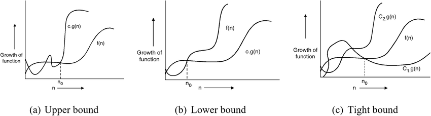

# Unit 2

!!! info "Learning Outcome"

    Explain the principles of asymptotic analysis and the role of algorithms in computing.

## 2.1 Fundamentals

<unit2:Algorithms> are a set of finite rules or instructions to be followed in calculations or other problem-solving operations

### 2.1.1 Features of Algorithm

Every algorithm must satisfy the following Criteria:

1. **Input:** there are zero or more quantities, which are externally supplied;

2. **Output:** at least one quantity is produced;

3. **Definiteness:** each instruction must be clear and unambiguous;

4. **Finiteness** if we trace out the instructions of an algorithm, then for all cases the algorithm will terminate after a finite number of steps;

5. **Effectiveness:** every instruction must be sufficiently basic that it can in
   principle be carried out by a person using only pencil and paper. It is not enough that each operation be definite, but it must also be feasible.

## **2.2 Asymptotic Analysis**

- Asymptotic Analysis : Asymptotic analysis of an algorithm studies its efficiency in terms of **input size n** as n→∞. It provides an estimate of time or space complexity using notations bigO. Theta , omega and is independent of hardware or implementation.

### 2.1.1 Concept of Growth Rates

- Growth rate describes how the running time of an algorithm increases as the input size grows. We consider only the leading term of a formula **_(e.g., an^2^)_**, since the lower-order terms are
  relatively insignificant for large values of n.

- We also ignore the leading term’s constant coefficient, since constant factors are less significant than the rate of growth in determining computational efficiency for large inputs.

- Example: Linear (O(n)), Quadratic (O(n²)), Logarithmic (O(log n)).
- Helps compare algorithms independently of hardware.

  

!!! warning "For lower value of input some worst case may perform better"

    We usually consider one algorithm to be more efficient than another if its worstcase running time has a lower order of growth. Due to constant factors and lowerorder terms, an algorithm whose running time has a higher order of growth might take less time for small inputs than an algorithm whose running time has a lower2.3 Designing algorithms 29 order of growth. But for large enough inputs, a ‚.n2/ algorithm, for example, will run more quickly in the worst case than a ‚.n3/ algorithm.

### 2.1.2 Best-case, Worst-case, and Average-case Analysis

- **Best-case:** Minimum time an algorithm takes for any input (optimistic).
- **Worst-case:** Maximum time an algorithm takes (pessimistic, most commonly used).
- **Average-case:** Expected time over all inputs (realistic measure).

### 2.1.3 Importance of Asymptotic Analysis in Algorithm Design

- Provides machine-independent evaluation of algorithms.
- Helps predict scalability for large input sizes.
- Guides selection of efficient algorithms.

---
