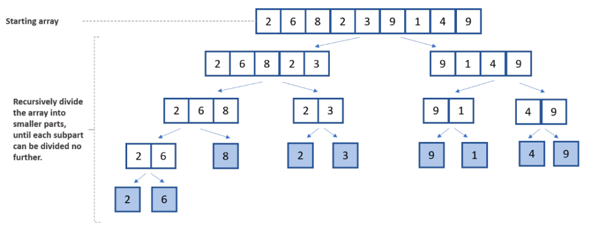
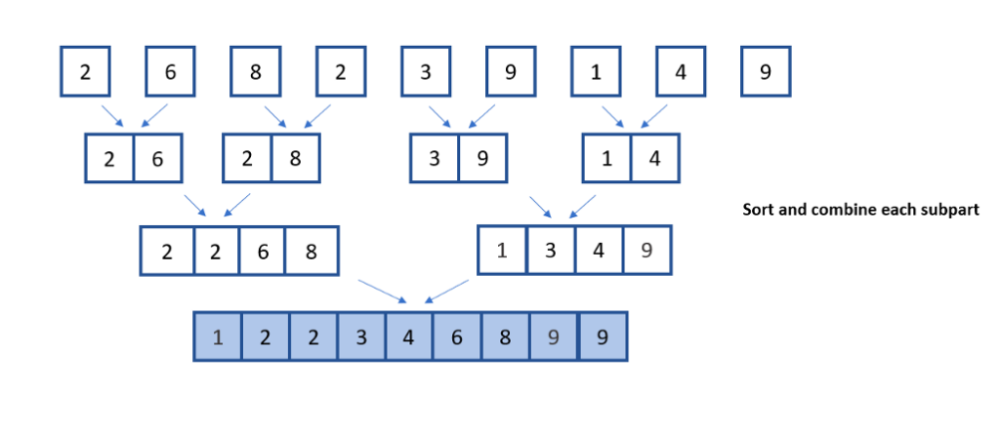

# Merge sort analysis

- The sort was developed by the American computer scientist John von Neumann in 1945.
- It is a comparison-based sort.
- It uses divide-&-conquer approach. There are three steps in this approach.

      - ***Divide*** the problem into a number of subproblems that are smaller instances of the
            same problem.
      - ***Conquer*** the subproblems by solving them recursively. If the subproblem sizes are
            small enough, however, just solve the subproblems in a straightforward manner.
      - ***Combine*** the solutions to the subproblems into the solution for the original problem.

Example :

1. Given an array of unsorted numbers : Array = $ \begin{bmatrix} 2 & 6 & 8 & 2 & 3 & 9 & 1 & 4 & 9 \end{bmatrix}$
2. From the given array, **divide** the array in half i.e., This initial step separates the overall list into two smalle halves.
3. Then, the lists are broken down further until they can no longer be divided, leaving only one element item in each halved list as in image 1.

   

4. In the conquer step, try to sort both the subarrays
5. When the conquer step reaches the base step and we get two sorted subarrays, we combine the results by creating a sorted array from two sorted subarrays as in image 2.

   

Image : [Image Source](https://developer.nvidia.com/blog/merge-sort-explained-a-data-scientists-algorithm-guide/)

Pseudo Code for Merge Sort
!!! note ""

    ```text
    MergeSort(Array[],low, high)
    if low < high
    int mid <- (low + high)/2
    MergeSort(Array[], low, mid)
    MergeSort(Array[], mid+1, high)
    Merge(Array[],low, mid, mid+1, high)

    Merge Function
    Merge(Array[],low, mid, mid+1, high)
    k =low; i =low; j =mid+ 1;
    while ((k < mid) and (j < high)) do
      {
            if (a[k] < a[j])then
                  b[i] :=a[k];k:=k + 1;
            else
                  b[i]-=a[j]; j :=j+ l;
            i=i + 1;
      }

      if (i > mid) then
      for k :=j to high do
      {
      b[i]:=a[k];i :=i + 1;
      else}
      for k :=k to middo
      {
      b[i] :=a[k];i :=i + 1;
      }
      for k :=low to high doa[k] :=b[k];
    ```

!!! note "Unit 3 Summary"

    1. A recurrence is an equation (or inequality) that defines a function in terms of its value(s) at smaller input(s)
    2. A recurrence relation is an equation that defines a sequence based on its previous terms
    3. General form of Recurrence Relation:
            $$
            T(n) = a \cdot T\left(\frac{n}{b}\right) + f(n)
            $$

      Where:

      - $T(n)$ → **the time/space complexity of the problem of size n**

      - $a$ → **number of subproblems in the recursion**

      - $(n/b)$ → **size of each subproblem**

      - $f(n)$ → **the cost of dividing the problem and combining the results**

    4. Method of solving Reucurrence relations : ***Iterative Method, Recursion tree, Substitution Method, Telescoping, Master theorem***
    5. **Iterative Method** : expand step by step and replace the recurrence with successive substitutions until a clear pattern emerges, stop once the base case is reached, then simplify.
    6. **recurrsion Tree Method** : expand step by step and replace the recurrence with successive substitutions until a clear pattern emerges, stop once the base case is reached, then simplify.
