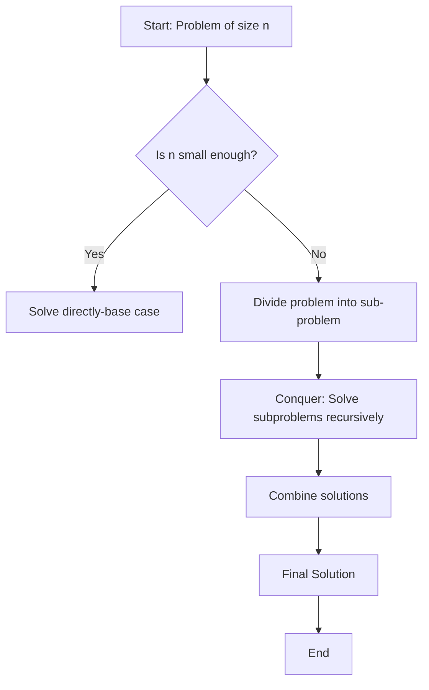

# Unit 4: Divide and Conquer Algorithms

## 4.1 Fundamentals Divide & Conquer Algorithm Design

### 4.1.1 Principles and structure of divide and conquer algorithms

Definition:
Divide and Conquer is a problem-solving strategy that breaks a problem into smaller subproblems, solves them independently, and then combines their solutions to form the final answer.

General Steps:

Divide – Break the main problem into smaller subproblems of the same type.

Conquer – Solve the subproblems recursively. If the subproblem is small enough, solve it directly (base case).

Combine – Merge the solutions of the subproblems into a solution for the original problem.



### 4.1.2 Advantages and limitations of divide and conquer

| **Advantages**                                                                                               | **Limitations**                                                                                                    |
| ------------------------------------------------------------------------------------------------------------ | ------------------------------------------------------------------------------------------------------------------ |
| **Efficiency** – Often reduces time complexity vs straightforward methods (e.g., merge sort vs bubble sort). | **Overhead of recursion** – Recursive calls use more memory (stack space) and may be inefficient for small inputs. |
| **Parallelism** – Independent subproblems can be solved in parallel.                                         | **Not always optimal** – Iterative solutions can be simpler/faster in some cases (e.g., linear search).            |
| **Simplicity in design** – Breaks problems into smaller, manageable parts.                                   | **Combination step cost** – If merging results is costly, performance suffers (e.g., merging in merge sort).       |
| **Reusability** – Same principle applies across many domains (sorting, searching, matrix multiplication).    | **Divide evenly issue** – Problems may not split evenly (e.g., quicksort with bad pivots).                         |
| **Reduces complexity in proofs** – Recursive definitions simplify correctness proofs.                        | **Implementation complexity** – Code can be harder to implement/debug compared to iterative methods.               |

## 4.2 Strassen’s Algorithm for Matrix Multiplication

### 4.2.1 Standard Matrix Multiplication

Before going into Standard Matrix Multiplication, analyse the ways the sqare matrices are multiplies. The standard way of multiplying any sqaure matrix is is as follow.

Given two 𝑛 × 𝑛 matrices(square matrix) 𝐴 and 𝐵, the product 𝐶 = 𝐴×𝐵 is also an 𝑛×𝑛 matrix where

$$
 𝐶_{𝑖𝑗}=∑_{𝑘=1}^𝑛𝐴_{𝑖𝑘}⋅𝐵_{𝑘𝑗}
$$

Pseudocode for Square Matrix Multiplication

!!! note ""

    ```text
    SQUARE MATRIX MULTIPLY(A, B)
        n = A.rows
        let C be a new n x n matrix
        for i = 1 to n
            for j = 1 to n
                C[i][j] = 0
                for k = 1 to n
                    C[i][j] = C[i][j] + A[i][k] * B[k][j]
    ```

From a standard matrix multiplication, for every element in the resultant matrix C has to perform **$n$** multiplication and **$(n-1)$** addition i.e, for example 2x2 matrix A multiplied with 2x2 matrix B, so to get the first element $C[i][j]$ it will take 2 multiplication and 1 addition.

!!! example "code implementation"

    === "C"

        ```c
          #include <stdio.h>
          #include <stdlib.h>

          #define n 3 // taking it as 3 for example

          //define the function for square matrix multiplication
          void squareMatrixMultiply(int A[n][n], int B[n][n], int C[n][n]){
            for (int i=0; i<n; i++){
                for (int j=0; j<n; j++){
                    C[i][j] = 0;
                    for (int k=0; k< n; k++){
                        C[i][j] = C[i][j]+A[i][k]*B[k][j];
                    }
                }
            }

          }

          int main(void) {
            int A[n][n] = {{1,2,3}, {4,5,6},{7,8,9}};
            int B[n][n] = {{1,2,3},{4,5,6},{7,8,9}}
            int C[n][n]

            printf("Result:\n");
            for (int i = 0; i < N; i++) {
                for (int j = 0; j < N; j++) {
                    printf("%d ", C[i][j]);
                }
                printf("\n");
                }
            return 0;
            }
        ```

    === "C++"

        ```c++
            #include <iostream>
            #include <vector>
            using namespace std;

            #define N 3

            void multiply(vector<vector<int>>& A, vector<vector<int>>& B, vector<vector<int>>& C) {
                for (int i = 0; i < N; i++) {
                    for (int j = 0; j < N; j++) {
                        C[i][j] = 0;
                        for (int k = 0; k < N; k++) {
                            C[i][j] += A[i][k] * B[k][j];
                        }
                    }
                }
            }

            int main() {
                vector<vector<int>> A = {{1,2,3},{4,5,6},{7,8,9}};
                vector<vector<int>> B = {{9,8,7},{6,5,4},{3,2,1}};
                vector<vector<int>> C(N, vector<int>(N));

                multiply(A, B, C);

                cout << "Result:\n";
                for (auto &row : C) {
                    for (auto &val : row) cout << val << " ";
                    cout << endl;
                }
            }

        ```
    === "JS"

        ```js
            function multiply(A, B) {
            const n = A.length;
            let C = Array.from({ length: n }, () => Array(n).fill(0));

            for (let i = 0; i < n; i++) {
                for (let j = 0; j < n; j++) {
                    for (let k = 0; k < n; k++) {
                     C[i][j] += A[i][k] * B[k][j];
                    }
                }
             }
            return C;

            }

            const A = [[1,2,3],[4,5,6],[7,8,9]];
            const B = [[9,8,7],[6,5,4],[3,2,1]];

            console.log("Result:");
            console.log(multiply(A, B));

        ```
    === "Java"

        ```java
            public class MatrixMultiply {
                public static void multiply(int[][] A, int[][] B, int[][] C, int n) {
                    for (int i = 0; i < n; i++) {
                        for (int j = 0; j < n; j++) {
                C[i][j] = 0;
                            for (int k = 0; k < n; k++) {
                                C[i][j] += A[i][k] * B[k][j];
                            }
                        }
                    }
                }

            public static void main(String[] args) {
                int n = 3;
                int[][] A = {{1,2,3},{4,5,6},{7,8,9}};
                int[][] B = {{9,8,7},{6,5,4},{3,2,1}};
                int[][] C = new int[n][n];

                multiply(A, B, C, n);

                System.out.println("Result:");
                for (int[] row : C) {
                    for (int val : row) {
                        System.out.print(val + " ");
                    }
                    System.out.println();
                }
            }
        }


        ```


    === "py"

        ```py
            def multiply(A, B):
                n = len(A)
                C = [[0]*n for _ in range(n)]
                for i in range(n):
                    for j in range(n):
                        for k in range(n):
                            C[i][j] += A[i][k] * B[k][j]
                return C

            A = [[1,2,3],[4,5,6],[7,8,9]]
            B = [[9,8,7],[6,5,4],[3,2,1]]

            C = multiply(A, B)

            print("Result:")
            for row in C:
            print(row)

        ```

### 4.2.2 Divide and conqure method for Matrix Multiplication

when we use a divide-and-conquer algorithm to compute the matrix product C = A.B, we **_assume that n is an exact power of 2_** in each of the nxn matrices. We make this assumption because in each divide step, we will
divide nxn matrices into four n/2 x n/2 matrices, and by assuming that n is an
exact power of 2, we are guaranteed that as long as $n \ge 2$, the dimension n=2 is an
integer.

Steps:

    1.Break down two 𝑛 × 𝑛 matrices into 4 submatrices of size 𝑛/2 × 𝑛/ 2.
    2.Multiply the submatrices recursively.
    3.Combine results to form the final product.

Pseudocode for matrix multiplication using divide and conquer

```

SQUARE-MATRIX-MULTIPLY-RECURSIVE (A, B)
1 n = A.rows
2 let C be a new nxn matrix
3 if n == 1
4 C[1][1] = A[1][1].B[1][1]
5 else partition A, B, and C
6 C[1][1] = SQUARE-MATRIX-MULTIPLY-RECURSIVE(A[1][1].B[1][1]) +
SQUARE-MATRIX-MULTIPLY-RECURSIVE(A[1][2].B[2][1])
7 C[1][2] = SQUARE-MATRIX-MULTIPLY-RECURSIVE(A[1][1].B[1][2]) +
SQUARE-MATRIX-MULTIPLY-RECURSIVE(A[1][2].B[2][2])
8 C[2][1] = SQUARE-MATRIX-MULTIPLY-RECURSIVE(A[2][1].B[1][1]) +
SQUARE-MATRIX-MULTIPLY-RECURSIVE(A[2][2].B[2][1])
9 C[2][2] = SQUARE-MATRIX-MULTIPLY-RECURSIVE(A[2][1].B[1][2]) +
SQUARE-MATRIX-MULTIPLY-RECURSIVE(A[2][2].B[2][2])
10 return C

```

## Steps

Let:

$$
A =
\begin{bmatrix}
A_{11} & A_{12} \\
A_{21} & A_{22}
\end{bmatrix},
\quad
B =
\begin{bmatrix}
B_{11} & B_{12} \\
B_{21} & B_{22}
\end{bmatrix}
$$

Then the product is:

$$
C = A \times B =
\begin{bmatrix}
C_{11} & C_{12} \\
C_{21} & C_{22}
\end{bmatrix}
$$

where:

$$
\begin{aligned}
C_{11} &= A_{11}B_{11} + A_{12}B_{21} \\
C_{12} &= A_{11}B_{12} + A_{12}B_{22} \\
C_{21} &= A_{21}B_{11} + A_{22}B_{21} \\
C_{22} &= A_{21}B_{12} + A_{22}B_{22}
\end{aligned}
$$

---

## Recurrence Relation

- Each step requires **8 multiplications** of size \((n/2) \times (n/2)\), plus some additions.

\[
T(n) = 8T\left(\frac{n}{2}\right) + O(n^2)
\]

---

## Complexity (Master Theorem)

\[
T(n) = O(n^3)
\]

(same as classical matrix multiplication).

---

```

```
