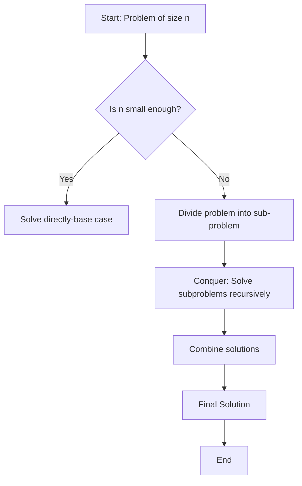

# Unit 4: Divide and Conquer Algorithms

!!! note "Learning Outcome"

    Implement divide-and-conquer algorithms such as Strassen's algorithm for matrix multiplication and the Fast Fourier Transform.

## 4.1 Fundamentals Divide & Conquer Algorithm Design

### 4.1.1 Principles and structure of divide and conquer algorithms

Definition:
Divide and Conquer is a problem-solving strategy that breaks a problem into smaller subproblems, solves them independently, and then combines their solutions to form the final answer.

General Steps:

Divide – Break the main problem into smaller subproblems of the same type.

Conquer – Solve the subproblems recursively. If the subproblem is small enough, solve it directly (base case).

Combine – Merge the solutions of the subproblems into a solution for the original problem.



### 4.1.2 Advantages and limitations of divide and conquer

| **Advantages**                                                                                               | **Limitations**                                                                                                    |
| ------------------------------------------------------------------------------------------------------------ | ------------------------------------------------------------------------------------------------------------------ |
| **Efficiency** – Often reduces time complexity vs straightforward methods (e.g., merge sort vs bubble sort). | **Overhead of recursion** – Recursive calls use more memory (stack space) and may be inefficient for small inputs. |
| **Parallelism** – Independent subproblems can be solved in parallel.                                         | **Not always optimal** – Iterative solutions can be simpler/faster in some cases (e.g., linear search).            |
| **Simplicity in design** – Breaks problems into smaller, manageable parts.                                   | **Combination step cost** – If merging results is costly, performance suffers (e.g., merging in merge sort).       |
| **Reusability** – Same principle applies across many domains (sorting, searching, matrix multiplication).    | **Divide evenly issue** – Problems may not split evenly (e.g., quicksort with bad pivots).                         |
| **Reduces complexity in proofs** – Recursive definitions simplify correctness proofs.                        | **Implementation complexity** – Code can be harder to implement/debug compared to iterative methods.               |

## 4.2 Matrix Multiplication

### 4.2.1 Standard Matrix Multiplication

Before going into Standard Matrix Multiplication, analyse the ways the sqare matrices are multiplies. The standard way of multiplying any sqaure matrix is is as follow.

Given two 𝑛 × 𝑛 matrices(square matrix) 𝐴 and 𝐵, the product 𝐶 = 𝐴×𝐵 is also an 𝑛×𝑛 matrix where

$$
 𝐶_{𝑖𝑗}=∑_{𝑘=1}^𝑛𝐴_{𝑖𝑘}⋅𝐵_{𝑘𝑗}
$$

Pseudocode for Square Matrix Multiplication

!!! note ""

    ```text
    SQUARE MATRIX MULTIPLY(A, B)
        n = A.rows
        let C be a new n x n matrix
        for i = 1 to n
            for j = 1 to n
                C[i][j] = 0
                for k = 1 to n
                    C[i][j] = C[i][j] + A[i][k] * B[k][j]
    ```

From a standard matrix multiplication, for every element in the resultant matrix C has to perform **$n$** multiplication and **$(n-1)$** addition i.e, for example 2x2 matrix A multiplied with 2x2 matrix B, so to get the first element $C[i][j]$ it will take 2 multiplication and 1 addition.

!!! example "code implementation"

    === "C"

        ```c
          #include <stdio.h>
          #include <stdlib.h>

          #define n 3 // taking it as 3 for example

          //define the function for square matrix multiplication
          void squareMatrixMultiply(int A[n][n], int B[n][n], int C[n][n]){
            for (int i=0; i<n; i++){
                for (int j=0; j<n; j++){
                    C[i][j] = 0;
                    for (int k=0; k< n; k++){
                        C[i][j] = C[i][j]+A[i][k]*B[k][j];
                    }
                }
            }

          }

          int main(void) {
            int A[n][n] = {{1,2,3}, {4,5,6},{7,8,9}};
            int B[n][n] = {{1,2,3},{4,5,6},{7,8,9}}
            int C[n][n]

            printf("Result:\n");
            for (int i = 0; i < N; i++) {
                for (int j = 0; j < N; j++) {
                    printf("%d ", C[i][j]);
                }
                printf("\n");
                }
            return 0;
            }
        ```

    === "C++"

        ```c++
            #include <iostream>
            #include <vector>
            using namespace std;

            #define N 3

            void multiply(vector<vector<int>>& A, vector<vector<int>>& B, vector<vector<int>>& C) {
                for (int i = 0; i < N; i++) {
                    for (int j = 0; j < N; j++) {
                        C[i][j] = 0;
                        for (int k = 0; k < N; k++) {
                            C[i][j] += A[i][k] * B[k][j];
                        }
                    }
                }
            }

            int main() {
                vector<vector<int>> A = {{1,2,3},{4,5,6},{7,8,9}};
                vector<vector<int>> B = {{9,8,7},{6,5,4},{3,2,1}};
                vector<vector<int>> C(N, vector<int>(N));

                multiply(A, B, C);

                cout << "Result:\n";
                for (auto &row : C) {
                    for (auto &val : row) cout << val << " ";
                    cout << endl;
                }
            }

        ```
    === "JS"

        ```js
            function multiply(A, B) {
            const n = A.length;
            let C = Array.from({ length: n }, () => Array(n).fill(0));

            for (let i = 0; i < n; i++) {
                for (let j = 0; j < n; j++) {
                    for (let k = 0; k < n; k++) {
                     C[i][j] += A[i][k] * B[k][j];
                    }
                }
             }
            return C;

            }

            const A = [[1,2,3],[4,5,6],[7,8,9]];
            const B = [[9,8,7],[6,5,4],[3,2,1]];

            console.log("Result:");
            console.log(multiply(A, B));

        ```
    === "Java"

        ```java
            public class MatrixMultiply {
                public static void multiply(int[][] A, int[][] B, int[][] C, int n) {
                    for (int i = 0; i < n; i++) {
                        for (int j = 0; j < n; j++) {
                C[i][j] = 0;
                            for (int k = 0; k < n; k++) {
                                C[i][j] += A[i][k] * B[k][j];
                            }
                        }
                    }
                }

            public static void main(String[] args) {
                int n = 3;
                int[][] A = {{1,2,3},{4,5,6},{7,8,9}};
                int[][] B = {{9,8,7},{6,5,4},{3,2,1}};
                int[][] C = new int[n][n];

                multiply(A, B, C, n);

                System.out.println("Result:");
                for (int[] row : C) {
                    for (int val : row) {
                        System.out.print(val + " ");
                    }
                    System.out.println();
                }
            }
        }


        ```


    === "py"

        ```py
            def multiply(A, B):
                n = len(A)
                C = [[0]*n for _ in range(n)]
                for i in range(n):
                    for j in range(n):
                        for k in range(n):
                            C[i][j] += A[i][k] * B[k][j]
                return C

            A = [[1,2,3],[4,5,6],[7,8,9]]
            B = [[9,8,7],[6,5,4],[3,2,1]]

            C = multiply(A, B)

            print("Result:")
            for row in C:
            print(row)

        ```

The time complexicity of Standard Matrxi multiplication is $\Theta (n^3)$

### 4.2.2 Divide and conqure method for Matrix Multiplication

when we use a divide-and-conquer algorithm to compute the matrix product C = A.B, we **_assume that n is an exact power of 2_** in each of the nxn matrices. We make this assumption because in each divide step, we will divide nxn matrices into four n/2 x n/2 matrices, and by assuming that n is an exact power of 2, we are guaranteed that as long as $n \ge 2$, the dimension n=2 is an integer.[^1]

Steps:

    1.Decompose two 𝑛 × 𝑛 matrices into 4 submatrices of size 𝑛/2 × 𝑛/ 2.
    2.Multiply the submatrices recursively.
    3.Combine results to form the final product.

Pseudocode for matrix multiplication using divide and conquer

```

SQUARE-MATRIX-MULTIPLY-RECURSIVE (A, B)
1 n = A.rows
2 let C be a new nxn matrix
3 if n == 1
4 C[1][1] = A[1][1].B[1][1]
5 else partition A, B, and C
6 C[1][1] = SQUARE-MATRIX-MULTIPLY-RECURSIVE(A[1][1].B[1][1]) +
    SQUARE-MATRIX-MULTIPLY-RECURSIVE(A[1][2].B[2][1])
7 C[1][2] = SQUARE-MATRIX-MULTIPLY-RECURSIVE(A[1][1].B[1][2]) +
    SQUARE-MATRIX-MULTIPLY-RECURSIVE(A[1][2].B[2][2])
8 C[2][1] = SQUARE-MATRIX-MULTIPLY-RECURSIVE(A[2][1].B[1][1]) +
    SQUARE-MATRIX-MULTIPLY-RECURSIVE(A[2][2].B[2][1])
9 C[2][2] = SQUARE-MATRIX-MULTIPLY-RECURSIVE(A[2][1].B[1][2]) +
    SQUARE-MATRIX-MULTIPLY-RECURSIVE(A[2][2].B[2][2])
10 return C

```

Steps

Let:

$$
A =
\begin{bmatrix}
A_{11} & A_{12} \\
A_{21} & A_{22}
\end{bmatrix},
\quad
B =
\begin{bmatrix}
B_{11} & B_{12} \\
B_{21} & B_{22}
\end{bmatrix} \tag{4.1}
$$

Then the product is:

$$
C = A \times B =
\begin{bmatrix}
C_{11} & C_{12} \\
C_{21} & C_{22}
\end{bmatrix} \tag{4.2}
$$

where:

$$
\begin{aligned}
C_{11} &= A_{11}B_{11} + A_{12}B_{21} \\
C_{12} &= A_{11}B_{12} + A_{12}B_{22} \\
C_{21} &= A_{21}B_{11} + A_{22}B_{21}  \\
C_{22} &= A_{21}B_{12} + A_{22}B_{22}
\end{aligned} \tag{4.3}
$$

---

Recurrence Relation

- Each step requires **8 multiplications** of size \((n/2) \times (n/2)\), plus some additions.

\[
T(n) = 8T\left(\frac{n}{2}\right) + O(n^2)
\]

- Time Complexity

  $$
  T(n) = O(n^3)
  $$

(same as classical matrix multiplication).

---

### 4.2.3 Strassen’s Algorithm

It has four steps[^2]:

1.  Divide the input matrices A and B and output matrix C into $\frac{n}{2}$ x $\frac{n}{2}$ submatrices, as in equation (4.1) above. This step takes $\Theta(1)$ time by index calculation.

    $$
    A =
    \begin{bmatrix}
    A_{11} & A_{12} \\
    A_{21} & A_{22}
    \end{bmatrix},
    \quad
    B =
    \begin{bmatrix}
    B_{11} & B_{12} \\
    B_{21} & B_{22}
    \end{bmatrix}
    $$

    and resultant matrix "C" :

    $$
    C = A \times B =
    \begin{bmatrix}
    C_{11} & C_{12} \\
    C_{21} & C_{22}
    \end{bmatrix}
    $$

2.  The values of the resultant matrix C is as follows

    $$
    C =
    \begin{bmatrix}
    m_1+m_4-m_5+m_7 & m_3+m_5 \\
    m_2+m_4 & m_1+m_3-m_2+m_6
    \end{bmatrix}
    $$

    Where

    $$
    \begin{align*}
    m_{1} &= (A_{11} + A_{22}) \times (B_{11} + B_{22}) \implies A_{11} \cdotp B_{11} + A_{11} \cdotp B_{22} + A_{22} \cdotp B_{11} + A_{22} \cdotp B_{22} \\
    m_{2} &= B_{11} \times  (A_{21} + A_{22}) \implies A_{21} \cdotp B_{11} + A_{22} \cdotp B_{11} \\
    m_{3} &= A_{11} \times (B_{12} - B_{22}) \implies A_{11} \cdotp B_{12} -  A_{11} \cdotp  B_{22} \\
    m_{4} &= A_{22} \times (B_{21} - B_{11}) \implies A_{22} \cdotp B_{21} - A_{22} \cdotp B_{11} \\
    m_{5} &= B_{22} \times (A_{11} + A_{12}) \implies A_{11} \cdotp B_{22} + A_{12} \cdotp B_{22} \\
    m_{6} &= (A_{21} - A_{11})\times (B_{11} + B_{12}) \implies A_{21} \cdotp B_{11} + A_{21} \cdotp  B_{12} - A_{11} \cdotp B_{11} - A_{11} \cdotp B_{12}   \\
    m_{7} &= (A_{12} - A_{22})\times (B_{21} + B_{22}) \implies A_{12} \cdotp B_{21} + A_{12} \cdotp B_{22} - A_{22} \cdotp B_{21} - A_{22} \cdotp B_{22}
    \end{align*}
    $$

    **_On solving this, it would give the same result as in eq 4.3_**

Recurrence Relation

- Each step requires **7 multiplications** of size \((n/2) \times (n/2)\), plus a number additions and subtractions.

$$
T(n) = 7T\left(\frac{n}{2}\right) + O(n^2)
$$

- Time Complexity

  $$
  T(n) = O(n^{2.80})
  $$

---

!!! example "Example 1"

    $$
    A =
    \begin{bmatrix}
    1 & 3 \\
    7 & 5
    \end{bmatrix},
    \quad
    B =
    \begin{bmatrix}
    6 & 8 \\
    4 & 2
    \end{bmatrix}
    $$

    $$
    \begin{align*}
    m_{1} &= (1 + 5) \times (6 + 2) = 48 \\
    m_{2} &= 6 \times  (7 + 5) = 72 \\
    m_{3} &= 1 \times (8 - 2) =  6 \\
    m_{4} &= 5 \times (4 - 6) = -10 \\
    m_{5} &= 2 \times (1 + 3) = 8 \\
    m_{6} &= (7 - 1)\times (6 + 8) = 84   \\
    m_{7} &= (3- 5)\times (4 + 2) = -12
    \end{align*}
    $$

    Now :

    $$
    C =
    \begin{bmatrix}
    m_1+m_4-m_5+m_7 & m_3+m_5 \\
    m_2+m_4 & m_1+m_3-m_2+m_6
    \end{bmatrix}
    $$

    $$
    \implies C =
    \begin{bmatrix}
    48+(-10)-8+(-12) & 6+8 \\
    72+(-10) & 48+6-72+84
    \end{bmatrix}
    $$

    $$
    \implies C =
    \begin{bmatrix}
    18 & 14 \\
    62 & 66
    \end{bmatrix}
    $$

## 4.3 Integer Multiplication

Integer multiplication is one of the fundamental operations in computer science and mathematics. While multiplying small numbers is not complex, multiplying large integers efficiently is critical in applications such as:

1. Cryptography (RSA, ECC, etc.) : modern cryptography, require manipulation of integers that are over 100 decimal digits long.

2. Computer Algebra Systems

3. High-precision scientific computing

4. Complexity theory and algorithm research

### 4.3.1 Naive Approch to Integer multiplication

The Naive approch of integer multiplication involves multiplying digit by digit, carrying over and adding partial products to arrive at the final answer. If the two numbers have `n` digits each, you perform `n * n` single-digit multiplications.

Example: $456 \times 123 $

Solution : $(456 \times 1)+(456 \times 2)+(456 \times 3) = 56,088$

Example 2:

Multiply 123 × 45 (in base 10):

- 123 × 5 = 615
- 123 × 40 = 4920
- Sum = 5535

This corresponds to digit-by-digit partial products and shifts.

Time complexity = $O(n^2)$

**_Pseudocode_**

```
function naiveMultiply(A[0..n-1], B[0..n-1]):  // digits little-endian (least significant first)
    // result array length up to 2n
    R = array of zeros length 2n
    for i from 0 to n-1:
        carry = 0
        for j from 0 to n-1:
            temp = R[i + j] + A[i] * B[j] + carry
            R[i + j] = temp mod BASE
            carry = floor(temp / BASE)
        R[i + n] += carry
    return normalize(R)  // remove leading zeros
```

### 4.3.2 Karatsuba Algorithm for integer multiplication

Karatsuba’s algorithm reduces the number of multiplications by using divide and conquer. Split each `n`-digit number into two halves (high and low):

Let $m = floor(\frac{n}{2})$. Write

$ X = X_1 \times 10^m + X_0 $

$Y = Y_1 \times 10^m + Y_0$

The straightforward expansion gives four products:

$$
\fcolorbox{black}{red}{$X \times Y = (X_1 \cdot Y_1) \cdot 10^{2m} + (X_1 \cdot Y_0 + X_0 \cdot Y_1) \cdot 10^m + X_0 \cdot Y_0$}
$$

Naively, that needs 4 multiplications of size \~n/2. Karatsuba avoids computing $X_1*Y_0$ and $X_0*Y_1$ separately by computing:

\[
\begin{align*}
P_1 &= X_1 \cdot Y_1 \\
P_2 &= X_0 \cdot Y_0 \\
P_3 &= (X_1 + X_0)(Y_1 + Y_0) - P_1 - P_2 \quad \text{(equals $X_1Y_0 + X_0Y_1$)} \\
\end{align*}
\]

$$\boxed{X \cdot Y = P_1 \cdot 10^{2m} + P_3\cdot 10^m + P_2}$$

Thus only **3** multiplications of half-size numbers are needed.

```
function karatsubaMultiply(X, Y):
    m = floor(n / 2)
    X1, X0 = split(X, m)
    Y1, Y0 = split(Y, m)

    P1 = karatsubaMultiply(X1, Y1)
    P2 = karatsubaMultiply(X0, Y0)
    P3 = karatsubaMultiply(X1 + X0, Y1 + Y0)

    cross = P3 - P1 - P2
    return P1 * 10^(2m) + cross * 10^m + P2
```

Example:
Multiply $X = 1234$, $Y = 5678$ in base 10:

1.  Split with $m = 2$ (two-digit halves):

    - $X_1 = 12$, $X_0 = 34$ ; $Y_1 = 56$, $Y_0 = 78$

2.  Compute three products (recursively or directly):

    - $P_1 = 12 * 56 = 672$
    - $P_2 = 34 * 78 = 2652$
    - $P_3 = (12 + 34) * (56 + 78) = 46 * 134 = 6164$

3.  $cross = P_3 - P_1 - P_2 = 6164 - 672 - 2652 = 2840$
4.  Recombine:

    - $P_1 * 10^{2m} = 672 * 10^4 = 6,720,000$
    - $cross * 10^m = 2840 * 10^2 = 284,000$
    - $P_2 = 2,652$
    - Sum = $6,720,000 + 284,000 + 2,652 = 7,006,652$

Check: $1234 * 5678 = 7,006,652$

Karatsuba recurrence:

$$
T(n) = 3 T(n/2) + O(n)
$$

Apply the Master Theorem :

- $a = 3$, $b = 2$ → exponent $log_b(a) = log_2 3  ≈ 1.585$.
- Therefore: $T(n) = Θ(n^{log_2 3}) ≈ Θ(n^{1.585})$.

This is asymptotically faster than $Θ(n^2)$ for large $n$.

**Comparison & When to Use Which **

| Aspect                    |         Naïve (schoolbook) |                                           Karatsuba |
| ------------------------- | -------------------------: | --------------------------------------------------: |
| Asymptotic time           |                   $Θ(n^2)$ |                     $Θ(n^{log_2 3}) ≈ Θ(n^{1.585})$ |
| Best for                  | Small to moderate integers |                                      Large integers |
| Implementation complexity |                     Simple | Moderate (careful splitting, carries, thresholding) |

**Rule of thumb:** For very large integers (hundreds to thousands of machine-word limbs), Karatsuba gives measurable speedups. For small sizes, the simple naive algorithm is often faster.

### 4.3.3 Recent algorithms in integer multiplication

#### 1. Motivation

- Modern applications like **cryptography, scientific computing, and number theory** require multiplication of integers with millions of digits.
- Even Karatsuba (**O(n^1.585)**) becomes too slow.
- Goal: reduce complexity closer to **O(n log n)**.

---

#### 2. Major Recent Algorithms

##### (a) Schoolbook Multiplication

- Traditional method taught in schools.
- Complexity: **O(n²)**.
- Still used for very small n.

---

##### (b) Karatsuba Multiplication (1960)

- Divide-and-conquer, split numbers into 2 halves.
- Complexity: **O(n^1.585)**.
- Breakthrough: first sub-quadratic algorithm.

---

##### (c) Toom–Cook Multiplication (1963)

- Generalization of Karatsuba: split into more than 2 parts.
- Example: **Toom-3** gives **O(n^1.465)**.
- Used in libraries (GMP) for medium-sized numbers.

---

##### (d) Schönhage–Strassen Algorithm (1971)

- Uses **Fast Fourier Transform (FFT)** in modular arithmetic.
- Complexity: **O(n log n log log n)**.
- Practical for very large integers.
- Standard in big integer libraries for decades.

---

##### (e) Fürer’s Algorithm (2007)

- Improved Schönhage–Strassen with refined complex FFT usage.
- Complexity: **O(n log n · 2^O(log\* n))**.
- Very close to O(n log n) in practice.

---

##### (f) Harvey–van der Hoeven Algorithm (2019)

- First algorithm with **true O(n log n)** time complexity.
- Solved a long-standing open problem in computational complexity.
- Still mostly theoretical but groundbreaking.

---

#### 3. Complexity Comparison

| Algorithm                  | Year | Complexity                  |
| -------------------------- | ---- | --------------------------- |
| Schoolbook (Naïve)         | –    | O(n²)                       |
| Karatsuba                  | 1960 | O(n^1.585)                  |
| Toom–Cook (Toom-3, Toom-k) | 1963 | O(n^1.465), improves with k |
| Schönhage–Strassen         | 1971 | O(n log n log log n)        |
| Fürer                      | 2007 | O(n log n · 2^O(log\* n))   |
| Harvey–van der Hoeven      | 2019 | O(n log n)                  |


## Reference

[^1]: Cormen, T., Leiserson, C., Rivest, R., & Stein, C. (2009). **_Introduction to Algorithms (Third)_**. Mit Press.
[^2]: Levitin, A. (2019). **_Introduction to the design and analysis of algorithms._** Pearson.
