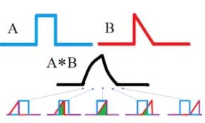
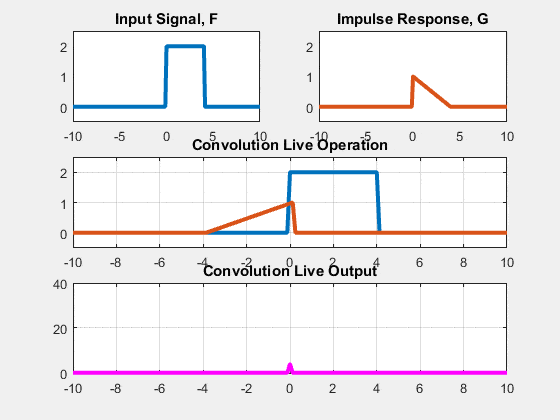
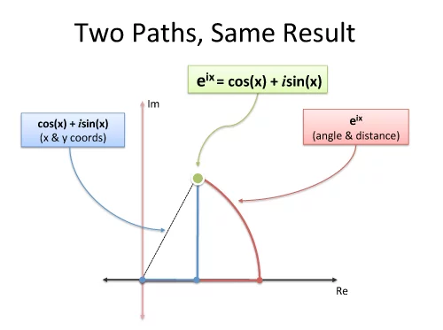
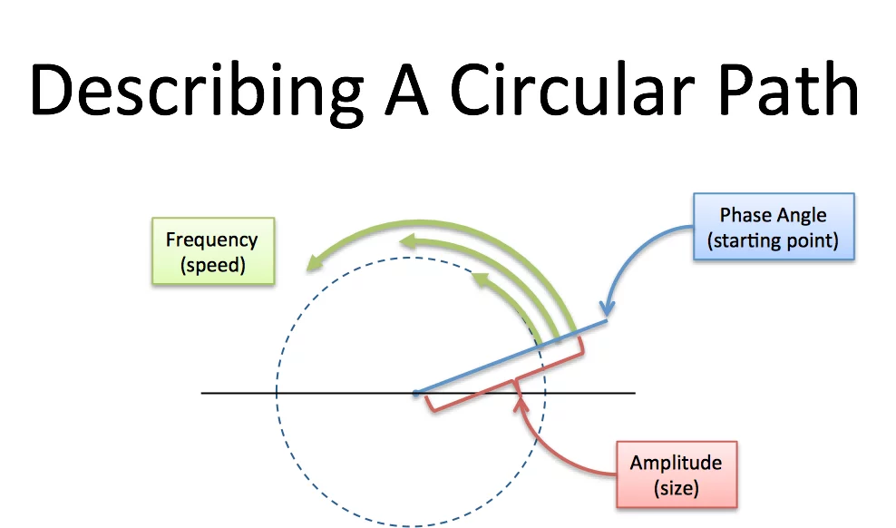

# Unit 4: Divide and Conquer Algorithms

!!! note "Learning Outcome"

    Implement divide-and-conquer algorithms such as Strassen's algorithm for matrix multiplication and the Fast Fourier Transform.

## 4.1 Fundamentals Divide & Conquer Algorithm Design

### 4.1.1 Principles and structure of divide and conquer algorithms

> Divide and Conquer is a problem-solving strategy that **breaks a problem into smaller subproblems**, solves them independently, and then combines their solutions to form the final answer.

**General Steps:**

- Divide – Break the main problem into smaller subproblems of the same type.
- Conquer – Solve the subproblems recursively. If the subproblem is small enough, solve it directly (base case).
- Combine – Merge the solutions of the subproblems into a solution for the original problem.


### 4.1.2 Advantages and limitations of divide and conquer

| **Advantages**                                                                                               | **Limitations**                                                                                                    |
| ------------------------------------------------------------------------------------------------------------ | ------------------------------------------------------------------------------------------------------------------ |
| **Efficiency** – Often reduces time complexity vs straightforward methods (e.g., merge sort vs bubble sort). | **Overhead of recursion** – Recursive calls use more memory (stack space) and may be inefficient for small inputs. |
| **Parallelism** – Independent subproblems can be solved in parallel.                                         | **Not always optimal** – Iterative solutions can be simpler/faster in some cases (e.g., linear search).            |
| **Simplicity in design** – Breaks problems into smaller, manageable parts.                                   | **Combination step cost** – If merging results is costly, performance suffers (e.g., merging in merge sort).       |
| **Reusability** – Same principle applies across many domains (sorting, searching, matrix multiplication).    | **Divide evenly issue** – Problems may not split evenly (e.g., quicksort with bad pivots).                         |
| **Reduces complexity in proofs** – Recursive definitions simplify correctness proofs.                        | **Implementation complexity** – Code can be harder to implement/debug compared to iterative methods.               |

## 4.2 Matrix Multiplication

### 4.2.1 Standard Matrix Multiplication

Given a square matrix, the standard way of multiplying any sqaure matrix is as follow.

Given two 𝑛 × 𝑛 matrices(square matrix) 𝐴 and 𝐵, the product $𝐶 = 𝐴×𝐵$ is also an $𝑛×𝑛$ matrix where

$$
\boxed{
 𝐶_{𝑖𝑗}=∑_{𝑘=1}^𝑛𝐴_{𝑖𝑘}⋅𝐵_{𝑘𝑗}}
$$

Lets understand the above formula with a pseudocode for Square Matrix Multiplication

(**Note**: _Try to analyse the code first and then check the explanation for reference._)

!!! note "Pseudocode for standard Matrix Multiplication"

    ```text
    1 SQUARE MATRIX MULTIPLY(A, B)
    2    n = A.rows
    3    let C be a new n x n matrix
    4    for i = 1 to n
    5        for j = 1 to n
    6            C[i][j] = 0
    7            for k = 1 to n
    8                C[i][j] = C[i][j] + A[i][k] * B[k][j]
    ```

    ??? note "Explanation:"

         1. Intializing a function called **SQUARE MATRIX MULTIPLY** that takes two input parameter A and B, which are both square matix
         2. initialize n= A.rows, will store the size of the row, alternately col can also be used as it is a square matrix
         3. Initializing a new matrix $C$ of size $n \times n$

From a standard matrix multiplication, for every element in the resultant matrix C has to perform **$n$** multiplication and **$(n-1)$** addition i.e, for example 2x2 matrix A multiplied with 2x2 matrix B, so to get the first element $C[i][j]$ it will take 2 multiplication and 1 addition.

!!! example "code implementation"

    === "C"

        ```c
          #include <stdio.h>
          #include <stdlib.h>

          #define n 3 // taking it as 3 for example

          //define the function for square matrix multiplication
          void squareMatrixMultiply(int A[n][n], int B[n][n], int C[n][n]){
            for (int i=0; i<n; i++){
                for (int j=0; j<n; j++){
                    C[i][j] = 0;
                    for (int k=0; k< n; k++){
                        C[i][j] = C[i][j]+A[i][k]*B[k][j];
                    }
                }
            }

          }

          int main(void) {
            int A[n][n] = {{1,2,3}, {4,5,6},{7,8,9}};
            int B[n][n] = {{1,2,3},{4,5,6},{7,8,9}}
            int C[n][n]

            printf("Result:\n");
            for (int i = 0; i < N; i++) {
                for (int j = 0; j < N; j++) {
                    printf("%d ", C[i][j]);
                }
                printf("\n");
                }
            return 0;
            }
        ```

    === "C++"

        ```c++
            #include <iostream>
            #include <vector>
            using namespace std;

            #define N 3

            void multiply(vector<vector<int>>& A, vector<vector<int>>& B, vector<vector<int>>& C) {
                for (int i = 0; i < N; i++) {
                    for (int j = 0; j < N; j++) {
                        C[i][j] = 0;
                        for (int k = 0; k < N; k++) {
                            C[i][j] += A[i][k] * B[k][j];
                        }
                    }
                }
            }

            int main() {
                vector<vector<int>> A = {{1,2,3},{4,5,6},{7,8,9}};
                vector<vector<int>> B = {{9,8,7},{6,5,4},{3,2,1}};
                vector<vector<int>> C(N, vector<int>(N));

                multiply(A, B, C);

                cout << "Result:\n";
                for (auto &row : C) {
                    for (auto &val : row) cout << val << " ";
                    cout << endl;
                }
            }

        ```
    === "JS"

        ```js
            function multiply(A, B) {
            const n = A.length;
            let C = Array.from({ length: n }, () => Array(n).fill(0));

            for (let i = 0; i < n; i++) {
                for (let j = 0; j < n; j++) {
                    for (let k = 0; k < n; k++) {
                     C[i][j] += A[i][k] * B[k][j];
                    }
                }
             }
            return C;

            }

            const A = [[1,2,3],[4,5,6],[7,8,9]];
            const B = [[9,8,7],[6,5,4],[3,2,1]];

            console.log("Result:");
            console.log(multiply(A, B));

        ```
    === "Java"

        ```java
            public class MatrixMultiply {
                public static void multiply(int[][] A, int[][] B, int[][] C, int n) {
                    for (int i = 0; i < n; i++) {
                        for (int j = 0; j < n; j++) {
                C[i][j] = 0;
                            for (int k = 0; k < n; k++) {
                                C[i][j] += A[i][k] * B[k][j];
                            }
                        }
                    }
                }

            public static void main(String[] args) {
                int n = 3;
                int[][] A = {{1,2,3},{4,5,6},{7,8,9}};
                int[][] B = {{9,8,7},{6,5,4},{3,2,1}};
                int[][] C = new int[n][n];

                multiply(A, B, C, n);

                System.out.println("Result:");
                for (int[] row : C) {
                    for (int val : row) {
                        System.out.print(val + " ");
                    }
                    System.out.println();
                }
            }
        }


        ```


    === "py"

        ```py
            def multiply(A, B):
                n = len(A)
                C = [[0]*n for _ in range(n)]
                for i in range(n):
                    for j in range(n):
                        for k in range(n):
                            C[i][j] += A[i][k] * B[k][j]
                return C

            A = [[1,2,3],[4,5,6],[7,8,9]]
            B = [[9,8,7],[6,5,4],[3,2,1]]

            C = multiply(A, B)

            print("Result:")
            for row in C:
            print(row)

        ```

The time complexicity of Standard Matrxi multiplication is $\Theta (n^3)$

### 4.2.2 Divide and conqure method for Matrix Multiplication

when we use a divide-and-conquer algorithm to compute the matrix product C = A.B, we **_assume that n is an exact power of 2_** in each of the nxn matrices. We make this assumption because in each divide step, we will divide nxn matrices into four n/2 x n/2 matrices, and by assuming that n is an exact power of 2, we are guaranteed that as long as $n \ge 2$, the dimension n=2 is an integer.[^1]

Steps:

    1.Decompose two 𝑛 × 𝑛 matrices into 4 submatrices of size 𝑛/2 × 𝑛/ 2.
    2.Multiply the submatrices recursively.
    3.Combine results to form the final product.

Pseudocode for matrix multiplication using divide and conquer

```

SQUARE-MATRIX-MULTIPLY-RECURSIVE (A, B)
1 n = A.rows
2 let C be a new nxn matrix
3 if n == 1
4 C[1][1] = A[1][1].B[1][1]
5 else partition A, B, and C
6 C[1][1] = SQUARE-MATRIX-MULTIPLY-RECURSIVE(A[1][1].B[1][1]) +
    SQUARE-MATRIX-MULTIPLY-RECURSIVE(A[1][2].B[2][1])
7 C[1][2] = SQUARE-MATRIX-MULTIPLY-RECURSIVE(A[1][1].B[1][2]) +
    SQUARE-MATRIX-MULTIPLY-RECURSIVE(A[1][2].B[2][2])
8 C[2][1] = SQUARE-MATRIX-MULTIPLY-RECURSIVE(A[2][1].B[1][1]) +
    SQUARE-MATRIX-MULTIPLY-RECURSIVE(A[2][2].B[2][1])
9 C[2][2] = SQUARE-MATRIX-MULTIPLY-RECURSIVE(A[2][1].B[1][2]) +
    SQUARE-MATRIX-MULTIPLY-RECURSIVE(A[2][2].B[2][2])
10 return C

```

Steps

Let:

$$
A =
\begin{bmatrix}
A_{11} & A_{12} \\
A_{21} & A_{22}
\end{bmatrix},
\quad
B =
\begin{bmatrix}
B_{11} & B_{12} \\
B_{21} & B_{22}
\end{bmatrix} \tag{4.1}
$$

Then the product is:

$$
C = A \times B =
\begin{bmatrix}
C_{11} & C_{12} \\
C_{21} & C_{22}
\end{bmatrix} \tag{4.2}
$$

where:

$$
\begin{aligned}
C_{11} &= A_{11}B_{11} + A_{12}B_{21} \\
C_{12} &= A_{11}B_{12} + A_{12}B_{22} \\
C_{21} &= A_{21}B_{11} + A_{22}B_{21}  \\
C_{22} &= A_{21}B_{12} + A_{22}B_{22}
\end{aligned} \tag{4.3}
$$

---

Recurrence Relation

- Each step requires **8 multiplications** of size \((n/2) \times (n/2)\), plus some additions.

\[
T(n) = 8T\left(\frac{n}{2}\right) + O(n^2)
\]

- Time Complexity

  $$
  T(n) = O(n^3)
  $$

(same as classical matrix multiplication).

---

### 4.2.3 Strassen’s Algorithm

It has four steps[^2]:

1.  Divide the input matrices A and B and output matrix C into $\frac{n}{2}$ x $\frac{n}{2}$ submatrices, as in equation (4.1) above. This step takes $\Theta(1)$ time by index calculation.

    $$
    A =
    \begin{bmatrix}
    A_{11} & A_{12} \\
    A_{21} & A_{22}
    \end{bmatrix},
    \quad
    B =
    \begin{bmatrix}
    B_{11} & B_{12} \\
    B_{21} & B_{22}
    \end{bmatrix}
    $$

    and resultant matrix "C" :

    $$
    C = A \times B =
    \begin{bmatrix}
    C_{11} & C_{12} \\
    C_{21} & C_{22}
    \end{bmatrix}
    $$

2.  The values of the resultant matrix C is as follows

    $$
    C =
    \begin{bmatrix}
    m_1+m_4-m_5+m_7 & m_3+m_5 \\
    m_2+m_4 & m_1+m_3-m_2+m_6
    \end{bmatrix}
    $$

    Where

    $$
    \begin{align*}
    m_{1} &= (A_{11} + A_{22}) \times (B_{11} + B_{22}) \implies A_{11} \cdotp B_{11} + A_{11} \cdotp B_{22} + A_{22} \cdotp B_{11} + A_{22} \cdotp B_{22} \\
    m_{2} &= B_{11} \times  (A_{21} + A_{22}) \implies A_{21} \cdotp B_{11} + A_{22} \cdotp B_{11} \\
    m_{3} &= A_{11} \times (B_{12} - B_{22}) \implies A_{11} \cdotp B_{12} -  A_{11} \cdotp  B_{22} \\
    m_{4} &= A_{22} \times (B_{21} - B_{11}) \implies A_{22} \cdotp B_{21} - A_{22} \cdotp B_{11} \\
    m_{5} &= B_{22} \times (A_{11} + A_{12}) \implies A_{11} \cdotp B_{22} + A_{12} \cdotp B_{22} \\
    m_{6} &= (A_{21} - A_{11})\times (B_{11} + B_{12}) \implies A_{21} \cdotp B_{11} + A_{21} \cdotp  B_{12} - A_{11} \cdotp B_{11} - A_{11} \cdotp B_{12}   \\
    m_{7} &= (A_{12} - A_{22})\times (B_{21} + B_{22}) \implies A_{12} \cdotp B_{21} + A_{12} \cdotp B_{22} - A_{22} \cdotp B_{21} - A_{22} \cdotp B_{22}
    \end{align*}
    $$

    **_On solving this, it would give the same result as in eq 4.3_**

Recurrence Relation

- Each step requires **7 multiplications** of size \((n/2) \times (n/2)\), plus a number additions and subtractions.

$$
T(n) = 7T\left(\frac{n}{2}\right) + O(n^2)
$$

- Time Complexity

  $$
  T(n) = O(n^{2.80})
  $$

---

!!! example "Example 1"

    $$
    A =
    \begin{bmatrix}
    1 & 3 \\
    7 & 5
    \end{bmatrix},
    \quad
    B =
    \begin{bmatrix}
    6 & 8 \\
    4 & 2
    \end{bmatrix}
    $$

    $$
    \begin{align*}
    m_{1} &= (1 + 5) \times (6 + 2) = 48 \\
    m_{2} &= 6 \times  (7 + 5) = 72 \\
    m_{3} &= 1 \times (8 - 2) =  6 \\
    m_{4} &= 5 \times (4 - 6) = -10 \\
    m_{5} &= 2 \times (1 + 3) = 8 \\
    m_{6} &= (7 - 1)\times (6 + 8) = 84   \\
    m_{7} &= (3- 5)\times (4 + 2) = -12
    \end{align*}
    $$

    Now :

    $$
    C =
    \begin{bmatrix}
    m_1+m_4-m_5+m_7 & m_3+m_5 \\
    m_2+m_4 & m_1+m_3-m_2+m_6
    \end{bmatrix}
    $$

    $$
    \implies C =
    \begin{bmatrix}
    48+(-10)-8+(-12) & 6+8 \\
    72+(-10) & 48+6-72+84
    \end{bmatrix}
    $$

    $$
    \implies C =
    \begin{bmatrix}
    18 & 14 \\
    62 & 66
    \end{bmatrix}
    $$

## 4.3 Integer Multiplication

Integer multiplication is one of the fundamental operations in computer science and mathematics. While multiplying small numbers is not complex, multiplying large integers efficiently is critical in applications such as:

1. Cryptography (RSA, ECC, etc.) : modern cryptography, require manipulation of integers that are over 100 decimal digits long.

2. Computer Algebra Systems

3. High-precision scientific computing

4. Complexity theory and algorithm research

### 4.3.1 Naive Approch to Integer multiplication

The Naive approch of integer multiplication involves multiplying digit by digit, carrying over and adding partial products to arrive at the final answer. If the two numbers have `n` digits each, you perform `n * n` single-digit multiplications.

Example: $456 \times 123 $

Solution : $(456 \times 1)+(456 \times 2)+(456 \times 3) = 56,088$

Example 2:

Multiply 123 × 45 (in base 10):

- 123 × 5 = 615
- 123 × 40 = 4920
- Sum = 5535

This corresponds to digit-by-digit partial products and shifts.

Time complexity = $O(n^2)$

**_Pseudocode_**

```
function naiveMultiply(A[0..n-1], B[0..n-1]):  // digits little-endian (least significant first)
    // result array length up to 2n
    R = array of zeros length 2n
    for i from 0 to n-1:
        carry = 0
        for j from 0 to n-1:
            temp = R[i + j] + A[i] * B[j] + carry
            R[i + j] = temp mod BASE
            carry = floor(temp / BASE)
        R[i + n] += carry
    return normalize(R)  // remove leading zeros
```

### 4.3.2 Karatsuba Algorithm for integer multiplication

Karatsuba’s algorithm reduces the number of multiplications by using divide and conquer. Split each `n`-digit number into two halves (high and low):

Let $m = floor(\frac{n}{2})$. Write

$ X = X_1 \times 10^m + X_0 $

$Y = Y_1 \times 10^m + Y_0$

The straightforward expansion gives four products:

$$
\fcolorbox{black}{red}{$X \times Y = (X_1 \cdot Y_1) \cdot 10^{2m} + (X_1 \cdot Y_0 + X_0 \cdot Y_1) \cdot 10^m + X_0 \cdot Y_0$}
$$

Naively, that needs 4 multiplications of size \~n/2. Karatsuba avoids computing $X_1*Y_0$ and $X_0*Y_1$ separately by computing:

\[
\begin{align*}
P_1 &= X_1 \cdot Y_1 \\
P_2 &= X_0 \cdot Y_0 \\
P_3 &= (X_1 + X_0)(Y_1 + Y_0) - P_1 - P_2 \quad \text{(equals $X_1Y_0 + X_0Y_1$)} \\
\end{align*}
\]

$$\boxed{X \cdot Y = P_1 \cdot 10^{2m} + P_3\cdot 10^m + P_2}$$

Thus only **3** multiplications of half-size numbers are needed.

```
function karatsubaMultiply(X, Y):
    m = floor(n / 2)
    X1, X0 = split(X, m)
    Y1, Y0 = split(Y, m)

    P1 = karatsubaMultiply(X1, Y1)
    P2 = karatsubaMultiply(X0, Y0)
    P3 = karatsubaMultiply(X1 + X0, Y1 + Y0)

    cross = P3 - P1 - P2
    return P1 * 10^(2m) + cross * 10^m + P2
```

Example:
Multiply $X = 1234$, $Y = 5678$ in base 10:

1.  Split with $m = 2$ (two-digit halves):

    - $X_1 = 12$, $X_0 = 34$ ; $Y_1 = 56$, $Y_0 = 78$

2.  Compute three products (recursively or directly):

    - $P_1 = 12 * 56 = 672$
    - $P_2 = 34 * 78 = 2652$
    - $P_3 = (12 + 34) * (56 + 78) = 46 * 134 = 6164$

3.  $cross = P_3 - P_1 - P_2 = 6164 - 672 - 2652 = 2840$
4.  Recombine:

    - $P_1 * 10^{2m} = 672 * 10^4 = 6,720,000$
    - $cross * 10^m = 2840 * 10^2 = 284,000$
    - $P_2 = 2,652$
    - Sum = $6,720,000 + 284,000 + 2,652 = 7,006,652$

Check: $1234 * 5678 = 7,006,652$

Karatsuba recurrence:

$$
T(n) = 3 T(n/2) + O(n)
$$

Apply the Master Theorem :

- $a = 3$, $b = 2$ → exponent $log_b(a) = log_2 3  ≈ 1.585$.
- Therefore: $T(n) = Θ(n^{log_2 3}) ≈ Θ(n^{1.585})$.

This is asymptotically faster than $Θ(n^2)$ for large $n$.

**Comparison & When to Use Which **

| Aspect                    |         Naïve (schoolbook) |                                           Karatsuba |
| ------------------------- | -------------------------: | --------------------------------------------------: |
| Asymptotic time           |                   $Θ(n^2)$ |                     $Θ(n^{log_2 3}) ≈ Θ(n^{1.585})$ |
| Best for                  | Small to moderate integers |                                      Large integers |
| Implementation complexity |                     Simple | Moderate (careful splitting, carries, thresholding) |

**Rule of thumb:** For very large integers (hundreds to thousands of machine-word limbs), Karatsuba gives measurable speedups. For small sizes, the simple naive algorithm is often faster.

### 4.3.3 Recent algorithms in integer multiplication

#### 1. Motivation

- Modern applications like **cryptography, scientific computing, and number theory** require multiplication of integers with millions of digits.
- Even Karatsuba (**O(n^1.585)**) becomes too slow.
- Goal: reduce complexity closer to **O(n log n)**.

---

#### 2. Major Recent Algorithms

**(a) Schoolbook Multiplication**

- Traditional method taught in schools.
- Complexity: **O(n²)**.
- Still used for very small n.

---

**(b) Karatsuba Multiplication (1960)**

- Divide-and-conquer, split numbers into 2 halves.
- Complexity: **O(n^1.585)**.
- Breakthrough: first sub-quadratic algorithm.

---

**(c) Toom–Cook Multiplication (1963)**

- Generalization of Karatsuba: split into more than 2 parts.
- Example: **Toom-3** gives **O(n^1.465)**.
- Used in libraries (GMP) for medium-sized numbers.

---

**(d) Schönhage–Strassen Algorithm (1971)**

- Uses **Fast Fourier Transform (FFT)** in modular arithmetic.
- Complexity: **O(n log n log log n)**.
- Practical for very large integers.
- Standard in big integer libraries for decades.

---

**(e) Fürer’s Algorithm (2007)**

- Improved Schönhage–Strassen with refined complex FFT usage.
- Complexity: **O(n log n · 2^O(log\* n))**.
- Very close to O(n log n) in practice.

---

**(f) Harvey–van der Hoeven Algorithm (2019)**

- First algorithm with **true O(n log n)** time complexity.
- Solved a long-standing open problem in computational complexity.
- Still mostly theoretical but groundbreaking.

---

#### 3. Complexity Comparison

| Algorithm                  | Year | Complexity                  |
| -------------------------- | ---- | --------------------------- |
| Schoolbook (Naïve)         | –    | O(n²)                       |
| Karatsuba                  | 1960 | O(n^1.585)                  |
| Toom–Cook (Toom-3, Toom-k) | 1963 | O(n^1.465), improves with k |
| Schönhage–Strassen         | 1971 | O(n log n log log n)        |
| Fürer                      | 2007 | O(n log n · 2^O(log\* n))   |
| Harvey–van der Hoeven      | 2019 | O(n log n)                  |


## 4.4 Convolutiona and Fast Fourier Transform

Convolution is a mathematical operation that combines two functions to produce a third function. It expresses how the shape of one function is modified by another. In discrete form, the convolution of two sequences $a[0...n-1]$and $b[0...m-1]$ produces a sequence $c[0...n+m-2]$.

<figure markdown="span">
    {width="80%"}
    <figcaption>Convolution of two functions A (red) and B (blue) produce a third function describing the overlap (green).</figcaption>
    <p align='right' style="font-size:0.8em"><i>Image Source: <a href="https://www.statisticshowto.com/convolution-integral-simple-definition/"> Statistics How to</a ></i></p>
</figure>

### 4.4.1 Discrete Time convolution

<figure markdown="span">
    {width="100%"}
    <figcaption>Convolution of two functions f and g</figcaption>
    <p align='right' style="font-size:0.8em"><i>Image Source: <a href="https://quincyaflint.weebly.com/academic-material/discrete-convolution"> Quincy's Website</a ></i></p>
</figure>

Discrete time convolution is an operation on two discrete time signals is given by:

$$(f * g)[n]=\sum_{i=-\infty}^{\infty} f[i] g[n-i] $$

where:

- $f[i]$ : input signal
- $g[n-i]$: kernel/filter function shifted by n
- The result (𝑓∗𝑔)[𝑛] is a new sequence that depends on both

!!! example "Example"

    Let
    \( f = [1, 2, 3] \) and \( g = [0, 1, 0.5] \)

    Then,

    $$
    (f * g)[n] = \begin{cases}
    1 \cdot 0 = 0 & (n=0)\\
    1 \cdot 1 + 2 \cdot 0 = 1 & (n=1)\\
    1 \cdot 0.5 + 2 \cdot 1 + 3 \cdot 0 = 2.5 & (n=2)\\
    2 \cdot 0.5 + 3 \cdot 1 = 4 & (n=3)\\
    3 \cdot 0.5 = 1.5 & (n=4)
    \end{cases}
    $$

    **Result:**
    $$
    (f \* g) = [0, 1, 2.5, 4, 1.5]
    $$

---

**Key Applications**

1.  Signal Processing
    - Audio filtering and enhancement
    - Noise reduction
    - Echo and reverb effects

Image Processing

Edge detection
Blurring and sharpening
Feature extraction in CNNs

<figure markdown="span">
    {width="100%"}
    <figcaption>Convolution with kernel in modification of image example</figcaption>
    <p align='right' style="font-size:0.8em"><i>Image Source: <a href="https://commons.wikimedia.org/wiki/File:2D_Convolution_Animation.gif"> Wiki Media</a ></i></p>
</figure>

<figure markdown="span">
    {width="100%"}
    <figcaption>Convolution example of blurring an image</figcaption>
    <p align='right' style="font-size:0.8em"><i>Image Source: <a href="https://www.bitcoininsider.org/article/70964/computer-vision-busy-developers-convolutions"> Bitcoin Insider</a ></i></p>
</figure>

### 4.4.2 Naive Approch to convolution

In the **naive method**, we directly apply the convolution formula using nested loops.

For sequences of length \( N \) : $ (f \* g)[n] = \sum\_{i=0}^{N-1} f[i] \cdot g[n - i]$

We compute this for each output index \( n \).

**Time Complexity**

- There are \( N \) possible output positions
- Each position requires summing up to \( M \) terms  
  **O(N × M)** operations $\approx$ **O(N^2)**

```
ConvolutionNaive(a[0...n-1], b[0...m-1]):
result_size = n + m - 1
c[0...result_size-1] = all zeros

    for k = 0 to result_size-1:
        for i = 0 to n-1:
            j = k - i
            if 0 ≤ j < m:
                c[k] = c[k] + a[i] × b[j]

    return c

```

### 4.4.3 Fast Fourier Transform

FFT (Fast Fourier Transform) is an **efficient algorithm** to compute the **Discrete Fourier Transform (DFT)** of a sequence in **O(N log N)** time instead of **O(N²)**.

The DFT converts a signal from the **time domain** to the **frequency domain**.

**Mathematical Idea**

The DFT of a sequence \( x[n] \) of length \( N \) is:

$$
X[k] = \sum_{n=0}^{N-1} x[n] \cdot e^{-i2\pi kn/N}
$$

Where :

- N = number of time samples we have
- n = current sample we're considering (0 .. N-1)
- x[n] = value of the signal at time n
- k = current frequency we're considering (0 Hertz up to N-1 Hertz)
- X[k] = amount of frequency k in the signal (amplitude and phase, a complex number)

This tells us how much of each frequency \( k \) is present in the signal.

**Intution Of DFT**
The Fourier Transform takes a specific viewpoint: **_What if any signal could be filtered into a bunch of circular paths?_**

The Fourier Transform is about circular paths and Euler's formula is a clever way to generate one

<figure markdown="span">
    {width="100%"}
    <figcaption>Representation of Euler Formula</figcaption>
    <p align='right' style="font-size:0.8em"><i>Image Source: <a href="https://betterexplained.com/articles/an-interactive-guide-to-the-fourier-transform/"> Better Explained</a ></i></p>
</figure>

<figure markdown="span">
    {width="50%"}
    <figcaption>Representation in a circle</figcaption>
    <p align='right' style="font-size:0.8em"><i>Image Source: <a href="https://betterexplained.com/articles/an-interactive-guide-to-the-fourier-transform/"> Better Explained</a ></i></p>
</figure>
<figure markdown="span">
    {width="100%"}
    <figcaption>Euler Formula</figcaption>
    <p align='right' style="font-size:0.8em"><i>Image Source: <a href="http://engredu.com/2022/12/09/euler-formula/"> Engr Edu </a ></i></p>
</figure>

**Information from the Circle**

- Amplitutde : How big is the circle? (Radius)
- Frequency: How fast do we draw it? (Frequency. 1 circle/second is a frequency of 1 Hertz (Hz) or 2\*pi radians/sec)
- Where do we start? (Phase angle, where 0 degrees is the x-axis)

### 4.4.4 Divide-and-Conquer in FFT (Cooley–Tukey Algorithm)

1. **Split the signal** into even and odd indexed parts:

   $$ x\_{even}[n] = x[2n], \quad x\_{odd}[n] = x[2n + 1]$$

2. **Recursively compute** DFTs of each half.

3. **Combine** results using the formula:  
   $$ X[k] = E[k] + e^{-i2\pi k/N} O[k] $$  
   $$ X[k + N/2] = E[k] - e^{-i2\pi k/N} O[k] $$

This reduces computations from **N² → N log₂N**, a massive improvement.

---

    Algorithm FFT(x)
    Input: Sequence x of length N (where N is a power of 2)
    Output: DFT of x

    1.  if N == 1 then
    2.      return x
    3.  end if

    4.  Split x into two sequences:
        even = [x[0], x[2], x[4], ..., x[N-2]]
        odd = [x[1], x[3], x[5], ..., x[N-1]]

    5.  E = FFT(even) // Recursive call for even indices
    6.  O = FFT(odd) // Recursive call for odd indices

    7.  Initialize X as an array of size N

    8.  for k = 0 to N/2 - 1 do
    9.      t = exp(-2πi * k / N) * O[k]
    10. X[k] = E[k] + t
    11. X[k + N/2] = E[k] - t
    12. end for

    13. return X

---

## 4.5 Binary Search and Ternary Search

### 4.5.1 Binary Search

Binary search is an efficient **divide-and-conquer** algorithm used to find the position of a target element in a **sorted array**.  
Instead of checking each element sequentially (as in linear search), it repeatedly divides the search space in half, drastically reducing the number of comparisons.

Algorithm:

1. Compare the target element `x` with the middle element of the array.
2. If `x` equals the middle element, return its index.
3. If `x` is smaller, search the left half.
4. If `x` is larger, search the right half.
5. Repeat until the element is found or the range is empty.

!!! example "Example"

    Consider the sorted array: 2 6 8 12 25 56 89 99 and Target = 99

    1. mid = 25 Compare with mid, 25 < 99, Move right
    2. mid = 89, Compare with mid, 89 <99, Move right
    3. Mid = 99, return as 99 = 99

```
BINARY_SEARCH(A, n, x):
    low ← 0
    high ← n - 1
    while low ≤ high:
        mid ← (low + high) / 2
        if A[mid] == x:
            return mid
        else if A[mid] < x:
            low ← mid + 1
        else:
            high ← mid - 1
return -1 // Element not found
```

Time Complexity : O(logn)

### 4.5.2 Ternary Search

Ternary search is another divide-and-conquer technique, similar to binary search.
Instead of dividing the array into two halves, it divides the search space into three parts using two midpoints.

**Algorithm**

- Compute two midpoints:

      - mid1 = low + (high - low) / 3
      - mid2 = high - (high - low) / 3

- Compare the target element x with A[mid1] and A[mid2].
- If x == A[mid1] or x == A[mid2], return that index.
- If x < A[mid1], search the first third.
- If x > A[mid2], search the last third.
- Otherwise, search the middle third.

```
TERNARY_SEARCH(A, low, high, x):
    while low ≤ high:
        mid1 ← low + (high - low) / 3
        mid2 ← high - (high - low) / 3

        if A[mid1] == x:
            return mid1
        if A[mid2] == x:
            return mid2

        if x < A[mid1]:
            high ← mid1 - 1
        else if x > A[mid2]:
            low ← mid2 + 1
        else:
            low ← mid1 + 1
            high ← mid2 - 1
    return -1  // Element not found

```

!!! example "Example"

    A = [1, 3, 5, 7, 9, 11, 13, 15, 17]
    x = 11

    1. low= 1, high = 17

        m1 index =2 value =5, m2 index = 6 value = 13

        compare with m1 and m2, m1 < x < m2

    2. low = 3, high = 5

        m1 index = 3 value = 7, m2 index =5 value = 11, Found

Time Complexity : $O(log_3 n)$

## 4.6 Efficient Modular Exponentiation

Modular exponentiation is a technique to compute: $(a^b) \mod m$ efficiently

It’s widely used in **cryptography**, **number theory**, and **computer algorithms**, especially when the exponent \( b \) is very large.

---

### 4.6.1 Naive Approach to Modular Exponentiation

**Idea:**

The naive method directly computes \( a^b \) and then takes modulo \( m \).

\[
result = (a^b) \mod m
\]

**Algorithm:**

1. Initialize `result = 1`
2. Multiply `result` by `a`, `b` times
3. Take modulo \( m \) at the end.

**Pseudocode:**

```python
def naive_modular_pow(a, b, m):
    result = 1
    for i in range(b):
        result = result * a
    return result % m
```

Time Complexity: **O(b)** multiplications
Impractical for large exponents: If b = $2^{1000}$, we'd need $2^{1000}$ multiplications
Example: Computing $5^{100} \mod 13$ would require 100 multiplications
Even with modular reduction at each step, still too slow for cryptographic purposes

### 4.6.2 Square-and-multiply algorithm

Write the exponent \(b\) in binary and use its bits to decide when to multiply. This reduces the number of multiplications to about the number of bits in \(b\) (i.e., \(O(\log b)\)).

**Step**

To compute $a^b \mod m$

1.  Convert the Exponent "b" to Binary
2.  Start from the most significant bit (MSB).
3.  initialize result = 1
4.  For each bit in the binary representation (from left to right):

    - Square the current result
    - If the current bit is 1, multiply by the base a
    - Take modulo 𝑚 after each step.

!!! example "Example"

    Question : $10^{25} \mod 58$

    - **step 1**: convert 25 to binary : $25_{10} = (11001)_2$
    - **step 2**: result = 1
    - **step 3**:
        - checking first bit is equal  to 1, therefore sqaure the result and multiply with base "a" and find the modulo
        - $1^2 \times 10 \mod 58$ = 10
        - update the table

    |Bits → | 1 | 1 | 0 | 0 | 1 |
    |-------|---|---|---|---|---|
    |result →| 10|   |   |   |   |

    - **step 4**:
        - checking second bit is equal  to 1, therefore sqaure the result and multiply with base "a" and find the modulo
        - $10^2 \times 10 \mod 58$ = 14
        - update the table

    |Bits → | 1 | 1 | 0 | 0 | 1 |
    |-------|---|---|---|---|---|
    |result → | 10| 14  |   |   |   |

    - **step 5**:
        - checking second bit is equal  to 0, therefore sqaure the result and find the modulo
        - $14^2 \mod 58$ = 22
        - update the table

    |Bits → | 1 | 1 | 0 | 0 | 1 |
    |-------|---|---|---|---|---|
    |result → | 10| 14  | 22  |   |   |

    - **step 6**:
        - checking second bit is equal  to 0, therefore sqaure the result and multiply with base "a" and find the modulo
        - $22^2 \mod 58$ = 20
        - update the table

    |Bits → | 1 | 1 | 0 | 0 | 1 |
    |----|---|---|---|---|---|
    |result → | 10| 14  | 22  | 20 |   |

    - step 7:
        - checking second bit is equal  to 1, therefore sqaure the result and multiply with base "a" and find the modulo
        - $00^2 \times 10 \mod 58$ = 56
        - update the table

    |Bits → | 1 | 1 | 0 | 0 | 1 |
    |----|---|---|---|---|---|
    |result → | 10| 14  |  22 | 20  | 56  |

    ** final result** : $10^{25} \mod 58$ = 56

```
function modular_exponentiation(base, exponent, modulus):
    result = 1
    base = base mod modulus

    while exponent > 0:
        if exponent is odd:
            result = (result × base) mod modulus
        base = (base × base) mod modulus
        exponent = exponent >> 1  // right shift (divide by 2)

    return result
```

**Time Complexity**

- Bit length of exponent: $k = ⌈log₂(b)⌉$
- Number of squarings: $k - 1$ (one for each bit except the first)
- Number of multiplications: Approximately $k/2$ on average (for half the bits being 1) i.e, Each iteration halves the exponent.
- Total operations: O(k) = $O(log b)$ modular multiplications
- Modulo at every step keeps numbers manageable.
- Comparison: Naive O(b) vs Efficient O(log b)

### 4.6.3 Applications in Cryptography

1.  RSA Cryptosystem

    - Encryption: $c = m^e \mod n$
    - Decryption: $m = c^d \mod n$

    Where e (public exponent) and d (private exponent) are large numbers
    Efficient modular exponentiation is essential for practical RSA

2.  Diffie-Hellman Key Exchange

    - Key computation: $K = g^{(ab)} \mod p$
    - Both parties compute shared secret using large exponents
    - Security relies on difficulty of discrete logarithm problem

3.  Digital Signatures (DSA, ECDSA)

    - Signature verification involves modular exponentiation
    - Must verify signatures efficiently in real-time applications

## 4.7 Efficient Matrix Modular Exponentiation

> Matrix modular exponentiation is an extension of modular exponentiation from scalar numbers to matrices. It is a powerful technique used in various computational problems, especially where recurrence relations or transitions between states can be modeled using matrices.

In standard modular exponentiation, we compute $a^b \mod m$ whereas in **matrix modular exponentiation**, we instead compute:

$$
\boxed{A^n \mod m}
$$

where **A** is a square matrix, **n** is a non-negative integer (the exponent), and **m** is the modulus.

**Steps in Left-to-Right Matrix Modular Exponentiation**

- Step 1: Convert the Exponent to Binary

       - Write `n` in binary form.

- Step 2: Initialize result

       - `result = I` (identity matrix)
       - `base = A`

- Step 3: Process Each Bit (Left → Right)

For each bit **b** in the binary representation of `n` (starting from the **leftmost bit**):

1. **Square the current result**  
   $
   result = (result × result) \mod m
   $

2. **If the current bit is 1**, multiply by the base matrix:
   $
   result = (result × A) \mod m
   $

---

$$
A^{10} \mod 1000
$$

where

$$
A =
\begin{bmatrix}
1 & 1 \\
1 & 0
\end{bmatrix}
$$

---

#### Step 1: Convert the Exponent to Binary

$$
10_{10} = 1010_2
$$

- Bit 1 (MSB = 1)
- result = result² = I
- multiply by A:
- result = $I^2 \times A = A$

$$
\begin{bmatrix}
1 & 0 \\
0 & 1
\end{bmatrix}
\times
\begin{bmatrix}
1 & 1 \\
1 & 0
\end{bmatrix}
=
\begin{bmatrix}
1 & 1 \\
1 & 0
\end{bmatrix}
$$

- Bit 2 (next = 0)
- Square the result : $A^2$
- Bit = 0 → don’t multiply

$$
\begin{bmatrix}
1 & 1 \\
1 & 0
\end{bmatrix}
\times
\begin{bmatrix}
1 & 1 \\
1 & 0
\end{bmatrix}
=
\begin{bmatrix}
2 & 1 \\
1 & 1
\end{bmatrix}
$$

- Bit 3 (next = 1)
- Square the result : $(A^2)^2 = A^4$

$$
\begin{bmatrix}
2 & 1 \\
1 & 1
\end{bmatrix}
\times
\begin{bmatrix}
2 & 1 \\
1 & 1
\end{bmatrix}
=
\begin{bmatrix}
5 & 3 \\
3 & 2
\end{bmatrix}
$$

- Bit = 1 → multiply by A i.e, $A^4 \times A$

$$
\begin{bmatrix}
5 & 3 \\
3 & 2
\end{bmatrix}
\times
\begin{bmatrix}
1 & 1 \\
1 & 0
\end{bmatrix}
=
\begin{bmatrix}
8 & 5 \\
5 & 3
\end{bmatrix}
$$

- Bit 4 (last = 0)
- Square result = $(A⁵)² = A¹⁰$:
  $$
  $$

$$
\begin{bmatrix}
8 & 5 \\
5 & 3
\end{bmatrix}
\times
\begin{bmatrix}
8 & 5 \\
5 & 3
\end{bmatrix}
=
\begin{bmatrix}
88 & 55 \\
55 & 34
\end{bmatrix}
$$

- Bit = 0 → no multiply.

## Reference

[^1]: Cormen, T., Leiserson, C., Rivest, R., & Stein, C. (2009). **_Introduction to Algorithms (Third)_**. Mit Press.
[^2]: Levitin, A. (2019). **_Introduction to the design and analysis of algorithms._** Pearson.
