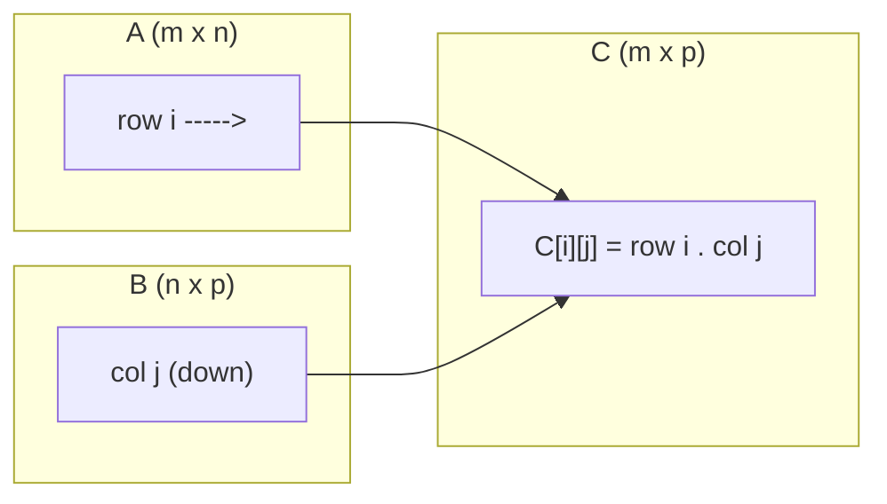
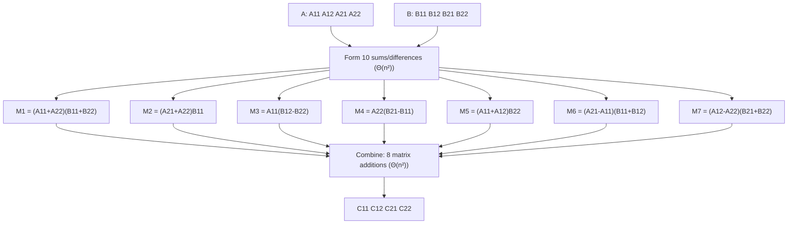
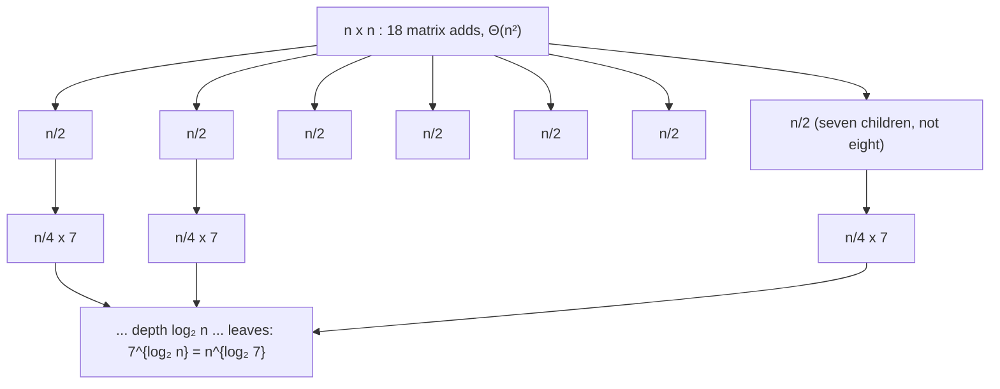
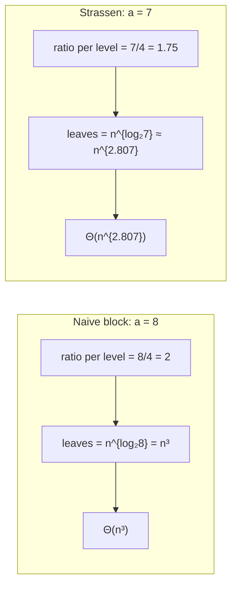
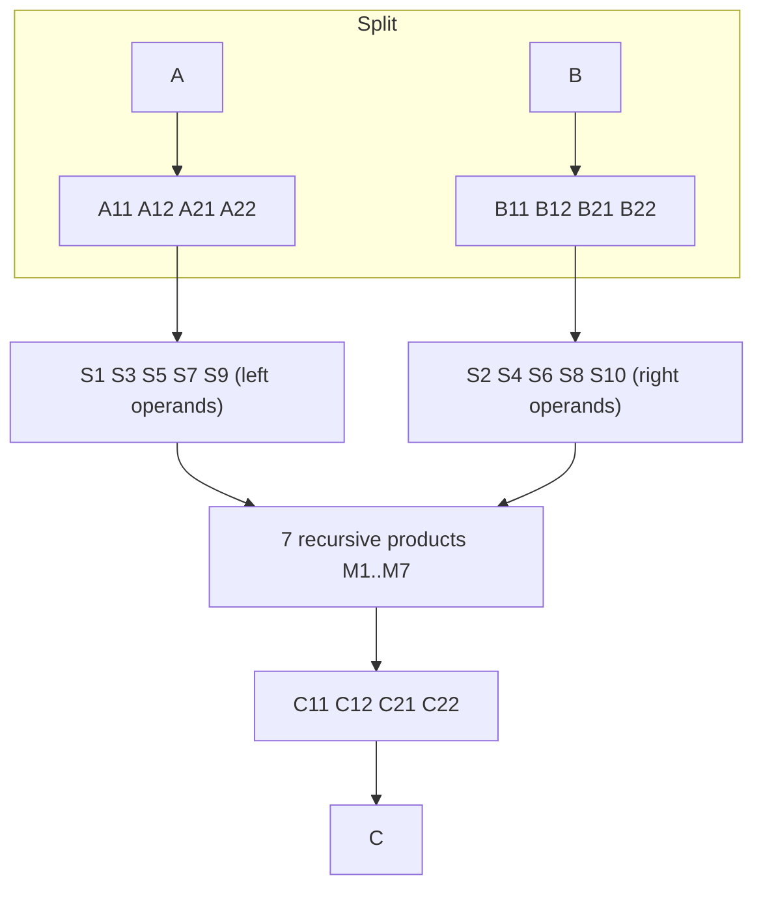
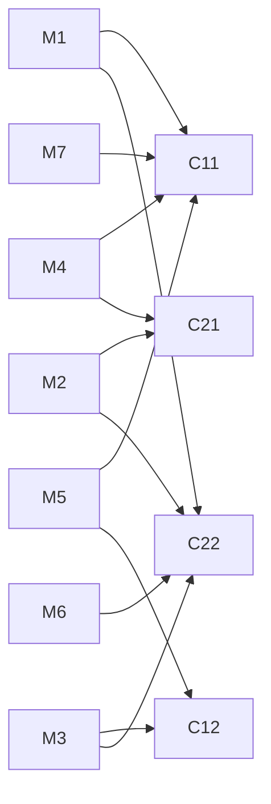

# Strassen's Algorithm for Matrix Multiplication

## Definition

Strassen's algorithm is a divide-and-conquer algorithm for multiplying two square matrices that performs asymptotically fewer scalar multiplications than the definition-based triple-loop algorithm.

Informally:

> Cut both matrices into four quadrants each. The obvious block formula needs eight products of quadrants. Strassen found an arrangement of sums and differences that needs only seven, and recursion turns that single saved multiplication into a change of exponent.

Formally, let $A, B \in R^{n \times n}$ over a ring $R$ (typically $\mathbb{R}$ or $\mathbb{Z}$), with $n = 2^k$. Strassen's algorithm computes $C = AB$ using the recurrence

$$
T(n) = 7\,T(n/2) + \Theta(n^2),
$$

which solves to

$$
T(n) = \Theta\!\left(n^{\log_2 7}\right) = \Theta\!\left(n^{2.8073\ldots}\right),
$$

strictly better than the $\Theta(n^3)$ of the definition-based algorithm.

| Aspect | Description |
| --- | --- |
| What it is | A recursive, sub-cubic algorithm for dense matrix multiplication |
| Problem it addresses | The $\Theta(n^3)$ cost of the definition, which was believed for a long time to be optimal |
| Input | Two $n \times n$ matrices $A$, $B$ over a ring (only $+$, $-$, $\times$ are used; no division) |
| Output | The product matrix $C = AB$ |
| Position in algorithm design | The canonical example of divide and conquer combined with an *algebraic identity* that reduces the branching factor |

!!! info

    Strassen published this in 1969 under the title *"Gaussian elimination is not optimal"*. The title is the point: the result was significant not because the constant was better, but because it disproved the widespread assumption that $n^3$ was a barrier for matrix multiplication and, by extension, for the linear-algebra operations reducible to it.

---

## Motivation and Problem Context

### Where matrix multiplication comes from

Matrix multiplication is the computational bottleneck of a remarkable number of tasks:

- Solving linear systems and computing matrix inverses, determinants, and LU factorizations
- Transitive closure and all-pairs shortest paths in graphs (via Boolean or min-plus products)
- Graph adjacency powers: $(A^k)_{ij}$ counts walks of length $k$ from $i$ to $j$
- Every dense layer of a neural network, and the attention mechanism of a transformer
- 3D transformations in graphics, and rotations composed as products of matrices
- Signal processing, statistics (covariance matrices, normal equations), and finite-element simulation

Because so much reduces to it, an improvement in the exponent of matrix multiplication propagates outward to an improvement in the exponent of many other problems. That is what makes the problem interesting far beyond its own statement.

### Why the naive cost hurts

The definition of the product requires, for each of the $n^2$ output entries, a dot product of length $n$. That is $n^3$ scalar multiplications. The growth is brutal:

| $n$ | $n^3$ multiplications | At $10^9$ operations/second |
| --- | --- | --- |
| 100 | $10^6$ | 1 ms |
| 1000 | $10^9$ | 1 s |
| 10 000 | $10^{12}$ | ~17 minutes |
| 100 000 | $10^{15}$ | ~11.6 days |

Doubling $n$ multiplies the work by eight. An algorithm with exponent $2.807$ multiplies the work by only $2^{2.807} \approx 7$ per doubling. The ratio of the two costs is $n^{3}/n^{2.807} = n^{0.193}$, which for $n = 4096$ is about $4.9$ — a factor of five, purely from restructuring the arithmetic.

### The question Strassen asked

Consider the smallest interesting case, $2 \times 2$:

$$
\begin{pmatrix} c_{11} & c_{12} \\ c_{21} & c_{22} \end{pmatrix}
=
\begin{pmatrix} a_{11} & a_{12} \\ a_{21} & a_{22} \end{pmatrix}
\begin{pmatrix} b_{11} & b_{12} \\ b_{21} & b_{22} \end{pmatrix}
$$

The definition uses 8 multiplications and 4 additions. The natural reaction is that 8 is obviously necessary: there are 8 products $a_{ik}b_{kj}$ appearing in the answer, and each must be computed.

That reaction is wrong, and seeing why it is wrong is the whole lesson. The eight products $a_{ik}b_{kj}$ are one *particular basis* for expressing the answer. Nothing forces us to compute the answer in terms of them. We are allowed to compute any seven products of *linear combinations* of the $a$'s and *linear combinations* of the $b$'s, and then form the four outputs as linear combinations of those seven results. Addition is cheap; multiplication is what we are counting.

!!! tip

    This is precisely the Karatsuba move. Multiplying two 2-digit numbers $(x_1B + x_0)(y_1B + y_0)$ appears to need four digit products, but the identity

    $$
    x_1y_0 + x_0y_1 = (x_1+x_0)(y_1+y_0) - x_1y_1 - x_0y_0
    $$

    reduces it to three. Strassen's algorithm is the same idea applied to $2 \times 2$ blocks: 8 products become 7 at the cost of extra additions. If you understand why Karatsuba works, you already understand *why Strassen exists*; only the specific identity is harder to find.

---

## Problem Formulation

```text
Input:
    Two matrices A and B over a ring R,
    A of dimension n x n, B of dimension n x n.
    (Strassen's classical form assumes n = 2^k; see the padding discussion later.)

Output:
    The matrix C of dimension n x n with
        C[i][j] = sum over k = 1..n of A[i][k] * B[k][j].

Objective:
    Minimise the number of scalar multiplications (and, secondarily, additions),
    hence the asymptotic running time.

Assumptions:
    - The entries lie in a ring: addition, subtraction and multiplication are
      available and associative/distributive. Division is NOT used.
    - Multiplication of entries need NOT be commutative. This matters: during the
      recursion the "entries" are submatrices, and matrix multiplication is not
      commutative.
    - The matrices are dense; no structure (sparsity, symmetry, bandedness) is exploited.

Constraints and edge cases:
    - n = 1: the product is a single scalar multiplication.
    - n odd, or not a power of two: requires padding or peeling.
    - Non-square products (m x n times n x p): handled by padding to a common
      square size, or by rectangular variants.
    - Floating-point entries: correctness becomes "accuracy", and the guarantees
      differ from the classical algorithm.
```

!!! warning

    The non-commutativity assumption is the single most important structural constraint. Any candidate identity for $2 \times 2$ multiplication must be valid in a **noncommutative** ring, because the recursive step substitutes matrices for the scalars $a_{ij}$, $b_{ij}$. Identities that silently use $xy = yx$ do exist and can multiply $2 \times 2$ commutative matrices with fewer operations, but they do **not** recurse, and therefore give no asymptotic improvement.

---

## Review of Standard Matrix Multiplication

### The definition

For $A \in R^{m \times n}$ and $B \in R^{n \times p}$, the product $C = AB \in R^{m \times p}$ is defined entrywise by

$$
C_{ij} = \sum_{k=1}^{n} A_{ik} B_{kj}, \qquad 1 \le i \le m,\ 1 \le j \le p .
$$

Read structurally: **entry $(i,j)$ of the product is the dot product of row $i$ of $A$ with column $j$ of $B$.** The inner dimensions must agree; the outer dimensions become the shape of the result.



### Properties worth remembering

| Property | Statement | Consequence for algorithms |
| --- | --- | --- |
| Associative | $(AB)C = A(BC)$ | Chain multiplication order affects cost: this is the matrix-chain DP problem |
| Distributive | $A(B+C) = AB + AC$ | Justifies the block decomposition and Strassen's identities |
| Not commutative | $AB \ne BA$ in general | Strassen's identities must avoid commuting factors |
| Identity | $AI = IA = A$ | Base of exponentiation by squaring |
| Transpose | $(AB)^{\mathsf T} = B^{\mathsf T}A^{\mathsf T}$ | Used to convert column access into row access for cache reasons |
| Block-compatible | Conformable block partitions multiply "as if" the blocks were scalars | The key enabler of all recursive algorithms here |

### Pseudocode

```text
ALGORITHM StandardMatrixMultiply(A, B)
    // A is m x n, B is n x p. Returns C = A * B (m x p).

    IF columns(A) != rows(B)
        ERROR "dimension mismatch"

    m ← rows(A)
    n ← columns(A)
    p ← columns(B)

    C ← new matrix of size m x p, all entries 0

    FOR i ← 1 TO m
        FOR j ← 1 TO p
            sum ← 0
            FOR k ← 1 TO n
                sum ← sum + A[i][k] * B[k][j]
            C[i][j] ← sum

    RETURN C
```

### Complexity

Let $m = n = p$ for simplicity.

- The innermost statement executes exactly $n \cdot n \cdot n = n^3$ times.
- Each execution performs one multiplication and one addition.

$$
\text{Multiplications} = n^3, \qquad
\text{Additions} = n^3 - n^2 = n^2(n-1),
$$

(the $-n^2$ because each of the $n^2$ dot products performs $n-1$ additions, not $n$, if the sum is initialised with the first product). Total arithmetic operations $\approx 2n^3$.

$$
T(n) = \Theta(n^3), \qquad S(n) = \Theta(n^2) \text{ for the output, } \Theta(1) \text{ auxiliary}.
$$

Best, average and worst case coincide: the loop bounds do not depend on the data. There is no early exit, no data-dependent branch, and therefore no distinction between cases.

!!! note

    The output alone occupies $\Theta(n^2)$ space, so $\Omega(n^2)$ is a trivial lower bound on the time as well: every entry of $C$ must be written, and in general every entry of $A$ and $B$ must be read. The interesting question is the gap between the trivial $\Omega(n^2)$ and the achievable upper bound. Closing that gap is the central open problem of algebraic complexity.

### Loop ordering and why the same $n^3$ can differ by a factor of ten

The three loops of the standard algorithm can be nested in any of $3! = 6$ orders. All perform the same $n^3$ multiply-add operations; they differ only in memory access pattern.

| Order | Access pattern | Behaviour in a row-major language |
| --- | --- | --- |
| `i, j, k` | `A` row-wise, `B` column-wise | `B` access strides by a row length: poor locality |
| `i, k, j` | `A` element-wise, `B` and `C` row-wise | Excellent locality; usually the fastest naive form |
| `k, i, j` | `B` row-wise, `C` row-wise, `A` element-wise | Also good; accumulates into `C` |

In addition, real implementations use **blocking (tiling)**: partition the matrices into tiles small enough that three tiles fit in cache, and multiply tile by tile. The operation count is unchanged at $n^3$, but the number of slow memory transfers drops from $\Theta(n^3)$ to $\Theta(n^3/\sqrt{M})$ for a cache of size $M$.

!!! tip

    Blocking is a divide-and-conquer idea used purely for memory hierarchy, not for operation count. Recursive block multiplication ($8T(n/2) + \Theta(n^2)$) achieves the same effect *cache-obliviously*, with no knowledge of $M$. This is worth internalising: divide and conquer can pay off in the memory system even when it does not change the asymptotic operation count at all.

### Block (partitioned) matrix multiplication

This is the structural fact Strassen's algorithm rests upon. Let $n$ be even and partition

$$
A = \begin{pmatrix} A_{11} & A_{12} \\ A_{21} & A_{22}\end{pmatrix},
\qquad
B = \begin{pmatrix} B_{11} & B_{12} \\ B_{21} & B_{22}\end{pmatrix},
\qquad
C = \begin{pmatrix} C_{11} & C_{12} \\ C_{21} & C_{22}\end{pmatrix},
$$

where every block is $\tfrac n2 \times \tfrac n2$. Then

$$
\begin{aligned}
C_{11} &= A_{11}B_{11} + A_{12}B_{21}, &\qquad C_{12} &= A_{11}B_{12} + A_{12}B_{22}, \\
C_{21} &= A_{21}B_{11} + A_{22}B_{21}, &\qquad C_{22} &= A_{21}B_{12} + A_{22}B_{22}.
\end{aligned}
$$

These are *exactly* the $2 \times 2$ scalar formulas with blocks in place of scalars. The identity holds because summation over $k$ can be split into "$k$ in the first half" and "$k$ in the second half":

$$
C_{ij} = \sum_{k=1}^{n} A_{ik}B_{kj}
       = \underbrace{\sum_{k=1}^{n/2} A_{ik}B_{kj}}_{\text{left blocks of }A \times \text{top blocks of }B}
       + \underbrace{\sum_{k=n/2+1}^{n} A_{ik}B_{kj}}_{\text{right blocks} \times \text{bottom blocks}} .
$$

!!! danger

    Order matters in the block formulas. $A_{11}B_{11}$ is not interchangeable with $B_{11}A_{11}$. Every derivation below must respect the left-to-right order of factors.

---

## Naive Divide and Conquer: the Baseline That Fails

The block formulas immediately give a recursive algorithm.

```text
ALGORITHM NaiveBlockMultiply(A, B, n)
    IF n = 1
        RETURN [ A[1][1] * B[1][1] ]

    Partition A into A11, A12, A21, A22   (each n/2 x n/2)
    Partition B into B11, B12, B21, B22

    C11 ← NaiveBlockMultiply(A11, B11) + NaiveBlockMultiply(A12, B21)
    C12 ← NaiveBlockMultiply(A11, B12) + NaiveBlockMultiply(A12, B22)
    C21 ← NaiveBlockMultiply(A21, B11) + NaiveBlockMultiply(A22, B21)
    C22 ← NaiveBlockMultiply(A21, B12) + NaiveBlockMultiply(A22, B22)

    RETURN assembled C
```

Counting:

- Recursive multiplications: **8**, each on matrices of size $n/2$.
- Additions: **4** additions of $\tfrac n2 \times \tfrac n2$ matrices, i.e. $4 \cdot (n/2)^2 = n^2$ scalar additions, plus $\Theta(n^2)$ for partitioning and assembling.

$$
T(n) = 8T(n/2) + \Theta(n^2).
$$

Apply the Master Theorem with $a = 8$, $b = 2$, $\alpha = \log_2 8 = 3$, $f(n) = \Theta(n^2) = O(n^{3-\varepsilon})$: case 1, leaves dominate, so

$$
T(n) = \Theta(n^3).
$$

### Identifying the bottleneck

The recursion bought **nothing** asymptotically. Where is the cost? At the leaves. There are $8^{\log_2 n} = n^{\log_2 8} = n^3$ leaves, each doing one scalar multiplication. The $\Theta(n^2)$ combine work at every level sums to only $\Theta(n^2)$ overall (a geometric series dominated by the root), which is negligible.

This diagnosis tells us exactly what to attack:

```text
Naive definition: Θ(n³)
      ↓
Block recursion: 8T(n/2) + Θ(n²) = Θ(n³)   (no gain)
      ↓
Bottleneck: the LEAF count n^{log₂ 8}, driven by a = 8
      ↓
Key observation: additions are free (they live in f(n), which is dominated);
                 only the branching factor a sits in the exponent
      ↓
Goal: reduce a from 8 to 7, whatever it costs in additions
      ↓
Strassen: 7T(n/2) + Θ(n²) = Θ(n^{log₂ 7})
```

!!! tip

    This is the most transferable insight in the whole topic. In $T(n) = aT(n/b) + f(n)$ with leaf-dominated behaviour, $a$ appears in the **exponent** $\log_b a$ while $f(n)$ appears only as a lower-order term. Therefore trading *any constant number of extra additions* for *one fewer recursive multiplication* is an unconditional asymptotic win. Karatsuba ($4 \to 3$), Toom–Cook ($9 \to 5$ for a three-way split), and Strassen ($8 \to 7$) are three instances of the same trade.

---

## Intuition

### The accounting that motivates the search

Suppose we could multiply $2 \times 2$ matrices with $r$ multiplications of *linear combinations of entries*, using any number of additions. Recursing gives

$$
T(n) = r\,T(n/2) + \Theta(n^2) \implies T(n) = \Theta\!\left(n^{\log_2 r}\right)
\quad \text{whenever } \log_2 r > 2, \text{ i.e. } r > 4 .
$$

| $r$ | $\log_2 r$ | Comment |
| --- | --- | --- |
| 8 | 3.000 | The definition; no gain |
| 7 | 2.807 | Strassen; the best possible for $2\times2$ |
| 6 | 2.585 | Proved impossible |
| 5 | 2.322 | Proved impossible |
| 4 | 2.000 | Would be optimal; impossible |

So the entire prize hangs on shaving multiplications off a $2 \times 2$ product. Once you see the table, the search becomes obvious as an objective, even though finding the identity is not obvious at all.

### Why fewer than eight is even conceivable

Write the four outputs of a $2\times 2$ product:

$$
\begin{aligned}
c_{11} &= a_{11}b_{11} + a_{12}b_{21} \\
c_{12} &= a_{11}b_{12} + a_{12}b_{22} \\
c_{21} &= a_{21}b_{11} + a_{22}b_{21} \\
c_{22} &= a_{21}b_{12} + a_{22}b_{22}
\end{aligned}
$$

Eight distinct products $a_{ik}b_{kj}$ appear. But we do not need those eight *individually*; we only need the four sums. A product of sums, such as $(a_{11}+a_{22})(b_{11}+b_{22})$, produces four of the needed terms at once — along with two unwanted cross terms $a_{11}b_{22}$ and $a_{22}b_{11}$. If further cleverly chosen products supply exactly the right unwanted terms to cancel, we can assemble the four outputs from fewer than eight products.

That is the whole idea: **compute products that overshoot, then cancel the overshoot with other products you were going to need anyway.**

### A two-line analogy

For scalars, the identity

$$
xy = \frac{(x+y)^2 - x^2 - y^2}{2}
$$

computes a product from three squarings. If squaring were cheaper than multiplying, this would be a saving. It is the same shape of trick: a product recovered from sums and cancellations. Strassen's identity is a far more intricate cousin, but the mental category is the same.

!!! tip

    The invention question — *"if I had to discover this myself, what would lead me there?"* — has a concrete answer here:

    > I am counting only multiplications. Additions are free. So let me stop insisting on computing the eight monomials $a_{ik}b_{kj}$ and instead look for seven products of *linear forms in $a$* times *linear forms in $b$* whose span contains the four required outputs.

    That reframing turns an apparently impossible task into a finite (if large) linear-algebra search over coefficient patterns.

---

## Core Concepts

### Bilinearity of matrix multiplication

Each output entry $c_{ij}$ is a **bilinear form**: linear in the entries of $A$ when $B$ is fixed, and linear in the entries of $B$ when $A$ is fixed. This is why the following template is the right search space:

$$
C_{ij} = \sum_{t=1}^{r} \gamma_{ij}^{(t)} M_t,
\qquad
M_t = \left(\sum_{i,k} \alpha_{ik}^{(t)} A_{ik}\right)\left(\sum_{k,j} \beta_{kj}^{(t)} B_{kj}\right).
$$

An algorithm of this shape is called a **bilinear algorithm of rank $r$**. Strassen's is the case $r = 7$ for $2\times2$, with all coefficients in $\{-1, 0, 1\}$.

### Tensor rank and the exponent of matrix multiplication

Matrix multiplication of $\langle m, n, p \rangle$ shapes is a trilinear form, encoded as a 3-dimensional tensor. The minimum $r$ in the template above is the **tensor rank** of that form. The connection to complexity is a theorem:

$$
\text{rank}\big(\langle n, n, n\rangle\big) \le r \implies \omega \le \log_n r,
$$

where $\omega$ is the exponent of matrix multiplication, defined as the infimum of $\tau$ such that $O(n^\tau)$ arithmetic operations suffice.

Strassen's contribution is exactly $\text{rank}(\langle 2,2,2\rangle) \le 7$, hence $\omega \le \log_2 7 \approx 2.8074$.

### Recursion versus a one-off trick

A trick that works only at the top level is worth a constant factor. A trick that works on *blocks* recurses and changes the exponent. This is why the noncommutativity requirement is not pedantry: the recursive substitution of matrices for scalars is the mechanism that converts a constant-factor saving into an exponent improvement.

### Cutoff (base-case threshold)

In practice the recursion is not carried to $n = 1$. Below a threshold $n_0$ the algorithm switches to a tuned classical multiply. This is a base-case choice, exactly as with a merge-sort cutoff, and it dominates real performance.

### Padding and peeling

Strassen's split requires an even dimension. Two standard remedies:

- **Static padding**: embed $A$ and $B$ into the next power of two $\hat n = 2^{\lceil \log_2 n\rceil}$ with zeros. Worst case $\hat n < 2n$, so the cost multiplies by at most $2^{2.807} \approx 7$ — safe but potentially wasteful.
- **Dynamic peeling**: if $n$ is odd, strip the last row and column, multiply the even $(n-1)$ part with Strassen, and repair the border with $\Theta(n^2)$ rank-one updates.
- **Hybrid**: pad only up to the nearest multiple of $2^{\ell}$ where $\ell$ is the number of recursion levels actually used before the cutoff. This is what practical libraries do.

---

## Algorithmic Paradigm

**Divide and conquer, combined with an algebraic identity that reduces the branching factor.**

Why this paradigm fits:

1. **Self-similarity.** A submatrix product is itself a matrix product. The block identity guarantees this exactly, not approximately.
2. **Disjointness.** The seven products are independent; no subproblem is solved twice, so there is no case for dynamic programming.
3. **Cheap combine.** Forming the operands and assembling the outputs costs only matrix additions, $\Theta(n^2)$ — asymptotically negligible against the leaf count.
4. **The exponent is controlled by $a$.** Since the recursion is leaf-dominated, reducing $a$ is the only lever that changes the exponent, and an algebraic identity is the tool that reduces it.

Note what the paradigm is **not** doing here: it is not exploiting order, monotonicity, or geometry. It is exploiting *algebra*. That places Strassen in the same family as Karatsuba, Toom–Cook, and the FFT, rather than with merge sort and closest-pair.

---

## Strassen's Innovative Approach

### Setup

Let $n$ be even and partition $A$, $B$, $C$ into $\tfrac n2 \times \tfrac n2$ quadrants as above.

### The ten operand combinations

$$
\begin{array}{llll}
S_1 = A_{11} + A_{22} & S_2 = B_{11} + B_{22} & S_3 = A_{21} + A_{22} & S_4 = B_{12} - B_{22} \\
S_5 = A_{11} + A_{12} & S_6 = B_{21} - B_{11} & S_7 = A_{21} - A_{11} & S_8 = B_{11} + B_{12} \\
S_9 = A_{12} - A_{22} & S_{10} = B_{21} + B_{22} & &
\end{array}
$$

### The seven products

$$
\begin{aligned}
M_1 &= S_1 \, S_2 = (A_{11} + A_{22})(B_{11} + B_{22}) \\
M_2 &= S_3 \, B_{11} = (A_{21} + A_{22})\,B_{11} \\
M_3 &= A_{11} \, S_4 = A_{11}(B_{12} - B_{22}) \\
M_4 &= A_{22} \, S_6 = A_{22}(B_{21} - B_{11}) \\
M_5 &= S_5 \, B_{22} = (A_{11} + A_{12})\,B_{22} \\
M_6 &= S_7 \, S_8 = (A_{21} - A_{11})(B_{11} + B_{12}) \\
M_7 &= S_9 \, S_{10} = (A_{12} - A_{22})(B_{21} + B_{22})
\end{aligned}
$$

Each $M_t$ is a single recursive multiplication of $\tfrac n2 \times \tfrac n2$ matrices. **There are seven, not eight.**

### Assembling the answer

$$
\begin{aligned}
C_{11} &= M_1 + M_4 - M_5 + M_7 \\
C_{12} &= M_3 + M_5 \\
C_{21} &= M_2 + M_4 \\
C_{22} &= M_1 - M_2 + M_3 + M_6
\end{aligned}
$$



### Verifying the identities

The proof is direct expansion. Because the entries are matrices, the order of every factor is preserved throughout; only distributivity and associativity of addition are used.

**Expanding the seven products.**

$$
\begin{aligned}
M_1 &= A_{11}B_{11} + A_{11}B_{22} + A_{22}B_{11} + A_{22}B_{22} \\
M_2 &= A_{21}B_{11} + A_{22}B_{11} \\
M_3 &= A_{11}B_{12} - A_{11}B_{22} \\
M_4 &= A_{22}B_{21} - A_{22}B_{11} \\
M_5 &= A_{11}B_{22} + A_{12}B_{22} \\
M_6 &= A_{21}B_{11} + A_{21}B_{12} - A_{11}B_{11} - A_{11}B_{12} \\
M_7 &= A_{12}B_{21} + A_{12}B_{22} - A_{22}B_{21} - A_{22}B_{22}
\end{aligned}
$$

**Block $C_{11}$.**

$$
\begin{aligned}
M_1 + M_4 - M_5 + M_7
&= \big(A_{11}B_{11} + A_{11}B_{22} + A_{22}B_{11} + A_{22}B_{22}\big) \\
&\quad + \big(A_{22}B_{21} - A_{22}B_{11}\big) \\
&\quad - \big(A_{11}B_{22} + A_{12}B_{22}\big) \\
&\quad + \big(A_{12}B_{21} + A_{12}B_{22} - A_{22}B_{21} - A_{22}B_{22}\big) \\
&= A_{11}B_{11} + A_{12}B_{21}. \quad \checkmark
\end{aligned}
$$

Tracking the cancellations explicitly:

| Term | $M_1$ | $M_4$ | $-M_5$ | $M_7$ | Net |
| --- | --- | --- | --- | --- | --- |
| $A_{11}B_{11}$ | $+1$ | | | | $+1$ (kept) |
| $A_{11}B_{22}$ | $+1$ | | $-1$ | | 0 |
| $A_{22}B_{11}$ | $+1$ | $-1$ | | | 0 |
| $A_{22}B_{22}$ | $+1$ | | | $-1$ | 0 |
| $A_{22}B_{21}$ | | $+1$ | | $-1$ | 0 |
| $A_{12}B_{22}$ | | | $-1$ | $+1$ | 0 |
| $A_{12}B_{21}$ | | | | $+1$ | $+1$ (kept) |

Seven distinct monomials appear; five cancel; the two survivors are exactly $C_{11}$.

**Block $C_{12}$.**

$$
M_3 + M_5 = (A_{11}B_{12} - A_{11}B_{22}) + (A_{11}B_{22} + A_{12}B_{22}) = A_{11}B_{12} + A_{12}B_{22}. \quad \checkmark
$$

**Block $C_{21}$.**

$$
M_2 + M_4 = (A_{21}B_{11} + A_{22}B_{11}) + (A_{22}B_{21} - A_{22}B_{11}) = A_{21}B_{11} + A_{22}B_{21}. \quad \checkmark
$$

**Block $C_{22}$.**

$$
\begin{aligned}
M_1 - M_2 + M_3 + M_6
&= \big(A_{11}B_{11} + A_{11}B_{22} + A_{22}B_{11} + A_{22}B_{22}\big) \\
&\quad - \big(A_{21}B_{11} + A_{22}B_{11}\big) \\
&\quad + \big(A_{11}B_{12} - A_{11}B_{22}\big) \\
&\quad + \big(A_{21}B_{11} + A_{21}B_{12} - A_{11}B_{11} - A_{11}B_{12}\big) \\
&= A_{21}B_{12} + A_{22}B_{22}. \quad \checkmark
\end{aligned}
$$

All four blocks agree with the block formulas, so the identity is proved. Note that at no point was $XY = YX$ used, which is precisely what licenses the recursion.

### Operation count for one level

| Quantity | Count |
| --- | --- |
| Recursive multiplications of size $n/2$ | 7 |
| Matrix additions/subtractions to form operands | 10 |
| Matrix additions/subtractions to assemble $C$ | 8 |
| **Total additive matrix operations** | **18** |
| Scalar additions implied | $18 \cdot (n/2)^2 = 4.5\,n^2$ |

Compare with the naive block version: 8 multiplications and 4 matrix additions ($n^2$ scalar additions). Strassen pays $4.5n^2$ instead of $n^2$ in additions — a factor of 4.5 more addition work — to remove one of eight multiplications. Asymptotically that is an excellent trade; for small $n$ it is a bad one. This tension *is* the crossover point discussed later.

### Pseudocode

```text
ALGORITHM Strassen(A, B, n, cutoff)
    // A, B are n x n with n a power of two. Returns C = A * B.

    IF n <= cutoff
        RETURN StandardMatrixMultiply(A, B)

    h ← n / 2

    Partition A into A11, A12, A21, A22   (each h x h)
    Partition B into B11, B12, B21, B22

    // Ten operand combinations
    S1 ← A11 + A22       S2  ← B11 + B22
    S3 ← A21 + A22       S4  ← B12 - B22
    S5 ← A11 + A12       S6  ← B21 - B11
    S7 ← A21 - A11       S8  ← B11 + B12
    S9 ← A12 - A22       S10 ← B21 + B22

    // Seven recursive multiplications
    M1 ← Strassen(S1,  S2,  h, cutoff)
    M2 ← Strassen(S3,  B11, h, cutoff)
    M3 ← Strassen(A11, S4,  h, cutoff)
    M4 ← Strassen(A22, S6,  h, cutoff)
    M5 ← Strassen(S5,  B22, h, cutoff)
    M6 ← Strassen(S7,  S8,  h, cutoff)
    M7 ← Strassen(S9,  S10, h, cutoff)

    // Eight additive operations to assemble the quadrants
    C11 ← M1 + M4 - M5 + M7
    C12 ← M3 + M5
    C21 ← M2 + M4
    C22 ← M1 - M2 + M3 + M6

    RETURN the n x n matrix assembled from C11, C12, C21, C22
```

!!! note

    The `cutoff` parameter is not decoration. With `cutoff = 1` this pseudocode is the textbook algorithm and is slower than the classical triple loop for every $n$ you are likely to run. The algorithm becomes useful only with a sensible cutoff.

### The Winograd variant: 7 multiplications, 15 additions

Strassen's product count is optimal for $2 \times 2$, but the addition count is not. Winograd's rearrangement achieves the same 7 multiplications with only **15** additive operations instead of 18:

$$
\begin{array}{ll}
S_1 = A_{21} + A_{22} & T_1 = B_{12} - B_{11} \\
S_2 = S_1 - A_{11}    & T_2 = B_{22} - T_1 \\
S_3 = A_{11} - A_{21} & T_3 = B_{22} - B_{12} \\
S_4 = A_{12} - S_2    & T_4 = T_2 - B_{21}
\end{array}
$$

$$
\begin{aligned}
M_1 &= A_{11}B_{11}, & M_2 &= A_{12}B_{21}, & M_3 &= S_4 B_{22}, & M_4 &= A_{22}T_4, \\
M_5 &= S_1 T_1, & M_6 &= S_2 T_2, & M_7 &= S_3 T_3. &&
\end{aligned}
$$

$$
\begin{aligned}
U_1 &= M_1 + M_2, & U_2 &= M_1 + M_6, & U_3 &= U_2 + M_7, & U_4 &= U_2 + M_5, \\
U_5 &= U_4 + M_3, & U_6 &= U_3 - M_4, & U_7 &= U_3 + M_5. &&
\end{aligned}
$$

$$
C_{11} = U_1, \qquad C_{12} = U_5, \qquad C_{21} = U_6, \qquad C_{22} = U_7 .
$$

Four $S$'s, four $T$'s, and seven $U$'s give $4+4+7 = 15$ additive operations. The asymptotic exponent is unchanged ($\log_2 7$), but the constant improves, which lowers the practical crossover point. Production implementations of "Strassen" are usually this variant.

!!! info

    It is a theorem (Winograd, 1971) that **7 multiplications are necessary** for $2 \times 2$ noncommutative matrix multiplication. So no rearrangement of the same split can do better than $\log_2 7$; improving the exponent requires a different base case, such as $\langle 3,3,3 \rangle$ or the far more elaborate constructions of the modern literature.

---

## Step-by-Step Execution

### A worked $2 \times 2$ example with scalars

$$
A = \begin{pmatrix} 1 & 3 \\ 7 & 5 \end{pmatrix}, \qquad
B = \begin{pmatrix} 6 & 8 \\ 4 & 2 \end{pmatrix}.
$$

Reference answer from the definition:

$$
C = \begin{pmatrix} 1\cdot6 + 3\cdot4 & 1\cdot8 + 3\cdot2 \\ 7\cdot6 + 5\cdot4 & 7\cdot8 + 5\cdot2 \end{pmatrix}
  = \begin{pmatrix} 18 & 14 \\ 62 & 66 \end{pmatrix}.
$$

Now Strassen, with $A_{11}=1, A_{12}=3, A_{21}=7, A_{22}=5$ and $B_{11}=6, B_{12}=8, B_{21}=4, B_{22}=2$:

| Product | Expression | Operands | Value |
| --- | --- | --- | --- |
| $M_1$ | $(A_{11}+A_{22})(B_{11}+B_{22})$ | $(1+5)(6+2) = 6 \cdot 8$ | 48 |
| $M_2$ | $(A_{21}+A_{22})B_{11}$ | $(7+5)\cdot 6 = 12 \cdot 6$ | 72 |
| $M_3$ | $A_{11}(B_{12}-B_{22})$ | $1 \cdot (8-2) = 1 \cdot 6$ | 6 |
| $M_4$ | $A_{22}(B_{21}-B_{11})$ | $5 \cdot (4-6) = 5 \cdot (-2)$ | $-10$ |
| $M_5$ | $(A_{11}+A_{12})B_{22}$ | $(1+3)\cdot 2 = 4 \cdot 2$ | 8 |
| $M_6$ | $(A_{21}-A_{11})(B_{11}+B_{12})$ | $(7-1)(6+8) = 6 \cdot 14$ | 84 |
| $M_7$ | $(A_{12}-A_{22})(B_{21}+B_{22})$ | $(3-5)(4+2) = (-2)\cdot 6$ | $-12$ |

Assembling:

| Block | Formula | Arithmetic | Value | Expected |
| --- | --- | --- | --- | --- |
| $C_{11}$ | $M_1 + M_4 - M_5 + M_7$ | $48 - 10 - 8 - 12$ | **18** | 18 |
| $C_{12}$ | $M_3 + M_5$ | $6 + 8$ | **14** | 14 |
| $C_{21}$ | $M_2 + M_4$ | $72 - 10$ | **62** | 62 |
| $C_{22}$ | $M_1 - M_2 + M_3 + M_6$ | $48 - 72 + 6 + 84$ | **66** | 66 |

Seven multiplications instead of eight; 18 additive operations instead of 4. On $2 \times 2$ scalars this is clearly a *worse* deal in total operations ($7 + 18 = 25$ against $8 + 4 = 12$). The payoff appears only when the seven multiplications are themselves expensive — that is, when they are recursive block products.

!!! warning

    Do not conclude from this example that Strassen is useless. Conclude the correct thing: at $n = 2$ it is a loss, and there exists a crossover $n_0$ above which it wins. Finding that crossover is an engineering measurement, not a theoretical deduction.

### One level of recursion on a $4 \times 4$ product

$$
A = \begin{pmatrix}
1 & 2 & 3 & 4 \\
5 & 6 & 7 & 8 \\
9 & 10 & 11 & 12 \\
13 & 14 & 15 & 16
\end{pmatrix},
\qquad
B = I_4 + E, \text{ with } E \text{ having a single } 1 \text{ at } (1,4).
$$

Rather than grind through 4×4 arithmetic by hand, observe the *structure* of the recursion:

| Level | Matrix size | Number of multiplications alive | Additions performed at this level |
| --- | --- | --- | --- |
| 0 (root) | $4 \times 4$ | 1 call | $18 \cdot 2^2 = 72$ scalar additions |
| 1 | $2 \times 2$ | 7 calls | $7 \cdot 18 \cdot 1^2 = 126$ scalar additions |
| 2 (leaves) | $1 \times 1$ | 49 calls | 0 |

Total scalar multiplications: $49 = 7^2$. The classical algorithm uses $4^3 = 64$. Total scalar additions: $72 + 126 = 198$, against the classical $4^3 - 4^2 = 48$. The multiplication saving is 15; the addition penalty is 150. At $n=4$ Strassen is far behind, exactly as the general formula predicts.

### The crossover in a pure flop model

Model the classical algorithm as $2n^3$ flops (one multiply and one add per inner iteration) and consider applying **one** level of Strassen on top of it:

$$
\text{Strassen (1 level)} = 7 \cdot 2\left(\frac n2\right)^3 + 18\left(\frac n2\right)^2
= \frac{7}{4}n^3 + \frac{9}{2}n^2 .
$$

This beats $2n^3$ when

$$
2n^3 > \frac74 n^3 + \frac92 n^2
\iff \frac14 n^3 > \frac92 n^2
\iff n > 18 .
$$

So in a flop-counting model the crossover is around $n \approx 18$ per level. Measured crossovers against **highly tuned** classical kernels are much higher — commonly reported anywhere from around a hundred to around a thousand, depending on the library, the hardware and the precision — because the classical kernel achieves near-peak floating-point throughput while Strassen's extra additions are memory-bound. The gap between 18 and the measured value is entirely the story of constants and the memory hierarchy.

---

## Visual Explanation

### The recursion tree and where the cost lives



Level $i$ contains $7^i$ nodes, each of size $n/2^i$, each doing $\Theta((n/2^i)^2)$ addition work. The level cost is therefore

$$
7^i \cdot c\left(\frac{n}{2^i}\right)^2 = cn^2 \left(\frac74\right)^{i},
$$

a **geometric series with ratio $7/4 > 1$**, so the sum is dominated by its last term, the leaves. The leaves number $n^{\log_2 7}$ and that is the answer.

### Comparing the two recursions side by side



The only difference between the two algorithms is a single unit of $a$, and it moves the exponent by $\log_2 8 - \log_2 7 = \log_2(8/7) \approx 0.193$.

### Data flow of one Strassen level



### Where each $M_t$ contributes



Notice the asymmetry: $M_1$ feeds two blocks, $M_6$ and $M_7$ feed only one each, and $C_{11}$ and $C_{22}$ each need four products while $C_{12}$ and $C_{21}$ need two. Nothing about the construction is symmetric, which is a hint of why it was hard to find.

---

## Correctness

### What must be proved

Two separate things:

1. **The identity is algebraically valid** for one level, over any (possibly noncommutative) ring.
2. **The recursion is correct**, by strong induction on $n$.

Part 1 is the expansion carried out above. Part 2 follows the standard divide-and-conquer template.

### Proof by strong induction on $n$

**Claim.** For every $n = 2^k$, $k \ge 0$, `Strassen(A, B, n)` returns $AB$.

**Recursion contract.** `Strassen(X, Y, m)` returns the exact product $XY$ for $m \times m$ inputs $X, Y$.

**Base case ($n = 1$, or $n \le n_0$ with a classical multiply).**
For $n = 1$ the algorithm returns $A_{11}B_{11}$, which is the product by definition. For a cutoff $n_0 > 1$, the base case delegates to `StandardMatrixMultiply`, whose correctness is immediate from the definition of the product (the inner loop computes exactly $\sum_k A_{ik}B_{kj}$).

**Inductive hypothesis.** Assume the contract holds for all sizes $2^j$ with $j < k$.

**Inductive step ($n = 2^k$, $k \ge 1$).**

1. *The split is well-formed.* $n$ is even, so each quadrant is exactly $\tfrac n2 \times \tfrac n2$, and $\tfrac n2 = 2^{k-1} < n$. Every recursive call therefore receives a strictly smaller, valid instance. This also establishes termination.

2. *The operands are valid inputs.* Each $S_i$ is a sum or difference of $\tfrac n2 \times \tfrac n2$ matrices and is therefore a $\tfrac n2 \times \tfrac n2$ matrix. Sums are computed exactly (no approximation over a ring).

3. *The recursive results are correct.* By the inductive hypothesis, $M_t$ equals the exact product of its two operand matrices.

4. *The combination is correct.* Substituting the exact products into the four assembly formulas and expanding — the computation performed above, which uses only distributivity, associativity of addition, and additive inverses, and never commutes a product — yields
$$
\begin{aligned}
M_1 + M_4 - M_5 + M_7 &= A_{11}B_{11} + A_{12}B_{21} = C_{11}, \\
M_3 + M_5 &= A_{11}B_{12} + A_{12}B_{22} = C_{12}, \\
M_2 + M_4 &= A_{21}B_{11} + A_{22}B_{21} = C_{21}, \\
M_1 - M_2 + M_3 + M_6 &= A_{21}B_{12} + A_{22}B_{22} = C_{22}.
\end{aligned}
$$

5. *The blocks are the product.* By the block-multiplication identity (itself a consequence of splitting the summation index $k$), the matrix assembled from these four quadrants is exactly $AB$.

Hence the contract holds for $n = 2^k$, completing the induction. $\blacksquare$

### Why the proof needs noncommutativity to be *unused*

The inductive step substitutes matrices for the symbols $A_{ij}$, $B_{ij}$. If the expansion in step 4 had at any point rewritten $XY$ as $YX$, the substitution would be invalid, since matrix multiplication does not commute. Inspecting the expansion, every monomial keeps an $A$-factor on the left and a $B$-factor on the right throughout. The identity is therefore valid over any ring, and the induction goes through.

!!! danger

    This is not a technicality that can be waved away. There exist bilinear-looking schemes for $2 \times 2$ products with fewer than 7 multiplications that are valid for **commuting** entries. They compute correct answers for scalars and are useless as recursive algorithms, because at the first recursive step the entries become matrices and the identity breaks. If you ever "discover" a 6-multiplication scheme, check whether it commutes anything.

### Padding correctness

If $A$ and $B$ are embedded in $\hat n \times \hat n$ matrices $\hat A, \hat B$ by appending zero rows and columns, then

$$
\hat A \hat B = \begin{pmatrix} AB & 0 \\ 0 & 0\end{pmatrix},
$$

because the added rows/columns are zero and contribute nothing to any dot product involving the original index range. So the top-left $n \times n$ submatrix of the padded product is $AB$. Padding is therefore *exactly* correct, not approximately.

---

## Analysis of Strassen's Algorithm

### Deriving the recurrence

Read it directly off the pseudocode.

1. **Recursive calls.** Exactly 7, each on inputs of size $n/2$. So $a = 7$, $b = 2$.
2. **Non-recursive work.** Partitioning: $\Theta(n^2)$ (or $\Theta(1)$ if index views are used instead of copies). Forming the 10 operands: $10 \cdot (n/2)^2 = 2.5n^2$ scalar operations. Assembling: $8 \cdot (n/2)^2 = 2n^2$. Total $f(n) = \Theta(n^2)$.
3. **Base case.** $T(1) = \Theta(1)$.

$$
\boxed{T(n) = 7\,T(n/2) + \Theta(n^2), \qquad T(1) = \Theta(1).}
$$

### Solving by the Master Theorem

With $a = 7$, $b = 2$:

$$
\alpha = \log_b a = \log_2 7 = 2.807354922\ldots
$$

Compare $f(n) = \Theta(n^2)$ with $n^{\alpha} = n^{2.807\ldots}$. Since $2 < 2.807 - \varepsilon$ for, say, $\varepsilon = 0.5$, we have $f(n) = O(n^{\alpha - \varepsilon})$: **Case 1, leaf-dominated.** Therefore

$$
T(n) = \Theta\!\left(n^{\log_2 7}\right) = \Theta\!\left(n^{2.8074}\right).
$$

### Solving by recursion tree (to see *why*)

At depth $i$ there are $7^i$ subproblems of size $n/2^i$, each contributing $c(n/2^i)^2$ additive work:

$$
T(n) = \sum_{i=0}^{\log_2 n - 1} 7^i \cdot c\left(\frac{n}{2^i}\right)^2 \;+\; 7^{\log_2 n}\cdot T(1)
= cn^2 \sum_{i=0}^{\log_2 n - 1}\left(\frac74\right)^i + n^{\log_2 7}\,T(1).
$$

The geometric sum with ratio $7/4$ evaluates to

$$
\sum_{i=0}^{L-1}\left(\frac74\right)^i = \frac{(7/4)^L - 1}{7/4 - 1} = \frac{4}{3}\left[\left(\frac74\right)^{L} - 1\right],
\qquad L = \log_2 n .
$$

And $(7/4)^{\log_2 n} = n^{\log_2 (7/4)} = n^{\log_2 7 - 2}$, so

$$
cn^2 \cdot \frac43\left(n^{\log_2 7 - 2} - 1\right) = \frac{4c}{3}\left(n^{\log_2 7} - n^2\right).
$$

Adding the leaf term gives $T(n) = \Theta(n^{\log_2 7})$, with the explicit lower-order correction $-\Theta(n^2)$.

!!! tip

    The recursion-tree computation is more informative than the Master Theorem here, because the ratio $7/4$ makes the mechanism visible: each level down multiplies the work by $7/4$, so the deepest level dominates and the whole cost is essentially the leaf count. Change 7 to 4 and the ratio becomes 1 (all levels equal, giving $\Theta(n^2\log n)$); change it to 3 and the root would dominate, giving $\Theta(n^2)$.

### Exact operation counts for $n = 2^k$

**Multiplications.** Let $P(n)$ be the number of scalar multiplications with recursion all the way to $n = 1$:

$$
P(n) = 7P(n/2), \quad P(1) = 1 \implies P(n) = 7^{\log_2 n} = n^{\log_2 7}.
$$

**Additions.** Let $A(n)$ count scalar additions/subtractions:

$$
A(n) = 7A(n/2) + 18\left(\frac n2\right)^2 = 7A(n/2) + \frac92 n^2, \qquad A(1) = 0 .
$$

Try $A(n) = c\left(n^{\log_2 7} - n^2\right)$, which satisfies $A(1) = 0$. Substituting:

$$
7A(n/2) + \tfrac92 n^2
= 7c\left(\frac{n^{\log_2 7}}{7} - \frac{n^2}{4}\right) + \frac92 n^2
= c\,n^{\log_2 7} - \frac{7c}{4}n^2 + \frac92 n^2 .
$$

For this to equal $c\,n^{\log_2 7} - c\,n^2$ we need $-\tfrac{7c}{4} + \tfrac92 = -c$, i.e. $\tfrac{3c}{4} = \tfrac92$, so $c = 6$:

$$
\boxed{A(n) = 6\left(n^{\log_2 7} - n^2\right).}
$$

**Comparison table.**

| $n$ | Classical mults ($n^3$) | Strassen mults ($n^{\log_2 7}$) | Classical adds ($n^3-n^2$) | Strassen adds ($6(n^{\log_27}-n^2)$) | Classical total | Strassen total |
| --- | --- | --- | --- | --- | --- | --- |
| 2 | 8 | 7 | 4 | 18 | 12 | 25 |
| 4 | 64 | 49 | 48 | 198 | 112 | 247 |
| 8 | 512 | 343 | 448 | 1 674 | 960 | 2 017 |
| 16 | 4 096 | 2 401 | 3 840 | 12 870 | 7 936 | 15 271 |
| 32 | 32 768 | 16 807 | 31 744 | 94 698 | 64 512 | 111 505 |
| 64 | 262 144 | 117 649 | 258 048 | 681 318 | 520 192 | 798 967 |
| 128 | 2 097 152 | 823 543 | 2 080 768 | 4 842 954 | 4 177 920 | 5 666 497 |
| 512 | $1.34\times10^8$ | $4.04\times10^7$ | $1.34\times10^8$ | $2.41\times10^8$ | $2.68\times10^8$ | $2.81\times10^8$ |
| 1024 | $1.07\times10^9$ | $2.82\times10^8$ | $1.07\times10^9$ | $1.69\times10^9$ | $2.15\times10^9$ | $1.97\times10^9$ |

!!! danger

    Read the last two columns carefully. With recursion carried all the way down to $n = 1$, Strassen loses on **total** operation count at $n = 512$ and only overtakes the classical algorithm somewhere between 512 and 1024 — because the addition term carries a constant of 6 against the classical 1. Textbook presentations that stop at "$\Theta(n^{2.807})$ beats $\Theta(n^3)$" hide this completely. The algorithm is only useful with a cutoff, which replaces the expensive deep levels with a cheap classical kernel.

### Complexity with a cutoff $n_0$

Recurse only while $n > n_0$; below that, multiply classically. For $n = n_0 \cdot 2^\ell$ the number of leaves is $7^{\ell}$, each a classical $n_0 \times n_0$ multiply costing $\approx 2n_0^3$ flops:

$$
T(n) \approx 7^{\ell}\cdot 2n_0^3 + \frac{4}{3}\cdot\frac92\left(n^{2}\left(\tfrac74\right)^{\ell} - n^2\right),
\qquad \ell = \log_2\!\frac{n}{n_0}.
$$

Since $7^{\ell} = (n/n_0)^{\log_2 7}$, the leading term is

$$
2n_0^3 \left(\frac{n}{n_0}\right)^{\log_2 7} = 2\,n^{\log_2 7}\, n_0^{\,3 - \log_2 7} = 2\,n^{\log_2 7}\,n_0^{\,0.1926\ldots}.
$$

Two readings of this formula:

- The **exponent in $n$ is unchanged** by the cutoff. Any fixed $n_0$ still gives $\Theta(n^{\log_2 7})$.
- The **constant grows** as $n_0^{0.193}$, so a larger cutoff makes the asymptotic constant slightly worse while making the practical performance much better (because the classical kernel runs near peak throughput). The optimum $n_0$ is determined by measurement, not by this formula.

### Space complexity

| Quantity | Cost |
| --- | --- |
| Output | $\Theta(n^2)$, unavoidable |
| Classical algorithm auxiliary | $\Theta(1)$ (accumulate in place) |
| Strassen, naive implementation | $\Theta(n^2)$ auxiliary, with a large constant: 10 operand matrices and 7 result matrices of size $(n/2)^2$ per active frame |
| Strassen, per-frame temporaries summed over depth | $\sum_{i} \Theta\!\left((n/2^i)^2\right) = \Theta(n^2)$ (geometric, ratio $1/4$) |
| Recursion depth | $\Theta(\log n)$ frames |

The geometric sum is the saving grace: temporaries shrink by a factor of 4 per level while only one path is active at a time, so the total live auxiliary memory is $\Theta(n^2)$ — the same order as the output, but with a constant that a naive implementation makes uncomfortably large (commonly quoted around $2n^2$ to $3n^2$ extra for careful implementations, and much more for careless ones). Memory-efficient variants reduce the workspace substantially by overwriting operands and reordering the products.

!!! warning

    The classical algorithm needs essentially **no** workspace, while Strassen needs $\Theta(n^2)$. On a machine where the matrices only just fit in memory, Strassen may be impossible regardless of its exponent. This is a real constraint in large-scale linear algebra, not a hypothetical.

### Best, average, worst case

All three coincide, at $\Theta(n^{\log_2 7})$. The control flow is determined entirely by $n$; no branch depends on the values. There is no data-dependent behaviour, no amortization, and no randomization. This makes the algorithm perfectly predictable — a genuine engineering advantage for latency-sensitive systems, and a reminder that "worst case equals best case" is not automatic but a property of oblivious algorithms.

### The exponent in context

| Algorithm | Year | Exponent | Practical? |
| --- | --- | --- | --- |
| Definition | — | 3 | Yes; the baseline, near peak hardware throughput |
| Strassen | 1969 | $\log_2 7 \approx 2.8074$ | Yes, above a crossover; used in some libraries |
| Winograd variant of Strassen | 1971 | $\log_2 7$ | Yes; lower constant, lower crossover |
| Pan | 1978 | $\approx 2.796$ | Marginal |
| Bini et al. (approximate bilinear) | 1979 | $\approx 2.78$ | No |
| Schönhage | 1981 | $\approx 2.55$ | No |
| Strassen (laser method) | 1986 | $\approx 2.48$ | No |
| Coppersmith–Winograd | 1990 | $\approx 2.376$ | No |
| Later refinements | 2010s–2020s | $\approx 2.371$ | No |
| Trivial lower bound | — | 2 | — |

!!! info

    Everything below Strassen in this table is a **galactic algorithm**: the asymptotic exponent is better, but the hidden constants are so enormous that the crossover point exceeds any matrix size that will ever be multiplied. Strassen is the only sub-cubic algorithm in the list that is used in practice. Whether $\omega = 2$ is one of the major open problems in theoretical computer science.

### Consequences for other problems

Because many linear-algebra operations reduce to matrix multiplication by block recursion, Strassen's exponent propagates:

| Problem | Classical | With a $O(n^\omega)$ multiplier |
| --- | --- | --- |
| Matrix inversion | $\Theta(n^3)$ | $O(n^{\omega})$ |
| Determinant | $\Theta(n^3)$ | $O(n^{\omega})$ |
| LU decomposition | $\Theta(n^3)$ | $O(n^{\omega})$ |
| Solving $Ax=b$ (dense) | $\Theta(n^3)$ | $O(n^{\omega})$ |
| Boolean matrix product / transitive closure | $\Theta(n^3)$ | $O(n^{\omega})$ |
| Graph triangle counting | $\Theta(n^3)$ | $O(n^{\omega})$ |

This is why the 1969 title said Gaussian elimination is not optimal: Gaussian elimination is $\Theta(n^3)$, and the reduction to matrix multiplication beats it.

---

## Python Implementation

```python
"""Strassen's algorithm for matrix multiplication, with a classical fallback.

Matrices are represented as lists of lists of numbers. The implementation is
written for clarity and to mirror the pseudocode, not for raw speed; a
production version would use contiguous buffers and index views instead of
copying submatrices.
"""

from typing import List

Matrix = List[List[float]]


def standard_multiply(A: Matrix, B: Matrix) -> Matrix:
    """Definition-based product. Uses the i,k,j loop order for locality."""
    m, n = len(A), len(A[0])
    n2, p = len(B), len(B[0])
    if n != n2:
        raise ValueError(f"inner dimensions differ: {n} vs {n2}")

    C = [[0.0] * p for _ in range(m)]
    for i in range(m):
        Ai, Ci = A[i], C[i]
        for k in range(n):
            a = Ai[k]
            if a == 0:
                continue
            Bk = B[k]
            for j in range(p):
                Ci[j] += a * Bk[j]
    return C


def add(A: Matrix, B: Matrix) -> Matrix:
    return [[x + y for x, y in zip(ra, rb)] for ra, rb in zip(A, B)]


def sub(A: Matrix, B: Matrix) -> Matrix:
    return [[x - y for x, y in zip(ra, rb)] for ra, rb in zip(A, B)]


def split(M: Matrix):
    """Split an even-sized square matrix into its four quadrants."""
    h = len(M) // 2
    top, bottom = M[:h], M[h:]
    M11 = [row[:h] for row in top]
    M12 = [row[h:] for row in top]
    M21 = [row[:h] for row in bottom]
    M22 = [row[h:] for row in bottom]
    return M11, M12, M21, M22


def join(C11: Matrix, C12: Matrix, C21: Matrix, C22: Matrix) -> Matrix:
    """Reassemble four quadrants into one matrix."""
    top = [r1 + r2 for r1, r2 in zip(C11, C12)]
    bottom = [r1 + r2 for r1, r2 in zip(C21, C22)]
    return top + bottom


def _strassen_pow2(A: Matrix, B: Matrix, cutoff: int) -> Matrix:
    """Strassen on matrices whose size is a power of two."""
    n = len(A)
    if n <= cutoff:
        return standard_multiply(A, B)

    A11, A12, A21, A22 = split(A)
    B11, B12, B21, B22 = split(B)

    # Seven recursive products (ten operand combinations)
    M1 = _strassen_pow2(add(A11, A22), add(B11, B22), cutoff)
    M2 = _strassen_pow2(add(A21, A22), B11, cutoff)
    M3 = _strassen_pow2(A11, sub(B12, B22), cutoff)
    M4 = _strassen_pow2(A22, sub(B21, B11), cutoff)
    M5 = _strassen_pow2(add(A11, A12), B22, cutoff)
    M6 = _strassen_pow2(sub(A21, A11), add(B11, B12), cutoff)
    M7 = _strassen_pow2(sub(A12, A22), add(B21, B22), cutoff)

    # Eight additive operations to assemble the quadrants
    C11 = add(sub(add(M1, M4), M5), M7)     # M1 + M4 - M5 + M7
    C12 = add(M3, M5)
    C21 = add(M2, M4)
    C22 = add(add(sub(M1, M2), M3), M6)     # M1 - M2 + M3 + M6

    return join(C11, C12, C21, C22)


def strassen(A: Matrix, B: Matrix, cutoff: int = 64) -> Matrix:
    """Multiply A (m x n) by B (n x p) using Strassen with zero padding.

    Padding to the next power of two is exact: the extra rows and columns are
    zero, so they contribute nothing to any dot product in the original range.
    """
    if not A or not A[0] or not B or not B[0]:
        raise ValueError("empty matrix")
    m, n = len(A), len(A[0])
    n2, p = len(B), len(B[0])
    if n != n2:
        raise ValueError(f"inner dimensions differ: {n} vs {n2}")

    size = max(m, n, p)
    dim = 1
    while dim < size:
        dim *= 2

    if dim <= cutoff:
        return standard_multiply(A, B)

    Ap = [[0.0] * dim for _ in range(dim)]
    Bp = [[0.0] * dim for _ in range(dim)]
    for i in range(m):
        Ap[i][:n] = A[i]
    for i in range(n):
        Bp[i][:p] = B[i]

    Cp = _strassen_pow2(Ap, Bp, cutoff)
    return [row[:p] for row in Cp[:m]]


if __name__ == "__main__":
    A = [[1, 3], [7, 5]]
    B = [[6, 8], [4, 2]]
    print(strassen(A, B, cutoff=1))        # [[18, 14], [62, 66]]
    print(standard_multiply(A, B))          # [[18, 14], [62, 66]]

    # Non-power-of-two, non-square: padding path
    A = [[1, 2, 3], [4, 5, 6]]
    B = [[7, 8], [9, 10], [11, 12]]
    print(strassen(A, B, cutoff=1))        # [[58, 64], [139, 154]]
```

### An instrumented version for counting operations

```python
class OpCounter:
    """Counts scalar multiplications and additions to verify the analysis."""

    def __init__(self):
        self.mults = 0
        self.adds = 0


def counted_standard(A, B, ctr):
    n = len(A)
    C = [[0] * n for _ in range(n)]
    for i in range(n):
        for j in range(n):
            total = A[i][0] * B[0][j]
            ctr.mults += 1
            for k in range(1, n):
                total += A[i][k] * B[k][j]
                ctr.mults += 1
                ctr.adds += 1
            C[i][j] = total
    return C


def counted_strassen(A, B, ctr):
    n = len(A)
    if n == 1:
        ctr.mults += 1
        return [[A[0][0] * B[0][0]]]

    def cadd(X, Y):
        ctr.adds += len(X) * len(X)
        return add(X, Y)

    def csub(X, Y):
        ctr.adds += len(X) * len(X)
        return sub(X, Y)

    A11, A12, A21, A22 = split(A)
    B11, B12, B21, B22 = split(B)

    M1 = counted_strassen(cadd(A11, A22), cadd(B11, B22), ctr)
    M2 = counted_strassen(cadd(A21, A22), B11, ctr)
    M3 = counted_strassen(A11, csub(B12, B22), ctr)
    M4 = counted_strassen(A22, csub(B21, B11), ctr)
    M5 = counted_strassen(cadd(A11, A12), B22, ctr)
    M6 = counted_strassen(csub(A21, A11), cadd(B11, B12), ctr)
    M7 = counted_strassen(csub(A12, A22), cadd(B21, B22), ctr)

    C11 = cadd(csub(cadd(M1, M4), M5), M7)
    C12 = cadd(M3, M5)
    C21 = cadd(M2, M4)
    C22 = cadd(cadd(csub(M1, M2), M3), M6)

    return join(C11, C12, C21, C22)
```

Running the counted version for $n = 2, 4, 8, 16$ reproduces exactly $7^{\log_2 n}$ multiplications and $6(n^{\log_2 7} - n^2)$ additions, confirming the closed forms derived above.

---

## Code Walkthrough

### Mapping pseudocode to Python

```text
IF n <= cutoff                        -> if n <= cutoff:
    RETURN Standard(A, B)             ->     return standard_multiply(A, B)
Partition A into A11..A22             -> A11, A12, A21, A22 = split(A)
M1 ← Strassen(A11+A22, B11+B22)       -> M1 = _strassen_pow2(add(A11,A22), add(B11,B22), cutoff)
C11 ← M1 + M4 - M5 + M7               -> C11 = add(sub(add(M1, M4), M5), M7)
RETURN assembled C                    -> return join(C11, C12, C21, C22)
```

### Points students commonly misread

**`if n <= cutoff: return standard_multiply(...)`**
This single line is the difference between a textbook curiosity and a usable algorithm. With `cutoff=1` the recursion descends to scalars, and every level pays the 6-times-larger addition constant derived earlier. With `cutoff=64` the deepest and most numerous levels of the recursion tree — which contain almost all the *nodes* — are replaced by a tight classical kernel.

**`split` copies; it does not view.**
`[row[:h] for row in top]` allocates new lists. That is $\Theta(n^2)$ copying per level and is the dominant practical cost of this implementation. A serious version passes `(matrix, row_offset, col_offset, size)` and never copies, or operates on a flat buffer with strides. The asymptotics are unaffected ($\Theta(n^2)$ either way) but the constant is large.

**`add` and `sub` allocate a fresh matrix each time.**
There are 18 such calls per level. In a tuned implementation, temporaries are pre-allocated once as a workspace and reused, and the additions are fused into the recursive calls where possible. The number of distinct live temporaries is what determines the memory constant.

**`C11 = add(sub(add(M1, M4), M5), M7)`**
Read this as $((M_1 + M_4) - M_5) + M_7$. Order does not matter for correctness here (matrix addition is associative and commutative), but it does matter for floating-point rounding: different groupings give slightly different results. This is worth knowing when a test compares Strassen's output to a reference bit-for-bit — it will fail, and that failure is not a bug.

**`if a == 0: continue` in `standard_multiply`**
A micro-optimization that helps considerably on padded matrices, because padding introduces large zero blocks. It also silently makes the routine's running time data-dependent, which is a small departure from the oblivious behaviour of the pure triple loop.

**Padding in `strassen`**
`size = max(m, n, p)` then rounding up to a power of two handles rectangular inputs by embedding everything in a square. Correctness follows from the zero-block argument. The cost can be as bad as $(2\times)^{\log_2 7} \approx 7$ times the ideal when $n$ is just above a power of two — a strong argument for dynamic peeling or partial padding in practice.

**Why `_strassen_pow2` is separate from `strassen`**
The inner routine has a precondition (size is a power of two greater than the cutoff) that the outer routine establishes. Separating the two keeps the invariant explicit rather than scattering padding logic through the recursion. This is the "recursion contract" idea from divide-and-conquer design, made concrete in the code structure.

---

## Numerical Stability

For exact rings ($\mathbb{Z}$, $\mathbb{Z}_p$, polynomial rings) Strassen is exactly correct. For floating point it is *not* equivalent to the classical algorithm, and the difference is a genuine limitation.

### The classical bound

For the definition-based product in floating point with unit roundoff $\varepsilon$, one has the **componentwise** bound

$$
\left|\hat C_{ij} - C_{ij}\right| \le n\,\varepsilon \sum_{k} |A_{ik}||B_{kj}| + O(\varepsilon^2),
$$

that is, $|\hat C - C| \le n\varepsilon\,|A||B|$ entrywise. This is strong: a small entry of $C$ formed from small operands is computed to high relative accuracy.

### What Strassen gives up

Strassen forms intermediate quantities such as $(A_{11}+A_{22})(B_{11}+B_{22})$ whose magnitude can far exceed that of the output block, and then relies on cancellation to recover the answer. Consequently:

- The componentwise bound is **lost**. Only a **normwise** bound survives, of the form $\|\hat C - C\| \le c(n)\,\varepsilon\,\|A\|\,\|B\|$.
- The constant $c(n)$ grows faster than the classical $n$. The standard reference analysis (Higham) gives a bound in which, for recursion down to a base size $n_0$, the factor grows like $(n/n_0)^{\log_2 12}$ rather than linearly in $n$ — noticeably worse, though still polynomial.
- Scaling matters: because the bound is normwise, badly scaled matrices (rows or columns of wildly different magnitude) lose accuracy that the classical algorithm would have preserved.

Practical consequences:

- Using a **large cutoff** improves accuracy as well as speed, because it reduces the number of Strassen levels and hence the exponent in the error growth. This is a rare case where the engineering choice helps both axes at once.
- Applications that need componentwise accuracy — some eigenvalue algorithms, ill-conditioned solves, iterative refinement — should not use Strassen underneath without analysis.
- Applications tolerant of normwise error at low precision — deep-learning training in fp16/bf16, for instance — are much less affected, which is why fast-multiplication techniques resurface in that setting.

!!! danger

    "The algorithm computes the product" is a statement about a ring. In floating point, *how* you compute a product is part of the specification. Two algorithms with the same mathematical output can have materially different error behaviour, and Strassen's is worse than the classical algorithm's in a way that cannot be fixed by careful coding.

---

## Alternative Approaches

| Algorithm | Strategy | Multiplications for $2\times2$ blocks | Time | Extra space | Notes |
| --- | --- | --- | --- | --- | --- |
| Definition (triple loop) | Brute force | 8 | $\Theta(n^3)$ | $\Theta(1)$ | Best constants; near-peak throughput with blocking and vectorization |
| Blocked/tiled classical | Transform for locality | 8 | $\Theta(n^3)$ | $\Theta(1)$ | Same operations, far fewer cache misses |
| Recursive block (cache-oblivious) | Divide and conquer | 8 | $\Theta(n^3)$ | $\Theta(\log n)$ stack | Cache-optimal without knowing cache sizes |
| Strassen | D&C + algebraic identity | 7 | $\Theta(n^{2.807})$ | $\Theta(n^2)$ | Practical above a crossover; weaker error bound |
| Strassen–Winograd | Same, fewer additions | 7 (15 adds) | $\Theta(n^{2.807})$ | $\Theta(n^2)$ | Lower constant; the usual practical choice |
| Pan, Schönhage, Coppersmith–Winograd and successors | Advanced tensor methods | — | $O(n^{2.78})$ down to $O(n^{2.371})$ | large | Galactic: never faster on real inputs |
| Sparse methods (CSR, etc.) | Exploit structure | — | $O(\text{nnz})$-dependent | varies | Different problem: only for sparse inputs |
| Structured multiplications (Toeplitz, circulant) | FFT-based | — | $O(n\log n)$ matrix–vector | $\Theta(n)$ | Only for structured matrices |
| Randomized approximate product | Sampling / sketching | — | $O(n^2)$ or less | varies | Approximate answer with probabilistic error bounds |
| GPU / distributed classical | Parallel | 8 | $\Theta(n^3/P)$ work per node | varies | The real-world answer for large dense products |

### Where Strassen sits among the "reduce $a$" family

| Problem | Naive split | Naive $a$ | Improved $a$ | Exponent before | Exponent after |
| --- | --- | --- | --- | --- | --- |
| Integer multiplication (2-way) | 2 halves | 4 | 3 (Karatsuba) | 2.000 | 1.585 |
| Integer multiplication (3-way) | 3 parts | 9 | 5 (Toom–Cook 3) | 2.000 | 1.465 |
| Matrix multiplication (2-way) | 4 quadrants | 8 | 7 (Strassen) | 3.000 | 2.807 |

Reading the table row by row makes the transferable pattern unmistakable: the split is chosen for convenience, and then an algebraic identity is hunted for that reduces the number of *products* required.

---

## Trade-Off Analysis

| Trade-off | How it appears in Strassen |
| --- | --- |
| Asymptotics vs constants | Better exponent, worse constant. The crossover is not at $n=2$ but at a measured $n_0$; below it the classical algorithm wins outright |
| Multiplications vs additions | 8 mults + 4 adds becomes 7 mults + 18 adds. Correct when multiplication is the expensive operation (recursively, it is); wrong when both cost the same and $n$ is small |
| Time vs space | Classical needs $\Theta(1)$ workspace; Strassen needs $\Theta(n^2)$ with a substantial constant. On a memory-bound machine this can be decisive |
| Speed vs accuracy | Strassen loses the componentwise error bound and has a worse normwise constant. Larger cutoffs recover accuracy and speed simultaneously |
| Simplicity vs performance | The classical kernel is a few lines and easy to verify; a competitive Strassen needs padding logic, workspace management, a tuned cutoff, and careful testing |
| Generality vs specialization | Strassen works over any ring but ignores all structure. For sparse, symmetric, banded or structured matrices, specialized methods beat both algorithms by far more than $n^{0.193}$ |
| Arithmetic vs memory traffic | The classical blocked kernel is compute-bound and reaches near-peak flops; Strassen's additions are memory-bound, so a flop saving does not translate into a proportional time saving |
| Parallelism granularity | The 7 products are independent and parallelise well, but the operand formation and assembly are synchronization points; classical multiplication parallelises more uniformly |
| Predictability vs adaptivity | Both are oblivious: no data-dependent behaviour, so latency is perfectly predictable. Neither can exploit favourable inputs (e.g. many zeros) without extra machinery |

!!! tip

    The single most useful engineering statement about Strassen: **it is a constant-factor optimization dressed as an asymptotic one, for every matrix size you will actually multiply.** At $n = 4096$ the theoretical advantage is about a factor of 5; after accounting for the addition constant, memory traffic and a realistic cutoff, real implementations report gains in the tens of percent. That is worth having, and it is not a revolution.

---

## Beginner Level

At this level you should be able to:

- Multiply two small matrices by the definition and state the complexity
- Explain the block decomposition and why it is valid
- List Strassen's seven products and four assembly formulas
- Write and solve the recurrence $T(n) = 7T(n/2)+\Theta(n^2)$
- Trace Strassen on a $2\times2$ example

**Micro-exercise.** Verify that the naive block recursion satisfies $T(n) = 8T(n/2)+\Theta(n^2) = \Theta(n^3)$, and state in one sentence why it gives no improvement over the triple loop.

**Micro-exercise.** For $n = 1024$, compute $n^3$ and $n^{\log_2 7}$ and take the ratio. (Answers: $1.07\times10^9$, $2.83\times10^8$, ratio $\approx 3.8$.)

---

## Intermediate Level

At this level you should be able to:

- Derive the recurrence from code rather than recalling it
- Solve it by both the Master Theorem and a recursion tree, and explain what the ratio $7/4$ means
- Derive the exact addition count $6(n^{\log_2 7}-n^2)$
- Explain why a cutoff is necessary and how it affects the constant but not the exponent
- Handle non-power-of-two sizes by padding, and prove padding correct
- Explain why noncommutativity of the entries matters

**Worked exercise: how many levels of Strassen should you apply?**

Suppose the classical kernel runs at $R$ flops per second and Strassen's additions run at $R/3$ flops per second (memory-bound). One level applied to size $n$ costs

$$
\frac{7 \cdot 2(n/2)^3}{R} + \frac{18(n/2)^2}{R/3}
= \frac{1.75n^3}{R} + \frac{13.5n^2}{R},
$$

against $2n^3/R$ classically. This is profitable when $0.25n^3 > 13.5n^2$, i.e. $n > 54$. Applying a second level requires the same inequality at $n/2$, hence $n > 108$, and so on: the number of profitable levels is roughly $\log_2(n/54)$. This is exactly why implementations use a cutoff rather than full recursion, and why the cutoff must be measured on the target machine.

---

## Advanced Level

### The bilinear/tensor view

Encode the $\langle 2,2,2\rangle$ matrix multiplication trilinear form as

$$
\mathcal{T} = \sum_{i,j,k \in \{1,2\}} a_{ij}\otimes b_{jk}\otimes c_{ki}.
$$

A bilinear algorithm with $r$ multiplications is exactly a decomposition of $\mathcal{T}$ into $r$ rank-one tensors:

$$
\mathcal{T} = \sum_{t=1}^{r}\left(\sum_{ij}\alpha^{(t)}_{ij}a_{ij}\right)\otimes\left(\sum_{jk}\beta^{(t)}_{jk}b_{jk}\right)\otimes\left(\sum_{ki}\gamma^{(t)}_{ki}c_{ki}\right).
$$

Strassen exhibits such a decomposition with $r=7$ and coefficients in $\{-1,0,1\}$. The recursive construction is the statement that tensor rank is submultiplicative under the Kronecker product:

$$
\mathcal{T}_{\langle n,n,n\rangle} \cong \mathcal{T}_{\langle 2,2,2\rangle}^{\otimes \log_2 n}
\implies
R\big(\langle n,n,n\rangle\big) \le 7^{\log_2 n} = n^{\log_2 7}.
$$

Hence $\omega \le \log_2 7$. This is the precise sense in which "one algebraic identity changes the exponent".

### Lower bounds

- **7 is optimal for $\langle 2,2,2\rangle$.** Winograd (1971) proved $R(\langle 2,2,2\rangle) = 7$, so no reorganization of the same $2\times2$ split can beat $\log_2 7$.
- The best known general lower bound on the number of multiplications for $n \times n$ is only $\Omega(n^2)$-ish (specifically $2n^2 - o(n^2)$ style bounds for bilinear complexity), which is why the gap between 2 and 2.371 remains wide open.
- Improving the exponent requires larger or cleverer base cases, or asymptotic techniques (border rank, the laser method, group-theoretic constructions) that trade practicality for exponent.

### Changing the assumptions

| Assumption changed | Consequence |
| --- | --- |
| Entries commute | Fewer multiplications become possible for a *fixed* $2\times2$ product, but the scheme no longer recurses, so the exponent is unchanged |
| $n$ not a power of two | Padding costs up to a factor $2^{\log_2 7}\approx 7$; peeling costs $\Theta(n^2)$ per odd level; both are correct |
| Matrices rectangular | Rectangular fast multiplication has its own exponents $\omega(k)$; padding to square wastes work when the aspect ratio is extreme |
| Entries are floating point | Componentwise accuracy is lost; normwise constant grows like $n^{\log_2 12}$ |
| Entries are Booleans with OR/AND | Not a ring (no additive inverse), so Strassen's subtractions are unavailable. Boolean products are computed over $\mathbb{Z}$ and thresholded instead |
| Matrices sparse | Strassen's additions destroy sparsity; the algorithm is actively harmful |
| Memory is tight | The $\Theta(n^2)$ workspace may be unavailable; classical in-place blocking is required |
| Massively parallel/distributed | Communication cost, not flops, becomes the bottleneck; communication-avoiding Strassen variants exist but are intricate |
| Very low precision (fp16/int8) | The accuracy penalty matters less; fast-multiplication schemes become relatively more attractive |

### Parallel structure

The seven products are mutually independent, so with unbounded processors the span satisfies

$$
T_\infty(n) = T_\infty(n/2) + \Theta(\log n) \implies T_\infty(n) = \Theta(\log^2 n),
$$

(the $\Theta(\log n)$ being the span of a parallel matrix addition), while the work is $T_1(n) = \Theta(n^{\log_2 7})$. Parallelism is therefore $\Theta(n^{\log_2 7}/\log^2 n)$ — enormous. In practice the limiting factor is memory bandwidth and the $\Theta(n^2)$ temporaries, not the critical path.

---

## Interview and Competitive Programming Level

### What is actually asked

Strassen is more commonly an **interview discussion topic** than an implementation task. Expect:

- "What is the complexity of matrix multiplication, and can you do better than $n^3$?"
- "Explain how Strassen achieves $n^{2.807}$." (The expected answer is 7 products instead of 8, plus the recurrence.)
- "Why is Strassen rarely used in practice?" (Constants, memory, accuracy, and the fact that tuned BLAS is compute-bound near peak.)
- "How does this relate to Karatsuba?" (Same trade: reduce $a$, pay in additions.)

Direct implementation appears occasionally in numerical-computing roles and in courses; competitive programming almost never uses it, because contest matrices are small ($n \le 500$ typically) and the modulus-based constant factors favour a tight classical loop.

### The pattern to recognize

The transferable skill is not Strassen itself but the move:

> **In a leaf-dominated divide-and-conquer recurrence, look for an algebraic identity that reduces the number of recursive calls, and be willing to pay any constant number of extra cheap operations for it.**

Where this pattern shows up in contests:

- **Matrix exponentiation** for linear recurrences: $M^k$ via exponentiation by squaring, $O(d^3\log k)$ for a $d\times d$ transition matrix. This is the divide-and-conquer idea that *does* appear constantly.
- **Polynomial multiplication**: Karatsuba for $n \le 10^4$, NTT/FFT above that.
- **Big-integer arithmetic**: Karatsuba and Toom–Cook.
- **Boolean matrix product via bitsets**: $O(n^3/64)$, which for contest sizes beats any sub-cubic algorithm and is the practical answer to "speed up matrix multiplication".
- **Min-plus (tropical) products** for shortest paths: note that these are over a semiring with **no subtraction**, so Strassen does not apply — a favourite trap question.

### Constraint-based reasoning

| $n$ (dense $n\times n$ product) | Feasible approach |
| --- | --- |
| $\le 100$ | Anything; classical triple loop |
| $\le 500$ | Classical, cache-friendly loop order; $1.25\times10^8$ inner steps |
| $\le 2000$ | Blocked classical, or a BLAS call; $8\times10^9$ steps needs real optimization |
| $\le 10^4$ and dense | Library BLAS or GPU; consider Strassen only inside a tuned library |
| Boolean, $\le 4000$ | Bitset trick: $n^3/64$ |
| Sparse | Sparse algorithms; ignore both classical dense and Strassen |

### Implementation pitfalls in a timed setting

- Writing the recursion to $n=1$ and being slower than the triple loop
- Copying submatrices at every level, turning a flop saving into an allocation disaster
- Getting one sign wrong in $C_{11} = M_1 + M_4 - M_5 + M_7$ (the $-M_5$ is the usual casualty)
- Padding to a power of two and then not trimming the result back
- Forgetting that a min-plus or Boolean-OR semiring has no subtraction

---

## Edge Cases

| Edge case | Why it matters | What to do |
| --- | --- | --- |
| $n = 1$ | The recursion's base; the split is undefined | Return the single scalar product |
| $n = 2$ | Smallest case exercising the identity; Strassen is slower here | Correctness test, not a performance case |
| $n$ odd | The quadrant split requires even $n$ | Pad or peel; never split unevenly and hope |
| $n$ just above a power of two (e.g. 1025) | Static padding nearly doubles $n$, costing up to $\approx 7\times$ | Pad only to a multiple of $2^{\ell}$ for the levels actually used |
| Non-square inputs | Strassen as stated needs square blocks | Pad to a common square size, or use rectangular variants |
| Dimension mismatch | Silent wrong answers if unchecked | Validate `cols(A) == rows(B)` at the boundary |
| Zero matrix, identity matrix | Cheap sanity tests with known answers | Assert $A \cdot 0 = 0$, $A \cdot I = A$ |
| Matrices with large entries | Strassen's intermediate sums can overflow before the outputs would | Use a wider accumulator type; in exact integer settings, bound the growth |
| Matrices with wildly different row/column scales | Normwise error bound loses accuracy that componentwise would keep | Scale the matrices, or use the classical algorithm |
| Very large $n$ with tight memory | $\Theta(n^2)$ workspace may not exist | Use classical blocked multiplication |
| Sparse matrices | Additions destroy sparsity; the algorithm becomes far slower than sparse methods | Do not use Strassen |
| Semiring entries without subtraction (Boolean OR-AND, min-plus) | Strassen's identities require additive inverses | Not applicable; embed in $\mathbb{Z}$ if possible, or use a different method |

!!! danger

    The overflow case deserves emphasis in exact-integer settings. If $A$ and $B$ have entries bounded by $K$, the classical product has entries bounded by $nK^2$. Strassen's intermediates can be larger — sums of quadrants before multiplication, and combinations like $M_1 + M_4 - M_5 + M_7$ after — so an accumulator sized for the *output* may overflow on an *intermediate*. This is a real bug class, not a theoretical worry.

---

## Common Implementation Pitfalls

**Sign errors in the assembly formulas.** $C_{11} = M_1 + M_4 - M_5 + M_7$ and $C_{22} = M_1 - M_2 + M_3 + M_6$ each contain exactly one subtraction, in different positions. A sign error produces a wrong answer that still has the right shape, so it is caught only by comparing against a reference.

**Mismatching an operand pair.** Swapping $M_2 = (A_{21}+A_{22})B_{11}$ for $(A_{21}+A_{22})B_{12}$, or reversing a factor order, breaks correctness. Reversing factor order is especially insidious: it still works for symmetric or commuting test matrices and fails on general ones.

**Testing only with symmetric or commuting matrices.** If your tests use identity, diagonal, or symmetric matrices, factor-order bugs pass. Always test with random asymmetric matrices.

**Recursing to $n = 1$.** Correct but slow, always. Introduce a cutoff.

**Copying submatrices at every level.** $\Theta(n^2)$ allocation and copying per level, with a large constant. Use index views or a flat buffer with offsets.

**Allocating temporaries inside the recursion.** 18 fresh matrices per call. Pre-allocate a workspace and reuse it.

**Forgetting to trim after padding.** The padded product is $\hat n \times \hat n$; the answer is its top-left $m \times p$ submatrix.

**Padding by rounding up only one dimension.** For rectangular inputs, all three of $m$, $n$, $p$ must be handled.

**Overflow in intermediates.** See the edge-case note above.

**Comparing floating-point output bit-for-bit against the classical algorithm.** Different summation orders produce different rounding. Compare with a tolerance based on $\varepsilon\|A\|\|B\|$.

**Assuming the cutoff is portable.** An optimal cutoff measured on one machine, precision, or compiler is not optimal on another. Re-measure.

**Applying it to a semiring.** Min-plus and Boolean OR-AND have no additive inverse, so the subtractions are meaningless. This mistake appears in attempts to "speed up Floyd–Warshall with Strassen".

---

## Common Conceptual Mistakes

**"Strassen needs 7 multiplications, so it is $7/8$ as expensive."**
No. The saving compounds through $\log_2 n$ levels: the leaf count changes from $n^3$ to $n^{2.807}$, a factor of $n^{0.193}$, not a constant $7/8$. Conversely, one level alone *is* only a $7/8$ saving in multiplications — which is why one level is not worth much and full recursion is.

**"Strassen is always faster than the classical algorithm."**
False for all small and moderate $n$. The addition constant is 6 against 1, and tuned classical kernels run near peak hardware throughput. There is a crossover, and it must be measured.

**"$\Theta(n^{2.807})$ means it beats $\Theta(n^3)$ at $n=2$."**
Asymptotic notation says nothing about small $n$. The $2\times2$ trace earlier shows Strassen using 25 operations against the classical 12.

**"Reducing the number of additions would improve the exponent."**
It would not. Additions live in $f(n) = \Theta(n^2)$, which is dominated by the leaves. Winograd's 15-addition variant has exactly the same exponent as Strassen's 18-addition version; it improves only the constant.

**"Any recursive matrix multiplication is Strassen."**
The $8T(n/2)+\Theta(n^2)$ block recursion is still $\Theta(n^3)$. What makes Strassen Strassen is the algebraic identity, not the recursion.

**"Strassen works on any matrix product."**
It requires a ring: addition, subtraction, multiplication. Boolean OR-AND products and min-plus products have no subtraction, and Strassen simply does not apply.

**"Since the answers are mathematically identical, the numerics are identical."**
They are not. Strassen loses the componentwise error bound. Mathematical equality and floating-point equality are different claims.

**"The theoretical record exponent 2.371 means we can multiply matrices in nearly $n^2$ time."**
Not in practice. Those algorithms are galactic; their constants make them slower than the classical algorithm for any realizable $n$.

**"Strassen requires $n$ to be a power of two."**
The classical presentation does, but padding and peeling handle every $n$ correctly. The power-of-two assumption is an expositional convenience.

**"The seven products can be chosen symmetrically."**
The construction is genuinely asymmetric: $C_{11}$ and $C_{22}$ need four products, $C_{12}$ and $C_{21}$ need two. Expecting a tidy symmetric pattern is why the identity is hard to reconstruct from memory — and a reason to derive or verify it rather than recall it.

---

## Important Properties and Invariants

**Block-multiplication identity.** Conformably partitioned matrices multiply as if the blocks were scalars. This is the structural property that makes the recursion possible at all, and it follows from splitting the summation index.

**Bilinearity.** Each output entry is linear in $A$ and linear in $B$ separately. This licenses the search over products of linear forms.

**Noncommutative validity.** Every monomial in the expansion keeps its $A$-factor on the left and $B$-factor on the right. This invariant is what allows scalars to be replaced by matrices in the recursive step.

**Ring requirement.** Only $+$, $-$, $\times$ are used, with associativity and distributivity. No division, no ordering, no commutativity of multiplication. Hence the algorithm is valid over $\mathbb{Z}$, $\mathbb{Z}_m$, polynomial rings, and matrix rings — but not over semirings lacking subtraction.

**Size-decrease property.** Every recursive call receives a matrix of size exactly $n/2$, guaranteeing termination in $\log_2 n$ levels.

**Recursion contract.** Each call returns the exact product of its two arguments. Correctness of the whole reduces to the base case plus the assembly identity.

**Leaf domination.** The level-cost ratio is $a/b^2 = 7/4 > 1$, so cost concentrates at the leaves. This single number explains the complexity, and explains why the additions do not matter asymptotically.

**Obliviousness.** Control flow depends only on $n$, never on the data. Best = average = worst case, and the running time is perfectly predictable.

**Padding exactness.** Zero-padding to a larger square embeds the original product exactly in the top-left corner.

---

## When to Use

Strassen (in practice, the Winograd variant with a tuned cutoff) is appropriate when:

- The matrices are **large and dense**, comfortably above the measured crossover on the target hardware.
- Entries lie in an **exact ring** ($\mathbb{Z}$, $\mathbb{Z}_p$, polynomials), where the accuracy objection disappears entirely. This is a genuinely strong use case: computer-algebra systems and cryptographic computations do use fast matrix multiplication.
- Multiplication of entries is **much more expensive than addition** — for example, entries that are themselves large integers, polynomials, or matrices. Here the 7-versus-8 trade is overwhelming.
- **Memory is not the binding constraint**, so the $\Theta(n^2)$ workspace is affordable.
- The application tolerates **normwise** rather than componentwise error, and precision is not marginal.
- The product is a repeated, dominant cost worth optimizing, and profiling has confirmed it.

Concrete settings: exact linear algebra over finite fields; symbolic computation; large dense products inside a library that already tunes its classical kernel and can afford the extra code path; theoretical reductions where only the exponent matters.

---

## When NOT to Use

- **Small or moderate $n$.** Below the crossover the classical algorithm wins, often by a wide margin.
- **Sparse matrices.** Additions of quadrants destroy sparsity, so Strassen converts an $O(\text{nnz})$ problem into a dense $O(n^{2.807})$ one.
- **Structured matrices** (symmetric, banded, Toeplitz, circulant, low-rank). Exploiting structure beats $n^{0.193}$ by orders of magnitude.
- **Tight memory budgets.** The $\Theta(n^2)$ workspace may be unavailable; classical blocking needs essentially none.
- **When componentwise accuracy is required.** Ill-conditioned solves, eigenvalue algorithms, iterative refinement.
- **Semirings without subtraction.** Boolean OR-AND products, min-plus (tropical) products for shortest paths. The identities do not exist there.
- **When the classical kernel is already at peak throughput and the product is not the bottleneck.** Optimizing a non-bottleneck is wasted effort and added risk.
- **When a highly optimized library or GPU path exists.** A tuned BLAS `dgemm` or a tensor-core kernel will usually beat a hand-written Strassen, because it wins on memory traffic and vectorization even while losing on flop count.
- **In a contest or a deadline-driven implementation**, unless the problem specifically demands it. The bug surface is large and the payoff for contest-sized inputs is negative.

!!! danger

    The most common real-world misuse is reaching for Strassen as a general "matrix multiplication is slow" fix. Before considering it, check in order: is the matrix sparse or structured? Is the loop order and blocking right? Is a BLAS or GPU path available? Is the precision reducible? Each of these typically yields a far larger speedup than $n^{0.193}$, with far less risk.

---

## Serviceable Mental Model

> Strassen's algorithm is a trade: **buy one fewer recursive multiplication with as many cheap additions as it takes.** Because the number of recursive calls sits in the exponent $\log_b a$ while additions sit in the dominated term $f(n)$, that trade changes the growth rate, not merely the constant.

Equivalently, as a design statement:

> When a divide-and-conquer recurrence is leaf-dominated, the only lever that matters is the branching factor. Look for an algebraic identity that reduces it.

And as a caution:

> The exponent improved by 0.193; the constant got about six times worse. Whether that is a win depends entirely on $n$, on the hardware, and on whether you can afford the workspace and the weaker error bound.

---

## Related Algorithms and Concepts

```text
Matrix multiplication
│
├── Definition-based
│     ├── Triple loop (loop-order variants)
│     ├── Blocked / tiled (cache-aware)
│     └── Recursive block, 8T(n/2)+Θ(n²)  (cache-oblivious, still Θ(n³))
│
├── Fast (sub-cubic) algorithms
│     ├── Strassen, 7T(n/2)+Θ(n²)               → n^{2.807}
│     ├── Strassen–Winograd (7 mults, 15 adds)  → n^{2.807}, smaller constant
│     ├── Pan, Bini, Schönhage                  → ~2.55–2.79
│     └── Coppersmith–Winograd and successors    → ~2.371 (galactic)
│
├── Structure-exploiting
│     ├── Sparse (CSR/CSC, SpGEMM)
│     ├── Symmetric / banded / triangular kernels
│     ├── Toeplitz and circulant via FFT
│     └── Low-rank and randomized sketching (approximate)
│
└── Reductions TO matrix multiplication
      ├── Matrix inversion, determinant, LU        → O(n^ω)
      ├── Transitive closure, Boolean product      → O(n^ω)
      ├── All-pairs shortest paths (min-plus)      → NOT via Strassen (no subtraction)
      └── Triangle counting, graph powers          → O(n^ω)
```

Distinguishing assumptions:

| Related technique | Shares with Strassen | Differs in |
| --- | --- | --- |
| Karatsuba multiplication | Reduce $a$ via an algebraic identity, pay in additions | Operates on digit strings; $4 \to 3$ instead of $8 \to 7$ |
| Toom–Cook | Same trade at a larger split | Uses polynomial evaluation/interpolation, requires division by small constants |
| FFT-based convolution | Divide and conquer on an algebraic structure | Changes representation (evaluation at roots of unity) rather than counting products |
| Recursive block multiplication | Identical recursion structure | $a = 8$, so no exponent change; used for cache behaviour |
| Matrix exponentiation by squaring | Divide and conquer on the exponent | Reduces the number of *matrix* products, not the cost of one |
| Blocked classical multiplication | Partitioning into submatrices | Purely a memory-hierarchy optimization; same operation count |
| Min-plus (tropical) product | Same $n^3$ triple-loop shape | Semiring without subtraction; Strassen inapplicable |

---

## Algorithm Comparison

| Algorithm | Strategy | Recurrence | Time | Aux space | Numerics | In practice |
| --- | --- | --- | --- | --- | --- | --- |
| Triple loop | Brute force | — | $\Theta(n^3)$ | $\Theta(1)$ | Componentwise bound | Baseline; excellent constants |
| Blocked classical | Transform for locality | — | $\Theta(n^3)$ | $\Theta(1)$ | Same as triple loop | The practical standard |
| Recursive block | Divide and conquer | $8T(n/2)+\Theta(n^2)$ | $\Theta(n^3)$ | $\Theta(\log n)$ | Slightly better (pairwise summation) | Cache-oblivious, competitive |
| Strassen | D&C + identity | $7T(n/2)+\Theta(n^2)$ | $\Theta(n^{2.807})$ | $\Theta(n^2)$ | Normwise only, worse constant | Above crossover, with cutoff |
| Strassen–Winograd | D&C + identity | $7T(n/2)+\Theta(n^2)$ | $\Theta(n^{2.807})$ | $\Theta(n^2)$ | Similar to Strassen | The usual practical fast variant |
| Coppersmith–Winograd family | Tensor methods | — | $O(n^{2.371})$ | large | — | Never |

---

## Real-World Applications

- **Exact linear algebra over finite fields.** Libraries such as FFLAS-FFPACK use Strassen–Winograd for large dense products over $\mathbb{Z}_p$, where the accuracy objection vanishes and the flop saving is real. This is arguably the strongest practical use case.
- **Computer algebra systems.** Products of matrices whose entries are large integers or polynomials: here one entry multiplication costs far more than one addition, so the 7-versus-8 trade is decisively favourable.
- **High-performance numerical libraries.** Some BLAS implementations and research kernels include a Strassen path for very large matrices, typically one or two levels deep on top of a tuned `gemm`.
- **Theoretical algorithm design.** Any result stated as $O(n^\omega)$ — graph algorithms, transitive closure, triangle counting, dynamic connectivity, parsing — depends on the existence of fast matrix multiplication. Strassen is the first and most concrete such result.
- **Cryptanalysis and coding theory.** Linear algebra over $\mathbb{F}_2$ at large sizes; note that $\mathbb{F}_2$ is a ring, so Strassen applies (and the "method of four Russians" competes with it).
- **Deep learning research.** Interest in fast-multiplication schemes recurs because low-precision training tolerates the weaker error bound; the practical winners so far remain classical kernels on tensor hardware, but the trade-off is genuinely different from double-precision scientific computing.
- **Teaching.** Strassen is the standard demonstration that an "obvious" operation count can be beaten, and the standard vehicle for the Master Theorem's case 1.

---

## Engineering Perspective

**An asymptotically superior algorithm is not automatically the better production choice.** Strassen is the textbook illustration.

| Dimension | Consideration |
| --- | --- |
| Correctness risk | 7 products and 18 signed additions is a large surface for sign and index errors; the classical kernel is trivially auditable |
| Maintainability | Padding, cutoff, workspace management and a fast path double or triple the code size for a modest gain |
| Testing | Must include asymmetric random matrices (to catch factor-order bugs), non-power-of-two sizes, and tolerance-based floating-point comparison |
| Observability | Log the recursion depth actually used and the effective cutoff; a mis-tuned cutoff silently costs performance |
| Portability | The optimal cutoff depends on cache sizes, vector width, precision and compiler. A hard-coded constant will be wrong elsewhere |
| Resource limits | $\Theta(n^2)$ workspace with a large constant; must be budgeted and bounded |
| Numerical contract | If the API previously guaranteed classical accuracy, switching to Strassen changes the contract. This must be documented, not silently introduced |
| Technical debt | A hand-rolled fast multiply competes with a well-funded BLAS that improves every year. Prefer the library unless profiling proves otherwise |
| Where the real wins are | Loop order, blocking, vectorization, multithreading, precision reduction, and exploiting sparsity or structure typically dominate the $n^{0.193}$ available from Strassen |

!!! tip

    The professional sequence when a matrix product is slow: **measure** it is really the bottleneck; check for **sparsity or structure**; use a **tuned library or GPU**; reduce **precision** if the application allows; only then consider a fast algorithm. Strassen is near the end of that list, not the beginning — and knowing that is itself an engineering skill.

---

## Performance Considerations

**Constant factors.** Strassen's addition count carries a constant of 6 against the classical 1. This is the dominant reason the crossover is not tiny.

**Compute-bound versus memory-bound.** A blocked classical kernel achieves a high ratio of flops to bytes moved and can approach peak throughput. Strassen's matrix additions have arithmetic intensity $O(1)$ — one flop per element touched — and are therefore memory-bandwidth-bound. A 12.5 percent flop saving does not translate into a 12.5 percent time saving; often it translates into nothing at all until $n$ is large.

**Cache behaviour.** Recursive subdivision is cache-friendly in itself: at some level each subproblem fits in cache. But Strassen's temporaries increase the working set relative to recursive classical multiplication, partly offsetting this.

**Workspace and allocation.** 18 temporaries per level; allocation must be hoisted out of the recursion into a pre-sized workspace.

**Cutoff tuning.** The single most impactful parameter. Choose it by measurement on the target machine, per precision. Typical implementations recurse only a small number of levels (often one to three) before handing off to a tuned kernel.

**Padding waste.** For $n$ just above a power of two, static padding to $2^{\lceil\log_2 n\rceil}$ can nearly double $n$ and cost up to a factor of $\approx 7$. Pad only enough for the levels actually used.

**Vectorization.** The classical inner loop vectorizes and uses fused multiply-add units perfectly. Strassen's additions vectorize too, but they consume bandwidth without using the FMA units, so they degrade the machine's efficiency metric even while reducing the flop count.

**Parallelism.** The seven products are independent and map naturally onto tasks; the operand-formation and assembly phases are synchronization points and bandwidth-limited. On distributed memory, communication cost rather than flops governs, and communication-avoiding Strassen variants are an active research area.

**Precision.** In fp32/fp16 the relative penalty from Strassen's weaker error bound is larger in absolute terms but often within application tolerance; in fp64 scientific computing it is more often unacceptable.

!!! info

    A useful summary: the classical algorithm is limited by **arithmetic**, Strassen shifts part of that limit onto **memory**. Whether the shift helps depends on which resource is scarce on your machine — which is exactly the kind of question asymptotic notation cannot answer.

---

## Testing Strategy

Test at three levels: the identity for one level, the recursion, and the padding wrapper.

| Category | Cases |
| --- | --- |
| Known answers | $2\times2$ hand-computed example; $A\cdot I = A$; $A \cdot 0 = 0$; permutation matrices |
| Boundary sizes | $n = 1, 2, 3, 4, 5, 7, 8, 9, 16, 17$ — powers of two and the values immediately around them |
| Shapes | Square, tall, wide, and $1\times n$ times $n \times 1$ |
| Reference comparison | Random matrices against `standard_multiply`, over many trials |
| Asymmetry | Random **asymmetric** integer matrices, essential for catching factor-order bugs |
| Structure | Diagonal, triangular, single-nonzero, all-ones |
| Value extremes | Large integers (overflow in intermediates), zeros, negatives |
| Cutoff sweep | The same input with `cutoff` = 1, 2, 4, 8, 64: all must agree exactly for integers |
| Floating point | Compare with a tolerance proportional to $\varepsilon$ times the product of the operand norms, never bit-for-bit |
| Operation counts | Instrumented run must match $7^{\log_2 n}$ multiplications and $6(n^{\log_27}-n^2)$ additions |
| Performance | Timing curve versus $n$, to locate the empirical crossover |

```python
import random


def reference(A, B):
    n, m, p = len(A), len(B), len(B[0])
    return [[sum(A[i][k] * B[k][j] for k in range(m)) for j in range(p)]
            for i in range(n)]


def test_against_reference(trials=300):
    for _ in range(trials):
        m = random.randint(1, 12)
        n = random.randint(1, 12)
        p = random.randint(1, 12)
        # Asymmetric integer entries: catches factor-order and sign bugs
        A = [[random.randint(-9, 9) for _ in range(n)] for _ in range(m)]
        B = [[random.randint(-9, 9) for _ in range(p)] for _ in range(n)]
        for cutoff in (1, 2, 4, 8):
            assert strassen(A, B, cutoff) == reference(A, B), (m, n, p, cutoff)


def test_known_cases():
    assert strassen([[1, 3], [7, 5]], [[6, 8], [4, 2]], 1) == [[18, 14], [62, 66]]

    n = 8
    I = [[1 if i == j else 0 for j in range(n)] for i in range(n)]
    A = [[random.randint(-5, 5) for _ in range(n)] for _ in range(n)]
    assert strassen(A, I, 1) == A
    assert strassen(I, A, 1) == A

    Z = [[0] * n for _ in range(n)]
    assert strassen(A, Z, 1) == Z


def test_noncommutativity_is_respected():
    # A and B chosen so that AB != BA; a factor-order bug shows up here.
    A = [[1, 2], [3, 4]]
    B = [[0, 1], [1, 0]]
    assert strassen(A, B, 1) == reference(A, B)
    assert strassen(B, A, 1) == reference(B, A)
    assert reference(A, B) != reference(B, A)


if __name__ == "__main__":
    test_known_cases()
    test_against_reference()
    test_noncommutativity_is_respected()
    print("all tests passed")
```

!!! tip

    The `test_noncommutativity_is_respected` case is the highest-value test in the suite. Symmetric or identity test matrices let factor-order bugs pass silently, and factor order is exactly the thing the recursion depends on.

---

## Debugging Strategy

**Test one level before the recursion.** Set `cutoff = n/2` so that exactly one Strassen level runs and the children are classical. If that fails, the bug is in the identity or the assembly, not in the recursion.

**Check each $M_t$ individually against its definition.** Compute $M_1$ through $M_7$ with the reference multiplier and compare. This localizes a sign or operand error to one line.

**Check each block individually.** Print $C_{11}, C_{12}, C_{21}, C_{22}$ and the expected block values. The pattern of which blocks are wrong identifies the culprit: $C_{11}$ and $C_{22}$ each depend on four products, $C_{12}$ and $C_{21}$ on two, and the sets overlap in a distinctive way.

**Use small integer matrices.** Values in $[-9, 9]$ at $n = 2$ or $4$ make hand verification feasible and eliminate floating-point noise from the diagnosis.

**Sweep the cutoff.** For exact integer arithmetic, results must be *identical* for every cutoff. A discrepancy that appears only at `cutoff = 1` points to the base case; one that appears at every cutoff above 1 points to the identity.

**Instrument the recursion.** Print size and depth on entry:

```python
def _strassen_pow2(A, B, cutoff, depth=0):
    n = len(A)
    print("  " * depth + f"enter n={n}")
    ...
```

A repeated size at increasing depth means the split is not shrinking. A depth exceeding $\log_2 n$ means a size computation is wrong.

**Verify the operation counts.** Use the instrumented version; a multiplication count of $8^{\log_2 n}$ rather than $7^{\log_2 n}$ means eight products are being computed somewhere (a common outcome of copy-paste while writing the seven).

**Isolate the padding wrapper.** Test `_strassen_pow2` on exact powers of two first, then test `strassen` on odd and rectangular sizes. Mixing the two makes a padding bug look like an identity bug.

**For floating-point discrepancies, compute the residual.** $\|\hat C - C\| / (\varepsilon\|A\|\|B\|)$ should be a modest number. If it is astronomically large, the bug is logical; if it is a few hundred, it is expected rounding.

---

## Practice Problems

Problem statements only; solutions are not provided.

### Beginner

**B1. Hand trace.**
Input: $A = \begin{pmatrix}2 & 1\\ 4 & 3\end{pmatrix}$, $B = \begin{pmatrix}5 & 6\\ 7 & 8\end{pmatrix}$. Output: all seven $M_t$ values and the four blocks of $C$, plus verification against the definition. Difficulty: easy.

**B2. Operation counts.**
Input: $n = 2, 4, 8, 16, 32$. Output: a table of classical multiplications, Strassen multiplications, classical additions, and Strassen additions, using the closed forms derived in the notes. State the smallest $n$ in your table at which Strassen has fewer *total* operations. Difficulty: easy.

**B3. Recurrence classification.**
For each of $T(n)=8T(n/2)+n^2$, $T(n)=7T(n/2)+n^2$, $T(n)=4T(n/2)+n^2$, $T(n)=3T(n/2)+n^2$, identify $a$, $b$, $\alpha=\log_b a$, the Master Theorem case, and the closed form. Explain what changes qualitatively between them. Difficulty: easy.

**B4. Implement the classical algorithm three ways.**
Input: two $n\times n$ matrices. Output: the product, implemented with loop orders `ijk`, `ikj`, and `kij`. Measure and explain the timing differences for $n = 512$. Constraints: same language, same compiler flags. Difficulty: easy.

**B5. Verify block multiplication.**
Input: a $4 \times 4$ matrix pair. Output: a demonstration that the four block formulas give the same result as the definition, with the summation-splitting argument written out for one entry. Difficulty: easy.

### Intermediate

**I1. Implement Strassen with a cutoff.**
Input: two $n \times n$ matrices, $n$ a power of two, and a cutoff $n_0$. Output: the product. Requirements: no allocation inside the recursion (pre-allocate a workspace); verify against a reference for $n$ up to 256 and all cutoffs in $\{1,2,4,\ldots,n\}$. Difficulty: medium.

**I2. Locate the empirical crossover.**
Input: your implementation from I1 and a tuned classical multiply. Output: a timing table and the measured crossover $n_0^*$. Explain the discrepancy with the flop-model prediction of $n > 18$. Difficulty: medium.

**I3. Handle arbitrary dimensions.**
Input: $A$ of size $m\times n$ and $B$ of size $n \times p$, arbitrary. Output: the product, using (a) static padding to a power of two, and (b) dynamic peeling. Compare the running times for $m=n=p=1025$ and explain the difference. Difficulty: medium.

**I4. Derive the addition count.**
Output: a derivation of $A(n) = 6(n^{\log_2 7} - n^2)$ from $A(n) = 7A(n/2) + \tfrac92 n^2$, $A(1)=0$, by both substitution and the recursion-tree method. Then verify it empirically with an instrumented implementation for $n \le 64$. Difficulty: medium.

**I5. Cutoff and the constant.**
Show that with cutoff $n_0$ the leading term is $2\,n^{\log_2 7} n_0^{3-\log_2 7}$, and compute the factor by which the asymptotic constant increases when $n_0$ goes from 1 to 64. Discuss why a larger constant can still mean a faster program. Difficulty: medium.

### Advanced

**A1. Prove the identity from scratch.**
Output: a full expansion proof that Strassen's seven products and four assembly formulas compute the block product, with an explicit table of monomial cancellations for each block, and an argument that commutativity is nowhere used. Difficulty: hard.

**A2. Implement and verify the Winograd variant.**
Input: two $n\times n$ matrices. Output: the product via the 7-multiplication, 15-addition scheme given in the notes. Verify the addition count empirically, prove the four assembly identities, and measure the crossover shift relative to standard Strassen. Difficulty: hard.

**A3. Numerical behaviour.**
Input: random matrices with entries drawn so that the matrices are badly scaled (for example, row $i$ multiplied by $10^{i}$). Output: the measured relative error of Strassen versus classical multiplication in double precision, as a function of $n$ and the number of Strassen levels. Relate the observed growth to the normwise bound. Difficulty: hard.

**A4. Fast matrix inversion.**
Using block recursion and a fast multiplier, design an $O(n^{\omega})$ algorithm for inverting a matrix whose leading principal submatrices are all nonsingular. State the recurrence, prove correctness via the Schur complement, and explain precisely why the nonsingularity assumption is needed. Difficulty: hard.

**A5. Why Strassen fails on a semiring.**
Consider min-plus matrix "multiplication" $C_{ij} = \min_k (A_{ik}+B_{kj})$, which computes shortest-path relaxations. Prove that Strassen's identities cannot be adapted, identify exactly which ring axiom fails, and describe what is known about sub-cubic algorithms for min-plus products. Difficulty: hard.

### Interview and Competitive Programming

**C1. Boolean matrix product.**
Input: two $n\times n$ Boolean matrices, $n \le 4000$. Output: their OR-AND product. Constraints: 2-second limit. Direction: bitsets giving $O(n^3/64)$; explain why Strassen is not the right tool and what would have to change for it to become one. Difficulty: medium.

**C2. Linear recurrence at huge index.**
Input: a linear recurrence of order $d \le 60$ with coefficients mod $10^9+7$, and an index $k \le 10^{18}$. Output: the $k$-th term. Direction: matrix exponentiation by squaring; analyse whether Strassen would help for these $d$ and why. Difficulty: medium.

**C3. Counting walks and triangles.**
Input: an undirected graph on $n \le 500$ vertices as an adjacency matrix. Output: the number of triangles, and the number of walks of length exactly $k \le 10^9$ between two given vertices. Direction: $\text{tr}(A^3)/6$; matrix powers with a modulus. Difficulty: medium-hard.

**C4. Explain and estimate.**
You are asked in an interview: "We multiply $8192\times8192$ float matrices in a hot path. Would Strassen help?" Produce a structured answer: the theoretical gain, the addition constant, the memory requirement, the accuracy change, and at least three alternatives you would try first. Difficulty: medium-hard.

**C5. Design a hybrid multiplier.**
Design and implement a multiplier that chooses, at runtime, between a classical blocked kernel and one to three levels of Strassen, based on $n$, available workspace, and a required accuracy tolerance. Specify the decision rule, how you would calibrate it, and how you would test that the chosen path is always correct. Difficulty: hard.

---

## Questions

Model answers are not provided.

### Conceptual

1. Why does the naive block recursion $8T(n/2)+\Theta(n^2)$ give no improvement over the triple loop, despite being a divide-and-conquer algorithm?
2. Explain why reducing the branching factor from 8 to 7 changes the exponent, while reducing the addition count from 18 to 15 does not.
3. What exactly does "matrix multiplication is bilinear" mean, and why does it define the search space in which Strassen's identity was found?
4. Why must Strassen's identities be valid in a noncommutative ring? What would go wrong if one of them silently assumed $XY = YX$?
5. Explain in one paragraph the relationship between Strassen's algorithm and Karatsuba's algorithm.
6. Why does Strassen not apply to min-plus or Boolean OR-AND matrix products?

### Analytical

1. Derive $T(n) = 7T(n/2)+\Theta(n^2)$ from the pseudocode, justifying the $\Theta(n^2)$ term precisely.
2. Solve the recurrence by the recursion-tree method, showing the geometric series with ratio $7/4$ explicitly, and state what would change if the ratio were exactly 1.
3. Derive the exact multiplication count $n^{\log_2 7}$ and the exact addition count $6(n^{\log_2 7}-n^2)$.
4. Show that with a cutoff $n_0$ the leading term is $2n^{\log_2 7}n_0^{3-\log_2 7}$, and interpret the exponent $3 - \log_2 7$.
5. Determine, in a model where a multiplication and an addition cost the same, the smallest $n$ at which full Strassen recursion uses fewer total operations than the classical algorithm.
6. Analyse the total auxiliary space of Strassen, showing why the per-level temporaries sum to $\Theta(n^2)$ rather than $\Theta(n^2 \log n)$.
7. If a hypothetical scheme multiplied $3\times3$ matrices with 21 multiplications, what exponent would it give? Compare with $\log_2 7$. What if it used 23?

### Design

1. Modify Strassen to multiply an $m\times n$ by an $n\times p$ matrix with arbitrary dimensions, and analyse the cost of your padding strategy in the worst case.
2. Design a memory-efficient variant that reduces the number of simultaneously live temporaries. What ordering of the seven products helps, and why?
3. Design a hybrid algorithm that applies exactly $\ell$ levels of Strassen and then a blocked classical kernel, with $\ell$ chosen at runtime. State the decision rule.
4. Adapt the recursion so that products of matrices over $\mathbb{Z}_p$ avoid intermediate overflow. What bound on intermediate magnitudes must you establish?
5. Design a parallel Strassen for a shared-memory machine. Where are the synchronization points, and what limits the achievable speedup?
6. Using a fast multiplier as a black box, design an $O(n^\omega)$ algorithm for the determinant, and state the assumptions your reduction requires.

### Correctness

1. Prove that $M_1 + M_4 - M_5 + M_7 = A_{11}B_{11}+A_{12}B_{21}$, presenting the cancellations as a table.
2. Prove the block-multiplication identity from the definition of the product, making the summation split explicit.
3. Give the full strong-induction proof that `Strassen` returns $AB$ for all $n = 2^k$, identifying precisely where the inductive hypothesis is used.
4. Prove that zero-padding to a larger square is exactly correct.
5. State the recursion contract for `_strassen_pow2` and explain how the padding wrapper establishes its precondition.
6. Explain why a scheme that multiplies $2\times2$ matrices with 6 multiplications using commutativity is not a counterexample to Winograd's lower bound of 7.

### Scenario

1. A team wants to accelerate an $n = 300$ dense product in double precision. Should they use Strassen? What should they do instead, and in what order?
2. A computer-algebra system multiplies $2000\times2000$ matrices over $\mathbb{Z}_{p}$ with $p$ a 30-bit prime. Argue for or against Strassen here, and contrast with the floating-point case.
3. An embedded system must multiply $1024\times1024$ float matrices with only $\Theta(1)$ scratch memory available. What are the options?
4. A solver's accuracy degrades after a colleague swaps in a Strassen-based `gemm`. Explain the likely mechanism and how you would confirm it.
5. Your matrices are $10^6 \times 10^6$ with 0.001 percent nonzeros. Evaluate Strassen for this workload.
6. A GPU offers tensor cores delivering very high fp16 throughput. Does Strassen become more or less attractive, and why?

### Troubleshooting

1. An implementation returns correct results for symmetric test matrices and wrong results for general ones. Give the most likely defect and a test that isolates it.
2. An instrumented run reports $8^{\log_2 n}$ multiplications. What is wrong?
3. Results are correct for `cutoff >= 2` but wrong for `cutoff = 1`. Where is the bug?
4. A Strassen implementation is correct but three times slower than the classical triple loop at $n = 1024$. List four plausible causes in order of likelihood.
5. An exact-integer implementation produces correct answers for small entries and wrong answers for entries near $2^{31}$. Diagnose.
6. A floating-point implementation fails a test that compares its output bit-for-bit with the classical algorithm. Is this a bug? Justify, and propose a correct test.

### Comparative

1. Compare the classical, recursive-block, and Strassen algorithms across time, space, numerical accuracy, cache behaviour, and implementation risk.
2. Compare Strassen with Strassen–Winograd: what is the same, what differs, and what practical consequence follows?
3. Compare Karatsuba and Strassen as instances of the same design move, including the exponents obtained and the reason the exponents differ.
4. Compare Strassen against exploiting sparsity for a matrix that is 1 percent dense at $n = 10^4$.
5. Compare Strassen with the Coppersmith–Winograd family, and explain the term "galactic algorithm".
6. Compare the applicability of Strassen over $\mathbb{Z}_p$, over $\mathbb{R}$ in double precision, and over the min-plus semiring.

---

## Complexity Summary

### Standard matrix multiplication ($n\times n$)

| Measure | Value |
| --- | --- |
| Multiplications | $n^3$ |
| Additions | $n^3 - n^2$ |
| Time (best = average = worst) | $\Theta(n^3)$ |
| Output space | $\Theta(n^2)$ |
| Auxiliary space | $\Theta(1)$ |
| Numerical bound | componentwise: the entrywise error is bounded by $n\varepsilon$ times the entrywise product of absolute values |

### Strassen's algorithm ($n = 2^k$, recursion to $n=1$)

| Measure | Value |
| --- | --- |
| Recurrence | $T(n) = 7T(n/2)+\Theta(n^2)$ |
| Critical exponent | $\alpha = \log_2 7 \approx 2.8074$ |
| Master Theorem case | Case 1 (leaf-dominated) |
| Multiplications | $n^{\log_2 7}$ |
| Additions | $6\left(n^{\log_2 7} - n^2\right)$ |
| Time (best = average = worst) | $\Theta(n^{\log_2 7})$ |
| Output space | $\Theta(n^2)$ |
| Auxiliary space | $\Theta(n^2)$, large constant |
| Recursion depth | $\Theta(\log n)$ |
| Numerical bound | normwise only, constant growing faster than linearly in $n$ |

### With cutoff $n_0$

| Measure | Value |
| --- | --- |
| Time | $\Theta\!\left(n^{\log_2 7}\, n_0^{\,3-\log_2 7}\right) = \Theta\!\left(n^{\log_2 7} n_0^{0.193}\right)$ |
| Levels of recursion | $\log_2(n/n_0)$ |
| Exponent in $n$ | unchanged |
| Practical effect | large improvement, because the leaves become tuned classical kernels |

### Naive block recursion, for contrast

| Measure | Value |
| --- | --- |
| Recurrence | $T(n) = 8T(n/2)+\Theta(n^2)$ |
| Time | $\Theta(n^3)$ |
| Value | Cache behaviour, not operation count |

---

## Algorithm Design Checklist

```text
1.  What exactly is the problem? Input shapes, output shape, ring of entries.
2.  What is the naive solution and its exact operation count? (n³ mults, n³-n² adds)
3.  Where is the bottleneck? (The n³ leaf multiplications.)
4.  Is the problem self-similar under a natural split? (Yes: block multiplication.)
5.  Write the naive recursive version and its recurrence. (8T(n/2)+Θ(n²) = Θ(n³).)
6.  Which parameter sits in the exponent? (a, the number of recursive calls.)
7.  Which parameter is asymptotically free? (f(n), the additions.)
8.  Can an algebraic identity reduce a, at any cost in additions? (Yes: 8 → 7.)
9.  Does the identity remain valid when entries do not commute? (It must.)
10. Write the recurrence and solve it. (7T(n/2)+Θ(n²) = Θ(n^{log₂7}).)
11. Prove correctness: expansion for one level, strong induction for the recursion.
12. Analyse exact operation counts, not just asymptotics.
13. Analyse space: temporaries per level, summed, plus recursion depth.
14. Handle sizes that violate the split assumption (odd n, non-square).
15. Choose a base-case cutoff and justify it by measurement.
16. Check the numerical contract if entries are floating point.
17. Enumerate edge cases: n = 1, 2, odd, rectangular, overflow, sparse, semiring.
18. Test against a reference with ASYMMETRIC random matrices.
19. Compare against the realistic alternative (tuned library, GPU, sparsity), not the naive one.
20. Decide honestly whether the asymptotic gain survives the constants on your machine.
```

---

## Final Summary

**What it is.** Strassen's algorithm multiplies two $n\times n$ matrices by splitting each into four quadrants and computing the product from **seven** recursive block products instead of the obvious eight, at the cost of extra matrix additions.

**What problem it solves.** It breaks the $\Theta(n^3)$ cost of definition-based matrix multiplication, which was widely believed to be optimal before 1969, and thereby lowers the exponent for every problem reducible to matrix multiplication.

**Core insight.** The eight monomials $A_{ik}B_{kj}$ are one basis for the answer, not a requirement. Products of *sums* of quadrants overshoot and can be made to cancel, so seven well-chosen products span the four needed outputs. Additions are asymptotically free; the number of recursive multiplications is not.

**Paradigm.** Divide and conquer plus an algebraic identity that reduces the branching factor — the same move as Karatsuba and Toom–Cook.

**Correctness principle.** Direct expansion of the seven products proves the one-level identity over any ring, using no commutativity; strong induction on $n$ lifts it to the full recursion.

**Complexity.** $T(n) = 7T(n/2)+\Theta(n^2) = \Theta(n^{\log_2 7}) = \Theta(n^{2.8074})$; exactly $n^{\log_2 7}$ multiplications and $6(n^{\log_2 7}-n^2)$ additions; $\Theta(n^2)$ auxiliary space; best = average = worst.

**Key assumptions.** Entries form a ring with subtraction; entry multiplication need not commute; $n$ even at each level (handled by padding or peeling); matrices dense and unstructured; $\Theta(n^2)$ workspace available.

**When to use it.** Large dense products over exact rings, or where entry multiplication greatly exceeds entry addition in cost, above a measured crossover, with a cutoff and adequate memory.

**When not to use it.** Small or moderate $n$; sparse or structured matrices; tight memory; componentwise accuracy requirements; semirings without subtraction; whenever a tuned library, GPU path, precision reduction, or structural insight offers a larger gain.

**Most important engineering lesson.** A better exponent is a claim about the limit, not about your input. Strassen improves the exponent by 0.193 and worsens the addition constant sixfold, needs $\Theta(n^2)$ workspace, and weakens the error bound. Deciding whether that is a win requires exact operation counts, knowledge of the memory hierarchy, and measurement — which is precisely the difference between analysing an algorithm and engineering a system.

## Key Takeaways

1. The block-multiplication identity makes matrix multiplication self-similar, so divide and conquer applies; but with $a = 8$ the recursion is still $\Theta(n^3)$ and buys nothing.
2. In a leaf-dominated recurrence, only the branching factor $a$ affects the exponent. Additions live in $f(n)$ and are asymptotically free. This is the single most transferable idea in the topic.
3. Strassen computes seven products of *sums of quadrants* rather than the eight monomials, and recovers the four output blocks by cancellation: $\Theta(n^{\log_2 7})$ instead of $\Theta(n^3)$.
4. The identity must be valid without commuting factors, because the recursion substitutes matrices for scalars. This is the mechanism that turns a constant-factor trick into an exponent improvement.
5. Exact counts matter: $n^{\log_2 7}$ multiplications but $6(n^{\log_2 7}-n^2)$ additions. Full recursion loses on total operations until $n$ is in the high hundreds, which is why a cutoff is mandatory rather than optional.
6. A cutoff changes the constant ($n_0^{0.193}$) but never the exponent, and it improves both speed and accuracy.
7. Strassen trades arithmetic for memory traffic. A tuned classical kernel is compute-bound near peak throughput; Strassen's additions are bandwidth-bound. Flop savings do not translate proportionally into time savings.
8. Numerically, Strassen loses the componentwise error bound and has a worse normwise constant. Mathematical equivalence is not numerical equivalence.
9. Strassen requires a ring. Boolean OR-AND and min-plus products have no subtraction, so it simply does not apply — a favourite exam and interview trap.
10. Seven is optimal for the $2\times2$ base case (Winograd), so no rearrangement beats $\log_2 7$. Better exponents exist down to about 2.371, but they are galactic; Strassen remains the only sub-cubic algorithm used in practice.
11. Before reaching for Strassen, check sparsity, structure, loop order and blocking, library and GPU paths, and precision. Each usually yields more than the $n^{0.193}$ on offer.

---

## Final Practice Set

Solutions are not provided.

### Beginner

1. State the definition of the matrix product and derive its exact multiplication and addition counts for $n\times n$ inputs.
2. Write out the four block formulas for a $2\times2$ block partition and justify them by splitting the summation index.
3. List Strassen's seven products and four assembly formulas from the structure of the problem, then verify one block by expansion.
4. Solve $T(n)=7T(n/2)+n^2$ and $T(n)=8T(n/2)+n^2$ and explain in one sentence why the answers differ.
5. Compute $n^3$ and $n^{\log_2 7}$ for $n = 256$ and $n = 4096$ and state the ratio in each case.

### Intermediate

1. Derive the recurrence for Strassen directly from pseudocode, justifying the $\Theta(n^2)$ term term by term, and solve it two different ways.
2. Derive the closed form $6(n^{\log_2 7}-n^2)$ for the addition count and verify it for $n = 8$ by instrumenting an implementation.
3. Explain why a cutoff does not change the exponent, and compute how much the asymptotic constant grows when the cutoff rises from 1 to 128.
4. Prove that zero-padding is exact, and quantify the worst-case waste when $n = 2^k + 1$.
5. Analyse Strassen's auxiliary space, distinguishing per-frame temporaries from the sum over the active recursion path, and explain why the total is $\Theta(n^2)$.

### Advanced

1. Prove Strassen's identity in full, with a cancellation table for each of the four blocks, and identify every place where noncommutativity would have broken the argument.
2. State and prove the submultiplicativity of tensor rank under the Kronecker product, and use it to derive $\omega \le \log_2 7$ from $R(\langle 2,2,2\rangle)\le 7$.
3. Explain what would follow if some scheme achieved $R(\langle 3,3,3\rangle) = 21$, and compare the resulting exponent with $\log_2 7$.
4. Analyse the numerical stability of Strassen: explain why the componentwise bound is lost, what the normwise bound looks like, and why increasing the cutoff improves accuracy.
5. Using a fast multiplier as a black box, derive an $O(n^{\omega})$ algorithm for matrix inversion via Schur complements, state its assumptions, and explain why the same reduction does not give $O(n^\omega)$ min-plus products.

### Interview and Competitive Programming

1. Explain to an interviewer, in under two minutes, how Strassen achieves a sub-cubic exponent and why it is nonetheless rarely the right choice in production.
2. Given $n \le 4000$ Boolean matrices and a 2-second limit, describe the approach you would take and justify why it beats any sub-cubic algorithm here.
3. Given a linear recurrence of order $d \le 60$ and index $k \le 10^{18}$ modulo a prime, describe the full solution and state where the dominant cost lies.
4. You must choose between one level of Strassen on top of a tuned kernel, and a precision reduction from fp64 to fp32, for an $8192^2$ product. Compare the expected gains and the risks of each.
5. Identify three problems whose best known complexity is stated as $O(n^{\omega})$, and explain what would change about each if it were proved that $\omega = 2$.