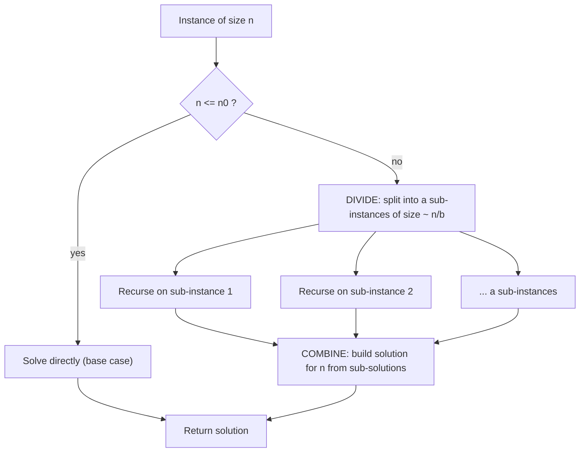
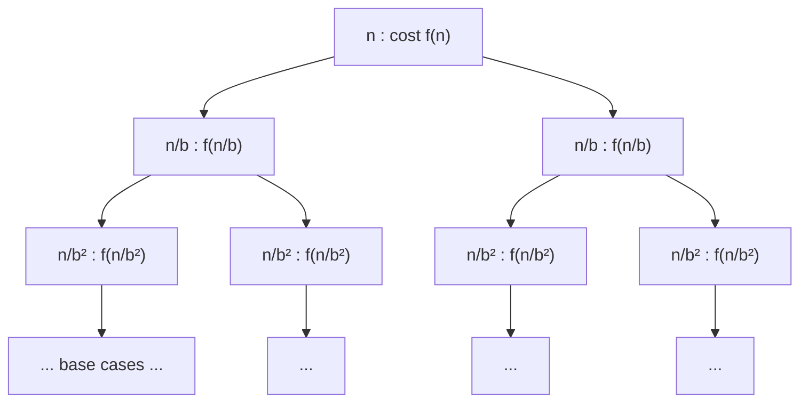
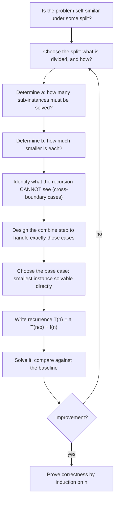
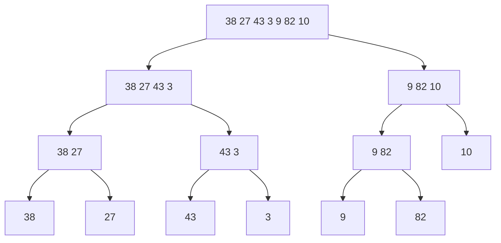
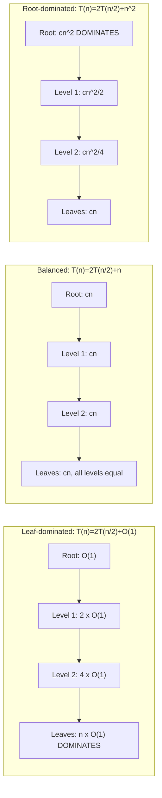
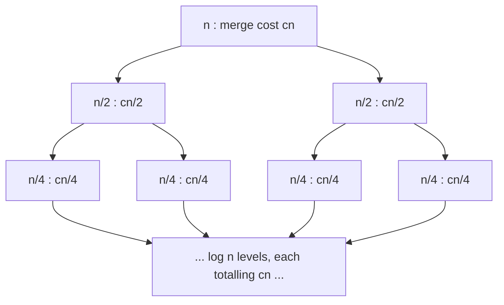
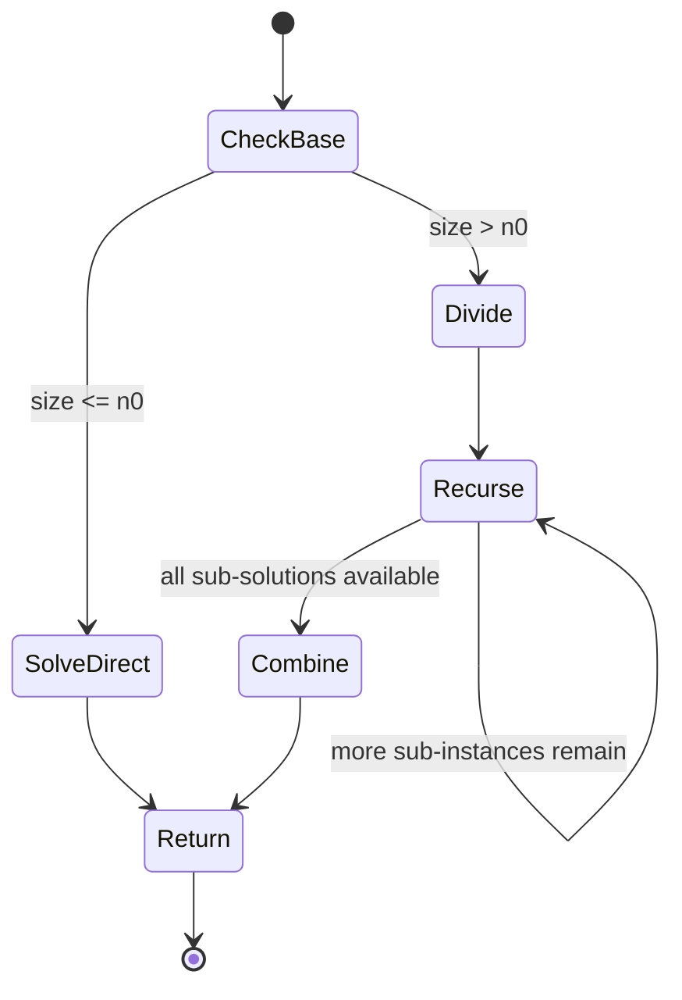
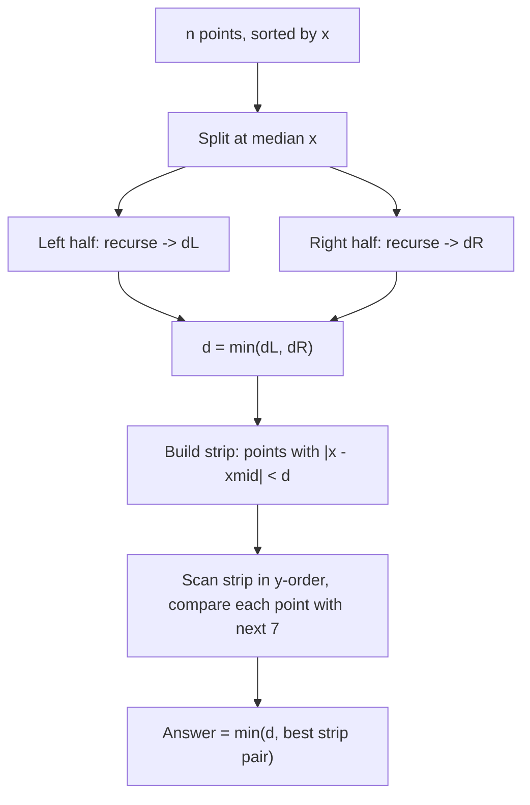
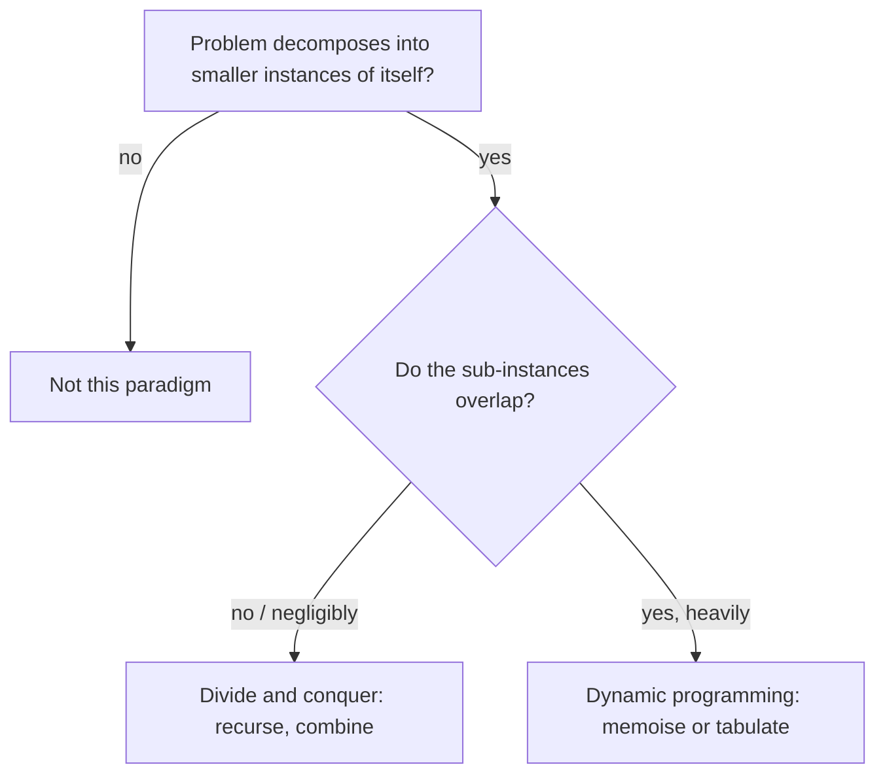

# Divide and Conquer Algorithm Design

## Definition

Divide and conquer is an algorithm design paradigm in which a problem instance is broken into **smaller instances of the same problem**, those smaller instances are solved recursively, and their solutions are **combined** into a solution for the original instance.

Informally:

> If a problem is too large to attack directly, cut it into pieces of the same shape, solve the pieces, and glue the answers back together.

Formally, let $P$ be a computational problem and let $x$ be an instance of $P$ of size $n$. A divide-and-conquer algorithm $A$ for $P$ has the following form:

- If $n \le n_0$ for some constant threshold $n_0$, solve $x$ directly (**base case**).
- Otherwise, construct instances $x_1, x_2, \dots, x_a$ of the **same** problem $P$, each of size at most $n/b$ for some $b > 1$ (**divide**).
- Recursively compute $A(x_1), \dots, A(x_a)$ (**conquer**).
- Compute the answer for $x$ from $A(x_1), \dots, A(x_a)$ (**combine**).

| Aspect | Description |
| --- | --- |
| What it is | A recursive problem-decomposition strategy |
| Problem it addresses | Problems whose structure allows independent sub-instances of the same kind |
| Input | An instance of a problem, usually described by a size parameter $n$ |
| Output | The solution to that instance, assembled from sub-solutions |
| Position in algorithm design | A general-purpose paradigm alongside greedy, dynamic programming, and backtracking |

!!! note

    Divide and conquer is **not an algorithm**. It is a *schema* for producing algorithms. Merge sort, quicksort, binary search, Karatsuba multiplication, Strassen's matrix multiplication, the Fast Fourier Transform, and closest-pair-of-points are all instantiations of the same schema with different divide and combine steps.

---

## Motivation and Problem Context

Consider sorting a list of one million records.

A direct approach compares every element with every other element and places them in order. Insertion sort and selection sort do exactly this and require on the order of $n^2$ operations. For $n = 10^6$ this is $10^{12}$ elementary operations, which at $10^9$ operations per second takes roughly 17 minutes. The same task with an $O(n \log n)$ algorithm requires about $2 \times 10^7$ operations, finishing in well under a second.

Where does the improvement come from? Not from a faster comparison, and not from better hardware. It comes from **restructuring the work**.

The key observation is that the $n^2$ cost of insertion sort arises because every element is potentially compared against every other. But if the list is split into two halves and each half is sorted independently, no comparison is ever performed between two elements of the *same* half during the merge. The merge only needs to interleave two already-ordered sequences, which costs $\Theta(n)$ rather than $\Theta(n^2)$.

This is the general pattern behind divide and conquer:

> A quadratic amount of "interaction" between elements is replaced by a linear (or otherwise cheap) amount of interaction **between the sub-solutions**, applied recursively.

The same reasoning appears in a very different setting. Multiplying two $n$-digit integers by the schoolbook method costs $\Theta(n^2)$ digit multiplications, because each digit of one number meets each digit of the other. Karatsuba observed that splitting each number into two halves reduces the problem to *three* half-sized multiplications instead of the obvious four, plus a linear amount of addition. The cost drops from $\Theta(n^2)$ to $\Theta(n^{\log_2 3}) \approx \Theta(n^{1.585})$.

!!! tip

    The recurring question that motivates divide and conquer is: **can the interaction between distant parts of the input be summarised cheaply, instead of being examined pairwise?** If yes, splitting the input is likely to pay off.

---

## Problem Formulation

Divide and conquer is a meta-technique, so the "problem" it solves is a *class* of problems. A problem is a candidate for divide and conquer when it can be stated as follows.

```text
Input:
    An instance x of problem P, of size n.

Output:
    A solution S(x) to P on x.

Structural requirement (self-similarity):
    There exist a decomposition function D and a combination function C such that
        D(x) = (x_1, x_2, ..., x_a),   each x_i an instance of the SAME problem P,
        size(x_i) <= n/b   for some constant b > 1,
        S(x) = C(S(x_1), S(x_2), ..., S(x_a), x).

Base case requirement:
    There exists a constant n_0 such that instances of size <= n_0 are solvable in O(1)
    (or in some fixed cheap cost).

Independence requirement:
    The sub-instances x_1, ..., x_a can be solved without reference to one another's
    solutions, and their solution sets do not substantially overlap.
```

**Constraints and assumptions**

- $b > 1$ strictly. If $b = 1$ the sub-instances are not smaller and the recursion does not terminate.
- The decomposition $D$ and the combination $C$ must be *cheaper* than solving the problem directly, otherwise nothing is gained.
- Recursion must reach the base case in finitely many steps: sizes must strictly decrease.

**Edge cases that must always be considered**

- $n = 0$ (empty instance)
- $n = 1$ (single element)
- $n$ not a power of $b$, so the split is uneven by one element
- Instances where the split is degenerate (for example, all elements equal)

!!! warning

    The independence requirement is the one students most often ignore. If sub-instances overlap heavily, plain recursion recomputes the same sub-solutions exponentially many times. That situation calls for **dynamic programming**, not divide and conquer.

---

## Intuition

Imagine you must count the number of people in a large stadium.

Counting them yourself, one by one, takes time proportional to the crowd. Instead, you split the stadium into two halves and hand each half to an assistant. Each assistant does the same to their half, recursively, until a section is small enough to count at a glance. Then the counts flow back upward, being added in pairs.

Two features of this story matter:

1. The **sub-task is the same task**, just smaller. You do not need a new procedure for half a stadium.
2. The **combine step is cheap**: adding two numbers costs almost nothing compared with counting.

Counting is a case where divide and conquer gives no asymptotic improvement, because the total work is $\Theta(n)$ either way. The improvement appears when the direct method is *superlinear*.

Return to sorting. Suppose the array is

```text
[38, 27, 43, 3, 9, 82, 10]
```

Splitting repeatedly gives single elements, which are trivially sorted. Merging back:

```text
[38] [27]        -> [27, 38]
[43] [3]         -> [3, 43]
[27,38] [3,43]   -> [3, 27, 38, 43]
[9] [82] [10]    -> [9, 10, 82]
[3,27,38,43] [9,10,82] -> [3, 9, 10, 27, 38, 43, 82]
```

At every level of the recursion, the total merging work is $\Theta(n)$, and there are $\Theta(\log n)$ levels. Hence $\Theta(n \log n)$.

!!! tip

    The intuition that leads a designer to invent a divide-and-conquer algorithm is:

    > "I am doing the same expensive comparison over and over between elements that are far apart. If I first organise each region locally, can I then relate the two regions using only a cheap summary of each?"

    In merge sort, the "cheap summary" is the fact that each half is already ordered, so only the two front elements ever need comparing.

---

## Core Concepts

### Self-similarity

A problem is self-similar (with respect to a decomposition) if a smaller instance of the *same* problem appears as a subproblem. This is what makes recursion applicable. Sorting a subarray is still sorting; searching a subarray is still searching. Contrast this with, say, "find the median of the array", where a natural decomposition produces medians of halves — and the median of halves does **not** determine the median of the whole. Self-similarity must be checked, not assumed.

### The three phases



### The branching factor $a$ and the shrink factor $b$

- $a$ = number of recursive calls made
- $b$ = factor by which the instance size shrinks

These two constants, together with the cost $f(n)$ of divide plus combine, determine the whole complexity through the recurrence

$$
T(n) = a\,T(n/b) + f(n).
$$

Note that $a$ and $b$ are **independent**. In merge sort $a = b = 2$: the array is cut into two halves and both are solved. In binary search $b = 2$ but $a = 1$: the array is cut in half but only one half is explored. In Karatsuba $b = 2$ but $a = 3$: the input splits into halves, yet three half-sized products are needed.

!!! info

    When $a = 1$, only one sub-instance is pursued and nothing is genuinely "combined". Many textbooks call this **decrease and conquer** (or *decrease by a constant factor*) rather than divide and conquer. Binary search, exponentiation by squaring, and the Euclidean algorithm belong to this family. The recurrence machinery is identical, so they are usually taught together.

### The critical exponent

Define

$$
\alpha = \log_b a .
$$

The quantity $n^{\alpha}$ is the total cost of the leaves of the recursion tree. Comparing $f(n)$ against $n^{\alpha}$ decides whether the algorithm is dominated by the leaves, by the root, or spread evenly across levels. This single comparison is the heart of the Master Theorem.

### Recursion tree

The recursion tree makes the accounting explicit: each node is a subproblem, labelled with the non-recursive work it performs. The total running time is the sum of all node labels.



At depth $i$ there are $a^i$ nodes, each of size $n/b^i$, contributing $a^i f(n/b^i)$. The depth is $\log_b n$.

### Auxiliary space and recursion depth

Each pending recursive call occupies a stack frame. The maximum number of simultaneously active frames is the **recursion depth**, typically $\Theta(\log n)$ for balanced splits and $\Theta(n)$ for degenerate ones. This is real memory, and on a typical system a depth of $10^5$ or more risks stack overflow.

---

## Algorithmic Paradigm

Divide and conquer *is* the paradigm under discussion, so the relevant question is when it is the right paradigm rather than a rival.

| Paradigm | Sub-instances | Relationship between sub-instances | Typical structural property exploited |
| --- | --- | --- | --- |
| Divide and conquer | Same problem, smaller | Disjoint and independent | Self-similarity, cheap combination |
| Dynamic programming | Same problem, smaller | Heavily overlapping | Optimal substructure + overlapping subproblems |
| Greedy | One sub-instance after a local choice | Sequential | Greedy-choice property |
| Backtracking | Many, explored with pruning | Independent but exponential in number | Constraint propagation |
| Decrease and conquer | One sub-instance | N/A | Size reduction with no combine |

Divide and conquer is appropriate when **all three** of the following hold:

1. The problem is self-similar under some natural split.
2. The sub-instances are (near) disjoint, so no work is duplicated.
3. Divide + combine costs asymptotically less than the direct algorithm's per-element interaction cost.

If condition 2 fails, use dynamic programming. If condition 3 fails, the recursion is pure overhead.

---

## Naive or Baseline Approach

To see the paradigm earn its keep, take the **maximum subarray problem**.

```text
Input:  An array A[0..n-1] of integers (possibly negative).
Output: The maximum value of A[i] + A[i+1] + ... + A[j] over all 0 <= i <= j < n.
```

### Brute force

```text
ALGORITHM MaxSubarrayBruteForce(A)

    best ← -INFINITY

    FOR i ← 0 TO n - 1
        sum ← 0
        FOR j ← i TO n - 1
            sum ← sum + A[j]
            IF sum > best
                best ← sum

    RETURN best
```

- Time: $\Theta(n^2)$
- Space: $\Theta(1)$

### Where is the bottleneck?

Every pair $(i, j)$ is examined. The algorithm never uses the fact that the best subarray of a *region* constrains the best subarray of a larger region containing it.

### Key observation

Split the array at the midpoint $m$. Any subarray falls into exactly one of three categories:

1. Entirely inside the left half $A[\text{lo} \dots m]$
2. Entirely inside the right half $A[m+1 \dots \text{hi}]$
3. Crossing the midpoint, so it contains both $A[m]$ and $A[m+1]$

Categories 1 and 2 are the *same problem* on half the input. Category 3 is a **new but easy** problem: the best crossing subarray is the best suffix of the left half joined to the best prefix of the right half, and each can be found by a single linear scan.

This is the classical shape of a divide-and-conquer insight: the cases that *do not* fit the recursion are handled by a cheap dedicated routine.

```text
Naive O(n²)
      ↓
Bottleneck: all pairs (i, j) examined
      ↓
Observation: subarrays are left / right / crossing
      ↓
Divide and conquer: 2T(n/2) + Θ(n)
      ↓
Proof: case exhaustion + induction
      ↓
Θ(n log n)
```

---

## Algorithm Design

### Designing a divide-and-conquer algorithm systematically

The design process has a fixed set of decisions. Making them explicitly is what turns "guess an algorithm" into "derive an algorithm".



### Decision 1: what to split

The split must be on a dimension along which the problem is self-similar.

- Arrays: split by index range (merge sort, maximum subarray)
- Sorted arrays: split by value via a pivot or midpoint (binary search, quickselect)
- Points in the plane: split by a coordinate (closest pair)
- Matrices: split into quadrants (Strassen)
- Integers: split the digit string (Karatsuba)
- Trees: split at a centroid or at the root's children

### Decision 2: how many recursive calls

The number $a$ is decided by *how many sub-instances the combine step needs*, not by how many pieces the input was cut into. Karatsuba cuts the input into two halves but needs three products; binary search cuts into two halves but needs one.

!!! tip

    Reducing $a$ while keeping $b$ fixed is the single most powerful optimisation available in this paradigm, because $a$ sits in the exponent $\log_b a$. Karatsuba's $4 \to 3$ and Strassen's $8 \to 7$ are both exactly this move.

### Decision 3: identify the cross-boundary cases

This is the intellectual core. The recursion, by construction, only ever sees each sub-instance in isolation. Anything that spans the boundary is invisible to it and must be recovered by the combine step.

| Problem | What the recursion misses | Combine step |
| --- | --- | --- |
| Merge sort | Relative order of elements in different halves | Merge two sorted runs, $\Theta(n)$ |
| Maximum subarray | Subarrays crossing the midpoint | Best suffix + best prefix, $\Theta(n)$ |
| Closest pair | Pairs with one point in each half | Strip scan, $\Theta(n)$ after presorting |
| Counting inversions | Inversions with one index in each half | Count during merge, $\Theta(n)$ |
| Binary search | Nothing (target is in exactly one half) | None, $\Theta(1)$ |

### Decision 4: the base case

The base case must be small enough to solve directly and large enough that the recursion terminates. Common choices:

- $n \le 1$: trivially solved
- $n \le 3$: for closest pair, where the strip argument needs at least a few points
- $n \le 32$ (a *cutoff*): switch to insertion sort in practice, because the constant factors of recursion dominate for small $n$

!!! danger

    A missing or wrong base case is the most common source of infinite recursion. Always verify that **every** recursive call receives an instance strictly smaller than its parent, and that the base case catches the smallest instance the recursion can produce (including $n = 0$ if that can occur).

### Decision 5: invariants

Divide and conquer proofs rest on a **contract**: what the recursive call promises to return. State it explicitly.

> `MergeSort(A, lo, hi)` returns with `A[lo..hi]` containing exactly the same multiset of elements it started with, in non-decreasing order.

Every recursive design should have such a sentence written down before the code is written. It is simultaneously the specification, the inductive hypothesis, and the debugging oracle.

---

## Algorithm

### The generic schema

```text
ALGORITHM DivideAndConquer(x)

    IF size(x) <= n0
        RETURN SolveDirectly(x)

    (x1, x2, ..., xa) ← Divide(x)

    FOR i ← 1 TO a
        si ← DivideAndConquer(xi)

    RETURN Combine(s1, s2, ..., sa, x)
```

### Instance 1: Merge sort

```text
ALGORITHM MergeSort(A, lo, hi)
    // Sorts A[lo..hi] in non-decreasing order.

    IF lo >= hi
        RETURN                       // 0 or 1 element: already sorted

    mid ← lo + floor((hi - lo) / 2)

    MergeSort(A, lo, mid)
    MergeSort(A, mid + 1, hi)
    Merge(A, lo, mid, hi)


ALGORITHM Merge(A, lo, mid, hi)

    L ← copy of A[lo..mid]
    R ← copy of A[mid+1..hi]

    i ← 0
    j ← 0
    k ← lo

    WHILE i < length(L) AND j < length(R)
        IF L[i] <= R[j]              // "<=" preserves stability
            A[k] ← L[i]
            i ← i + 1
        ELSE
            A[k] ← R[j]
            j ← j + 1
        k ← k + 1

    WHILE i < length(L)
        A[k] ← L[i]
        i ← i + 1
        k ← k + 1

    WHILE j < length(R)
        A[k] ← R[j]
        j ← j + 1
        k ← k + 1
```

### Instance 2: Maximum subarray

```text
ALGORITHM MaxSubarray(A, lo, hi)
    // Returns the maximum sum over all non-empty subarrays of A[lo..hi].

    IF lo = hi
        RETURN A[lo]

    mid ← lo + floor((hi - lo) / 2)

    leftBest  ← MaxSubarray(A, lo, mid)
    rightBest ← MaxSubarray(A, mid + 1, hi)
    crossBest ← MaxCrossing(A, lo, mid, hi)

    RETURN max(leftBest, rightBest, crossBest)


ALGORITHM MaxCrossing(A, lo, mid, hi)

    sum ← 0
    bestLeft ← -INFINITY
    FOR i ← mid DOWNTO lo
        sum ← sum + A[i]
        bestLeft ← max(bestLeft, sum)

    sum ← 0
    bestRight ← -INFINITY
    FOR j ← mid + 1 TO hi
        sum ← sum + A[j]
        bestRight ← max(bestRight, sum)

    RETURN bestLeft + bestRight
```

### Instance 3: Binary search (decrease and conquer, $a = 1$)

```text
ALGORITHM BinarySearch(A, target)
    // A is sorted in non-decreasing order.

    low  ← 0
    high ← length(A) - 1

    WHILE low <= high

        mid ← low + floor((high - low) / 2)      // avoids overflow

        IF A[mid] = target
            RETURN mid
        ELSE IF A[mid] < target
            low ← mid + 1
        ELSE
            high ← mid - 1

    RETURN NOT_FOUND
```

!!! warning

    Writing `mid ← floor((low + high) / 2)` is a classic defect: `low + high` can overflow a fixed-width integer for large arrays. The form `low + (high - low) / 2` is mathematically identical and overflow-safe.

---

## Step-by-Step Execution

### Merge sort on `[38, 27, 43, 3, 9, 82, 10]`

Divide phase (top-down):



Combine phase (bottom-up), in the order the merges actually complete:

| Step | Left run | Right run | Result | Comparisons |
| --- | --- | --- | --- | --- |
| 1 | [38] | [27] | [27, 38] | 1 |
| 2 | [43] | [3] | [3, 43] | 1 |
| 3 | [27, 38] | [3, 43] | [3, 27, 38, 43] | 3 |
| 4 | [9] | [82] | [9, 82] | 1 |
| 5 | [9, 82] | [10] | [9, 10, 82] | 2 |
| 6 | [3, 27, 38, 43] | [9, 10, 82] | [3, 9, 10, 27, 38, 43, 82] | 6 |

Total comparisons: 14. The upper bound $n \lceil \log_2 n \rceil = 7 \times 3 = 21$ is respected.

### A single merge, traced

Merging `L = [3, 27, 38, 43]` and `R = [9, 10, 82]`:

| Step | i | j | L[i] | R[j] | Chosen | Output so far |
| --- | --- | --- | --- | --- | --- | --- |
| 1 | 0 | 0 | 3 | 9 | L: 3 | [3] |
| 2 | 1 | 0 | 27 | 9 | R: 9 | [3, 9] |
| 3 | 1 | 1 | 27 | 10 | R: 10 | [3, 9, 10] |
| 4 | 1 | 2 | 27 | 82 | L: 27 | [3, 9, 10, 27] |
| 5 | 2 | 2 | 38 | 82 | L: 38 | [3, 9, 10, 27, 38] |
| 6 | 3 | 2 | 43 | 82 | L: 43 | [3, 9, 10, 27, 38, 43] |
| 7 | — | 2 | — | 82 | drain R | [3, 9, 10, 27, 38, 43, 82] |

Observe the invariant holding at every step: the output is sorted, and it consists exactly of the elements already consumed from `L` and `R`.

### Maximum subarray on `[-2, 1, -3, 4, -1, 2, 1, -5, 4]`

With `mid = lo + floor((hi - lo)/2)`, the top-level split is `[0..4]` and `[5..8]`. Calls are listed in the order they return.

| Call range | Left best | Right best | Cross best | Returned |
| --- | --- | --- | --- | --- |
| [0..0] `-2` | — | — | — | -2 |
| [1..1] `1` | — | — | — | 1 |
| [0..1] | -2 | 1 | -1 | 1 |
| [2..2] `-3` | — | — | — | -3 |
| [0..2] | 1 | -3 | -2 | 1 |
| [3..3] `4` | — | — | — | 4 |
| [4..4] `-1` | — | — | — | -1 |
| [3..4] | 4 | -1 | 3 | 4 |
| [0..4] | 1 | 4 | 2 | 4 |
| [5..5] `2` | — | — | — | 2 |
| [6..6] `1` | — | — | — | 1 |
| [5..6] | 2 | 1 | 3 | 3 |
| [7..7] `-5` | — | — | — | -5 |
| [8..8] `4` | — | — | — | 4 |
| [7..8] | -5 | 4 | -1 | 4 |
| [5..8] | 3 | 4 | 2 | 4 |
| [0..8] | 4 | 4 | 6 | **6** |

The final answer comes from the crossing case: the best suffix of `A[0..4]` is `[4, -1]` with sum 3, and the best prefix of `A[5..8]` is `[2, 1]` with sum 3, giving the subarray `[4, -1, 2, 1]` with sum 6.

### Binary search for 23 in `[2, 5, 8, 12, 16, 23, 38, 56, 72, 91]`

| Step | low | mid | high | A[mid] | Comparison | Action |
| --- | --- | --- | --- | --- | --- | --- |
| 1 | 0 | 4 | 9 | 16 | 16 < 23 | low ← 5 |
| 2 | 5 | 7 | 9 | 56 | 56 > 23 | high ← 6 |
| 3 | 5 | 5 | 6 | 23 | equal | return 5 |

Three probes for ten elements, consistent with $\lfloor \log_2 10 \rfloor + 1 = 4$ as the worst case.

---

## Visual Explanation

### Where the work lives

The following diagram contrasts three regimes of the recurrence $T(n) = aT(n/b) + f(n)$.



### Merge sort recursion tree with per-level cost



Each level totals $cn$; there are $\log_2 n + 1$ levels; hence $\Theta(n \log n)$.

### Control flow of a generic divide-and-conquer routine



---

## Correctness

Divide-and-conquer algorithms are proved correct by **strong induction on the instance size**. Strong induction (rather than ordinary induction) is required because the recursive calls may be on instances of size $n/2$, $n/3$, $n-1$, or anything smaller — not merely $n-1$.

### The proof template

Let $Q(n)$ be the statement: *the algorithm returns a correct solution for every instance of size $n$.*

**Base case.** Show $Q(n)$ holds for all $n \le n_0$, that is, `SolveDirectly` is correct on small instances.

**Inductive hypothesis.** Assume $Q(k)$ holds for all $k$ with $n_0 \le k < n$.

**Inductive step.** For an instance of size $n > n_0$:

1. Show that `Divide` produces genuine instances of the same problem, each of size $< n$ (this also establishes termination).
2. By the inductive hypothesis, each recursive call returns a correct sub-solution.
3. Show that `Combine`, given correct sub-solutions, produces a correct solution for the whole instance.

Steps 1 and 3 are the real work. Step 2 is free.

!!! note

    Termination and correctness are proved together here. Step 1 requires strictly decreasing size, which is exactly what guarantees the recursion bottoms out. An algorithm that is "correct if it terminates" is not correct.

### Worked proof: merge sort

**Claim.** `MergeSort(A, lo, hi)` leaves `A[lo..hi]` sorted in non-decreasing order and containing exactly the multiset of elements it originally contained.

Let $n = hi - lo + 1$.

**Base case ($n \le 1$).** The procedure returns immediately. A sequence of zero or one element is sorted, and no element was changed. The claim holds.

**Inductive hypothesis.** Assume the claim for all subarray lengths $k$ with $1 \le k < n$.

**Inductive step ($n \ge 2$).** Then $mid = lo + \lfloor (hi-lo)/2 \rfloor$ satisfies $lo \le mid < hi$, so both `A[lo..mid]` (length $\lceil n/2 \rceil$) and `A[mid+1..hi]` (length $\lfloor n/2 \rfloor$) are non-empty and strictly shorter than $n$. By the hypothesis, after the two recursive calls both halves are sorted and element-preserving. It remains to prove `Merge` correct.

**Correctness of `Merge` — loop invariant.**

> At the start of each iteration of the main `WHILE` loop, `A[lo..k-1]` contains the $k - lo$ smallest elements of $L \cup R$ (as a multiset) in non-decreasing order, and `L[i]` and `R[j]` are the smallest remaining unconsumed elements of `L` and `R` respectively.

*Initialization.* Before the first iteration $k = lo$, so `A[lo..k-1]` is empty, which vacuously contains the 0 smallest elements in sorted order. Since `L` and `R` are sorted and nothing has been consumed, `L[0]` and `R[0]` are their smallest elements.

*Maintenance.* Suppose the invariant holds at the start of an iteration. The algorithm copies $\min(L[i], R[j])$ into `A[k]`. Because `L` and `R` are each sorted, every unconsumed element of `L` is $\ge L[i]$ and every unconsumed element of `R` is $\ge R[j]$; therefore $\min(L[i], R[j])$ is the smallest unconsumed element overall. Placing it at position `k` extends the sorted prefix by one and preserves ordering, since it is $\ge$ every element already placed (those were the $k - lo$ smallest). Incrementing `i` or `j` restores the "smallest remaining" property. Incrementing `k` re-establishes the invariant for the next iteration.

*Termination.* The loop ends when one input run is exhausted. The invariant says `A[lo..k-1]` holds the smallest $k-lo$ elements in order; the drain loops append the remaining elements of the non-exhausted run, which are already sorted and all $\ge$ everything placed so far. Hence `A[lo..hi]` is sorted and is a permutation of the original contents.

This completes the inductive step, and therefore the proof. $\blacksquare$

### Worked proof: maximum subarray (proof by exhaustive cases)

**Claim.** `MaxSubarray(A, lo, hi)` returns $\max\{ \sum_{t=i}^{j} A[t] : lo \le i \le j \le hi \}$.

*Base case.* $lo = hi$: the only non-empty subarray is $A[lo]$ itself, which is returned.

*Inductive step.* Let $[i, j]$ be an optimal subarray of $A[lo..hi]$. Exactly one of the following holds:

- $j \le mid$: then $[i,j] \subseteq [lo, mid]$, and by the inductive hypothesis `leftBest` is at least its sum.
- $i > mid$: symmetrically, `rightBest` is at least its sum.
- $i \le mid < j$: then $[i,j]$ decomposes as $[i, mid] \cup [mid+1, j]$, so its sum is $\left(\sum_{t=i}^{mid} A[t]\right) + \left(\sum_{t=mid+1}^{j} A[t]\right)$. `MaxCrossing` computes the maximum over all suffixes of the left half and, independently, the maximum over all prefixes of the right half. Since the two choices are independent, their sum maximises the crossing case, so `crossBest` is at least the sum of $[i,j]$.

The three cases are exhaustive, so the maximum of the three values is at least the optimum. Conversely each of the three values is the sum of some genuine subarray, so the returned value is at most the optimum. Hence equality. $\blacksquare$

!!! tip

    Notice the structure of the argument: **the case analysis mirrors the divide.** Whenever the combine step is designed by asking "what does the recursion not see?", the correctness proof writes itself as a case exhaustion over "inside left / inside right / across the boundary".

### Correctness of binary search (loop invariant)

> **Invariant:** if `target` occurs in `A`, then it occurs at some index in `A[low..high]`.

*Initialization.* `low = 0`, `high = n-1`, so the range is the whole array; trivially true.

*Maintenance.* If `A[mid] < target`, then since `A` is sorted every index $\le mid$ holds a value $\le A[mid] < target$, so `target` cannot be at any such index; restricting to `A[mid+1..high]` preserves the invariant. The case `A[mid] > target` is symmetric. If `A[mid] = target` the algorithm returns and the invariant is irrelevant.

*Termination.* The loop exits when `low > high`, so the range is empty. The invariant then says: if `target` occurred in `A`, it occurred in an empty range — a contradiction. Hence `target` does not occur, and returning `NOT_FOUND` is correct. Progress is guaranteed because `low` strictly increases or `high` strictly decreases each iteration, so `high - low` strictly decreases. $\blacksquare$

---

## Complexity Analysis

The running time of a divide-and-conquer algorithm is captured by

$$
T(n) = \underbrace{a\,T(n/b)}_{\text{conquer}} + \underbrace{f(n)}_{\text{divide + combine}},
\qquad T(n) = \Theta(1) \text{ for } n \le n_0 .
$$

where

- $a \ge 1$ is the number of recursive calls,
- $b > 1$ is the shrink factor,
- $f(n)$ is the non-recursive cost at one node.

Everything about the asymptotic cost follows from the interaction of these three quantities.

### Space complexity

Two contributions must be counted separately:

1. **Auxiliary data structures** allocated during divide/combine. Merge sort's temporary buffers cost $\Theta(n)$ in total if a single scratch array is reused, or $\Theta(n)$ live at the top-level merge even with per-call allocation.
2. **Recursion stack**, equal to the maximum recursion depth times the frame size. For balanced splits this is $\Theta(\log n)$; for degenerate splits (worst-case quicksort) it can be $\Theta(n)$.

| Algorithm | Time (worst) | Auxiliary space | Stack depth |
| --- | --- | --- | --- |
| Binary search (iterative) | $\Theta(\log n)$ | $\Theta(1)$ | $\Theta(1)$ |
| Binary search (recursive) | $\Theta(\log n)$ | $\Theta(1)$ | $\Theta(\log n)$ |
| Merge sort | $\Theta(n \log n)$ | $\Theta(n)$ | $\Theta(\log n)$ |
| Quicksort | $\Theta(n^2)$ | $\Theta(1)$ | $\Theta(n)$ naive, $\Theta(\log n)$ with tail-recursion elimination on the larger side |
| Maximum subarray (D&C) | $\Theta(n \log n)$ | $\Theta(1)$ | $\Theta(\log n)$ |
| Karatsuba | $\Theta(n^{\log_2 3})$ | $\Theta(n)$ | $\Theta(\log n)$ |
| Strassen | $\Theta(n^{\log_2 7})$ | $\Theta(n^2)$ | $\Theta(\log n)$ |
| Closest pair | $\Theta(n \log n)$ | $\Theta(n)$ | $\Theta(\log n)$ |

!!! warning

    Merge sort is often described as "$O(n \log n)$ time, $O(n)$ space" while quicksort is described as "$O(n \log n)$ time, $O(\log n)$ space". Both descriptions silently choose a *case*: quicksort's $O(n \log n)$ is average-case, its worst case is $O(n^2)$. Always state which case a bound refers to.

### Best, average, and worst case

For most divide-and-conquer algorithms the split is deterministic and balanced, so best, average, and worst case coincide (merge sort: $\Theta(n \log n)$ in all cases). The exceptions are algorithms whose split depends on the data:

- **Quicksort**: best/average $\Theta(n \log n)$, worst $\Theta(n^2)$ when the pivot is always extremal.
- **Quickselect**: expected $\Theta(n)$, worst $\Theta(n^2)$.
- **Median of medians selection**: worst case $\Theta(n)$, at the cost of a much larger constant.

---

## Asymptotic Analysis

### Big-O

$f(n) = O(g(n))$ means there exist constants $c > 0$ and $n_1$ such that $f(n) \le c\,g(n)$ for all $n \ge n_1$. It is an **upper bound**: merge sort is $O(n \log n)$, and also (correctly but uselessly) $O(n^3)$.

### Big-Omega

$f(n) = \Omega(g(n))$ means $f(n) \ge c\,g(n)$ for all $n \ge n_1$. It is a **lower bound**. Any comparison-based sorting algorithm is $\Omega(n \log n)$ in the worst case, by the decision-tree argument: a comparison tree with $n!$ leaves has height at least $\log_2(n!) = \Theta(n \log n)$.

### Big-Theta

$f(n) = \Theta(g(n))$ means both bounds hold. Merge sort is $\Theta(n \log n)$: the upper bound from the recurrence and the lower bound from the decision-tree argument. This is why merge sort is called asymptotically optimal among comparison sorts.

| Complexity | Growth | $n = 10^6$, at $10^9$ ops/s |
| --- | --- | --- |
| $O(1)$ | Constant | instant |
| $O(\log n)$ | Logarithmic | ~20 operations |
| $O(n)$ | Linear | 1 ms |
| $O(n \log n)$ | Linearithmic | ~20 ms |
| $O(n^{1.585})$ | Karatsuba | ~4 minutes |
| $O(n^2)$ | Quadratic | ~17 minutes |
| $O(n^3)$ | Cubic | ~32 years |
| $O(2^n)$ | Exponential | infeasible beyond $n \approx 40$ |
| $O(n!)$ | Factorial | infeasible beyond $n \approx 12$ |

!!! info

    The practical lesson of this table is that moving from $\Theta(n^2)$ to $\Theta(n \log n)$ changes an algorithm from "batch job" to "interactive". Constant-factor tuning cannot achieve that; a change of paradigm can.

---

## Recurrence Analysis

### Deriving a recurrence

Do not guess the recurrence. Read it off the code:

1. Count the recursive calls and their argument sizes. That gives $a$ and $b$.
2. Sum the non-recursive work in the body. That gives $f(n)$.
3. State the base case.

For merge sort: two calls on halves gives $2T(n/2)$; the merge scans each element a constant number of times giving $\Theta(n)$; base case $T(1) = \Theta(1)$. Hence

$$
T(n) = 2T(n/2) + \Theta(n), \qquad T(1) = \Theta(1).
$$

### Method 1: iteration / expansion

$$
\begin{aligned}
T(n) &= 2T(n/2) + cn \\
     &= 2\big(2T(n/4) + cn/2\big) + cn = 4T(n/4) + 2cn \\
     &= 8T(n/8) + 3cn \\
     &\;\;\vdots \\
     &= 2^k T(n/2^k) + kcn .
\end{aligned}
$$

The recursion bottoms out when $n/2^k = 1$, i.e. $k = \log_2 n$. Substituting:

$$
T(n) = n\,T(1) + cn\log_2 n = \Theta(n \log n).
$$

### Method 2: recursion tree

Depth $i$ has $a^i$ nodes each of size $n/b^i$, so the level cost is $a^i f(n/b^i)$ and

$$
T(n) = \sum_{i=0}^{\log_b n - 1} a^i f\!\left(\frac{n}{b^i}\right) + \Theta\!\left(n^{\log_b a}\right).
$$

The final term is the total leaf cost, since there are $a^{\log_b n} = n^{\log_b a}$ leaves. Whether the sum is dominated by its first term, its last term, or is uniform across levels is exactly the trichotomy of the Master Theorem.

### Method 3: substitution (guess and verify by induction)

To prove $T(n) = O(n \log n)$ for $T(n) = 2T(n/2) + n$:

Guess $T(n) \le c\,n \log_2 n$ for some $c > 0$ and all $n \ge 2$.

Assume it for all sizes below $n$. Then

$$
\begin{aligned}
T(n) &\le 2\left(c \frac{n}{2}\log_2\frac{n}{2}\right) + n \\
     &= cn(\log_2 n - 1) + n \\
     &= cn\log_2 n - cn + n \\
     &\le cn\log_2 n \quad \text{provided } c \ge 1 .
\end{aligned}
$$

Choosing $c$ large enough to also cover the base case completes the induction.

!!! danger

    A frequent error in substitution proofs is proving $T(n) \le cn\log n + d$ but concluding $T(n) = O(n\log n)$ from an induction that never actually re-established the *exact* form assumed. The inductive step must end with **precisely** the assumed expression, with no leftover positive slack. Sometimes the fix is to strengthen the hypothesis (for example to $T(n) \le cn\log n - dn$).

### Method 4: the Master Theorem

For $T(n) = aT(n/b) + f(n)$ with $a \ge 1$, $b > 1$, let $\alpha = \log_b a$.

| Case | Condition on $f(n)$ | Result | Interpretation |
| --- | --- | --- | --- |
| 1 | $f(n) = O(n^{\alpha - \varepsilon})$ for some $\varepsilon > 0$ | $T(n) = \Theta(n^{\alpha})$ | Leaves dominate |
| 2 | $f(n) = \Theta(n^{\alpha} \log^k n)$, $k \ge 0$ | $T(n) = \Theta(n^{\alpha} \log^{k+1} n)$ | All levels contribute equally |
| 3 | $f(n) = \Omega(n^{\alpha + \varepsilon})$ **and** $a f(n/b) \le c f(n)$ for some $c<1$ and large $n$ | $T(n) = \Theta(f(n))$ | Root dominates |

Worked applications:

| Recurrence | $a$ | $b$ | $\alpha=\log_b a$ | $f(n)$ | Case | Solution |
| --- | --- | --- | --- | --- | --- | --- |
| $T(n)=2T(n/2)+\Theta(n)$ | 2 | 2 | 1 | $\Theta(n)$ | 2, $k=0$ | $\Theta(n\log n)$ |
| $T(n)=T(n/2)+\Theta(1)$ | 1 | 2 | 0 | $\Theta(1)$ | 2, $k=0$ | $\Theta(\log n)$ |
| $T(n)=3T(n/2)+\Theta(n)$ | 3 | 2 | $\log_2 3\approx1.585$ | $\Theta(n)$ | 1 | $\Theta(n^{\log_2 3})$ |
| $T(n)=8T(n/2)+\Theta(n^2)$ | 8 | 2 | 3 | $\Theta(n^2)$ | 1 | $\Theta(n^3)$ |
| $T(n)=7T(n/2)+\Theta(n^2)$ | 7 | 2 | $\log_2 7\approx2.807$ | $\Theta(n^2)$ | 1 | $\Theta(n^{\log_2 7})$ |
| $T(n)=2T(n/2)+\Theta(n^2)$ | 2 | 2 | 1 | $\Theta(n^2)$ | 3 | $\Theta(n^2)$ |
| $T(n)=4T(n/2)+\Theta(n^2)$ | 4 | 2 | 2 | $\Theta(n^2)$ | 2, $k=0$ | $\Theta(n^2\log n)$ |
| $T(n)=2T(n/2)+\Theta(n\log n)$ | 2 | 2 | 1 | $\Theta(n\log n)$ | 2, $k=1$ | $\Theta(n\log^2 n)$ |

!!! warning

    The Master Theorem has **gaps**. If $f(n)$ is larger than $n^{\alpha}$ but not *polynomially* larger — for example $f(n) = n \log n$ against $\alpha = 1$ handled by case 2 with $k=1$, or the genuinely uncovered $f(n) = n/\log n$ — no case applies directly. Similarly it does not apply to unequal splits such as $T(n) = T(n/3) + T(2n/3) + n$. Fall back to a recursion tree or the Akra–Bazzi method.

### Unequal splits

$T(n) = T(n/3) + T(2n/3) + n$ arises in quicksort with a guaranteed constant-fraction pivot. The recursion tree has depth between $\log_3 n$ and $\log_{3/2} n$, and every *full* level costs $n$, so

$$
n\log_3 n \le T(n) \le n\log_{3/2} n \implies T(n) = \Theta(n\log n).
$$

The lesson is that **any** split into constant fractions yields $\Theta(n\log n)$; only splits that are asymptotically unbalanced (like $1$ versus $n-1$) degrade to $\Theta(n^2)$.

### Median-of-medians selection

$$
T(n) \le T(n/5) + T(7n/10) + \Theta(n).
$$

Since $\tfrac15 + \tfrac{7}{10} = \tfrac{9}{10} < 1$, the level costs form a geometric series with ratio $9/10$, so $T(n) = \Theta(n)$. This is a case the Master Theorem cannot touch, and it shows why the sum of the fractional sizes — not just the number of calls — is what matters.

---

## Mathematical Reasoning

### Why the number of levels is $\log_b n$

Sizes along a root-to-leaf path are $n, n/b, n/b^2, \dots$. The path ends when $n/b^k \le n_0$, i.e. $k \ge \log_b (n/n_0)$. Since $n_0$ is constant, depth $= \Theta(\log_b n)$. Because $\log_b n = \log_2 n / \log_2 b$, changing the base of the logarithm changes only a constant factor — which is why we write $O(\log n)$ without specifying a base.

### Why the number of leaves is $n^{\log_b a}$

There are $a^k$ nodes at depth $k$, and the leaf depth is $\log_b n$, so the leaf count is

$$
a^{\log_b n} = \left(b^{\log_b a}\right)^{\log_b n} = b^{\log_b a \cdot \log_b n} = n^{\log_b a}.
$$

This identity is the reason $\log_b a$ appears everywhere in this topic.

### The comparison-sort lower bound

A deterministic comparison-based sorting algorithm can be modelled as a binary decision tree whose leaves are the $n!$ possible output permutations. A binary tree with $L$ leaves has height at least $\log_2 L$, so the worst-case number of comparisons is at least

$$
\log_2 (n!) \ge \log_2\left(\frac{n}{2}\right)^{n/2} = \frac{n}{2}\log_2\frac{n}{2} = \Omega(n\log n),
$$

using Stirling's approximation more precisely, $\log_2(n!) = n\log_2 n - n\log_2 e + O(\log n)$.

!!! note

    This bound is what makes merge sort's $\Theta(n\log n)$ *optimal* rather than merely *good*. It also explains why counting sort and radix sort can be linear: they are not comparison-based, so the bound does not apply to them.

---

## C++ Implementation

### Merge sort

```cpp
#include <iostream>
#include <vector>

// Merges the sorted runs A[lo..mid] and A[mid+1..hi] using a shared buffer.
void merge(std::vector<int>& A, std::vector<int>& buffer,
           int lo, int mid, int hi) {
    int i = lo, j = mid + 1, k = lo;

    while (i <= mid && j <= hi) {
        // "<=" keeps equal elements in their original relative order (stability)
        if (A[i] <= A[j]) buffer[k++] = A[i++];
        else              buffer[k++] = A[j++];
    }
    while (i <= mid) buffer[k++] = A[i++];
    while (j <= hi)  buffer[k++] = A[j++];

    for (int t = lo; t <= hi; ++t) A[t] = buffer[t];
}

void mergeSortRec(std::vector<int>& A, std::vector<int>& buffer,
                  int lo, int hi) {
    if (lo >= hi) return;                 // base case: 0 or 1 element

    int mid = lo + (hi - lo) / 2;         // overflow-safe midpoint
    mergeSortRec(A, buffer, lo, mid);
    mergeSortRec(A, buffer, mid + 1, hi);

    if (A[mid] <= A[mid + 1]) return;     // already ordered: skip the merge
    merge(A, buffer, lo, mid, hi);
}

void mergeSort(std::vector<int>& A) {
    if (A.size() < 2) return;
    std::vector<int> buffer(A.size());    // allocated once, reused everywhere
    mergeSortRec(A, buffer, 0, static_cast<int>(A.size()) - 1);
}

int main() {
    std::vector<int> data = {38, 27, 43, 3, 9, 82, 10};
    mergeSort(data);
    for (int x : data) std::cout << x << ' ';
    std::cout << '\n';                    // 3 9 10 27 38 43 82
}
```

### Maximum subarray

```cpp
#include <algorithm>
#include <climits>
#include <iostream>
#include <vector>

long long maxCrossing(const std::vector<int>& A, int lo, int mid, int hi) {
    long long sum = 0, bestLeft = LLONG_MIN;
    for (int i = mid; i >= lo; --i) {
        sum += A[i];
        bestLeft = std::max(bestLeft, sum);
    }

    sum = 0;
    long long bestRight = LLONG_MIN;
    for (int j = mid + 1; j <= hi; ++j) {
        sum += A[j];
        bestRight = std::max(bestRight, sum);
    }
    return bestLeft + bestRight;
}

long long maxSubarray(const std::vector<int>& A, int lo, int hi) {
    if (lo == hi) return A[lo];                       // base case

    int mid = lo + (hi - lo) / 2;
    long long left  = maxSubarray(A, lo, mid);
    long long right = maxSubarray(A, mid + 1, hi);
    long long cross = maxCrossing(A, lo, mid, hi);

    return std::max({left, right, cross});
}

int main() {
    std::vector<int> A = {-2, 1, -3, 4, -1, 2, 1, -5, 4};
    std::cout << maxSubarray(A, 0, static_cast<int>(A.size()) - 1) << '\n'; // 6
}
```

### Binary search (iterative and recursive)

```cpp
#include <iostream>
#include <vector>

constexpr int NOT_FOUND = -1;

int binarySearchIterative(const std::vector<int>& A, int target) {
    int low = 0, high = static_cast<int>(A.size()) - 1;

    while (low <= high) {
        int mid = low + (high - low) / 2;      // never overflows
        if (A[mid] == target)     return mid;
        else if (A[mid] < target) low  = mid + 1;
        else                      high = mid - 1;
    }
    return NOT_FOUND;
}

int binarySearchRecursive(const std::vector<int>& A, int target,
                          int low, int high) {
    if (low > high) return NOT_FOUND;          // base case: empty range

    int mid = low + (high - low) / 2;
    if (A[mid] == target)     return mid;
    if (A[mid] < target)      return binarySearchRecursive(A, target, mid + 1, high);
    else                      return binarySearchRecursive(A, target, low, mid - 1);
}

int main() {
    std::vector<int> A = {2, 5, 8, 12, 16, 23, 38, 56, 72, 91};
    std::cout << binarySearchIterative(A, 23) << '\n';                  // 5
    std::cout << binarySearchRecursive(A, 91, 0, (int)A.size() - 1) << '\n'; // 9
    std::cout << binarySearchIterative(A, 7)  << '\n';                  // -1
}
```

### Counting inversions: divide and conquer as a *modification* of merge sort

```cpp
#include <iostream>
#include <vector>

long long sortAndCount(std::vector<int>& A, std::vector<int>& buf,
                       int lo, int hi) {
    if (lo >= hi) return 0;

    int mid = lo + (hi - lo) / 2;
    long long inversions = sortAndCount(A, buf, lo, mid)
                         + sortAndCount(A, buf, mid + 1, hi);

    int i = lo, j = mid + 1, k = lo;
    while (i <= mid && j <= hi) {
        if (A[i] <= A[j]) {
            buf[k++] = A[i++];
        } else {
            // A[i] > A[j], so A[j] is inverted with every remaining element
            // of the left run: positions i, i+1, ..., mid
            inversions += (mid - i + 1);
            buf[k++] = A[j++];
        }
    }
    while (i <= mid) buf[k++] = A[i++];
    while (j <= hi)  buf[k++] = A[j++];
    for (int t = lo; t <= hi; ++t) A[t] = buf[t];

    return inversions;
}

int main() {
    std::vector<int> A = {2, 4, 1, 3, 5};
    std::vector<int> buf(A.size());
    std::cout << sortAndCount(A, buf, 0, (int)A.size() - 1) << '\n'; // 3
}
```

---

## Code Walkthrough

### Mapping pseudocode to C++

```text
ALGORITHM MergeSort(A, lo, hi)          -> void mergeSortRec(vector<int>&, vector<int>&, int, int)
    IF lo >= hi RETURN                  -> if (lo >= hi) return;
    mid ← lo + floor((hi-lo)/2)         -> int mid = lo + (hi - lo) / 2;
    MergeSort(A, lo, mid)               -> mergeSortRec(A, buffer, lo, mid);
    MergeSort(A, mid+1, hi)             -> mergeSortRec(A, buffer, mid + 1, hi);
    Merge(A, lo, mid, hi)               -> merge(A, buffer, lo, mid, hi);
```

Points where students commonly misread the implementation:

**`int mid = lo + (hi - lo) / 2;`**
This computes $\lfloor (lo+hi)/2 \rfloor$ without ever forming `lo + hi`. Because integer division truncates toward zero and `hi >= lo`, `mid` satisfies `lo <= mid < hi` whenever `lo < hi`. That strict inequality `mid < hi` is what guarantees the right half `[mid+1, hi]` is non-empty, and therefore that both recursive calls shrink the problem. Change it to `mid = hi - (hi - lo) / 2` and you get infinite recursion when `hi = lo + 1`.

**The shared `buffer`**
Allocating a fresh `std::vector` inside `merge` would perform $\Theta(n)$ allocations over the whole sort. Allocating one buffer of size $n$ at the top and passing it by reference keeps allocation cost at $\Theta(1)$ calls. Each merge writes only to `buffer[lo..hi]`, and no two concurrent merges overlap in that range, so the sharing is safe.

**`if (A[mid] <= A[mid+1]) return;`**
A practical optimisation, not part of the abstract algorithm: if the largest element of the left run is already $\le$ the smallest of the right run, the concatenation is sorted and merging is a no-op. This makes the implementation run in $\Theta(n)$ on already-sorted input while leaving the worst case unchanged.

**`if (A[i] <= A[j])` versus `<`**
With `<=`, when two elements compare equal the one from the *left* run is emitted first. Since the left run held the earlier original positions, equal elements retain their relative order: the sort is **stable**. Changing this to `<` silently destroys stability without changing any output on distinct keys — a bug that unit tests on distinct integers will never catch.

**`inversions += (mid - i + 1);` in the inversion counter**
When `A[j]` is emitted before `A[i]`, every element still unconsumed in the left run (`A[i..mid]`, which is `mid - i + 1` elements) is greater than `A[j]` and appears earlier in the original array. Each such pair is exactly one inversion. This is the general trick: **the combine step can compute cross-boundary quantities for free while it merges**.

**`long long` in `maxCrossing`**
Summing $10^5$ values of magnitude $10^9$ overflows a 32-bit `int`. Using `long long` for accumulators while inputs remain `int` is standard defensive practice.

---

## Alternative Approaches

### For sorting

| Algorithm | Strategy | Time (avg) | Time (worst) | Space | Stable | In-place | Notes |
| --- | --- | --- | --- | --- | --- | --- | --- |
| Insertion sort | Incremental | $\Theta(n^2)$ | $\Theta(n^2)$ | $O(1)$ | Yes | Yes | Excellent for small or nearly-sorted input |
| Merge sort | Divide and conquer | $\Theta(n\log n)$ | $\Theta(n\log n)$ | $\Theta(n)$ | Yes | No | Predictable; ideal for linked lists and external sorting |
| Quicksort | Divide and conquer | $\Theta(n\log n)$ | $\Theta(n^2)$ | $O(\log n)$ | No | Yes | Best constants in practice; needs pivot care |
| Heapsort | Transform and conquer | $\Theta(n\log n)$ | $\Theta(n\log n)$ | $O(1)$ | No | Yes | Worst-case optimal and in-place, poor cache behaviour |
| Counting/radix sort | Distribution | $\Theta(n+k)$ | $\Theta(n+k)$ | $\Theta(n+k)$ | Yes | No | Not comparison-based; needs bounded keys |

### For the maximum subarray problem

| Approach | Paradigm | Time | Space | Comment |
| --- | --- | --- | --- | --- |
| Brute force over all pairs | Exhaustive | $\Theta(n^2)$ | $O(1)$ | Baseline |
| Prefix sums + min prefix | Transform and conquer | $\Theta(n)$ | $O(n)$ or $O(1)$ | Uses $S_j - \min_{i<j} S_i$ |
| Divide and conquer | Divide and conquer | $\Theta(n\log n)$ | $O(\log n)$ | Generalises to segment trees and range queries |
| Kadane's algorithm | Dynamic programming | $\Theta(n)$ | $O(1)$ | Optimal; single pass |

!!! note

    Here divide and conquer is *not* the best algorithm — Kadane's linear scan beats it. It is still worth knowing, because the divide-and-conquer formulation is what generalises to *range* maximum-subarray queries via a segment tree, where each node stores (total, best prefix, best suffix, best inner). Kadane's algorithm does not generalise this way. Choosing a paradigm is about the problem you will *actually* face, including its future variants.

### For matrix multiplication

| Algorithm | Time | Practicality |
| --- | --- | --- |
| Definition (triple loop) | $\Theta(n^3)$ | Best constants; cache-friendly with blocking |
| Naive block recursion, $8T(n/2)+\Theta(n^2)$ | $\Theta(n^3)$ | Same asymptotics, better cache locality |
| Strassen, $7T(n/2)+\Theta(n^2)$ | $\Theta(n^{2.807})$ | Wins above roughly $n \approx 500$–$1000$; numerically less stable |
| Coppersmith–Winograd family | $O(n^{2.37\ldots})$ | Galactic: constants make it useless in practice |

### For integer multiplication

| Algorithm | Time | Comment |
| --- | --- | --- |
| Schoolbook | $\Theta(n^2)$ | Fastest for small $n$ |
| Karatsuba, $3T(n/2)+\Theta(n)$ | $\Theta(n^{1.585})$ | Practical crossover at a few hundred digits |
| Toom–Cook 3-way, $5T(n/3)+\Theta(n)$ | $\Theta(n^{1.465})$ | Crossover higher still |
| Schönhage–Strassen (FFT-based) | $\Theta(n\log n\log\log n)$ | Used by GMP for very large numbers |

The progression Karatsuba → Toom-Cook → FFT is one long exercise in the same idea: **reduce $a$ relative to $b$**.

---

## Trade-Off Analysis

| Trade-off | In divide and conquer |
| --- | --- |
| Time vs space | Merge sort buys guaranteed $\Theta(n\log n)$ with $\Theta(n)$ extra memory; quicksort trades a bad worst case for in-place operation |
| Recursion vs iteration | Recursion expresses the structure directly and is easy to prove correct; iteration avoids stack frames and call overhead. Binary search is clearer iteratively; merge sort is clearer recursively |
| Asymptotics vs constants | Strassen has a better exponent but larger constants and worse numerical stability; below the crossover it is slower |
| Simplicity vs performance | A hybrid sort (merge/quick with an insertion-sort cutoff) is measurably faster and measurably harder to get right |
| Worst case vs average case | Quicksort's average case beats merge sort's constants, but its worst case is quadratic and adversarially triggerable; randomised pivots convert an adversarial worst case into an improbable one |
| Deterministic vs randomised | Median-of-medians gives worst-case $\Theta(n)$ selection with a large constant; randomised quickselect gives expected $\Theta(n)$ with a small constant |
| Parallelism vs sequential efficiency | Independent sub-instances parallelise almost perfectly, but spawning a task per recursive call costs more than the work below a certain size — hence a *parallel cutoff* in addition to the sequential one |
| Cache behaviour vs operation count | Recursive splitting is naturally cache-oblivious: once a sub-instance fits in cache, all its remaining work is cache-resident. This can make an algorithm with more operations run faster |

!!! tip

    The cache argument is under-appreciated. Recursive matrix multiplication performs the same $\Theta(n^3)$ arithmetic as the triple loop but can be several times faster on large matrices, purely because the recursion automatically produces blocks that fit in cache at *every* level of the memory hierarchy, without the programmer knowing the cache sizes.

---

## Beginner Level

At this level you should be able to:

- State the three phases: divide, conquer, combine
- Recognise divide and conquer in merge sort, binary search, and quicksort
- Trace a small execution and draw the recursion tree
- Write the recurrence for a simple algorithm
- Apply the Master Theorem to standard cases

**Worked micro-example.** Compute the sum of an array by divide and conquer.

```text
ALGORITHM ArraySum(A, lo, hi)
    IF lo = hi
        RETURN A[lo]
    mid ← lo + floor((hi - lo)/2)
    RETURN ArraySum(A, lo, mid) + ArraySum(A, mid+1, hi)
```

Recurrence: $T(n) = 2T(n/2) + \Theta(1)$, so $\alpha = 1$, $f(n) = \Theta(1) = O(n^{1-\varepsilon})$, case 1, giving $\Theta(n)$.

This is instructive precisely because it gives **no** asymptotic improvement over a simple loop — the same $\Theta(n)$ — while adding $\Theta(\log n)$ stack space and call overhead. Divide and conquer applied without a reason is a pessimisation.

---

## Intermediate Level

At this level you should be able to:

- Derive a recurrence from unfamiliar code, including unequal splits
- Recognise when the Master Theorem does not apply and use a recursion tree instead
- Design the combine step for a new problem by asking what crosses the boundary
- Analyse space including stack depth
- Argue correctness with strong induction

**Worked example: closest pair of points.**

```text
Input:  n points in the plane.
Output: the minimum Euclidean distance between any two of them.
```

Brute force is $\Theta(n^2)$. Divide by a vertical line at the median $x$-coordinate:

1. Recursively find $d_L$ and $d_R$, the closest distances within each half. Let $d = \min(d_L, d_R)$.
2. The only pairs unaccounted for have one point in each half. Both such points must lie within distance $d$ of the dividing line, so restrict attention to the **strip** of width $2d$.
3. Sort the strip points by $y$ (or maintain a $y$-sorted list through the recursion). For each point in the strip, it suffices to compare against the next **at most 7** points in $y$-order.

The bound of 7 is the crucial geometric lemma. Partition the $d \times 2d$ rectangle above a strip point into eight $\tfrac{d}{2} \times \tfrac{d}{2} $ squares. Each square has diameter $d/\sqrt{2} < d$, so it can contain at most one point (two points in the same square would be closer than $d$, contradicting the recursive result within a half). Hence at most 8 points including the current one, so at most 7 comparisons.



With presorting by $x$ once and maintaining $y$-order by merging during the recursion, the combine step is $\Theta(n)$ and

$$
T(n) = 2T(n/2) + \Theta(n) = \Theta(n\log n).
$$

Re-sorting the strip by $y$ inside every call instead gives $T(n) = 2T(n/2) + \Theta(n\log n) = \Theta(n\log^2 n)$ — still a large improvement over $\Theta(n^2)$, and a good illustration of how the *combine cost alone* decides the final complexity.

---

## Advanced Level

### Reducing the branching factor: Karatsuba

Write two $n$-digit numbers in base $B$ with $m = n/2$:

$$
x = x_1 B^{m} + x_0, \qquad y = y_1 B^{m} + y_0 .
$$

Then

$$
xy = x_1y_1 B^{2m} + (x_1y_0 + x_0y_1)B^{m} + x_0y_0 .
$$

Computed directly this needs four half-sized products, giving $T(n) = 4T(n/2)+\Theta(n) = \Theta(n^2)$ — no gain. Karatsuba's identity removes one:

$$
x_1y_0 + x_0y_1 = (x_1 + x_0)(y_1 + y_0) - x_1y_1 - x_0y_0 .
$$

The two products $x_1y_1$ and $x_0y_0$ are needed anyway, so only three multiplications are performed:

$$
T(n) = 3T(n/2) + \Theta(n) = \Theta(n^{\log_2 3}) = \Theta(n^{1.585\ldots}).
$$

!!! tip

    The general principle: **extra additions are free, extra multiplications are not.** Since $f(n)$ sits outside the recursion and $a$ sits in the exponent, trading a constant number of additions for one fewer recursive call is almost always profitable. Strassen's algorithm applies exactly this trade to $2\times 2$ block matrices, replacing 8 multiplications with 7 at the cost of 18 additions.

### What happens when assumptions change

| Changed assumption | Consequence |
| --- | --- |
| Split is unbalanced ($1$ vs $n-1$) | Depth becomes $\Theta(n)$; merge sort-style recurrences degrade to $\Theta(n^2)$; stack may overflow |
| Sub-instances overlap | Exponential blow-up. $T(n)=2T(n-1)+O(1)$ gives $\Theta(2^n)$. Fix with memoisation, turning it into dynamic programming |
| Combine becomes superlinear | Total cost may be dominated by the root. $2T(n/2)+\Theta(n^2)$ is $\Theta(n^2)$: the recursion buys nothing |
| $b$ approaches 1 | Depth $\log_b n \to \infty$; the paradigm collapses |
| Data does not fit in memory | Merge sort still works (external merge sort with $k$-way merges); quicksort does not adapt well |
| Numerical inputs | Strassen accumulates larger relative error than the definition-based algorithm; unacceptable in some scientific computing |
| Adversarial input | Deterministic pivot selection can be attacked; randomisation restores expected bounds |
| Many cores available | Independent sub-instances give near-linear speedup with span $\Theta(\log^2 n)$ for merge sort with a parallel merge |

### The span of a parallel divide-and-conquer algorithm

If both recursive calls run in parallel, the **work** $T_1(n)$ is unchanged but the **span** (critical path) satisfies

$$
T_\infty(n) = T_\infty(n/2) + \text{span of combine}.
$$

For merge sort with a sequential merge, $T_\infty(n) = T_\infty(n/2) + \Theta(n) = \Theta(n)$, giving parallelism $T_1/T_\infty = \Theta(\log n)$ — modest. Using a parallel merge with span $\Theta(\log^2 n)$ yields $T_\infty(n) = \Theta(\log^3 n)$ and parallelism $\Theta(n/\log^2 n)$, which is excellent.

!!! info

    This is a concrete example of a general fact: in a parallel setting, the *combine step* becomes the bottleneck, not the recursion. Divide and conquer is the natural parallel paradigm precisely because the "conquer" phase is embarrassingly parallel.

---

## Interview and Competitive Programming Level

### Recognising the pattern

Reach for divide and conquer when you see:

- An array or sequence where the answer for a range can be assembled from the answers for two halves plus something crossing the midpoint (range queries, segment trees, maximum subarray, counting inversions)
- A monotone predicate over a search space (binary search, binary search on the answer, parametric search)
- Points, intervals, or rectangles in the plane sorted along a coordinate (closest pair, sweep-line hybrids)
- An algebraic identity that lets you compute $k$ products from fewer than the obvious number (Karatsuba, Strassen, FFT-based convolution)
- A recurrence in the *problem statement* itself: "the answer for $n$ depends on the answer for $n/2$"
- Constraints such as $n \le 10^5$ with a required $O(n\log n)$, where a $\Theta(n^2)$ solution is 100 times too slow

### Constraint-based reasoning

| $n$ | Feasible complexity |
| --- | --- |
| $\le 10$ | $O(n!)$, $O(2^n \cdot n)$ |
| $\le 25$ | $O(2^{n/2})$ meet-in-the-middle (itself a divide-and-conquer idea) |
| $\le 500$ | $O(n^3)$ |
| $\le 5000$ | $O(n^2)$ |
| $\le 10^5$ | $O(n\log n)$, $O(n\log^2 n)$ |
| $\le 10^6$ | $O(n)$, $O(n\log n)$ with small constants |

A constraint of $n \le 10^5$ with an obviously quadratic formulation is a strong hint that a $\log$ factor must be introduced by splitting.

### Common transformations

- **Merge sort tree / CDQ divide and conquer**: process cross-half contributions between "left half updates" and "right half queries" — the standard way to handle offline 3-dimensional partial-order counting.
- **Divide and conquer optimisation in dynamic programming**: when the optimal split point $\mathrm{opt}(i)$ is monotone in $i$, evaluating a DP layer drops from $\Theta(n^2)$ to $\Theta(n\log n)$ by recursing on index ranges and narrowing the candidate interval.
- **Binary search on the answer**: convert an optimisation problem into a decision problem `feasible(x)` that is monotone, then binary search over $x$. Turns "minimise the maximum load" into $O(\log(\text{range}))$ feasibility checks.
- **Meet in the middle**: split the input into two halves, enumerate $2^{n/2}$ possibilities in each, and combine by sorting and searching. Converts $2^n$ into $2^{n/2}\cdot n$.
- **Exponentiation by squaring**: $x^n = (x^{n/2})^2$ (times $x$ if $n$ is odd), giving $\Theta(\log n)$ multiplications; extends to matrix exponentiation for linear recurrences.

### Implementation pitfalls in contests

- Forgetting that a range is inclusive or exclusive at the boundary
- Recomputing `mid` inconsistently between the two recursive calls
- Allocating vectors inside the recursion, turning $O(n\log n)$ into something dominated by allocation
- Overflow in the accumulator (`int` vs `long long`)
- Recursion depth on adversarial input causing a stack overflow rather than a wrong answer

---

## Edge Cases

| Edge case | Why it matters | What to check |
| --- | --- | --- |
| Empty input ($n = 0$) | Many implementations index `A[0]` or compute `size() - 1` on an unsigned type, producing a huge value | Guard before recursing |
| Single element ($n = 1$) | Must be a base case, or `mid` equals `lo` and one recursive call is on the same range | `lo >= hi` test |
| Two elements | The smallest case where the split is exercised; `mid = lo`, right half is `[lo+1, hi]` | Verify both halves are non-empty |
| $n$ not a power of 2 | Halves differ in size by one; all bounds must be inclusive-safe | Trace $n = 7$ |
| All elements equal | Degenerate splits in quicksort (unless three-way partitioning); stability becomes observable | Test with a constant array |
| Already sorted / reverse sorted | Worst case for naive-pivot quicksort; best case for the merge-skip optimisation | Test both orders |
| Negative values | The maximum subarray answer may be negative if empty subarrays are disallowed; initialising `best = 0` is then wrong | All-negative array |
| Large values | Sums overflow 32-bit accumulators | Use 64-bit accumulators |
| Very large $n$ | Recursion depth and stack limits | Iterative bottom-up variant, or increase stack |
| Duplicate keys in search | Plain binary search returns *an* occurrence, not the first | Use lower_bound-style variants |
| Unsorted input to binary search | Silently returns a wrong answer rather than failing | Assert sortedness in debug builds |

---

## Common Implementation Pitfalls

**Midpoint overflow.** `(low + high) / 2` overflows for large indices. Use `low + (high - low) / 2`.

**Non-shrinking recursion.** If `mid` is computed with `ceil` instead of `floor`, the call `f(mid, hi)` may receive the same range as its parent when `hi = lo + 1`, causing infinite recursion. Always verify `lo <= mid < hi`.

**Off-by-one in the split.** Writing `f(lo, mid)` and `f(mid, hi)` (rather than `mid + 1`) processes `A[mid]` twice and, worse, never shrinks the second range.

**Inclusive versus exclusive ranges mixed in one file.** Pick one convention — `[lo, hi]` inclusive or `[lo, hi)` half-open — and apply it everywhere. Most divide-and-conquer bugs are boundary bugs.

**Wrong base case.** A base case of `lo == hi` alone loops forever when called with `lo > hi` (which happens for empty input). Use `lo >= hi`.

**Allocation inside the recursion.** A `std::vector` constructed in each `merge` call performs $\Theta(n)$ allocations and can dominate the running time.

**Losing stability.** Using `<` instead of `<=` in the merge comparison.

**Accumulator overflow.** Summing `int` values into an `int`.

**Uninitialised or wrongly initialised extremes.** Initialising `best = 0` in a maximum-subarray routine that must return a non-empty subarray gives 0 for an all-negative array instead of the largest element. Initialise to $-\infty$.

**Stack overflow instead of a wrong answer.** Deep recursion crashes rather than returning; on adversarial input a $\Theta(n)$-depth quicksort will do this. Recurse on the smaller side and loop on the larger.

**Assuming the input satisfies the precondition.** Binary search on an unsorted array returns garbage. In production, validate at the boundary or document the precondition and assert it in debug builds.

---

## Common Conceptual Mistakes

**"Divide and conquer always makes things faster."**
It does not. `ArraySum` above is $\Theta(n)$ either way, and now uses stack space. The speedup comes only when the direct method's cost is superlinear and the combine step is cheap.

**"Any recursive algorithm is divide and conquer."**
Recursion is a *mechanism*; divide and conquer is a *strategy*. Recursive Fibonacci is recursion with overlapping subproblems — it is a failed dynamic program, not a divide-and-conquer algorithm.

**"Divide and conquer and dynamic programming are the same because both use subproblems."**
The distinguishing property is overlap. Divide and conquer assumes sub-instances are disjoint and solves each once. Dynamic programming exists precisely because they are not disjoint and must be cached.



**"$O(n\log n)$ always beats $O(n^2)$."**
Asymptotically yes, for large enough $n$. For $n = 20$, insertion sort routinely beats merge sort because of constant factors. That is why real library sorts switch to insertion sort below a cutoff.

**"The Master Theorem solves every recurrence."**
It handles $aT(n/b)+f(n)$ with a polynomial comparison. It does not handle unequal splits, non-constant $a$ or $b$, or the gaps between its cases.

**"More recursive calls means a deeper tree."**
Depth is governed by $b$, breadth by $a$. Karatsuba makes three calls but is no deeper than merge sort's two.

**"Merge sort's $O(n)$ space is the same as quicksort's $O(\log n)$ because both are 'extra'."**
An $\Theta(n)$ auxiliary array is a different engineering proposition from an $\Theta(\log n)$ stack — the former may be impossible under a memory budget.

**"Recursion is inherently slow."**
Call overhead is a constant factor, typically small on modern hardware, and recursive splitting often *improves* cache behaviour. What is genuinely dangerous is recursion *depth*, not recursion itself.

---

## Important Properties and Invariants

**Size-decrease property.** Every recursive call receives an instance strictly smaller than its parent. This is simultaneously the termination argument and the well-foundedness needed for the induction.

**Sub-instance disjointness.** The sub-instances partition (or nearly partition) the input, so no work is duplicated. This is what separates the paradigm from dynamic programming.

**The recursion contract.** Each call returns a solution satisfying a stated specification for its sub-instance. Correctness of the whole reduces to: base case satisfies the contract, and combine preserves it.

**Case exhaustiveness of the combine step.** Every possible solution to the whole instance falls into one of the categories the algorithm considers: within a sub-instance, or crossing the boundary. Missing a category is the classic correctness bug (for example, forgetting that a closest pair can straddle the dividing line).

**Merge invariant.** In merge sort, the output prefix always holds the smallest consumed elements in order, and the fronts of the two runs are their smallest unconsumed elements.

**Search-range invariant.** In binary search, the target, if present, is always inside the current range.

**Monotonicity.** Binary search-style algorithms require a predicate that changes value at most once across the search space. Without monotonicity, halving is unjustified.

**Level-cost profile.** The comparison between $f(n)$ and $n^{\log_b a}$ determines whether cost concentrates at the root, at the leaves, or spreads evenly. This single property predicts the whole complexity.

---

## When to Use

Divide and conquer is a good fit when:

- The problem is naturally self-similar: a subarray, subrange, submatrix, subtree, or point subset is an instance of the same problem.
- Sub-instances are disjoint, so no subproblem is solved twice.
- The combine step is asymptotically cheaper than the direct method's cost, typically $O(n)$ or $O(n\log n)$ against a quadratic baseline.
- A **guaranteed** worst-case bound matters, and a balanced split can be enforced (merge sort over quicksort in latency-sensitive systems).
- The computation must be **parallelised**: independent sub-instances map directly onto tasks or threads.
- Data does not fit in memory: external merge sort processes runs that fit in RAM and merges them from disk.
- Good **cache behaviour** is required without hard-coding cache sizes; recursive blocking is cache-oblivious.
- The problem is an optimisation over a monotone predicate, making binary search on the answer applicable.

Concrete situations: sorting large datasets with predictable performance; range queries over arrays (segment trees are divide and conquer made persistent); geometric proximity problems; big-integer and polynomial arithmetic; computing convolutions via FFT; distributed map-reduce style aggregation.

---

## When NOT to Use

- **Sub-instances overlap.** Fibonacci, edit distance, knapsack, longest common subsequence. Plain recursion is exponential; use dynamic programming.
- **The combine step is as expensive as the original problem.** If $f(n) = \Theta(n^2)$ against a $\Theta(n^2)$ baseline, the recursion adds overhead for nothing.
- **The problem is not self-similar.** Splitting the input produces sub-instances of a *different* problem whose solutions do not compose. Finding the median of halves does not give the median of the whole; that is why selection needs a different idea (partitioning by value, not by position).
- **A linear or greedy algorithm already exists.** Kadane's algorithm beats the divide-and-conquer maximum subarray. Do not use a paradigm because it is elegant.
- **$n$ is small.** Below the crossover point the constant factors of recursion dominate. Use the simple algorithm, or a hybrid with a cutoff.
- **Memory is tight.** Merge sort's $\Theta(n)$ buffer may be unaffordable; heapsort gives the same worst-case time in $O(1)$ space.
- **Deep recursion is unsafe.** Embedded systems, kernel code, and languages without tail-call optimisation may not tolerate $\Theta(\log n)$ frames of a large struct, let alone $\Theta(n)$.
- **Numerical stability matters.** Strassen's subtractions amplify floating-point error relative to the definition-based product.
- **The split cannot be made balanced.** If every split is $1$ versus $n-1$, the recurrence degrades to $\Theta(n^2)$ and the stack to $\Theta(n)$.

!!! danger

    The most consequential misuse is applying divide and conquer to a problem with overlapping subproblems. The code looks correct, passes small tests, and then takes exponential time on real input. Whenever you write a recursion, ask explicitly: *can two different branches ever be asked the same question?* If yes, memoise.

---

## Serviceable Mental Model

> Divide and conquer is the disciplined replacement of *global* interaction by *local* interaction plus a cheap boundary correction, applied recursively.

Equivalently, as an accounting statement:

> The total cost is the sum of the recursion tree's node labels. Design the algorithm so that either the leaves are cheap, or the levels are few, or the root's work is small — and know which of the three you are relying on.

And as a design question to carry into an unfamiliar problem:

> If I solve the left half and the right half perfectly, what do I still not know? Can I find that out in linear time?

---

## Related Algorithms and Concepts

```text
Algorithm design paradigms
│
├── Brute force / exhaustive search
├── Decrease and conquer
│     ├── Decrease by a constant      (insertion sort, recursive linear search)
│     ├── Decrease by a constant factor (binary search, exponentiation by squaring)
│     └── Variable-size decrease      (Euclidean GCD, quickselect)
├── Divide and conquer
│     ├── Sorting                     (merge sort, quicksort)
│     ├── Searching / selection       (quickselect, median of medians)
│     ├── Arithmetic                  (Karatsuba, Toom-Cook, Strassen, FFT)
│     ├── Geometry                    (closest pair, convex hull by divide and conquer)
│     ├── Sequence statistics         (counting inversions, maximum subarray)
│     └── Offline query processing    (CDQ divide and conquer, merge sort tree)
├── Transform and conquer             (heapsort, presorting, Gaussian elimination)
├── Greedy
├── Dynamic programming
│     └── Divide-and-conquer DP optimisation (uses D&C inside DP)
└── Backtracking / branch and bound
```

Distinguishing assumptions:

| Related technique | Shares with D&C | Differs in |
| --- | --- | --- |
| Decrease and conquer | Recursive size reduction | Only one sub-instance; no combine |
| Dynamic programming | Optimal substructure | Sub-instances overlap and are cached |
| Greedy | Reduces to a smaller instance | Makes an irrevocable local choice, no recursion tree branching |
| Backtracking | Recursive exploration | Explores a search space, not a decomposition of the input |
| Segment trees | Recursive range decomposition | Persists the recursion tree as a data structure for repeated queries |
| MapReduce | Split, process independently, combine | Distributed execution model rather than an analysis framework |

---

## Algorithm Comparison

| Algorithm | Paradigm | Recurrence | Time | Space | Key assumption |
| --- | --- | --- | --- | --- | --- |
| Binary search | Decrease and conquer | $T(n/2)+\Theta(1)$ | $\Theta(\log n)$ | $\Theta(1)$ | Input sorted, predicate monotone |
| Merge sort | Divide and conquer | $2T(n/2)+\Theta(n)$ | $\Theta(n\log n)$ | $\Theta(n)$ | Comparable keys |
| Quicksort | Divide and conquer | $T(k)+T(n-k-1)+\Theta(n)$ | $\Theta(n\log n)$ avg, $\Theta(n^2)$ worst | $\Theta(\log n)$ | Good pivots |
| Quickselect | Variable-size decrease | $T(n/2)+\Theta(n)$ expected | $\Theta(n)$ expected | $\Theta(1)$ | Good pivots |
| Median of medians | Divide and conquer | $T(n/5)+T(7n/10)+\Theta(n)$ | $\Theta(n)$ worst | $\Theta(\log n)$ | None |
| Maximum subarray | Divide and conquer | $2T(n/2)+\Theta(n)$ | $\Theta(n\log n)$ | $\Theta(\log n)$ | Additive values |
| Counting inversions | Divide and conquer | $2T(n/2)+\Theta(n)$ | $\Theta(n\log n)$ | $\Theta(n)$ | Total order |
| Closest pair | Divide and conquer | $2T(n/2)+\Theta(n)$ | $\Theta(n\log n)$ | $\Theta(n)$ | Euclidean metric, presorting |
| Karatsuba | Divide and conquer | $3T(n/2)+\Theta(n)$ | $\Theta(n^{1.585})$ | $\Theta(n)$ | Large operands |
| Strassen | Divide and conquer | $7T(n/2)+\Theta(n^2)$ | $\Theta(n^{2.807})$ | $\Theta(n^2)$ | Large, well-conditioned matrices |
| FFT | Divide and conquer | $2T(n/2)+\Theta(n)$ | $\Theta(n\log n)$ | $\Theta(n)$ | $n$ a power of 2, roots of unity exist |

---

## Real-World Applications

- **Database engines.** External merge sort powers `ORDER BY` and sort-merge joins on datasets larger than memory; runs are sorted in RAM and $k$-way merged from disk.
- **Standard libraries.** `std::sort` in libstdc++ is *introsort*: quicksort, switching to heapsort when the recursion gets too deep (protecting the worst case) and to insertion sort below a cutoff (protecting the constants). `std::stable_sort` is a merge sort that falls back to an in-place variant when memory is scarce.
- **Version control.** `git diff` computes a longest common subsequence using Myers' algorithm, which uses a divide-and-conquer refinement to keep memory linear.
- **Signal and image processing.** The FFT — a divide and conquer on the polynomial evaluation points — underlies audio codecs, JPEG-style transforms, and fast convolution.
- **Cryptography and computer algebra.** Karatsuba and Toom–Cook multiplication in GMP, OpenSSL, and Java's `BigInteger` for RSA-sized operands.
- **Computer graphics and collision detection.** Bounding volume hierarchies and $k$-d trees recursively subdivide space; queries then prune whole subtrees.
- **Distributed systems.** MapReduce and similar frameworks are divide and conquer at cluster scale: partition the data, compute independently, reduce.
- **Compilers.** Recursive descent parsing decomposes a token stream according to grammar structure; register allocation and scheduling use recursive graph partitioning.
- **Machine learning.** Decision tree induction recursively partitions the feature space; hierarchical clustering merges bottom-up.
- **Networking.** Merge-based aggregation in sensor networks and tree-structured all-reduce operations in distributed training.

---

## Engineering Perspective

**An asymptotically optimal algorithm is not automatically the best production solution.**

Consider choosing a sort for a service that sorts request batches:

- Merge sort gives a hard $\Theta(n\log n)$ latency bound and stability, at $\Theta(n)$ memory. In a latency-SLA system, the *predictability* may matter more than the average speed.
- Quicksort is faster on average with less memory, but its worst case is quadratic and, with a deterministic pivot, remotely triggerable by an attacker who controls the input. This is a real denial-of-service vector, which is why introsort exists and why hash functions in language runtimes are randomised for the same reason.
- Insertion sort is the fastest of the three for $n \le 32$ and is trivially correct.

The engineering answer is a hybrid, and the reasoning that produces it is not asymptotic analysis alone.

Other engineering dimensions:

| Dimension | Consideration |
| --- | --- |
| Maintainability | A clean recursive formulation is often easier to read and modify than a hand-unrolled iterative one, even if marginally slower |
| Testing | Divide and conquer is very amenable to property-based testing: the recursion contract *is* the property |
| Observability | Instrument recursion depth and base-case hit counts; a depth much larger than $\log n$ indicates a degenerate split |
| Input validation | Preconditions (sortedness, non-empty, bounded values) should be asserted at the API boundary, not assumed inside the recursion |
| Resource limits | Stack size is a hard system limit; document the maximum supported $n$ or convert to an explicit stack |
| Technical debt | Micro-optimised hybrid sorts are notoriously bug-prone; prefer the library implementation unless profiling proves otherwise |
| Reliability | Deterministic algorithms reproduce bugs; randomised ones need a seed logged to be reproducible |

---

## Performance Considerations

**Constant factors.** Merge sort performs roughly $n\log_2 n$ comparisons and the same number of moves, plus buffer traffic. Quicksort performs fewer moves. This is why quicksort usually wins in practice despite the identical asymptotics.

**Cache behaviour.** Recursive subdivision is *cache-oblivious*: at some level of the recursion each sub-instance fits in L1, and all deeper work is cache-resident, with no knowledge of the cache size. This is a genuine and often decisive advantage over flat iterative algorithms with strided access.

**Memory allocation.** Allocation is expensive relative to comparisons. Hoist buffers out of the recursion.

**Branch prediction.** The comparison in a merge is unpredictable, costing a mispredict per element on some architectures. Branchless merging (using conditional moves or arithmetic index updates) can measurably help.

**Recursion depth and frame size.** A frame containing large local objects multiplies stack usage by the depth. Pass by reference; keep frames small.

**Base-case cutoff.** Switching to insertion sort at $n \le 16$–$32$ typically yields a 10–20 percent improvement in a merge or quicksort, because it eliminates the deepest and most numerous levels of the recursion tree, which contain most of the *nodes* even though they contain a modest share of the *work*.

**Parallelism.** Sub-instances are independent, so a task-parallel runtime can execute them concurrently. Use a *parallel cutoff* well above the sequential cutoff: spawning a task is far more expensive than a function call.

**Tail-call elimination.** In quicksort, recursing on the smaller partition and looping on the larger bounds the stack depth by $\Theta(\log n)$ even in the worst case, without changing the time complexity.

!!! info

    Distinguish *theoretical complexity*, which predicts scaling, from *practical runtime*, which is decided by constants, memory hierarchy, and branch behaviour. Complexity tells you which algorithm wins eventually; measurement tells you where "eventually" begins.

---

## Testing Strategy

A divide-and-conquer routine should be tested at three levels: the base case, the combine step in isolation, and the whole recursion against a reference implementation.

**Test categories**

| Category | Examples |
| --- | --- |
| Normal cases | Random arrays of moderate size |
| Boundary cases | $n = 0, 1, 2, 3$; $n$ exactly a power of two; $n$ one more and one less than a power of two |
| Edge cases | All equal; already sorted; reverse sorted; a single distinct value plus one outlier |
| Value extremes | `INT_MIN`, `INT_MAX`, all negatives, values that overflow 32-bit sums |
| Large inputs | $n = 10^6$ for timing and stack safety |
| Adversarial inputs | The "median-of-3 killer" sequence for quicksort; inputs designed to force unbalanced splits |
| Randomised / property-based | Compare against a trusted reference on thousands of random inputs |

**Properties worth asserting** (these are the recursion contract, restated as tests):

- The output is sorted: `is_sorted(result)`
- The output is a permutation of the input: compare multisets
- Stability: sort pairs `(key, originalIndex)` and check indices are increasing within equal keys
- Idempotence: sorting an already-sorted array leaves it unchanged

```cpp
#include <algorithm>
#include <cassert>
#include <random>
#include <vector>

void mergeSort(std::vector<int>& A);   // implementation under test

void testAgainstReference() {
    std::mt19937 rng(12345);           // fixed seed: failures are reproducible

    for (int trial = 0; trial < 2000; ++trial) {
        int n = static_cast<int>(rng() % 200);          // includes n = 0 and 1
        std::vector<int> A(n);
        for (int& x : A) x = static_cast<int>(rng() % 50) - 25;  // many duplicates

        std::vector<int> expected = A;
        std::sort(expected.begin(), expected.end());

        std::vector<int> actual = A;
        mergeSort(actual);

        assert(actual == expected);                     // sorted and a permutation
    }
}

void testEdgeCases() {
    std::vector<int> empty;             mergeSort(empty);  assert(empty.empty());
    std::vector<int> one   = {42};      mergeSort(one);    assert((one == std::vector<int>{42}));
    std::vector<int> equal(100, 7);     mergeSort(equal);  assert(std::is_sorted(equal.begin(), equal.end()));
    std::vector<int> rev   = {5,4,3,2,1};
    mergeSort(rev);
    assert((rev == std::vector<int>{1,2,3,4,5}));
}

int main() { testAgainstReference(); testEdgeCases(); }
```

!!! tip

    Testing with **many duplicates and small ranges** (`% 50` above) is far more effective at exposing divide-and-conquer bugs than testing with large random values, because it stresses tie-handling, stability, and degenerate partitions.

---

## Debugging Strategy

**Test the smallest failing case.** Shrink the input until the bug disappears. Divide-and-conquer defects almost always reproduce at $n \le 8$; a bug that only appears at $n = 10^5$ is usually overflow or stack depth, not logic.

**Instrument the recursion.** Print the range on entry and exit with indentation proportional to depth:

```cpp
void mergeSortRec(std::vector<int>& A, std::vector<int>& buf, int lo, int hi, int depth = 0) {
    std::cerr << std::string(2 * depth, ' ') << "enter [" << lo << ", " << hi << "]\n";
    // ... body, passing depth + 1 to recursive calls ...
    std::cerr << std::string(2 * depth, ' ') << "exit  [" << lo << ", " << hi << "]\n";
}
```

A range that repeats at increasing depth means the split is not shrinking. A depth far exceeding $\log_2 n$ means the split is unbalanced.

**Assert the contract at every level.** This turns "the final output is wrong" into "the failure first occurs at this range":

```cpp
assert(lo <= mid && mid < hi);                                  // split is valid
assert(std::is_sorted(A.begin() + lo, A.begin() + mid + 1));    // left half's contract
assert(std::is_sorted(A.begin() + mid + 1, A.begin() + hi + 1));// right half's contract
// ... merge ...
assert(std::is_sorted(A.begin() + lo, A.begin() + hi + 1));     // this call's contract
```

**Test the combine step in isolation.** Call `merge` directly on two hand-written sorted runs. Most bugs live here, not in the recursion.

**Use a trace table.** For a small input, tabulate `lo`, `mid`, `hi`, and the returned value for each call, as in the maximum-subarray table earlier. Compare against a hand computation.

**Check the base case separately.** Call the routine with $n = 0, 1, 2$ before anything else.

**Distinguish a crash from a wrong answer.** A segmentation fault on large input with correct results on small input is a stack overflow: measure the depth. A wrong answer only on large input is usually overflow: widen the accumulator.

---

## Practice Problems

Problem statements only; solutions are not provided.

### Beginner

**B1. Recursive maximum.**
Input: an array `A` of `n` integers, `n >= 1`. Output: the maximum element, computed by splitting the array in half and recursing. Constraints: `1 <= n <= 10^5`. Give the recurrence and solve it. Difficulty: easy.

**B2. Power by squaring.**
Input: integers `x`, `n >= 0`, and a modulus `m`. Output: `x^n mod m`. Constraints: `n <= 10^18`. Direction: $x^n = (x^{n/2})^2$ with a correction for odd $n$. State the number of multiplications performed. Difficulty: easy.

**B3. Trace and count.**
Input: the array `[5, 2, 9, 1, 7, 6, 3]`. Output: the complete recursion tree of merge sort, plus the exact number of comparisons performed by each merge. Difficulty: easy.

**B4. Classify recurrences.**
For each of $T(n)=4T(n/2)+n$, $T(n)=4T(n/2)+n^2$, $T(n)=4T(n/2)+n^3$, $T(n)=T(n/2)+n$, identify $a$, $b$, $\alpha=\log_b a$, the applicable Master Theorem case, and the closed form. Difficulty: easy.

**B5. First and last occurrence.**
Input: a sorted array `A` of `n` integers with duplicates, and a value `t`. Output: the indices of the first and last occurrence of `t`, or `-1 -1`. Constraints: `n <= 10^6`; required $O(\log n)$. Direction: two modified binary searches. Difficulty: easy.

### Intermediate

**I1. Counting inversions.**
Input: an array `A` of `n` distinct integers. Output: the number of pairs `i < j` with `A[i] > A[j]`. Constraints: `n <= 2*10^5`, values up to `10^9`. Required: $O(n\log n)$. Difficulty: medium.

**I2. Majority element by divide and conquer.**
Input: an array `A` of `n` elements. Output: the element appearing more than `n/2` times, or "none". Constraints: `n <= 10^5`. Direction: the majority of the whole must be the majority of at least one half; verify candidates by counting. Derive the recurrence. Difficulty: medium.

**I3. Peak finding in 1D.**
Input: an array `A` of `n` integers where no two adjacent elements are equal. Output: the index of any local peak (an element not smaller than its neighbours). Constraints: `n <= 10^6`; required $O(\log n)$. Prove that a peak always exists and that halving is justified. Difficulty: medium.

**I4. Closest pair of points.**
Input: `n` points with integer coordinates. Output: the minimum Euclidean distance between two distinct points. Constraints: `n <= 10^5`, coordinates up to `10^9` in absolute value. Required: $O(n\log n)$. Difficulty: medium.

**I5. Skyline problem.**
Input: `n` buildings, each `(left, right, height)`. Output: the skyline as a list of key points. Constraints: `n <= 10^5`. Direction: divide the building list in half, recurse, and merge two skylines in linear time. Difficulty: medium.

### Advanced

**A1. Median of two sorted arrays.**
Input: two sorted arrays of sizes `m` and `n`. Output: the median of their union. Constraints: `m + n <= 2*10^6`; required $O(\log(\min(m,n)))$. Prove the correctness of the partition-based search. Difficulty: hard.

**A2. Worst-case linear selection.**
Input: an array `A` of `n` elements and an integer `k`. Output: the `k`-th smallest element, with a **worst-case** $O(n)$ guarantee. Direction: median of medians with groups of 5. Prove that the recursive call is on at most $7n/10$ elements, and explain why groups of 3 fail. Difficulty: hard.

**A3. Karatsuba multiplication.**
Input: two non-negative integers given as digit strings of length up to `10^4`. Output: their product as a digit string. Required: asymptotically better than $\Theta(n^2)$. Determine empirically where the crossover with schoolbook multiplication lies, and explain the discrepancy with the theoretical prediction. Difficulty: hard.

**A4. Maximum subarray as a range query.**
Input: an array of `n` integers and `q` queries, each asking for the maximum subarray sum within a range `[l, r]`, with point updates interleaved. Constraints: `n, q <= 2*10^5`. Direction: a segment tree whose nodes store (total, best prefix, best suffix, best inner); the merge rule *is* the divide-and-conquer combine step. Difficulty: hard.

**A5. Divide and conquer DP optimisation.**
Input: a cost function and the recurrence $dp[i][j] = \min_{k<j}\left(dp[i-1][k] + C(k, j)\right)$ over `i = 1..m`, `j = 1..n`. Constraints: `n <= 10^5`, `m <= 100`. Direction: prove that $\mathrm{opt}(j)$ is monotone under a suitable condition on `C`, and use it to evaluate each layer in $O(n\log n)$. Difficulty: hard.

### Interview and Competitive Programming

**C1. Binary search on the answer.**
Input: `n` positive integers and an integer `k`. Output: the minimum possible value of the largest sum among `k` contiguous groups the array is split into. Constraints: `n <= 10^5`. Direction: `feasible(x)` = "can we split into at most `k` groups each of sum at most `x`?" is monotone. Difficulty: medium-hard.

**C2. Kth smallest in a sorted matrix.**
Input: an `n x n` matrix with rows and columns sorted ascending, and `k`. Output: the `k`-th smallest element. Constraints: `n <= 500`. Direction: binary search over the value range with a linear-time counting routine. Difficulty: medium-hard.

**C3. Meet in the middle.**
Input: `n <= 40` integers and a target `S`. Output: the number of subsets summing to exactly `S`. Direction: split into two halves, enumerate $2^{n/2}$ subset sums in each, sort one side, and count matches. Difficulty: hard.

**C4. Reverse pairs.**
Input: an array `A` of `n` integers. Output: the number of pairs `i < j` with `A[i] > 2 * A[j]`. Constraints: `n <= 5*10^4`, values up to `10^9` in absolute value. Direction: a modified merge sort with an extra counting pass before merging. Difficulty: hard.

**C5. Count of smaller numbers after self.**
Input: an array `A` of `n` integers. Output: for each index `i`, the number of `j > i` with `A[j] < A[i]`. Constraints: `n <= 10^5`. Direction: merge sort carrying original indices, accumulating counts during the merge. Compare with a Binary Indexed Tree solution and state when each is preferable. Difficulty: hard.

---

## Questions

Model answers are not provided.

### Conceptual

1. State the three phases of divide and conquer and explain which of them, if any, may be empty.
2. Explain why $b > 1$ is required, and describe what goes wrong when $b = 1$.
3. Why does divide and conquer require sub-instances to be disjoint, while dynamic programming does not?
4. Explain the difference between the branching factor $a$ and the shrink factor $b$, and give an algorithm in which they differ.
5. Why is `ArraySum` by divide and conquer no faster than a loop, and what does this reveal about when the paradigm helps?

### Analytical

1. Derive $T(n) = 2T(n/2) + \Theta(n)$ from the merge sort code, justifying each term.
2. Solve $T(n) = 3T(n/4) + n\log n$ using a recursion tree, and verify with the Master Theorem.
3. Show that the number of leaves in the recursion tree is $n^{\log_b a}$, and explain what this quantity means.
4. Explain why $T(n) = T(n/3) + T(2n/3) + n$ is $\Theta(n\log n)$ and why the Master Theorem cannot be applied to it directly.
5. Prove that $T(n) \le T(n/5) + T(7n/10) + cn$ implies $T(n) = O(n)$, and identify precisely where the argument uses $\tfrac15 + \tfrac{7}{10} < 1$.
6. Derive the comparison-based sorting lower bound $\Omega(n\log n)$ and state exactly which assumptions it requires.

### Design

1. Design a divide-and-conquer algorithm to count, for a given array, the number of pairs `(i, j)` with `i < j` and `A[i] > 2*A[j]`. State the recurrence.
2. Modify merge sort so that it also reports the length of the longest run of equal elements. What is the new combine step, and does the complexity change?
3. Design a divide-and-conquer algorithm to compute the convex hull of `n` points, and compare it with Graham scan.
4. Given a matrix with sorted rows and sorted columns, design an $O(n)$ search for a target value. Is this divide and conquer, decrease and conquer, or neither? Justify.
5. Explain how the divide-and-conquer maximum subarray formulation becomes a segment tree, and state precisely what each node must store.

### Correctness

1. Write the loop invariant for `Merge` and prove initialization, maintenance, and termination.
2. Prove the maximum subarray divide-and-conquer algorithm correct by case exhaustion, stating why the three cases are exhaustive and mutually exclusive.
3. Prove that binary search terminates, and identify the quantity that strictly decreases.
4. Prove the "at most 7 points" lemma in the closest-pair strip, and explain what fails if the lemma is stated for a strip of width $d$ rather than $2d$.
5. Explain why strong induction rather than ordinary induction is the appropriate proof technique for divide-and-conquer algorithms.

### Scenario

1. You must sort 500 GB of log records on a machine with 16 GB of RAM. Which algorithm, and why?
2. Your service sorts user-supplied arrays and has a strict p99 latency requirement. Compare quicksort with a deterministic pivot, randomised quicksort, merge sort, and introsort for this setting.
3. You are writing firmware with a 4 KB stack and must sort up to 10,000 records. Which algorithm, and what modifications?
4. A scientific application multiplies $4096 \times 4096$ double-precision matrices. Would you use Strassen? What would you need to measure first?
5. You must answer $10^5$ maximum-subarray queries over ranges of a $10^5$-element array with point updates. Which approach, and why does Kadane's algorithm not suffice?

### Troubleshooting

1. A student's merge sort computes `mid = (lo + hi + 1) / 2` and recurses on `[lo, mid]` and `[mid, hi]`. Describe the failure and the smallest input that exhibits it.
2. A maximum-subarray implementation initialises `best = 0` and returns 0 for `[-5, -2, -9]`. Explain the defect and give two possible fixes, stating how they differ in specification.
3. A merge sort passes all tests on arrays of distinct integers but reorders equal records in production. Diagnose the defect.
4. A quicksort works correctly but crashes with a stack overflow on sorted input of size $10^6$. Explain the mechanism and give two fixes.
5. A closest-pair implementation re-sorts the strip by $y$ inside every recursive call. It is correct but slower than expected. Derive the actual complexity.

### Comparative

1. Compare merge sort and quicksort across time (all cases), space, stability, cache behaviour, and adversarial robustness.
2. Compare the divide-and-conquer and Kadane solutions to the maximum subarray problem, and give a scenario in which the slower one is preferable.
3. Compare divide and conquer with dynamic programming, giving one problem that each solves well and the other solves badly.
4. Compare Karatsuba with schoolbook multiplication, including the crossover point and the reason it is not at $n = 2$.
5. Compare recursive and iterative binary search on correctness, clarity, and resource usage.

---

## Complexity Summary

### The paradigm in general

$$
T(n) = aT(n/b) + f(n), \qquad \alpha = \log_b a
$$

| Regime | Condition | Time |
| --- | --- | --- |
| Leaf-dominated | $f(n) = O(n^{\alpha-\varepsilon})$ | $\Theta(n^{\alpha})$ |
| Balanced | $f(n) = \Theta(n^{\alpha}\log^k n)$ | $\Theta(n^{\alpha}\log^{k+1} n)$ |
| Root-dominated | $f(n) = \Omega(n^{\alpha+\varepsilon})$ with regularity | $\Theta(f(n))$ |

Space: $\Theta(\text{auxiliary per level} \times \text{levels})$ in the worst case, plus recursion depth $\Theta(\log_b n)$ for balanced splits.

### Representative algorithms

| Algorithm | Best | Average | Worst | Space (aux + stack) |
| --- | --- | --- | --- | --- |
| Binary search | $\Theta(1)$ | $\Theta(\log n)$ | $\Theta(\log n)$ | $\Theta(1)$ iterative |
| Merge sort | $\Theta(n\log n)$ | $\Theta(n\log n)$ | $\Theta(n\log n)$ | $\Theta(n) + \Theta(\log n)$ |
| Quicksort | $\Theta(n\log n)$ | $\Theta(n\log n)$ | $\Theta(n^2)$ | $\Theta(1) + \Theta(\log n)$ tuned |
| Quickselect | $\Theta(n)$ | $\Theta(n)$ | $\Theta(n^2)$ | $\Theta(1)$ |
| Median of medians | $\Theta(n)$ | $\Theta(n)$ | $\Theta(n)$ | $\Theta(n) + \Theta(\log n)$ |
| Maximum subarray (D&C) | $\Theta(n\log n)$ | $\Theta(n\log n)$ | $\Theta(n\log n)$ | $\Theta(1) + \Theta(\log n)$ |
| Closest pair | $\Theta(n\log n)$ | $\Theta(n\log n)$ | $\Theta(n\log n)$ | $\Theta(n) + \Theta(\log n)$ |
| Karatsuba | $\Theta(n^{1.585})$ | $\Theta(n^{1.585})$ | $\Theta(n^{1.585})$ | $\Theta(n) + \Theta(\log n)$ |
| Strassen | $\Theta(n^{2.807})$ | $\Theta(n^{2.807})$ | $\Theta(n^{2.807})$ | $\Theta(n^2) + \Theta(\log n)$ |

---

## Advantages and Limitations

### Advantages

| Advantage | Explanation |
| --- | --- |
| Asymptotic improvement | Replaces quadratic pairwise interaction with a cheap combine, as in $\Theta(n^2) \to \Theta(n\log n)$ sorting or $\Theta(n^2) \to \Theta(n^{1.585})$ multiplication |
| Conceptual simplicity | The algorithm is described by three short steps; the recursion handles the bookkeeping |
| Straightforward correctness proofs | Strong induction on size, with the recursive call's contract as the hypothesis, is nearly mechanical |
| Mechanical complexity analysis | The recurrence is read directly off the code and solved by the Master Theorem or a recursion tree |
| Natural parallelism | Independent sub-instances map onto threads, tasks, or cluster nodes with no synchronisation until the combine |
| Cache-oblivious efficiency | Recursive subdivision automatically produces working sets that fit each level of the memory hierarchy, with no tuning |
| Suits external and distributed memory | Sub-instances can be sized to fit RAM or a node, making the paradigm the basis of external merge sort and MapReduce |
| Reusable structure | The same decomposition often yields a data structure (segment tree, $k$-d tree, BVH) supporting repeated queries |
| Composability | Combine steps can be enriched to compute extra statistics for free, as in counting inversions during a merge |
| Numerical benefits in some cases | Pairwise (recursive) summation has error growing as $O(\log n)$ rather than $O(n)$ for naive left-to-right summation |

### Limitations

| Limitation | Explanation |
| --- | --- |
| Fails with overlapping subproblems | Recomputation becomes exponential; dynamic programming is required instead |
| No benefit when the combine is expensive | If $f(n)$ matches or exceeds the baseline cost, the recursion adds only overhead |
| Recursion overhead | Function calls, parameter passing, and frame setup are pure cost, dominant for small $n$ |
| Stack consumption and overflow risk | Depth $\Theta(\log n)$ is usually safe; degenerate splits give $\Theta(n)$ and can crash the program |
| Extra memory for combining | Merge sort needs $\Theta(n)$ auxiliary space; in-place merging is possible but slow and intricate |
| Sensitivity to split balance | An unbalanced split silently degrades $\Theta(n\log n)$ to $\Theta(n^2)$ |
| Worse constants than specialised algorithms | Strassen loses below its crossover; the divide-and-conquer maximum subarray loses to Kadane outright |
| Not universally applicable | Many problems are not self-similar under any natural split |
| Numerical instability in some variants | Strassen's added subtractions amplify floating-point error |
| Harder to debug than iteration | State is distributed across stack frames; boundary conditions are error-prone |
| Parallel overhead | Task creation costs more than a call, so naive parallelisation of every level is slower than sequential code |

!!! note

    Advantages and limitations are two readings of the same structural facts. The recursion tree that makes the analysis easy is also the stack that can overflow; the independence that enables parallelism is also the assumption that fails for overlapping subproblems. Understanding the structure explains both columns at once.

---

## Algorithm Design Checklist

```text
1.  What exactly is the problem? State input, output, and constraints precisely.
2.  Is the problem self-similar? Does a smaller instance of the SAME problem appear?
3.  What is the naive solution, and what is its complexity?
4.  Where is the bottleneck? Which interactions cost the most?
5.  What is the natural split — index, value, coordinate, structure?
6.  How many sub-instances must actually be solved (a)?
7.  How much smaller is each (b)?
8.  Can a be reduced by an algebraic identity? (Karatsuba, Strassen)
9.  What does the recursion NOT see? Enumerate the cross-boundary cases.
10. Can the combine step handle exactly those cases cheaply?
11. Do the sub-instances overlap? If yes, switch to dynamic programming.
12. What is the base case, and does every recursion path reach it?
13. Does every recursive call receive a STRICTLY smaller instance?
14. Write the recursion contract in one sentence.
15. Write the recurrence T(n) = a T(n/b) + f(n) and solve it.
16. Is the result actually better than the naive solution?
17. Prove correctness by strong induction, with case exhaustion in the combine step.
18. Analyse space: auxiliary structures AND recursion depth.
19. Enumerate edge cases: n = 0, 1, 2; duplicates; sorted; all-equal; extreme values.
20. Choose a base-case cutoff for practical performance.
21. Test the base case, the combine step, and the whole algorithm separately.
22. Is a simpler linear or greedy algorithm available? If so, prefer it.
```

---

## Final Summary

**What it is.** Divide and conquer is a design paradigm that solves a problem by splitting it into smaller instances of the same problem, solving those recursively, and combining their solutions.

**What problem it solves.** It attacks problems whose direct solution is dominated by interaction between distant parts of the input, when that interaction can be summarised cheaply across a boundary.

**Core insight.** Solve each region in isolation, then repair only what crosses the boundary. Whatever the recursion cannot see must be exactly what the combine step computes.

**Paradigm.** Recursive decomposition into disjoint, self-similar sub-instances.

**Correctness principle.** Strong induction on instance size: correct base case, plus a combine step whose case analysis is exhaustive, given correct sub-solutions.

**Complexity.** $T(n) = aT(n/b) + f(n)$, resolved by comparing $f(n)$ with $n^{\log_b a}$ using the Master Theorem or a recursion tree.

**Key assumptions.** Strictly decreasing instance size; disjoint (non-overlapping) sub-instances; a combine step cheaper than the baseline; a reachable base case.

**When to use it.** Self-similar problems with cheap combines, requirements for guaranteed worst-case bounds, parallel or external-memory execution, or problems that reduce to a monotone decision predicate.

**When not to use it.** Overlapping subproblems, expensive combine steps, small inputs, tight memory or stack budgets, or when a linear or greedy algorithm already exists.

**Most important engineering lesson.** Asymptotic superiority is necessary but not sufficient. Real systems use hybrids — introsort, cutoff-augmented merge sort, Strassen above a crossover — because constants, memory hierarchy, stack limits, and adversarial inputs are as real as the exponent.

## Key Takeaways

1. Divide and conquer is a schema, not an algorithm; merge sort, Karatsuba, Strassen, FFT, and closest-pair are all the same three steps with different content.
2. The design question that generates the algorithm is: *if I solve both halves perfectly, what do I still not know?* The answer defines the combine step.
3. The recurrence $T(n) = aT(n/b) + f(n)$ is read directly off the code; $a$ and $b$ are independent, and $\alpha = \log_b a$ decides everything.
4. Reducing $a$ while holding $b$ fixed changes the exponent and is the most powerful optimisation in the paradigm; reducing $f(n)$ only changes a lower-order term unless the root dominates.
5. Correctness follows a fixed template: strong induction on size, with the recursive contract as hypothesis and an exhaustive case analysis in the combine step.
6. Overlapping subproblems break the paradigm. Overlap is the dividing line between divide and conquer and dynamic programming.
7. Balanced splits are what make the depth logarithmic; unbalanced splits silently degrade both time and stack usage.
8. Space has two components — auxiliary structures and recursion depth — and they must be analysed separately.
9. The paradigm's practical strengths (parallelism, cache-obliviousness, external-memory suitability) are as important as its asymptotic ones, and are not visible in the complexity notation.
10. Divide and conquer is sometimes the wrong answer even when it applies: Kadane beats it on maximum subarray, and insertion sort beats merge sort on small inputs. Selecting an algorithm is a separate skill from designing one.

---

## Final Practice Set

Solutions are not provided.

### Beginner

1. Define divide and conquer and identify the three phases in merge sort, naming what each phase costs.
2. Draw the recursion tree for merge sort on an 8-element array and label each node with its merge cost.
3. Solve $T(n) = 2T(n/2) + 1$ and $T(n) = 2T(n/2) + n$ and explain why the answers differ.
4. Give an example of a recursive algorithm that is *not* divide and conquer, and justify the classification.
5. Explain why binary search is often classified as decrease and conquer rather than divide and conquer.

### Intermediate

1. Derive the recurrence for the divide-and-conquer maximum subarray algorithm and solve it two different ways.
2. An algorithm splits an instance of size $n$ into 5 instances of size $n/3$ and spends $\Theta(n^2)$ combining. Determine its complexity and identify which Master Theorem case applies.
3. Explain why merge sort is stable and quicksort is not, referring to the specific line of code responsible in each.
4. Give a problem for which the divide-and-conquer combine step is $\Theta(1)$, and one for which it is $\Theta(n\log n)$, and state the resulting complexities.
5. Analyse the space complexity of recursive merge sort precisely, separating auxiliary arrays from stack frames, under both per-call and shared-buffer allocation.

### Advanced

1. Prove that any comparison-based sorting algorithm requires $\Omega(n\log n)$ comparisons in the worst case, and explain why radix sort does not contradict this.
2. Derive Karatsuba's recurrence from the algebraic identity and explain precisely why reducing four multiplications to three changes the exponent rather than the constant.
3. Prove that median-of-medians with groups of 5 yields worst-case $\Theta(n)$ selection, and show by an explicit recurrence why groups of 3 do not.
4. Construct an input that forces quicksort with median-of-three pivoting into $\Theta(n^2)$ behaviour, and explain the general principle behind such constructions.
5. Analyse the work and span of parallel merge sort with a sequential merge and with a parallel merge, and state the parallelism in each case.

### Interview and Competitive Programming

1. Given two sorted arrays of total size $n$, find their median in $O(\log(\min(m,n)))$ and prove the search invariant.
2. Count the pairs `(i, j)` with `i < j` and `A[i] > 2*A[j]` in $O(n\log n)$, and explain why the counting pass must precede the merge.
3. Given a monotone predicate over an integer range of size $10^{18}$, describe binary search on the answer and state the exact loop invariant that avoids off-by-one errors.
4. Given `n <= 40` integers and a target sum, count subsets achieving that sum using meet in the middle, and state the resulting complexity.
5. Design a segment tree that answers range maximum-subarray queries with point updates, specify the data stored at each node, and give the merge rule together with an argument that it is associative.