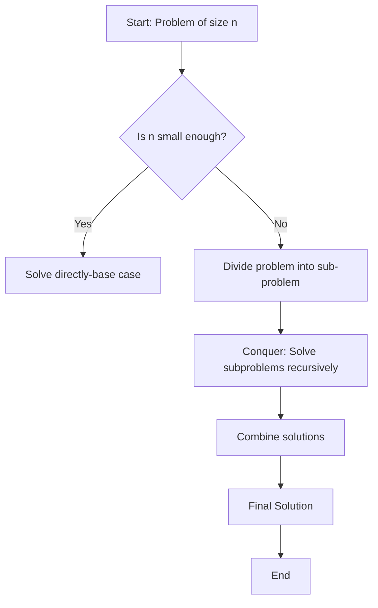

# 4.1 Fundamentals Divide & Conquer Algorithm Design

### 4.1.1 Principles and structure of divide and conquer algorithms

> Divide and Conquer is a problem-solving strategy that **breaks a problem into smaller subproblems**, solves them independently, and then combines their solutions to form the final answer.

**General Steps:**

- Divide – Break the main problem into smaller subproblems of the same type.
- Conquer – Solve the subproblems recursively. If the subproblem is small enough, solve it directly (base case).
- Combine – Merge the solutions of the subproblems into a solution for the original problem.

### 4.1.2 Advantages and limitations of divide and conquer

| **Advantages**                                                                                               | **Limitations**                                                                                                    |
| ------------------------------------------------------------------------------------------------------------ | ------------------------------------------------------------------------------------------------------------------ |
| **Efficiency** – Often reduces time complexity vs straightforward methods (e.g., merge sort vs bubble sort). | **Overhead of recursion** – Recursive calls use more memory (stack space) and may be inefficient for small inputs. |
| **Parallelism** – Independent subproblems can be solved in parallel.                                         | **Not always optimal** – Iterative solutions can be simpler/faster in some cases (e.g., linear search).            |
| **Simplicity in design** – Breaks problems into smaller, manageable parts.                                   | **Combination step cost** – If merging results is costly, performance suffers (e.g., merging in merge sort).       |
| **Reusability** – Same principle applies across many domains (sorting, searching, matrix multiplication).    | **Divide evenly issue** – Problems may not split evenly (e.g., quicksort with bad pivots).                         |
| **Reduces complexity in proofs** – Recursive definitions simplify correctness proofs.                        | **Implementation complexity** – Code can be harder to implement/debug compared to iterative methods.               |
