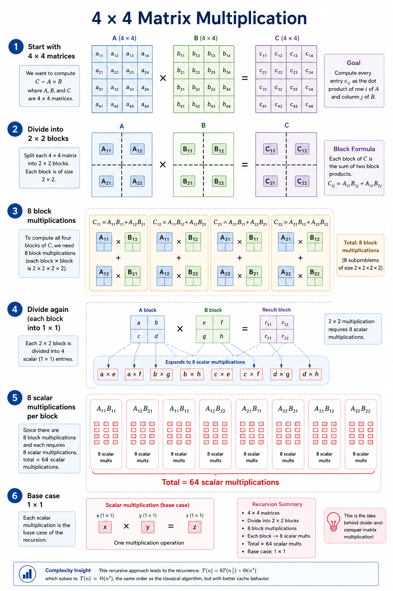
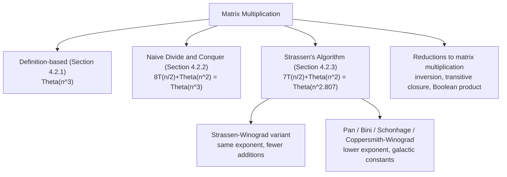

# Matrix Multiplication

## Definition

Let $A$ and $B$ be two matrices whose entries come from a **ring** — a set equipped with addition, subtraction, and multiplication satisfying the usual distributive and associative laws (the real numbers, the integers, integers modulo a prime, and polynomial rings are all examples). If $A$ is $n \times n$ and $B$ is $n \times n$, their product $C = A \times B$ is also an $n \times n$ matrix, defined entrywise by

$$
\boxed{
 C_{ij}=\sum_{k=1}^n A_{ik}\cdot B_{kj}}
$$

Each entry of $C$ is the dot product of a row of $A$ with a column of $B$. Matrix multiplication is one of the most fundamental operations in computer science and applied mathematics: it is how linear transformations are composed, how systems of linear equations are manipulated, and how a very large family of algorithms — from computer graphics to graph reachability to neural network inference — express their core computation. This topic asks a single, sharp question: given that the definition above requires $\Theta(n^3)$ scalar operations to evaluate directly, can we multiply two $n \times n$ matrices in asymptotically fewer operations, and if so, at what cost?

## Motivation and Problem Context

Matrix multiplication is not an abstract curiosity — it is a bottleneck operation that shows up, disguised, across almost every area of computing:

- **Computer graphics.** Every rotation, scaling, translation, and projection applied to a 3D model is a matrix, and transforming a scene means multiplying (and composing) these matrices, often millions of times per second inside a rendering pipeline.
- **Machine learning.** A fully connected neural network layer computes $y = Wx$, and training over a batch of inputs turns this into a matrix–matrix product $Y = WX$. Modern deep learning is, computationally, dominated by very large dense matrix multiplications; GPUs and specialized accelerators (tensor cores) exist largely because of this single operation.
- **Graph algorithms.** If $A$ is the adjacency matrix of a graph with $n$ vertices, then $(A^k)_{ij}$ counts the number of walks of length $k$ from vertex $i$ to vertex $j$. Repeated squaring of $A$ (itself built from matrix multiplication) gives $A^k$ in $O(\log k)$ multiplications, and Boolean or "min-plus" (tropical) variants of matrix multiplication are used for reachability and shortest-path computations.
- **Scientific computing.** Finite-element simulations, computational fluid dynamics, and large-scale linear algebra all reduce, at their core, to dense or sparse matrix products, frequently on matrices with $n$ in the thousands or tens of thousands.

The trouble is that the direct, definition-based algorithm costs $\Theta(n^3)$ scalar multiplications. For $n = 1{,}000$ this is $10^9$ multiplications; for $n = 10{,}000$ it is $10^{12}$. As $n$ grows, the cubic term dominates every other cost in the system, and it does so for an operation that is invoked over and over again inside larger algorithms. This makes matrix multiplication exactly the kind of problem where a lower exponent, even by a fraction, has an outsized real-world payoff: it was a longstanding open question — resolved only in 1969, by Volker Strassen — whether $n^3$ could be beaten at all. It can, and understanding how is one of the clearest illustrations in this course of the payoff of divide and conquer combined with an algebraic insight, rather than a purely mechanical restructuring of the same computation.

## Problem Formulation

**Input.** Two square matrices $A, B \in R^{n\times n}$, whose entries come from a ring $R$ (in practice: integers, reals, floating-point numbers, or entries modulo a prime).

**Output.** The matrix product $C = A \times B \in R^{n \times n}$, defined entrywise as $C_{ij} = \sum_{k=1}^n A_{ik}B_{kj}$.

**Constraints and assumptions.**

- For the standard (§4.2.1) algorithm, $n$ may be any positive integer; no assumption on $n$ is required.
- For the divide-and-conquer algorithm (§4.2.2) and for Strassen's algorithm (§4.2.3), we assume **$n$ is an exact power of two**. This assumption is purely for convenience of exposition: each divide step splits an $n \times n$ matrix into four $\tfrac n2 \times \tfrac n2$ submatrices, and $n$ being a power of two guarantees that $\tfrac n2$ stays an integer all the way down to the base case $n = 1$.
- **General $n$** (not a power of two, or rectangular $A$ and $B$) is handled by **zero-padding**: embed $A$ and $B$ in the top-left corner of $\hat n \times \hat n$ matrices $\hat A, \hat B$, where $\hat n$ is the next power of two at least as large as every relevant dimension, filling the new rows/columns with zeros. Because the padded rows and columns are zero, they contribute nothing to any dot product involving the original index range, so
  $$
  \hat A \hat B = \begin{pmatrix} AB & 0 \\ 0 & 0 \end{pmatrix},
  $$
  and the desired product $AB$ is exactly the top-left $n \times n$ (or $m \times p$, for rectangular inputs) block of $\hat A \hat B$. Padding is therefore exact, never approximate — it costs extra arithmetic (on the zero blocks) but never changes the answer.

### 4.2.1 Standard Matrix Multiplication

Given a square matrix, the standard way of multiplying any square matrix is as follow.

Given two 𝑛 × 𝑛 matrices(square matrix) 𝐴 and 𝐵, the product $𝐶 = 𝐴×𝐵$ is also an $𝑛×𝑛$ matrix where

$$
\boxed{
 𝐶_{𝑖𝑗}=∑_{𝑘=1}^𝑛𝐴_{𝑖𝑘}⋅𝐵_{𝑘𝑗}}
$$

Lets understand the above formula with a pseudocode for Square Matrix Multiplication

(**Note**: _Try to analyse the code first and then check the explanation for reference._)

!!! note "Pseudocode for standard Matrix Multiplication"

    ```text
    1 SQUARE MATRIX MULTIPLY(A, B)
    2    n = A.rows
    3    let C be a new n x n matrix
    4    for i = 1 to n
    5        for j = 1 to n
    6            C[i][j] = 0
    7            for k = 1 to n
    8                C[i][j] = C[i][j] + A[i][k] * B[k][j]
    ```

    ??? note "Explanation:"

         1. Intializing a function called **SQUARE MATRIX MULTIPLY** that takes two input parameter A and B, which are both square matix
         2. initialize n= A.rows, will store the size of the row, alternately col can also be used as it is a square matrix
         3. Initializing a new matrix $C$ of size $n \times n$
         4. The two outer loops, over $i$ and over $j$, together range over every row and column index from 1 to $n$, so they visit each of the $n^2$ positions of the output matrix exactly once.
         5. Line 6 initializes $C[i][j]$ to 0, since the entry is built up as a running sum rather than assigned directly.
         6. The innermost loop, over $k$, walks along row $i$ of $A$ and down column $j$ of $B$ at the same time, accumulating exactly the dot product $\sum_{k=1}^n A[i][k]\cdot B[k][j]$ into $C[i][j]$.
         7. Once the innermost loop finishes, $C[i][j]$ holds the correct value of that entry of the product, and control returns to the middle loop to move on to the next column.
         8. After all $n^2$ entries have been filled this way, $C$ is the completed product matrix $A \times B$.

From a standard matrix multiplication, for every element in the resultant matrix C has to perform **$n$** multiplication and **$(n-1)$** addition i.e, for example 2x2 matrix A multiplied with 2x2 matrix B, so to get the first element $C[i][j]$ it will take 2 multiplication and 1 addition.

The time complexicity of Standard Matrix multiplication is $\Theta (n^3)$

**Operation count, derived.** The assertion above can be made precise directly from the pseudocode. There are $n^2$ entries in $C$ to fill (the two outer loops). Each entry requires exactly $n$ scalar multiplications and $n-1$ scalar additions (the inner loop). Hence:

$$
\text{multiplications} = n^2 \cdot n = n^3, \qquad \text{additions} = n^2\cdot(n-1) = n^3 - n^2.
$$

The total number of scalar operations is $n^3 + (n^3 - n^2) = 2n^3 - n^2$, and since lower-order terms are absorbed by asymptotic notation,

$$
T(n) = \Theta(n^3).
$$

No loop reordering, no clever bookkeeping, and no early termination changes this count for the direct definition-based algorithm — every one of the $n^3$ products $A_{ik}B_{kj}$ (for each of the $n^2$ pairs $(i,j)$ and each of the $n$ values of $k$) is genuinely required by the definition of the product. This is the bottleneck the rest of this topic tries to break.

#### 4.2.2 Divide and conquer method for Matrix Multiplication

when we use a divide-and-conquer algorithm to compute the matrix product C = A.B, we **_assume that n is an exact power of 2_** in each of the nxn matrices. We make this assumption because in each divide step, we will divide nxn matrices into four n/2 x n/2 matrices, and by assuming that n is an exact power of 2, we are guaranteed that as long as $n \ge 2$, the dimension n=2 is an integer.

Steps:

1. Decompose two 𝑛 × 𝑛 matrices into 4 submatrices of size 𝑛/2 × 𝑛/ 2.
2. Multiply the submatrices recursively.
3. Combine results to form the final product.

Pseudocode for matrix multiplication using divide and conquer

```

SQUARE-MATRIX-MULTIPLY-RECURSIVE (A, B)
1 n = A.rows
2 let C be a new nxn matrix
3 if n == 1
4 C[1][1] = A[1][1].B[1][1]
5 else partition A, B, and C
6 C[1][1] = SQUARE-MATRIX-MULTIPLY-RECURSIVE(A[1][1].B[1][1]) +
    SQUARE-MATRIX-MULTIPLY-RECURSIVE(A[1][2].B[2][1])
7 C[1][2] = SQUARE-MATRIX-MULTIPLY-RECURSIVE(A[1][1].B[1][2]) +
    SQUARE-MATRIX-MULTIPLY-RECURSIVE(A[1][2].B[2][2])
8 C[2][1] = SQUARE-MATRIX-MULTIPLY-RECURSIVE(A[2][1].B[1][1]) +
    SQUARE-MATRIX-MULTIPLY-RECURSIVE(A[2][2].B[2][1])
9 C[2][2] = SQUARE-MATRIX-MULTIPLY-RECURSIVE(A[2][1].B[1][2]) +
    SQUARE-MATRIX-MULTIPLY-RECURSIVE(A[2][2].B[2][2])
10 return C

```

Steps

Let:

$$
A =
\begin{bmatrix}
A_{11} & A_{12} \\
A_{21} & A_{22}
\end{bmatrix},
\quad
B =
\begin{bmatrix}
B_{11} & B_{12} \\
B_{21} & B_{22}
\end{bmatrix} \tag{4.1}
$$

Then the product is:

$$
C = A \times B =
\begin{bmatrix}
C_{11} & C_{12} \\
C_{21} & C_{22}
\end{bmatrix} \tag{4.2}
$$

where:

$$
\begin{aligned}
C_{11} &= A_{11}B_{11} + A_{12}B_{21} \\
C_{12} &= A_{11}B_{12} + A_{12}B_{22} \\
C_{21} &= A_{21}B_{11} + A_{22}B_{21}  \\
C_{22} &= A_{21}B_{12} + A_{22}B_{22}
\end{aligned} \tag{4.3}
$$

---

Recurrence Relation

- Each step requires **8 multiplications** of size \((n/2) \times (n/2)\), plus some additions.

\[
T(n) = 8T\left(\frac{n}{2}\right) + O(n^2)
\]

- Time Complexity

  $$
  T(n) = O(n^3)
  $$

(same as classical matrix multiplication).

---

To multiply two \(4\times4\) matrices using the **Divide and Conquer** method, the algorithm treats each \(4\times4\) matrix as a \(2\times2\) grid, where every element of this larger grid is itself a \(2\times2\) submatrix.

#### Step 1: Partitioning the \(4\times4\) Matrices

Consider two \(4\times4\) matrices, \(A\) and \(B\).

We divide each matrix horizontally and vertically through the middle, producing four \(2\times2\) submatrices.

##### Matrix \(A\)

$$
A=
\left[
\begin{array}{cc|cc}
a_{11}&a_{12}&a_{13}&a_{14}\\
a_{21}&a_{22}&a_{23}&a_{24}\\
\hline
a_{31}&a_{32}&a_{33}&a_{34}\\
a_{41}&a_{42}&a_{43}&a_{44}
\end{array}
\right]
\quad\longrightarrow\quad
\begin{bmatrix}
A_{11}&A_{12}\\
A_{21}&A_{22}
\end{bmatrix}
$$

where each \(A_{ij}\) is a \(2\times2\) matrix.

##### Matrix \(B\)

$$
B=
\left[
\begin{array}{cc|cc}
b_{11}&b_{12}&b_{13}&b_{14}\\
b_{21}&b_{22}&b_{23}&b_{24}\\
\hline
b_{31}&b_{32}&b_{33}&b_{34}\\
b_{41}&b_{42}&b_{43}&b_{44}
\end{array}
\right]
\quad\longrightarrow\quad
\begin{bmatrix}
B_{11}&B_{12}\\
B_{21}&B_{22}
\end{bmatrix}
$$

Thus:

* \(A_{11}\) = top-left \(2\times2\) block
* \(A_{12}\) = top-right \(2\times2\) block
* \(A_{21}\) = bottom-left \(2\times2\) block
* \(A_{22}\) = bottom-right \(2\times2\) block

The same notation applies to matrix \(B\).


#### Step 2: The 8 Block Multiplications

Let

$$
C=A\times B
$$

and partition the result in the same way:

$$
C=
\begin{bmatrix}
C_{11}&C_{12}\\
C_{21}&C_{22}
\end{bmatrix}
$$

Each \(2\times2\) block of \(C\) is obtained using **two block multiplications followed by an addition**.

### \(C_{11}\): Top-Left Quadrant

$$
C_{11}
=
(A_{11}\times B_{11})
+
(A_{12}\times B_{21})
$$

This requires:

1. \(A_{11}\times B_{11}\)
2. \(A_{12}\times B_{21}\)

---

### \(C_{12}\): Top-Right Quadrant

$$
C_{12}
=
(A_{11}\times B_{12})
+
(A_{12}\times B_{22})
$$

This requires:

3. \(A_{11}\times B_{12}\)
4. \(A_{12}\times B_{22}\)

---

### \(C_{21}\): Bottom-Left Quadrant

$$
C_{21}
=
(A_{21}\times B_{11})
+
(A_{22}\times B_{21})
$$

This requires:

5. \(A_{21}\times B_{11}\)
6. \(A_{22}\times B_{21}\)

---

### \(C_{22}\): Bottom-Right Quadrant

$$
C_{22}
=
(A_{21}\times B_{12})
+
(A_{22}\times B_{22})
$$

This requires:

7. \(A_{21}\times B_{12}\)
8. \(A_{22}\times B_{22}\)

Therefore, at the first level of recursion, we have:

$$
\boxed{8\text{ block multiplications}}
$$

---

## Step 3: Recursion

The algorithm now applies the **same Divide and Conquer strategy recursively** to each of these \(2\times2\) block multiplications.

For example, consider:

$$
A_{11}\times B_{11}
$$

Both \(A_{11}\) and \(B_{11}\) are \(2\times2\) matrices.

We divide them again into \(1\times1\) blocks:

$$
A_{11}
=
\begin{bmatrix}
a_{11}&a_{12}\\
a_{21}&a_{22}
\end{bmatrix},
\qquad
B_{11}
=
\begin{bmatrix}
b_{11}&b_{12}\\
b_{21}&b_{22}
\end{bmatrix}
$$

The same process produces **8 scalar multiplications**:

$$
\begin{aligned}
c_{11}&=a_{11}b_{11}+a_{12}b_{21}\\
c_{12}&=a_{11}b_{12}+a_{12}b_{22}\\
c_{21}&=a_{21}b_{11}+a_{22}b_{21}\\
c_{22}&=a_{21}b_{12}+a_{22}b_{22}
\end{aligned}
$$

Thus, one \(2\times2\) block multiplication requires:

$$
\boxed{8\text{ scalar multiplications}}
$$

Since the first level produced **8 such block multiplications**, the total number of scalar multiplications is:

$$
8\times8=\boxed{64}
$$

---

## Recursion Tree

The process can be visualized as:

<figure markdown="span">
    {width="100%"}
    <figcaption>Example for 4x4 Matrix multiplication using divide and Conquer</figcaption>
    <p align='right' style="font-size:0.8em"><i>Image Source : AI generated(Google Gemini)</i></p>
</figure>


Therefore, the recursion produces:

$$
\boxed{8^2=64}
$$

base-level scalar multiplications.

---

## General Pattern

For an \(n\times n\) matrix, where \(n\) is a power of \(2\), the recurrence is:

$$
T(n)=8T\left(\frac n2\right)+\Theta(n^2)
$$

The base case is:

$$
T(1)=\Theta(1)
$$

Using the Master Theorem:

$$
a=8,\qquad b=2
$$

and

$$
n^{\log_b a}
=
n^{\log_2 8}
=
n^3
$$

Therefore:

$$
\boxed{T(n)=\Theta(n^3)}
$$

For \(n=4\), the recursion depth is:

$$
\log_2 4=2
$$

and the number of scalar multiplication operations is:

$$
\boxed{8^2=64}
$$

**Key idea:** Divide and Conquer does not reduce the number of scalar multiplications compared with the conventional matrix multiplication algorithm. Its importance here is that the problem is expressed recursively as smaller matrix multiplication problems, which leads naturally to the recurrence \(T(n)=8T(n/2)+\Theta(n^2)\).


### 4.2.3 Strassen's Algorithm

It has four steps:

1.  Divide the input matrices A and B and output matrix C into $\frac{n}{2}$ x $\frac{n}{2}$ submatrices, as in equation (4.1) above. This step takes $\Theta(1)$ time by index calculation.

    $$
    A =
    \begin{bmatrix}
    A_{11} & A_{12} \\
    A_{21} & A_{22}
    \end{bmatrix},
    \quad
    B =
    \begin{bmatrix}
    B_{11} & B_{12} \\
    B_{21} & B_{22}
    \end{bmatrix}
    $$

    and resultant matrix "C" :

    $$
    C = A \times B =
    \begin{bmatrix}
    C_{11} & C_{12} \\
    C_{21} & C_{22}
    \end{bmatrix}
    $$

2.  The values of the resultant matrix C is as follows

    $$
    C =
    \begin{bmatrix}
    m_1+m_4-m_5+m_7 & m_3+m_5 \\
    m_2+m_4 & m_1+m_3-m_2+m_6
    \end{bmatrix}
    $$

    Where

    $$
    \begin{align*}
    m_{1} &= (A_{11} + A_{22}) \times (B_{11} + B_{22}) \implies A_{11} \cdotp B_{11} + A_{11} \cdotp B_{22} + A_{22} \cdotp B_{11} + A_{22} \cdotp B_{22} \\
    m_{2} &= B_{11} \times  (A_{21} + A_{22}) \implies A_{21} \cdotp B_{11} + A_{22} \cdotp B_{11} \\
    m_{3} &= A_{11} \times (B_{12} - B_{22}) \implies A_{11} \cdotp B_{12} -  A_{11} \cdotp  B_{22} \\
    m_{4} &= A_{22} \times (B_{21} - B_{11}) \implies A_{22} \cdotp B_{21} - A_{22} \cdotp B_{11} \\
    m_{5} &= B_{22} \times (A_{11} + A_{12}) \implies A_{11} \cdotp B_{22} + A_{12} \cdotp B_{22} \\
    m_{6} &= (A_{21} - A_{11})\times (B_{11} + B_{12}) \implies A_{21} \cdotp B_{11} + A_{21} \cdotp  B_{12} - A_{11} \cdotp B_{11} - A_{11} \cdotp B_{12}   \\
    m_{7} &= (A_{12} - A_{22})\times (B_{21} + B_{22}) \implies A_{12} \cdotp B_{21} + A_{12} \cdotp B_{22} - A_{22} \cdotp B_{21} - A_{22} \cdotp B_{22}
    \end{align*}
    $$

    **_On solving this, it would give the same result as in eq 4.3_**

    !!! note "A note on operand order"

        For scalars, $B_{11}\times(A_{21}+A_{22})$ and $(A_{21}+A_{22})\times B_{11}$ are the same number, and the worked example below (where every block is a $1\times1$ scalar) does not distinguish them. Once these symbols stand for genuine submatrices, matrix multiplication no longer commutes, and the *order* of the factors must be read off the expansion column above, not the informal product notation: the expansion of $m_2$ keeps $A_{21}$ and $A_{22}$ on the left throughout ($A_{21}\cdot B_{11} + A_{22}\cdot B_{11}$), which is exactly $(A_{21}+A_{22})\times B_{11}$, and likewise the expansion of $m_5$ corresponds to $(A_{11}+A_{12})\times B_{22}$. The [Correctness](#correctness) and [Python Implementation](#python-implementation) sections below use this left-to-right, $A$-before-$B$ convention consistently for every product, which is what makes the algorithm valid for matrices and not only for scalars.

Recurrence Relation

- Each step requires **7 multiplications** of size \((n/2) \times (n/2)\), plus a number additions and subtractions.

$$
T(n) = 7T\left(\frac{n}{2}\right) + O(n^2)
$$

- Time Complexity

  Solving this recurrence exactly (see [Recurrence Analysis](#recurrence-analysis) below) gives

  $$
  T(n) = \Theta\left(n^{\log_2 7}\right) \approx \Theta(n^{2.807}),
  $$

  since $\log_2 7 = 2.807354922\ldots$ — not the rougher figure of $2.80$ sometimes quoted. This is a genuine, if modest, improvement over the $\Theta(n^3)$ of both the standard algorithm and the naive divide-and-conquer approach of §4.2.2.

---

!!! example "Example 1"

    $$
    A =
    \begin{bmatrix}
    1 & 3 \\
    7 & 5
    \end{bmatrix},
    \quad
    B =
    \begin{bmatrix}
    6 & 8 \\
    4 & 2
    \end{bmatrix}
    $$

    $$
    \begin{align*}
    m_{1} &= (1 + 5) \times (6 + 2) = 48 \\
    m_{2} &= 6 \times  (7 + 5) = 72 \\
    m_{3} &= 1 \times (8 - 2) =  6 \\
    m_{4} &= 5 \times (4 - 6) = -10 \\
    m_{5} &= 2 \times (1 + 3) = 8 \\
    m_{6} &= (7 - 1)\times (6 + 8) = 84   \\
    m_{7} &= (3- 5)\times (4 + 2) = -12
    \end{align*}
    $$

    Now :

    $$
    C =
    \begin{bmatrix}
    m_1+m_4-m_5+m_7 & m_3+m_5 \\
    m_2+m_4 & m_1+m_3-m_2+m_6
    \end{bmatrix}
    $$

    $$
    \implies C =
    \begin{bmatrix}
    48+(-10)-8+(-12) & 6+8 \\
    72+(-10) & 48+6-72+84
    \end{bmatrix}
    $$

    $$
    \implies C =
    \begin{bmatrix}
    18 & 14 \\
    62 & 66
    \end{bmatrix}
    $$

---

## Correctness

Two separate claims need to be established: that the **block-multiplication decomposition** used by the divide-and-conquer algorithm is correct at every level, and that **Strassen's seven-product identity** produces the same result as the eight-product block decomposition. Both proofs matter, because a divide-and-conquer algorithm is only as trustworthy as the identity it recurses on.

### Correctness of the block decomposition

**Claim.** If $A, B$ are $n\times n$ matrices partitioned into $\tfrac n2\times \tfrac n2$ blocks $A_{11},A_{12},A_{21},A_{22}$ and $B_{11},B_{12},B_{21},B_{22}$ as in equation (4.1), then $C = AB$, partitioned the same way, satisfies equation (4.3).

**Proof.** Write $n = 2m$ and split every row/column index into "first half" ($1,\dots,m$) and "second half" ($m+1,\dots,2m$). For $i, j$ in the first half (so that $C_{ij}$ lands in block $C_{11}$),

$$
C_{ij} = \sum_{k=1}^{2m} A_{ik}B_{kj} = \underbrace{\sum_{k=1}^{m} A_{ik}B_{kj}}_{\text{this is } (A_{11}B_{11})_{ij}} + \underbrace{\sum_{k=m+1}^{2m} A_{ik}B_{kj}}_{\text{this is } (A_{12}B_{21})_{ij}}.
$$

The first sum ranges $k$ over the first half only, which is precisely the definition of the $(i,j)$ entry of the ordinary product $A_{11}B_{11}$ (since $A_{ik}$ for $k \le m$ is an entry of $A_{11}$, and $B_{kj}$ for $k \le m$ is an entry of $B_{11}$). The second sum, by the same reasoning restricted to the second half of the index range, is the $(i,j)$ entry of $A_{12}B_{21}$. Hence $C_{11} = A_{11}B_{11} + A_{12}B_{21}$. The other three blocks follow identically, by choosing $i,j$ in the appropriate halves. $\blacksquare$

This is nothing more than splitting the summation index $k$ into two ranges — it does not depend on any special property of the entries, holds over any ring, and is the reason matrix multiplication is *self-similar*: multiplying two $n\times n$ matrices reduces to eight products of $\tfrac n2\times\tfrac n2$ matrices plus some additions, which is exactly what makes divide and conquer applicable in the first place (although, as the recurrence analysis below confirms, self-similarity alone does not guarantee an asymptotic improvement).

### Correctness of Strassen's seven-product identity

**Claim.** With $m_1,\dots,m_7$ defined as in §4.2.3 (using the $A$-before-$B$ operand order noted there), the four combinations

$$
C_{11} = m_1+m_4-m_5+m_7,\quad C_{12}=m_3+m_5,\quad C_{21}=m_2+m_4,\quad C_{22}=m_1-m_2+m_3+m_6
$$

equal the same blocks produced by the standard block decomposition, i.e. $C_{11}=A_{11}B_{11}+A_{12}B_{21}$, and so on.

**Proof (direct algebraic verification).** Substitute the expansions given in §4.2.3 and collect terms. For $C_{11}$:

$$
\begin{aligned}
m_1+m_4-m_5+m_7 &= (A_{11}B_{11}+A_{11}B_{22}+A_{22}B_{11}+A_{22}B_{22}) \\
&\quad+ (A_{22}B_{21}-A_{22}B_{11}) \\
&\quad- (A_{11}B_{22}+A_{12}B_{22}) \\
&\quad+ (A_{12}B_{21}+A_{12}B_{22}-A_{22}B_{21}-A_{22}B_{22}).
\end{aligned}
$$

Every term other than $A_{11}B_{11}$ and $A_{12}B_{21}$ appears exactly twice with opposite signs and cancels: $A_{11}B_{22}$ cancels against $-A_{11}B_{22}$; $A_{22}B_{11}$ against $-A_{22}B_{11}$; $A_{22}B_{22}$ against $-A_{22}B_{22}$; $A_{22}B_{21}$ against $-A_{22}B_{21}$; $A_{12}B_{22}$ against $-A_{12}B_{22}$. What survives is

$$
m_1+m_4-m_5+m_7 = A_{11}B_{11} + A_{12}B_{21} = C_{11}.
$$

The remaining three identities are verified the same way (and are exactly what the numeric worked example in §4.2.3 demonstrates for a specific $A$ and $B$, where every cancellation above happens with concrete numbers instead of symbols):

$$
m_3+m_5 = A_{11}B_{12}+A_{12}B_{22} = C_{12}, \qquad m_2+m_4 = A_{21}B_{11}+A_{22}B_{21} = C_{21},
$$
$$
m_1-m_2+m_3+m_6 = A_{21}B_{12}+A_{22}B_{22} = C_{22}.
$$

Since $C_{11},C_{12},C_{21},C_{22}$ are exactly the blocks the standard decomposition already proved correct, the assembled matrix equals $AB$. $\blacksquare$

**Why this proof never uses commutativity.** Every monomial appearing anywhere in the six expansions keeps an $A$-factor strictly on the left and a $B$-factor strictly on the right (e.g. $A_{22}B_{21}$, never $B_{21}A_{22}$). The proof only uses distributivity, associativity of addition, and the existence of additive inverses — properties of any ring, commutative or not. This matters because matrices themselves do not commute, and the whole point of Strassen's algorithm is to apply exactly this identity **recursively**, substituting submatrices for the scalars $A_{ij}, B_{ij}$. If the algebra had, at any point, silently swapped the order of a product, the substitution of matrices for scalars would be invalid the moment the entries stopped commuting. The identity survives the substitution precisely because it never needed commutativity to begin with.

**Correctness of the full recursion, by induction.** The one-level identity above only shows that *if* $m_1,\dots,m_7$ are computed correctly, *then* the assembly is correct. Full correctness of the recursive algorithm follows by strong induction on $n$:

- **Base case** ($n=1$): the algorithm returns $A_{11}B_{11}$, the scalar product, which is the definition of $C$.
- **Inductive step** ($n = 2^k$, $k \ge 1$): assume every recursive call on matrices of size $n/2 = 2^{k-1}$ returns the exact product of its arguments (inductive hypothesis). Each of the seven recursive calls in step 2 of §4.2.3 receives two valid $\tfrac n2 \times \tfrac n2$ matrices (sums or differences of quadrants, computed exactly), so by the inductive hypothesis each $m_t$ equals the exact product of its two operands. Substituting these exact products into the identity proved above shows the four assembled blocks equal the four blocks of $AB$, hence the whole assembled matrix equals $AB$.

By induction, the algorithm is correct for every $n = 2^k$. Correctness for general $n$ follows from the padding argument given in the Problem Formulation section: padding with zeros is exact, so running the power-of-two algorithm on the padded matrices and trimming the result gives the correct product for the original, unpadded matrices.

!!! danger

    The identity above is *not* something that can be discovered by trial and error with scalar or commuting test data alone. There exist superficially similar $7$- or even $6$-multiplication schemes that give correct answers when the entries commute but break the moment the entries become matrices — because somewhere in their derivation they implicitly swap the order of a product. Always verify a proposed fast-multiplication identity symbolically, keeping every $A$-factor and $B$-factor in a fixed relative order, exactly as done above.

## Complexity Analysis

The three algorithms developed above differ only in how many recursive multiplications they use at each level, and this single number is what determines their asymptotic complexity:

| Algorithm | Recursive multiplications per level | Non-recursive work per level | Recurrence | Time |
| --- | --- | --- | --- | --- |
| Standard (§4.2.1) | — (no recursion) | $n^3$ mults + $n^3 - n^2$ adds | — | $\Theta(n^3)$ |
| Naive divide and conquer (§4.2.2) | $a = 8$ | $\Theta(n^2)$ (4 additions of $\tfrac n2\times\tfrac n2$ blocks) | $T(n)=8T(n/2)+\Theta(n^2)$ | $\Theta(n^3)$ |
| Strassen (§4.2.3) | $a = 7$ | $\Theta(n^2)$ (10 operand sums/differences + 8 assembly additions, all of size $\tfrac n2\times\tfrac n2$) | $T(n)=7T(n/2)+\Theta(n^2)$ | $\Theta(n^{\log_2 7})$ |

Space complexity for both recursive algorithms is $\Theta(n^2)$: although only one recursive path is "live" at a time, the temporaries created at each level (quadrants, sums, partial products) form a geometric series in block size ($\Theta(n^2), \Theta(n^2/4), \Theta(n^2/16), \dots$) that sums to $\Theta(n^2)$, on top of a recursion depth of $\Theta(\log n)$ stack frames. This stands in contrast to the standard algorithm, which needs only $\Theta(1)$ auxiliary space beyond the $\Theta(n^2)$ output. Since none of the three algorithms branches on the *values* of the entries — only on the size $n$ — best, average, and worst case all coincide for each algorithm; there is no data-dependent behaviour to analyze separately.

## Recurrence Analysis

Both recursive algorithms above reduce to solving a recurrence of the shape $T(n) = aT(n/2) + \Theta(n^2)$, where $a$ is the number of recursive multiplications. The Master Theorem applies directly, with $b = 2$ in both cases, and the two values of $a$ tell two very different stories.

### Naive divide-and-conquer recurrence: $T(n) = 8T(n/2) + \Theta(n^2)$

Here $a = 8$, $b = 2$, $f(n) = \Theta(n^2)$. The critical exponent is

$$
n^{\log_b a} = n^{\log_2 8} = n^3.
$$

Comparing $f(n) = \Theta(n^2)$ against $n^{\log_2 8} = n^3$: since $n^2 = O(n^{3-\varepsilon})$ for, e.g., $\varepsilon = 1$, this falls under **Master Theorem Case 1** (the recursive calls, i.e. the leaves of the recursion tree, dominate the cost). Hence

$$
\boxed{T(n) = \Theta(n^3)}.
$$

The recursion-tree view makes this transparent: at depth $i$ there are $8^i$ subproblems of size $n/2^i$, contributing $8^i \cdot \Theta((n/2^i)^2)$ work at that level. The per-level cost is proportional to $8^i / 4^i = 2^i$, which **grows** with depth, so the deepest level (the $n^{\log_2 8} = n^3$ leaves) dominates the total, exactly as the Master Theorem predicts. This confirms the conclusion already reached in §4.2.2: reorganizing the computation recursively, without reducing the branching factor $a=8$, buys nothing asymptotically.

### Strassen's recurrence: $T(n) = 7T(n/2) + \Theta(n^2)$

Here $a = 7$, $b = 2$, $f(n) = \Theta(n^2)$. The critical exponent is

$$
\alpha = \log_b a = \log_2 7 = 2.807354922\ldots
$$

Comparing $f(n) = \Theta(n^2)$ against $n^{\alpha} = n^{2.807\ldots}$: again $n^2 = O(n^{\alpha - \varepsilon})$ for a suitable $\varepsilon > 0$ (e.g. $\varepsilon = 0.5$), so this is again **Master Theorem Case 1**, and

$$
\boxed{T(n) = \Theta\left(n^{\log_2 7}\right) \approx \Theta(n^{2.8074})}.
$$

This is the corrected, precise form of the "$O(n^{2.80})$" figure quoted informally in §4.2.3: the exponent is the irrational number $\log_2 7$, not a rounded decimal, and it is worth carrying at least three decimal places ($2.807$) since rounding to $2.80$ can make the value look smaller than it is.

**Recursion-tree derivation, to see *why*.** At depth $i$ there are $7^i$ subproblems of size $n/2^i$, each contributing $\Theta((n/2^i)^2)$ work, so

$$
T(n) = \sum_{i=0}^{\log_2 n - 1} 7^i \cdot c\left(\frac{n}{2^i}\right)^2 + 7^{\log_2 n}\cdot T(1) = c\,n^2\sum_{i=0}^{\log_2 n-1}\left(\frac74\right)^i + n^{\log_2 7}\, T(1).
$$

The ratio $7/4 > 1$ per level is the entire story: each level down multiplies the running total by $7/4$, so the sum is a geometric series dominated by its **last** term, and evaluating it (geometric sum formula, then using $(7/4)^{\log_2 n} = n^{\log_2 7 - 2}$) gives $T(n) = \Theta(n^{\log_2 7})$ with a lower-order correction of $-\Theta(n^2)$. Contrast this with the naive recurrence's ratio of $8/4 = 2$ per level (even more leaf-dominated) and note what would happen if the ratio were exactly $1$ (all $\log_2 n$ levels cost the same, giving an extra $\log n$ factor) or less than $1$ (the root would dominate instead of the leaves) — this is precisely the three-way split the Master Theorem formalizes.

!!! warning "The exponent improves, but the constant does not"

    Solving the recurrence exactly for the number of scalar multiplications, $P(n) = 7P(n/2)$, $P(1)=1$, gives $P(n) = n^{\log_2 7}$ exactly. Solving the corresponding recurrence for the number of scalar additions, $A(n) = 7A(n/2) + \tfrac92 n^2$, $A(1) = 0$, gives $A(n) = 6\left(n^{\log_2 7} - n^2\right)$ exactly — a constant of $6$ against the classical algorithm's constant of $1$ on the addition term. Because of this large constant, recursing Strassen all the way down to $n=1$ actually loses to the classical algorithm on *total* operation count for every $n$ up to somewhere between 512 and 1024; the asymptotic win only becomes a practical one once a cutoff replaces the deep, numerous, cheap-per-call levels with a single tuned classical kernel (see [Trade-Off Analysis](#trade-off-analysis) and [Performance Considerations](#performance-considerations) below).

## Python Implementation

Both recursive algorithms follow directly from the pseudocode above. The helper functions `add`, `sub`, `split`, and `join` are shared; only the recursive step differs — eight recursive calls assembled by equation (4.3) for the naive divide-and-conquer version, or seven recursive calls assembled by the identity in §4.2.3 for Strassen's algorithm.

```python
from typing import List

Matrix = List[List[float]]


def add(X: Matrix, Y: Matrix) -> Matrix:
    """Elementwise matrix addition."""
    return [[X[i][j] + Y[i][j] for j in range(len(X[0]))] for i in range(len(X))]


def sub(X: Matrix, Y: Matrix) -> Matrix:
    """Elementwise matrix subtraction."""
    return [[X[i][j] - Y[i][j] for j in range(len(X[0]))] for i in range(len(X))]


def split(M: Matrix):
    """Split an even-sized square matrix into its four quadrants A11, A12, A21, A22."""
    n = len(M)
    h = n // 2
    A11 = [row[:h] for row in M[:h]]
    A12 = [row[h:] for row in M[:h]]
    A21 = [row[:h] for row in M[h:]]
    A22 = [row[h:] for row in M[h:]]
    return A11, A12, A21, A22


def join(C11: Matrix, C12: Matrix, C21: Matrix, C22: Matrix) -> Matrix:
    """Reassemble four quadrants into one matrix."""
    top = [r1 + r2 for r1, r2 in zip(C11, C12)]
    bottom = [r1 + r2 for r1, r2 in zip(C21, C22)]
    return top + bottom


def dc_multiply(A: Matrix, B: Matrix) -> Matrix:
    """Naive divide-and-conquer multiplication: 8 recursive calls (eq. 4.3).

    Assumes A and B are square with a size that is a power of two.
    """
    n = len(A)
    if n == 1:
        return [[A[0][0] * B[0][0]]]

    A11, A12, A21, A22 = split(A)
    B11, B12, B21, B22 = split(B)

    C11 = add(dc_multiply(A11, B11), dc_multiply(A12, B21))
    C12 = add(dc_multiply(A11, B12), dc_multiply(A12, B22))
    C21 = add(dc_multiply(A21, B11), dc_multiply(A22, B21))
    C22 = add(dc_multiply(A21, B12), dc_multiply(A22, B22))

    return join(C11, C12, C21, C22)


def strassen_multiply(A: Matrix, B: Matrix, cutoff: int = 1) -> Matrix:
    """Strassen's algorithm: 7 recursive calls (m1..m7), matching §4.2.3.

    Assumes A and B are square with a size that is a power of two. `cutoff`
    switches to `dc_multiply`-style direct computation below a threshold
    size; see the Trade-Off and Performance Considerations sections for why
    this matters in practice.
    """
    n = len(A)
    if n <= cutoff:
        return dc_multiply(A, B) if n > 1 else [[A[0][0] * B[0][0]]]

    A11, A12, A21, A22 = split(A)
    B11, B12, B21, B22 = split(B)

    # Seven products; operand order kept A-before-B throughout (see the
    # "note on operand order" in §4.2.3 — this is essential for matrices).
    m1 = strassen_multiply(add(A11, A22), add(B11, B22), cutoff)
    m2 = strassen_multiply(add(A21, A22), B11, cutoff)
    m3 = strassen_multiply(A11, sub(B12, B22), cutoff)
    m4 = strassen_multiply(A22, sub(B21, B11), cutoff)
    m5 = strassen_multiply(add(A11, A12), B22, cutoff)
    m6 = strassen_multiply(sub(A21, A11), add(B11, B12), cutoff)
    m7 = strassen_multiply(sub(A12, A22), add(B21, B22), cutoff)

    C11 = add(sub(add(m1, m4), m5), m7)   # m1 + m4 - m5 + m7
    C12 = add(m3, m5)                     # m3 + m5
    C21 = add(m2, m4)                     # m2 + m4
    C22 = add(sub(add(m1, m3), m2), m6)   # m1 - m2 + m3 + m6

    return join(C11, C12, C21, C22)


if __name__ == "__main__":
    A = [[1, 3], [7, 5]]
    B = [[6, 8], [4, 2]]
    print(dc_multiply(A, B))          # [[18, 14], [62, 66]]
    print(strassen_multiply(A, B))    # [[18, 14], [62, 66]]
```

## Code Walkthrough

- **`split` / `join`** mirror the block decomposition of equation (4.1)–(4.2) directly: `split` cuts a matrix into the four quadrants $A_{11}, A_{12}, A_{21}, A_{22}$, and `join` reverses the operation. Every recursive call operates on a valid, correctly-shaped submatrix because `split` always divides an even-sized matrix exactly in half — which is precisely why the power-of-two assumption from the Problem Formulation section is needed.
- **`dc_multiply`** is a direct transcription of the pseudocode `SQUARE-MATRIX-MULTIPLY-RECURSIVE`: eight recursive calls, combined pairwise by `add`, exactly reproducing equation (4.3). It is included primarily as a baseline for comparison and as a stepping stone to `strassen_multiply` — structurally the two functions are nearly identical, differing only in *how many* recursive calls are made and *what* is passed into them.
- **`strassen_multiply`** replaces the eight block products with the seven values $m_1,\dots,m_7$ from §4.2.3, each computed on a *sum or difference* of quadrants rather than a raw quadrant. The four assignments to `C11, C12, C21, C22` are a direct transcription of the boxed formula in §4.2.3 — note that `C11` and `C22` each use four of the seven $m$ values (with exactly one subtraction each), while `C12` and `C21` use only two; this asymmetry is a real feature of the identity, not an implementation choice (see [Common Conceptual Mistakes](#common-conceptual-mistakes)).
- **The `cutoff` parameter** exists because, as the boxed warning in the Recurrence Analysis section explains, recursing Strassen all the way to $n=1$ is provably *worse* than the classical algorithm in total operation count for all but very large $n$. Setting `cutoff` to some threshold (tuned by measurement, not derived analytically) hands the smallest, most numerous subproblems to a plain triple loop, which is both faster in practice and better behaved numerically.
- **Reading `C11 = add(sub(add(m1, m4), m5), m7))`**: this is $((m_1+m_4)-m_5)+m_7$. Matrix addition is associative, so the grouping does not affect the mathematical result — but in floating point, different groupings can produce slightly different rounding, which is worth knowing before comparing Strassen's output to a reference bit-for-bit (see [Common Implementation Pitfalls](#common-implementation-pitfalls)).

## Alternative Approaches

| Approach | Strategy | Multiplications per $2\times2$ block step | Time | Extra space | When it is the right choice |
| --- | --- | --- | --- | --- | --- |
| Standard triple loop (§4.2.1) | Direct definition | 8 | $\Theta(n^3)$ | $\Theta(1)$ | Small to moderate $n$; simplicity and predictability matter; this is what tuned libraries (BLAS) optimize to near-peak hardware throughput |
| Naive divide and conquer (§4.2.2) | D&C without an algebraic reduction | 8 | $\Theta(n^3)$ | $\Theta(\log n)$ stack | Rarely chosen for speed; useful for cache-oblivious recursive blocking, and as the pedagogical stepping stone to Strassen |
| Strassen (§4.2.3) | D&C + a 7-multiplication algebraic identity | 7 | $\Theta(n^{\log_2 7}) \approx \Theta(n^{2.807})$ | $\Theta(n^2)$ | Large, dense matrices over an exact ring, above a measured crossover, with memory to spare |
| Strassen–Winograd variant | Same identity, reorganized to use only 15 additions instead of 18 | 7 | $\Theta(n^{2.807})$ | $\Theta(n^2)$ | The usual production choice when Strassen is used at all — smaller constant, same exponent |
| Coppersmith–Winograd and later refinements | Advanced tensor / bilinear-complexity methods | — | as low as $\approx O(n^{2.371})$ | very large hidden constants | Never in practice — these are "galactic algorithms": their crossover point exceeds any matrix size that will ever actually be multiplied |

!!! info "Galactic algorithms"

    Every algorithm below Strassen in the exponent race — Pan, Bini, Schönhage, Coppersmith–Winograd, and their modern descendants — improves the asymptotic exponent but at the cost of enormous constant factors, making them theoretically interesting but practically unusable. Strassen (or its Winograd variant) remains the *only* sub-cubic matrix multiplication algorithm actually deployed in real systems. Whether the true optimal exponent $\omega$ equals $2$ remains a major open problem in theoretical computer science.

## Trade-Off Analysis

| Trade-off | How it shows up here |
| --- | --- |
| Asymptotics vs. constants | Strassen's exponent ($2.807$) beats the standard algorithm's ($3$), but its addition constant ($6$) is six times the standard algorithm's ($1$); the crossover point must be measured, not assumed |
| Multiplications vs. additions | 8 multiplications + 4 additions becomes 7 multiplications + 18 additions — a good trade only because multiplications, recursively, are the expensive resource (they are what sits in the exponent) |
| Time vs. space | The standard algorithm needs $\Theta(1)$ extra space; Strassen needs $\Theta(n^2)$, with a large constant from the temporaries created at every recursion level |
| Speed vs. numerical accuracy | Strassen forms intermediate sums such as $A_{11}+A_{22}$ whose magnitude can exceed that of the final answer, relying on cancellation to recover it. In floating point this loses the strong componentwise error bound the classical algorithm enjoys, replacing it with a weaker normwise bound whose constant grows with recursion depth. Applications needing componentwise accuracy (ill-conditioned solves, some eigenvalue algorithms) should avoid Strassen underneath without careful analysis; applications tolerant of normwise error at lower precision (e.g. deep-learning training) are far less affected |
| Simplicity vs. performance | The standard triple loop is a few lines and trivially auditable; a competitive Strassen implementation needs padding, a tuned cutoff, and workspace management, roughly tripling the code surface for a payoff that only appears at large $n$ |

!!! tip

    The single most useful engineering statement about Strassen: it is best understood as **a constant-factor optimization dressed as an asymptotic one**, for every matrix size actually encountered in most applications. The exponent improves by $0.193$; realizing that gain in wall-clock time requires a carefully tuned cutoff, enough memory for the $\Theta(n^2)$ workspace, and tolerance for a weaker numerical guarantee.

## Edge Cases

| Edge case | Why it matters | How to handle it |
| --- | --- | --- |
| $n = 1$ | The base case; there is nothing left to split | Return the scalar product $A_{11}B_{11}$ directly |
| $n$ odd | The quadrant split in `split` requires an even size | Pad to the next even size (in practice, the next power of two), or use a peeling strategy that handles the odd row/column separately |
| $n$ a power of two just barely (e.g. $n = 1025$) | Static padding to the next power of two nearly doubles $n$, and the padded computation can cost up to $2^{\log_2 7} \approx 7\times$ the ideal | Pad only as far as the recursion levels actually used, or fall back to the classical algorithm above the cutoff for the "overhang" |
| Non-square inputs ($m \times n$ times $n \times p$) | Strassen and the naive D&C algorithm as presented require square blocks | Embed in a common square size via zero-padding (exact, per the Problem Formulation section), or use a rectangular variant |
| Dimension mismatch ($\text{cols}(A) \ne \text{rows}(B)$) | Silently produces a wrong-shaped or wrong-valued result if unchecked | Validate dimensions before dispatching to any of the three algorithms |
| Large-magnitude integer entries | Strassen's intermediate sums (e.g. $A_{11}+A_{22}$, or a combination like $m_1+m_4-m_5+m_7$) can exceed the magnitude of the final output entries | Use an accumulator type wide enough for the intermediates, not just the output, in exact-arithmetic settings |
| Sparse matrices | Strassen's additions of quadrants destroy sparsity structure, turning an $O(\text{nnz})$-friendly problem into a dense $O(n^{2.807})$ one | Do not use Strassen (or the naive D&C algorithm) on sparse matrices; use a sparse-matrix method instead |
| Entries from a semiring without subtraction (Boolean OR/AND, min-plus/tropical) | Strassen's identity uses subtraction in several of the $m_t$ and in the assembly formulas; a semiring has no additive inverse | Strassen does not apply; use the standard $\Theta(n^3)$ algorithm (or a specialized bitset/Boolean trick) for these products |

## Common Implementation Pitfalls

- **Sign errors in the assembly formulas.** $C_{11} = m_1+m_4-m_5+m_7$ and $C_{22} = m_1-m_2+m_3+m_6$ each contain exactly one subtraction in a different position; a single flipped sign produces output of the right shape but the wrong values, and this is caught only by comparing against a reference implementation.
- **Swapping an operand pair, or reversing a factor's order.** For example, computing $m_2$ as $(A_{21}+A_{22})\times B_{12}$ instead of $(A_{21}+A_{22})\times B_{11}$, or reversing which factor comes first. Reversing factor order is especially dangerous because it still gives correct answers on symmetric, diagonal, or identity test matrices, and fails silently only on general matrices.
- **Testing only with symmetric, diagonal, or commuting matrices.** If test matrices commute, factor-order bugs pass undetected. Always include random, asymmetric integer matrices in a test suite (see [Testing Strategy](#testing-strategy)).
- **Recursing all the way to $n=1$ with no cutoff.** Correct, but — as the boxed warning under Recurrence Analysis shows — genuinely slower than the classical algorithm in total operations for all realistic small-to-moderate $n$.
- **Copying submatrices at every level instead of using index views.** `split`'s list-slicing allocates fresh memory at every level; this is $\Theta(n^2)$ copying per level with a large constant, and is often the dominant practical cost of a straightforward implementation.
- **Forgetting to trim the result after padding.** The padded product is $\hat n\times\hat n$; only its top-left $m\times p$ submatrix is the answer for the original inputs.
- **Comparing floating-point results bit-for-bit.** Different groupings of the same additions produce different rounding; compare with a tolerance proportional to $\varepsilon \cdot \|A\|\cdot\|B\|$, never for exact equality.
- **Assuming a cutoff tuned on one machine transfers to another.** The optimal cutoff depends on cache size, vector width, and compiler; it must be re-measured per target platform.

## Common Conceptual Mistakes

- **"Seven out of eight multiplications means Strassen is $7/8$ as expensive."** Wrong — that would be true for a single level. The saving compounds over $\log_2 n$ levels, turning $n^3$ leaves into $n^{\log_2 7}$ leaves, a factor of $n^{0.193}$, which grows without bound as $n$ grows. Conversely, applying just *one* level of the identity on top of an otherwise classical computation is only worth a genuine $7/8$ saving — not the full asymptotic gain — which is exactly why full recursion (down to a cutoff) is what makes the technique valuable.
- **"Strassen is always faster than the classical algorithm."** False for small and moderate $n$; the classical algorithm has a much smaller constant and runs closer to peak hardware throughput. There is a real, measured crossover point below which Strassen loses.
- **"Any recursive matrix multiplication algorithm is Strassen's algorithm."** No — the naive divide-and-conquer algorithm of §4.2.2 is also recursive, but with $a=8$ it is still $\Theta(n^3)$. What makes Strassen's algorithm distinct is specifically the algebraic identity that reduces the branching factor from 8 to 7, not the act of recursing.
- **"Strassen requires $n$ to be a power of two."** The clean presentation does, but padding (or peeling) handles any $n$ correctly, at some extra cost; the power-of-two restriction is an expositional convenience, not a fundamental limitation.
- **"The seven products should be symmetric in structure."** They are not: $C_{11}$ and $C_{22}$ each depend on four of the seven $m_t$, while $C_{12}$ and $C_{21}$ depend on only two. Expecting a tidy, symmetric pattern is a common reason the identity is hard to reconstruct from memory — it should be derived or looked up, not guessed at.
- **"Since the two algorithms are mathematically equivalent, their floating-point results are identical."** They are not, in general. Strassen relies on cancellation among larger intermediate values, which changes the rounding behavior; the results agree only up to floating-point tolerance, not bit-for-bit.

## Important Properties and Invariants

- **Block-multiplication identity.** Conformably partitioned matrices multiply as if the blocks were scalars — proved above by splitting the summation index — and this is the structural fact that makes any divide-and-conquer approach to matrix multiplication possible at all.
- **Noncommutative validity.** Every monomial in Strassen's expansion keeps its $A$-factor on the left and $B$-factor on the right throughout; this is precisely what licenses substituting matrices (which do not commute) for the scalars in the identity's original derivation.
- **Ring requirement.** Strassen's identity uses only addition, subtraction, and multiplication — no division, no ordering, no commutativity of multiplication is required. It is valid over $\mathbb{Z}$, $\mathbb{Z}_m$, the reals, and matrix rings, but **not** over a semiring lacking subtraction (Boolean OR/AND, min-plus).
- **Size-halving.** Every recursive call operates on matrices of exactly half the linear size of its caller, guaranteeing termination after $\log_2 n$ levels for both recursive algorithms.
- **Leaf domination.** In both recurrences the per-level cost ratio ($a/b^2$, i.e. $8/4=2$ for the naive algorithm and $7/4 = 1.75$ for Strassen) exceeds $1$, so cost concentrates at the deepest level of recursion — the number of leaf-level scalar multiplications is what the asymptotic complexity actually measures.
- **Obliviousness.** None of the three algorithms branches on the *values* of the matrix entries, only on the size $n$; consequently best, average, and worst case coincide for each, and running time is perfectly predictable given only $n$.
- **Padding exactness.** Embedding a matrix in a larger, zero-padded square matrix changes nothing about the product within the original index range — padding is exact, never approximate.

## When to Use

Standard multiplication (§4.2.1) is the right default for essentially all everyday use — small to moderate matrix sizes, exact or floating-point arithmetic, simplicity and predictability valued over the last percent of throughput. Strassen's algorithm becomes worth considering specifically when:

- The matrices are **large and dense**, comfortably above a crossover point measured on the target hardware.
- Entries come from an **exact ring** ($\mathbb{Z}$, $\mathbb{Z}_p$, polynomials), where the numerical-accuracy objection disappears entirely — this is a genuinely strong use case in computer-algebra systems and cryptographic computation.
- **Multiplying entries is much more expensive than adding them** — for example, when entries are themselves large integers, polynomials, or matrices (as in some block-recursive algorithms) — making the 7-versus-8 trade decisively favourable.
- **Memory is not the binding constraint**, so the extra $\Theta(n^2)$ workspace with a large constant is affordable.
- The application can tolerate a **normwise** rather than a componentwise floating-point error bound.

## When NOT to Use

- **Small or moderate $n$.** Below the measured crossover, the standard algorithm wins outright, often by a wide margin, because of its much smaller constant.
- **Sparse matrices.** Strassen's additions of quadrants destroy sparsity, converting an $O(\text{nnz})$-friendly problem into a dense $O(n^{2.807})$ one.
- **Structured matrices** (symmetric, banded, triangular, Toeplitz, low-rank). Algorithms that exploit the structure directly beat the $n^{0.193}$ gain from Strassen by a much larger margin.
- **Tight memory budgets.** The $\Theta(n^2)$ auxiliary space, with its large constant, may simply not be available where the classical algorithm's $\Theta(1)$ would fit.
- **Componentwise accuracy requirements.** Ill-conditioned linear solves, some eigenvalue algorithms, and iterative refinement schemes rely on the classical algorithm's strong componentwise error bound.
- **Semirings without subtraction.** Boolean OR/AND products and min-plus (tropical) products used in shortest-path algorithms have no additive inverse, so the identity's subtractions are meaningless — Strassen simply does not apply here.
- **Whenever a tuned library or hardware path already exists.** A well-optimized BLAS `gemm` call, or a GPU/tensor-core kernel, frequently outperforms a hand-rolled Strassen implementation even at sizes where Strassen's flop count is lower, because the library wins on memory traffic and vectorization.

## Real-World Applications

- **Exact linear algebra over finite fields.** Libraries for computer algebra and cryptography use Strassen (or the Winograd variant) for large dense products over $\mathbb{Z}_p$, where the accuracy objection is irrelevant and the flop saving is genuine.
- **Computer algebra systems.** Products of matrices with large-integer or polynomial entries, where one multiplication costs far more than one addition, making the 7-versus-8 trade especially favourable.
- **High-performance numerical libraries.** Some BLAS implementations and research kernels include a Strassen path (typically applied one or two levels deep) on top of an otherwise tuned classical kernel, for very large dense matrices.
- **Theoretical algorithm design.** Any complexity result stated as $O(n^\omega)$ — for matrix inversion, transitive closure, Boolean matrix products, triangle counting, and more — traces back to the existence of a sub-cubic matrix multiplication algorithm, of which Strassen's was the first.
- **Graph algorithms via repeated squaring.** Computing $A^k$ for an adjacency matrix $A$ (to count walks, or to compute transitive closure via Boolean matrix powers) uses matrix multiplication as its core primitive, and benefits from any exponent improvement at large $n$.

## Engineering Perspective

An asymptotically superior algorithm is not automatically the better production choice, and Strassen is the standard illustration of this fact in an algorithms course:

- **Correctness risk.** Seven products and multiple signed additions form a large surface for sign and operand-order errors, whereas the classical triple loop is trivially auditable line by line.
- **Maintainability.** Supporting padding, a tuned cutoff, and workspace management roughly doubles or triples the code required, for a gain that only materializes above a measured threshold.
- **Portability of tuning.** The optimal cutoff depends on cache sizes, vector width, and compiler — a constant tuned on one machine is not guaranteed to be optimal on another.
- **Numerical contract.** If an existing API previously guaranteed classical-algorithm accuracy, silently substituting Strassen underneath changes that contract and should be documented, not slipped in.
- **Where the larger wins actually are.** Loop ordering and cache blocking, vectorization, multithreading, precision reduction, and exploiting sparsity or structure typically dominate the modest $n^{0.193}$ improvement Strassen offers, and should be exhausted first.

!!! tip

    A practical order of operations when a matrix product is a measured bottleneck: confirm it really is the bottleneck; check for sparsity or exploitable structure; reach for a tuned library or GPU path; consider reducing precision if the application tolerates it; only then consider a fast-multiplication algorithm like Strassen. Strassen belongs near the end of that list, and knowing that is itself part of good engineering judgment.

## Performance Considerations

- **Constant factors dominate at realistic sizes.** Strassen's addition count carries a constant of $6$ against the classical algorithm's $1$; this is the single largest reason the crossover point is not small.
- **Compute-bound vs. memory-bound.** A well-blocked classical kernel achieves a high ratio of arithmetic to memory traffic and can approach a machine's peak throughput. Strassen's many matrix additions perform roughly one flop per element touched, making them memory-bandwidth-bound; a flop-count saving does not translate proportionally into a time saving.
- **Cutoff tuning is the most impactful lever.** Because the addition-count constant makes deep, full recursion counterproductive, the size at which the algorithm hands off to a classical kernel should be chosen by measurement on the target hardware, not fixed arbitrarily.
- **Padding waste.** For $n$ just above a power of two, naive padding can nearly double the effective size and cost close to a factor of $7$ in the padded region; padding only as far as the levels actually used mitigates this.
- **Parallelism.** The seven products at each level are mutually independent and parallelize well; the operand-formation and assembly steps are synchronization points and tend to be memory-bandwidth limited rather than compute limited.

## Testing Strategy

A trustworthy test suite for these algorithms should include, at minimum:

| Category | What to test |
| --- | --- |
| Known answers | The $2\times2$ worked example above; $A\cdot I = A$; $A \cdot 0 = 0$ |
| Boundary sizes | $n = 1, 2, 4, 8$ (exact powers of two) and, for a padding-aware implementation, sizes immediately around a power of two |
| Reference comparison | Random matrices, checked against the standard algorithm (`dc_multiply`/`strassen_multiply` output equal to a straightforward triple-loop reference) |
| Asymmetric matrices | Random, **non-symmetric, non-commuting** integer matrices — essential, since symmetric or diagonal test data can hide factor-order bugs (see Common Implementation Pitfalls) |
| Cutoff sweep | For exact integer arithmetic, results must be identical for every cutoff value; a discrepancy that appears only at one cutoff points to a bug near the base case |
| Floating-point tolerance | Compare with a tolerance proportional to machine epsilon times the operand norms, never for bit-for-bit equality |

```python
import random


def reference(A, B):
    n, m, p = len(A), len(B), len(B[0])
    return [[sum(A[i][k] * B[k][j] for k in range(m)) for j in range(p)]
            for i in range(n)]


def test_against_reference(trials=200):
    for _ in range(trials):
        n = 2 ** random.randint(0, 3)
        A = [[random.randint(-9, 9) for _ in range(n)] for _ in range(n)]
        B = [[random.randint(-9, 9) for _ in range(n)] for _ in range(n)]
        assert dc_multiply(A, B) == reference(A, B)
        assert strassen_multiply(A, B) == reference(A, B)


def test_noncommutativity_is_respected():
    # A and B chosen so AB != BA; a factor-order bug would show up here.
    A = [[1, 2], [3, 4]]
    B = [[0, 1], [1, 0]]
    assert strassen_multiply(A, B) == reference(A, B)
    assert strassen_multiply(B, A) == reference(B, A)
```

## Debugging Strategy

- **Isolate a single level first.** Set the recursion to stop after one Strassen level (children computed classically) — if that fails, the bug is in the identity or the assembly, not in the recursion.
- **Check each $m_t$ individually.** Compute $m_1$ through $m_7$ against their definitions using the reference multiplier; this localizes a sign or operand-order error to a single line.
- **Check each output block individually.** $C_{11}$ and $C_{22}$ depend on four of the seven $m_t$; $C_{12}$ and $C_{21}$ depend on only two. The pattern of which blocks are wrong narrows down which $m_t$ is implicated.
- **Use small integer matrices for hand verification.** Values in $[-9,9]$ at $n=2$ make manual checking feasible and remove floating-point noise from the diagnosis.
- **Sweep the cutoff for exact (integer) inputs.** Results must be identical across every cutoff; a discrepancy at only one cutoff points to the base case, while a discrepancy at every cutoff above the base case points to the identity itself.
- **Verify against the operation-count formulas.** An implementation that reports $8^{\log_2 n}$ rather than $7^{\log_2 n}$ scalar multiplications is silently computing eight products somewhere — a common outcome of a copy-paste mistake while writing out the seven.

## Related Algorithms and Concepts



A separate, much deeper reference note on this same topic, `strasen.md` in this unit's source tree, works through the full inductive correctness proof, exact operation counts, numerical-stability analysis with explicit error bounds, and the tensor-rank formulation of Strassen's identity in far more depth than is needed here; it is a useful next stop for students who want to go beyond this course's requirements.

| Related technique | Shares with Strassen | Differs in |
| --- | --- | --- |
| Karatsuba multiplication (integer/polynomial) | Same trade: reduce the branching factor $a$ via an algebraic identity, pay in extra additions | Operates on digit strings or polynomial coefficients; reduces $4\to 3$ rather than $8 \to 7$ |
| Toom–Cook multiplication | Same trade at a larger split | Uses polynomial evaluation and interpolation rather than a fixed block identity |
| Matrix exponentiation by squaring | Divide and conquer, applied to the exponent rather than the matrix size | Reduces the number of matrix *products* needed for $A^k$, not the cost of a single product |
| Recursive block (cache-oblivious) multiplication | Identical recursive structure to §4.2.2 | Uses $a=8$, so it changes cache behaviour only, not the exponent |
| Min-plus (tropical) matrix product for shortest paths | Same $n^3$ triple-loop shape as the standard algorithm | A semiring without subtraction — Strassen's identity does not apply |

## Complexity Summary

| Algorithm | Recurrence | Multiplications | Time | Auxiliary space |
| --- | --- | --- | --- | --- |
| Standard (§4.2.1) | — | $n^3$ | $\Theta(n^3)$ | $\Theta(1)$ |
| Naive divide and conquer (§4.2.2) | $T(n)=8T(n/2)+\Theta(n^2)$ | $n^3$ | $\Theta(n^3)$ | $\Theta(\log n)$ |
| Strassen (§4.2.3) | $T(n)=7T(n/2)+\Theta(n^2)$ | $n^{\log_2 7}$ | $\Theta\!\left(n^{\log_2 7}\right)\approx\Theta(n^{2.8074})$ | $\Theta(n^2)$ |

## Algorithm Design Checklist

```text
1.  Confirm the input/output shapes and the ring the entries come from.
2.  Write the naive definition-based algorithm and derive its exact
    operation count (n^3 multiplications, n^3 - n^2 additions).
3.  Identify where the cost concentrates (the n^3 leaf multiplications).
4.  Check whether the problem is self-similar under a natural split
    (yes: block matrix multiplication, proved by splitting the sum index).
5.  Write the naive recursive version and its recurrence
    (8T(n/2)+Theta(n^2) = Theta(n^3)) -- confirm it buys nothing.
6.  Identify which parameter sits in the exponent (a, the branching
    factor) versus which is asymptotically free (f(n), the additions).
7.  Search for an algebraic identity that reduces a, at the cost of
    extra cheap additions (8 -> 7, Strassen's identity).
8.  Verify the identity holds without ever commuting a product --
    matrices will be substituted for scalars in the recursive step.
9.  Solve the new recurrence via the Master Theorem
    (7T(n/2)+Theta(n^2) = Theta(n^log2(7))).
10. Prove correctness: block-decomposition proof for one level, then
    strong induction on n for the full recursion.
11. Handle sizes that violate the split assumption (odd n, padding).
12. Choose a base-case cutoff and justify it by measurement, not theory.
13. Check the numerical contract if entries are floating point.
14. Test with random, ASYMMETRIC matrices, not just symmetric ones.
15. Decide honestly whether the asymptotic gain survives the constants,
    the memory budget, and the numerical requirements on your machine.
```

## Final Summary

**What it is.** Standard matrix multiplication evaluates the definition directly in $\Theta(n^3)$ time. The naive divide-and-conquer algorithm recasts the same computation recursively, using the block-multiplication identity, but still performs eight recursive multiplications per level and remains $\Theta(n^3)$. Strassen's algorithm replaces those eight products with seven cleverly chosen products of sums and differences of quadrants, recovering the four output blocks by cancellation, and thereby achieves $\Theta(n^{\log_2 7}) \approx \Theta(n^{2.807})$.

**Core insight.** The eight monomials $A_{ik}B_{kj}$ used by the direct block decomposition are one way to assemble the answer, not the only way. Products of sums of quadrants "overshoot" the target and can be made to cancel algebraically, so seven well-chosen products suffice to reconstruct the four blocks that eight products previously required. Since additions are asymptotically free (they live in $f(n)$, not in the exponent) while multiplications are not, this trade genuinely changes the growth rate.

**Correctness.** The block decomposition is correct because splitting the summation index $k$ into two halves splits the dot product into two sub-dot-products, exactly matching block multiplication. Strassen's seven-product identity is verified by direct algebraic expansion (each of the four output blocks reduces, after cancellation, to the same two-term sum the block decomposition already established), and this identity never needs to commute a product — which is exactly what allows it to be applied recursively to matrices rather than only to commuting scalars.

**Complexity.** $T(n) = 7T(n/2) + \Theta(n^2)$ solves, by the Master Theorem, to $\Theta(n^{\log_2 7})$, with $\log_2 7 = 2.807354922\ldots$ — a genuine but modest improvement over $\Theta(n^3)$, purchased at the cost of a much larger additive constant and $\Theta(n^2)$ auxiliary space.

**When it matters.** Large, dense matrices over an exact ring, above a measured crossover, with memory to spare. For small or moderate matrices, sparse or structured matrices, tight memory budgets, or applications requiring componentwise floating-point accuracy, the standard algorithm (or a specialized method) remains the right choice.

## Key Takeaways

1. The block-multiplication identity makes matrix multiplication self-similar, licensing a divide-and-conquer approach — but self-similarity alone guarantees nothing: with $a=8$ recursive calls, the naive D&C algorithm is still $\Theta(n^3)$.
2. In a leaf-dominated recurrence $T(n) = aT(n/2) + \Theta(n^2)$, only the branching factor $a$ affects the exponent; the additive term is asymptotically free. This is the single most transferable idea in this topic.
3. Strassen computes seven products of *sums* of quadrants rather than eight raw block products, and recovers the correct output blocks by algebraic cancellation, dropping the exponent from $3$ to $\log_2 7 \approx 2.807$.
4. The seven-product identity is provably valid without ever commuting a factor, which is exactly what allows scalars to be replaced by matrices in the recursive step — this is not a minor technical detail but the crux of why the identity recurses correctly at all.
5. Exact operation counts matter: Strassen needs $n^{\log_2 7}$ multiplications but $6(n^{\log_2 7}-n^2)$ additions (a constant of $6$ against the classical algorithm's $1$), so full recursion to $n=1$ actually loses on total operations until $n$ reaches the high hundreds — a cutoff to a classical kernel at small sizes is not optional in practice.
6. Strassen requires $n$ to be a power of two only for the clean presentation; padding (zero-extension, proved exact) or peeling handles arbitrary $n$.
7. Strassen requires a ring with subtraction. Boolean OR/AND and min-plus (tropical) matrix products, used in reachability and shortest-path algorithms, have no additive inverse, so Strassen's identity simply does not apply there.
8. Numerically, Strassen loses the classical algorithm's strong componentwise floating-point error bound in exchange for a weaker normwise bound — mathematical equivalence between the two algorithms is not the same as numerical equivalence.
9. Strassen's algorithm is best understood as a constant-factor trade-off dressed as an asymptotic improvement for most matrix sizes encountered in practice; realizing the theoretical gain requires a well-tuned cutoff, adequate memory, and tolerance for the weaker numerical guarantee.
10. Before reaching for Strassen (or any fast-multiplication scheme) on a slow matrix product, check sparsity, exploitable structure, loop ordering and blocking, and the availability of a tuned library or GPU path — each of these typically yields a larger, safer speedup than the $n^{0.193}$ Strassen offers.

## Practice Problems and Questions

A short set of conceptual and design questions, complementary to the graded practice set below.

**Conceptual.** Why does the naive divide-and-conquer algorithm ($8T(n/2)+\Theta(n^2)$) fail to improve on the standard algorithm's complexity, even though it is recursive?

**Analytical.** Derive, from the pseudocode, the exact non-recursive work per level in Strassen's algorithm (the number of $\tfrac n2\times\tfrac n2$ additions/subtractions used to form the ten operands and assemble the four output blocks), and confirm it is $\Theta(n^2)$.

**Design.** Suppose entry multiplication in your application costs 100 times as much as entry addition (e.g. entries are themselves large polynomials). Explain, quantitatively, why this strengthens the case for using Strassen's algorithm even at moderate $n$.

**Correctness.** Explain, in your own words, why the correctness proof for Strassen's identity would break if, at some point in the algebraic expansion, a product $XY$ were rewritten as $YX$.

**Scenario.** You are asked to multiply two $10^6 \times 10^6$ sparse matrices with roughly $10^7$ nonzero entries each. Explain why neither the standard algorithm nor Strassen's algorithm is an appropriate choice here.

**Comparative.** Compare the naive divide-and-conquer algorithm and Strassen's algorithm along exactly one axis: the number of recursive multiplications per level. Explain why this single difference is responsible for the entire asymptotic gap between $\Theta(n^3)$ and $\Theta(n^{\log_2 7})$.

## Final Practice Set

Solutions are not provided.

### Beginner

1. Multiply $A = \begin{pmatrix}2&1\\4&3\end{pmatrix}$ and $B=\begin{pmatrix}5&6\\7&8\end{pmatrix}$ using the definition directly, and separately using Strassen's seven products, and confirm the two answers agree.
2. Using the pseudocode in §4.2.1, count the exact number of scalar multiplications and additions performed for $n=3$, without using the closed-form formula, by tracing the loops by hand.
3. For each recurrence $T(n)=8T(n/2)+n^2$ and $T(n)=7T(n/2)+n^2$, identify $a$, $b$, the critical exponent $\log_b a$, and the Master Theorem case that applies.
4. Explain in one or two sentences why the naive divide-and-conquer algorithm of §4.2.2 does not improve on the standard algorithm's time complexity.
5. Compute $n^3$ and $n^{\log_2 7}$ for $n=256$ and for $n=4096$, and state the ratio $n^3 / n^{\log_2 7}$ in each case.

### Intermediate

1. Derive the recurrence $T(n)=7T(n/2)+\Theta(n^2)$ directly from the pseudocode in §4.2.3, justifying the $\Theta(n^2)$ term by counting the operand-forming and assembly additions separately.
2. Solve $T(n)=7T(n/2)+\Theta(n^2)$ both by the Master Theorem and by expanding the recursion tree, and explain what the per-level ratio $7/4$ tells you about where the cost concentrates.
3. Prove that zero-padding a non-power-of-two matrix to the next power of two produces an exactly correct result, and quantify the extra work performed when $n = 2^k+1$.
4. Implement `strassen_multiply` with a configurable `cutoff` and empirically find, for your machine and language, the smallest $n$ at which it outperforms `dc_multiply` in wall-clock time.
5. Explain why testing `strassen_multiply` only on symmetric or diagonal matrices can hide a factor-order bug, and construct a small asymmetric example that would expose one.

### Advanced

1. Give a complete proof, by strong induction on $n$, that `strassen_multiply` returns the exact product $AB$ for every $n = 2^k$, clearly identifying the base case, inductive hypothesis, and inductive step.
2. Derive the exact closed-form addition count for Strassen's algorithm recursed to $n=1$ (i.e. solve $A(n) = 7A(n/2) + \tfrac92 n^2$, $A(1)=0$), and use it to find the smallest $n$ (a power of two) at which Strassen's total operation count (multiplications plus additions) first drops below the standard algorithm's.
3. Explain, using the componentwise vs. normwise distinction, why Strassen's algorithm is not a numerically safe drop-in replacement for the standard algorithm in floating-point arithmetic, and describe one class of application where this distinction is critical.
4. Using matrix multiplication as a black-box $O(n^\omega)$ primitive, sketch an algorithm for computing all pairwise walk counts of a fixed length $k$ in a graph with $n$ vertices, and state its running time in terms of $\omega$.
5. Explain why Strassen's identity cannot be applied to computing all-pairs shortest paths via the min-plus (tropical) matrix product, and identify precisely which algebraic property of $(\mathbb{R}\cup\{\infty\}, \min, +)$ is missing.

### Interview and Competitive Programming

1. In under two minutes, explain to an interviewer how Strassen's algorithm achieves a sub-cubic exponent, and why it is nonetheless rarely used in production numerical libraries.
2. You are asked to compute $M^k \bmod p$ for a $d \times d$ matrix $M$ ($d \le 100$) and $k$ up to $10^{18}$. Describe your approach and state its time complexity in terms of $d$ and $k$, and explain why Strassen's algorithm is not the relevant optimization here.
3. Given two $n \times n$ Boolean matrices with $n \le 4000$ and a strict time limit, describe a practical approach to computing their Boolean product, and explain why it outperforms both the standard algorithm and Strassen's algorithm at this scale.
4. A colleague proposes computing shortest paths via repeated squaring of the min-plus product, then further proposes "speeding it up with Strassen." Explain, precisely, why the second half of this proposal does not work.
5. You must choose between recursing one level of Strassen on top of a tuned classical kernel, versus reducing numerical precision from double to single precision, for a single very large matrix product. Compare the expected speedup and the risk profile of each option.
