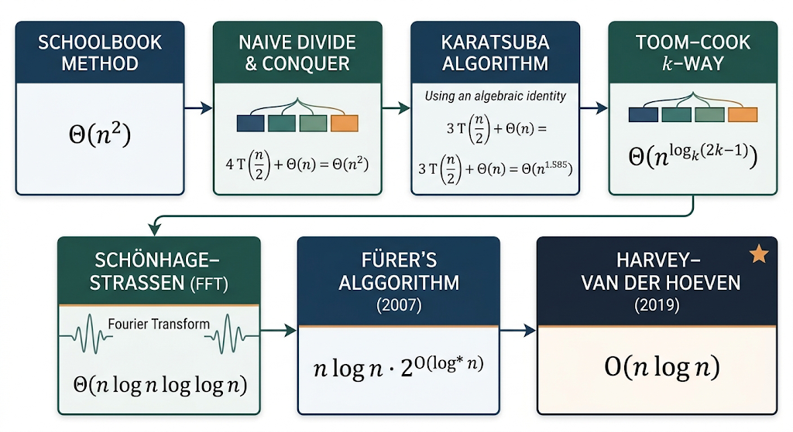
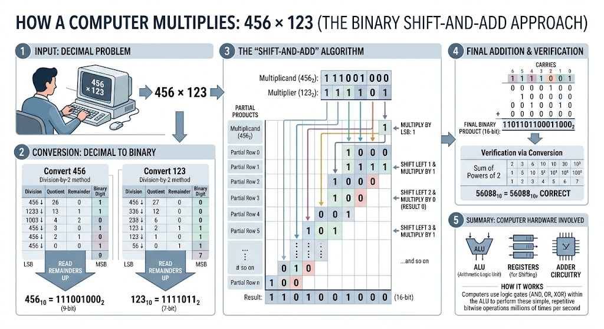
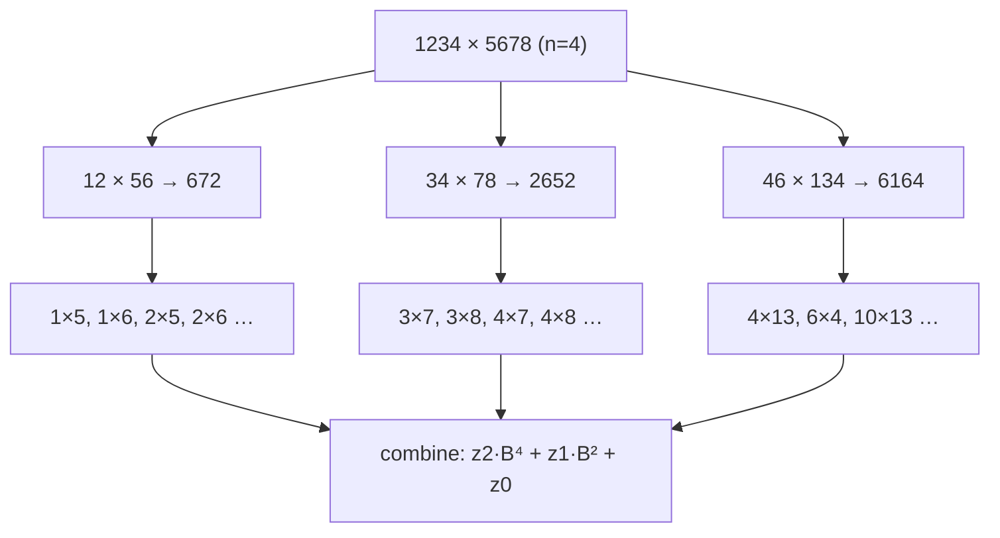

# Integer Multiplication

Integer multiplication is one of the fundamental operations in computer science and mathematics. While multiplying small numbers is not complex, multiplying large integers efficiently is critical in applications such as:

## Motivation and Problem Context

### Why the problem exists at all
On a 64-bit CPU, `a * b` for two `uint64_t` values is a single instruction. So why is there an algorithms problem here?

Because a great deal of computing operates on integers far larger than a machine word:

- **Public-key cryptography.** RSA uses moduli of 2048–4096 bits. Every encryption, decryption, and signature is a modular exponentiation, which is thousands of multiplications of 2048-bit numbers. Elliptic-curve and post-quantum schemes are similar in spirit.
- **Computer algebra systems.** Exact rational arithmetic, Gröbner bases, integer factorisation, and polynomial arithmetic over $\mathbb{Z}$ all multiply integers with thousands to millions of digits.
- **High-precision numerics.** Computing $\pi$ to $10^{14}$ digits, or evaluating special functions to arbitrary precision, is dominated by large-integer multiplication.
- **Cryptanalysis and number theory.** The number field sieve, primality certificates, and BBP-type computations are all bounded by multiplication cost.

In these settings, the *asymptotic* cost of multiplication is the cost of the application.

### Example 
Suppose you must multiply two 10 000-digit decimal numbers. The method taught in primary school multiplies every digit of $x$ by every digit of $y$: $10^8$ digit multiplications. At, generously, $10^9$ digit operations per second, that is a tenth of a second — for **one** multiplication. An RSA-style computation performing thousands of these becomes minutes.

Now ask the question that drives the whole topic:

> Is the "every digit against every digit" work actually *necessary*, or is it an artefact of the method?

For 3 000 years the answer was assumed to be "necessary". In 1960 Karatsuba showed it is not, refuting a conjecture of Kolmogorov that $\Omega(n^2)$ was a lower bound. That refutation is one of the founding results of algorithm analysis.

<figure markdown="span">
    {width="80%"}
    <figcaption>Evoluion of integer Multiplication complexity</figcaption>
    <p align='right' style="font-size:0.8em"><i>Image Source: AI generate(google Gemini)</i></p>
</figure>

### 2. Major Recent Algorithms

**(a) Schoolbook Multiplication**

- Traditional method taught in schools.
- Complexity: **O(n²)**.
- Still used for very small n.

**(b) Karatsuba Multiplication (1960)**

- Divide-and-conquer, split numbers into 2 halves.
- Complexity: **O(n^1.585)**.
- Breakthrough: first sub-quadratic algorithm.

**(c) Toom–Cook Multiplication (1963)**

- Generalization of Karatsuba: split into more than 2 parts.
- Example: **Toom-3** gives **O(n^1.465)**.
- Used in libraries (GMP) for medium-sized numbers.

**(d) Schönhage–Strassen Algorithm (1971)**

- Uses **Fast Fourier Transform (FFT)** in modular arithmetic.
- Complexity: **O(n log n log log n)**.
- Practical for very large integers.
- Standard in big integer libraries for decades.

**(e) Fürer’s Algorithm (2007)**

- Improved Schönhage–Strassen with refined complex FFT usage.
- Complexity: **O(n log n · 2^O(log\* n))**.
- Very close to O(n log n) in practice.

**(f) Harvey–van der Hoeven Algorithm (2019)**

- First algorithm with **true O(n log n)** time complexity.
- Solved a long-standing open problem in computational complexity.
- Still mostly theoretical but groundbreaking.

## Problem Formulation

```text
Input:
    Radix B >= 2 (fixed).
    X = (x_0, x_1, ..., x_{n-1}), 0 <= x_i < B, representing x = sum x_i B^i.
    Y = (y_0, y_1, ..., y_{m-1}), 0 <= y_j < B, representing y = sum y_j B^j.

Output:
    Z = (z_0, ..., z_{n+m-1}), 0 <= z_k < B, representing z = x * y.

Objective:
    Minimise the number of digit operations (add, multiply, compare on
    single digits) as a function of n and m.

Assumptions:
    - Operands are non-negative; signs are handled separately and cost O(1).
    - Digits are stored in an indexable array, so X[i] costs O(1).
    - B is small enough that a single-digit product fits in a machine word.

Edge cases:
    - x = 0 or y = 0            -> result is 0, no leading-zero garbage
    - n != m                    -> algorithms must not assume equal lengths
    - leading zeros in input    -> must be normalised or handled
    - n = 1                     -> must not recurse
```

!!! note "Two cost models, deliberately kept apart"

    - **Bit complexity** (used here): every digit operation is counted. This is the honest model for big integers.
    - **Word-RAM / unit-cost model:** arithmetic on numbers that fit in a word is $O(1)$. This is the right model when values are bounded by a polynomial in the input size, as in sorting or graph algorithms.

    Using the unit-cost model for cryptographic-size integers would make RSA look free, which it is not.

### 4.3.1 Naive Approch to Integer multiplication

The Naive approch of integer multiplication involves multiplying digit by digit, carrying over and adding partial products to arrive at the final answer. If the two numbers have `n` digits each, you perform `n * n` single-digit multiplications.

Example: $456 \times 123 $

Solution : $(456 \times 1)+(456 \times 2)+(456 \times 3) = 56,088$

Example 2:

Multiply 123 × 45 (in base 10):

- 123 × 5 = 615
- 123 × 40 = 4920
- Sum = 5535

This corresponds to digit-by-digit partial products and shifts.

Time complexity = $O(n^2)$



**_Pseudocode_**

```
function naiveMultiply(A[0..n-1], B[0..n-1]):  // digits little-endian (least significant first)
    // result array length up to 2n
    R = array of zeros length 2n
    for i from 0 to n-1:
        carry = 0
        for j from 0 to n-1:
            temp = R[i + j] + A[i] * B[j] + carry
            R[i + j] = temp mod BASE
            carry = floor(temp / BASE)
        R[i + n] += carry
    return normalize(R)  // remove leading zeros
```

### 4.3.2 Karatsuba Algorithm for integer multiplication

Karatsuba’s algorithm reduces the number of multiplications by using divide and conquer. Split each `n`-digit number into two halves (high and low):

Let $m = floor(\frac{n}{2})$. Write

$ X = X_1 \times 10^m + X_0 $

$Y = Y_1 \times 10^m + Y_0$

The straightforward expansion gives four products:

$$
\boxed{X \times Y = (X_1 \cdot Y_1) \cdot 10^{2m} + (X_1 \cdot Y_0 + X_0 \cdot Y_1) \cdot 10^m + X_0 \cdot Y_0}
$$

Naively, that needs 4 multiplications of size \~n/2. Karatsuba avoids computing $X_1*Y_0$ and $X_0*Y_1$ separately by computing:

\[
\begin{align*}
P_1 &= X_1 \cdot Y_1 \\
P_2 &= X_0 \cdot Y_0 \\
P_3 &= (X_1 + X_0)(Y_1 + Y_0) - P_1 - P_2 \quad \text{(equals $X_1Y_0 + X_0Y_1$)} \\
\end{align*}
\]

$$\boxed{X \cdot Y = P_1 \cdot 10^{2m} + P_3\cdot 10^m + P_2}$$

Thus only **3** multiplications of half-size numbers are needed.

```
function karatsubaMultiply(X, Y):
    m = floor(n / 2)
    X1, X0 = split(X, m)
    Y1, Y0 = split(Y, m)

    P1 = karatsubaMultiply(X1, Y1)
    P2 = karatsubaMultiply(X0, Y0)
    P3 = karatsubaMultiply(X1 + X0, Y1 + Y0)

    cross = P3 - P1 - P2
    return P1 * 10^(2m) + cross * 10^m + P2
```

Example:
Multiply $X = 1234$, $Y = 5678$ in base 10:

1.  Split with $m = 2$ (two-digit halves):

    - $X_1 = 12$, $X_0 = 34$ ; $Y_1 = 56$, $Y_0 = 78$

2.  Compute three products (recursively or directly):

    - $P_1 = 12 * 56 = 672$
    - $P_2 = 34 * 78 = 2652$
    - $P_3 = (12 + 34) * (56 + 78) = 46 * 134 = 6164$

3.  $cross = P_3 - P_1 - P_2 = 6164 - 672 - 2652 = 2840$
4.  Recombine:

    - $P_1 * 10^{2m} = 672 * 10^4 = 6,720,000$
    - $cross * 10^m = 2840 * 10^2 = 284,000$
    - $P_2 = 2,652$
    - Sum = $6,720,000 + 284,000 + 2,652 = 7,006,652$

Check: $1234 * 5678 = 7,006,652$

Karatsuba recurrence:

$$
T(n) = 3 T(n/2) + O(n)
$$

Apply the Master Theorem :

- $a = 3$, $b = 2$ → exponent $log_b(a) = log_2 3  ≈ 1.585$.
- Therefore: $T(n) = Θ(n^{log_2 3}) ≈ Θ(n^{1.585})$.

This is asymptotically faster than $Θ(n^2)$ for large $n$.

**Comparison & When to Use Which **

| Aspect                    |         Naïve (schoolbook) |                                           Karatsuba |
| ------------------------- | -------------------------: | --------------------------------------------------: |
| Asymptotic time           |                   $Θ(n^2)$ |                     $Θ(n^{log_2 3}) ≈ Θ(n^{1.585})$ |
| Best for                  | Small to moderate integers |                                      Large integers |
| Implementation complexity |                     Simple | Moderate (careful splitting, carries, thresholding) |

**Rule of thumb:** For very large integers (hundreds to thousands of machine-word limbs), Karatsuba gives measurable speedups. For small sizes, the simple naive algorithm is often faster.

---

#### 3. Complexity Comparison

| Algorithm                  | Year | Complexity                  |
| -------------------------- | ---- | --------------------------- |
| Schoolbook (Naïve)         | –    | O(n²)                       |
| Karatsuba                  | 1960 | O(n^1.585)                  |
| Toom–Cook (Toom-3, Toom-k) | 1963 | O(n^1.465), improves with k |
| Schönhage–Strassen         | 1971 | O(n log n log log n)        |
| Fürer                      | 2007 | O(n log n · 2^O(log\* n))   |
| Harvey–van der Hoeven      | 2019 | O(n log n)                  |


# Integer Multiplication

## Definition

**Informally.** Integer multiplication is the problem of computing the product of two whole numbers that are too large to fit in a machine register, so that the product must be built up digit by digit from the digits of the operands.

**Precisely.** Let $B \ge 2$ be a fixed radix. An integer $x \ge 0$ is represented as a sequence of digits
$$
x = \sum_{i=0}^{n-1} x_i B^i, \qquad 0 \le x_i < B .
$$
Given two such representations, of $n$ and $m$ digits, compute the digit representation of $x \cdot y$, which has $n + m$ or $n + m - 1$ digits.

| Aspect | Content |
| --- | --- |
| Input | Digit sequences of two non-negative integers $x$ (length $n$) and $y$ (length $m$) in radix $B$ |
| Output | The digit sequence of $x \cdot y$ in radix $B$ |
| Cost model | Number of **digit operations** (bit operations when $B = 2$), not number of "multiplications of numbers" |
| Where it fits | The canonical worked example of divide and conquer, and the entry point to the algebraic technique of *evaluation and interpolation* |

!!! warning "The size parameter is the number of digits, not the value"

    Throughout these notes $n$ is the **length of the input**, i.e. roughly $\log_B x$. An algorithm that is $\Theta(n^2)$ is quadratic in the *number of digits* and therefore only polylogarithmic in the *value* of the number. Confusing these two is the single most common error when reasoning about arithmetic complexity — for example, trial division for primality is $O(\sqrt{v})$ in the value $v$, which is $O(2^{n/2})$ in the input length, i.e. exponential.


---

## Core Concepts

### Positional representation as polynomial evaluation

This is the observation the entire topic rests on. If we define the polynomial
$$
X(t) = \sum_{i=0}^{n-1} x_i t^i ,
$$
then the integer $x$ is exactly $X(B)$. Likewise $y = Y(B)$. Therefore
$$
x \cdot y = X(B) \cdot Y(B) = \bigl(X \cdot Y\bigr)(B).
$$

So **multiplying integers is multiplying polynomials, followed by carry propagation**. The coefficients of the product polynomial are the *convolution*
$$
c_k = \sum_{i+j=k} x_i\, y_j ,
$$
and these $c_k$ may exceed $B$, which is exactly what carrying fixes.

!!! tip "The one idea to keep"

    Integer multiplication = polynomial multiplication (a convolution) + carrying.

    Carrying is always $\Theta(n)$ and never the bottleneck. Every improvement in this topic — Karatsuba, Toom–Cook, FFT — is an improvement to the *convolution*, and none of them touches the carrying step.

### Convolution

Given coefficient vectors $(x_i)$ of length $n$ and $(y_j)$ of length $m$, their convolution has length $n+m-1$ with $c_k = \sum_{i+j=k} x_i y_j$. The naive evaluation of all $c_k$ takes $\Theta(nm)$ coefficient multiplications. The whole subject is: **compute a convolution in less than $\Theta(nm)$ work.**

### Carrying (normalisation)

Given raw coefficients $c_0, \dots, c_{n+m-2}$ with $0 \le c_k \le (B-1)^2 \min(n,m)$, normalisation converts them into valid digits:

```text
carry ← 0
FOR k ← 0 TO length(c) - 1
    t ← c[k] + carry
    z[k] ← t mod B
    carry ← floor(t / B)
```

This is $\Theta(n+m)$ digit operations, provided each $c_k$ fits in a machine word — a real constraint discussed under *Common Implementation Pitfalls*.

### Digit shifts are free

Multiplying by $B^m$ shifts the digit array by $m$ positions. In a real implementation this is a memory offset, costing $O(1)$ if you can write into an offset region, or $O(n)$ if you copy. It is **never** a recursive multiplication. Forgetting this and calling the multiplication routine to compute $B^m$ destroys the complexity.

---

## Algorithmic Paradigm

| Algorithm | Paradigm |
| --- | --- |
| Schoolbook | Brute force (direct evaluation of the definition) |
| Karatsuba | Divide and conquer, with an algebraic identity reducing the branching factor |
| Toom–Cook | Divide and conquer via evaluation–interpolation |
| Schönhage–Strassen | Transform and conquer (FFT), i.e. change of representation |

Divide and conquer is appropriate because the problem is **self-similar along the digit axis**: half of a digit string is still a digit string, and multiplying two halves is still integer multiplication. The split is the one listed in the divide-and-conquer notes under "Integers: split the digit string".

The decisive fact, established there, is that in $T(n) = a\,T(n/b) + f(n)$ with $f$ linear, the branching factor $a$ sits in the exponent $\log_b a$. Reducing $a$ from 4 to 3 while keeping $b = 2$ is therefore worth far more than any constant-factor tuning of $f$.

---

## Naive Approach: The Schoolbook Algorithm

### How it works

Compute $x \cdot y = \sum_i x_i B^i \cdot y$. Each term is "one digit of $x$ times all of $y$, shifted". Accumulate the shifted partial products.

### Pseudocode

```text
ALGORITHM SchoolbookMultiply(X, Y, B)

    // X has n digits, Y has m digits, both little-endian (X[0] = least significant)

    n ← length(X)
    m ← length(Y)

    Z ← array of (n + m) zeros

    FOR i ← 0 TO n - 1

        carry ← 0

        FOR j ← 0 TO m - 1
            t       ← Z[i + j] + X[i] * Y[j] + carry
            Z[i + j] ← t mod B
            carry   ← floor(t / B)

        Z[i + m] ← Z[i + m] + carry

    RETURN StripLeadingZeros(Z)
```

!!! note "Why the inner accumulation cannot overflow a double-width word"

    At every point $Z[i+j] \le B-1$, $X[i]\,Y[j] \le (B-1)^2$, and $\textit{carry} \le B-1$. Hence
    $$
    t \le (B-1) + (B-1)^2 + (B-1) = B^2 - 1 .
    $$
    So $t$ always fits in two digits, and the new carry is again at most $B-1$. This is why the standard implementation with a single accumulator of twice the digit width is correct — and why choosing $B = 2^{64}$ on a 64-bit machine requires either a 128-bit type or hardware `mulhi`.

### Step-by-step execution

$x = 1234$, $y = 5678$, $B = 10$, digits little-endian $X = (4,3,2,1)$, $Y = (8,7,6,5)$.

| $i$ | Digit $x_i$ | Partial product $x_i \cdot y$ | Shifted by $10^i$ | Running total |
| --- | --- | --- | --- | --- |
| 0 | 4 | 22 712 | 22 712 | 22 712 |
| 1 | 3 | 17 034 | 170 340 | 193 052 |
| 2 | 2 | 11 356 | 1 135 600 | 1 328 652 |
| 3 | 1 | 5 678 | 5 678 000 | 7 006 652 |

Result: $1234 \times 5678 = 7\,006\,652$.

### Correctness by loop invariant

Let $X^{(i)} = \sum_{k=0}^{i-1} x_k B^k$ denote the value formed by the lowest $i$ digits of $x$.

**Invariant.** Before the outer iteration with index $i$, the array $Z$ (read as a number) equals $X^{(i)} \cdot y$.

- **Initialization.** Before $i = 0$: $X^{(0)} = 0$ and $Z$ is all zeros, so $Z = 0 = 0 \cdot y$. True.
- **Maintenance.** Iteration $i$ adds $x_i \cdot y \cdot B^i$ to $Z$: the inner loop adds $x_i y_j B^{i+j}$ for every $j$, with carries propagated so the array still holds a valid radix-$B$ representation of the same value. Hence the new $Z$ equals $X^{(i)}y + x_i y B^i = X^{(i+1)} y$. Invariant preserved.
- **Termination.** The loop ends with $i = n$, so $Z = X^{(n)} \cdot y = x \cdot y$. Correct.

### Complexity

- The inner loop body is $\Theta(1)$ digit operations and executes exactly $nm$ times.
- Carry fixups add $\Theta(n)$.

$$
T_{\text{school}}(n, m) = \Theta(nm), \qquad T_{\text{school}}(n) = \Theta(n^2) \text{ when } n = m .
$$

Space: $\Theta(n+m)$ for the output, $\Theta(1)$ auxiliary.

### The bottleneck

Every one of the $nm$ digit products $x_i y_j$ is computed explicitly. But the output has only $n+m$ digits. We are computing $\Theta(n^2)$ quantities to produce $\Theta(n)$ digits — a strong hint that the products carry redundant information and need not all be formed.

!!! tip "The bottleneck question"

    > The answer has $2n$ digits. Why am I doing $n^2$ units of work to produce it?

    Whenever the output is asymptotically smaller than the intermediate quantities you compute, look for an identity that produces the output from fewer of them. This is exactly the reasoning behind Strassen's algorithm for matrices.

---

## First Attempt at Divide and Conquer (and why it fails)

Split each $n$-digit operand at the midpoint $m = \lfloor n/2 \rfloor$:
$$
x = x_1 B^{m} + x_0, \qquad y = y_1 B^{m} + y_0,
$$
where $x_0, y_0$ are the low $m$ digits and $x_1, y_1$ the high $n-m$ digits. Then
$$
x y = x_1 y_1 B^{2m} + (x_1 y_0 + x_0 y_1) B^{m} + x_0 y_0 .
$$

This needs **four** half-size products: $x_1y_1$, $x_1y_0$, $x_0y_1$, $x_0y_0$. The additions and shifts are $\Theta(n)$. So
$$
T(n) = 4\,T(n/2) + \Theta(n).
$$

By the Master Theorem, $\alpha = \log_2 4 = 2$ and $f(n) = \Theta(n) = O(n^{2-\varepsilon})$: Case 1, leaf-dominated, giving
$$
T(n) = \Theta(n^{\log_2 4}) = \Theta(n^2).
$$

**No improvement.** This is the important negative result: divide and conquer by itself buys nothing here. It merely reorganises the same $n^2$ digit products.

!!! danger "Recursion is not a speed-up"

    Splitting a problem in half does not make it faster. What makes it faster is solving *fewer* subproblems than the naive decomposition suggests. If $a = b^{\,d}$ where $\Theta(n^d)$ is the naive cost, the recursion reproduces the naive complexity exactly.

---

## Karatsuba's Algorithm

### The key observation

We need the three quantities
$$
z_2 = x_1 y_1, \qquad z_1 = x_1 y_0 + x_0 y_1, \qquad z_0 = x_0 y_0 .
$$

Note that $z_1$ is not needed as two separate products — only their **sum** is needed. And there is an identity producing that sum from a single extra product:
$$
(x_1 + x_0)(y_1 + y_0) = \underbrace{x_1 y_1}_{z_2} + \underbrace{x_1 y_0 + x_0 y_1}_{z_1} + \underbrace{x_0 y_0}_{z_0}.
$$

Therefore
$$
\boxed{\;z_1 = (x_1 + x_0)(y_1 + y_0) - z_2 - z_0\;}
$$

We already have $z_2$ and $z_0$, so the middle coefficient costs **one** multiplication plus two subtractions, instead of two multiplications. Three half-size products in total.

!!! tip "If you had to invent this yourself"

    The reasoning is: *"the two cross-products always appear added together, never separately. Is there a single product whose expansion contains that sum, together with things I already know?"* Expanding $(x_1+x_0)(y_1+y_0)$ answers yes. This is the same move as Strassen's on matrices: buy one multiplication, pay in additions.

### Evaluation–interpolation view (the deeper reason)

Write $X(t) = x_1 t + x_0$ and $Y(t) = y_1 t + y_0$, so $x = X(B)$, $y = Y(B)$. Their product
$$
P(t) = X(t)Y(t) = z_2 t^2 + z_1 t + z_0
$$
is a quadratic, so it is determined by its values at **three** points. Karatsuba evaluates at $t = 0, 1, \infty$:

| Point | $X$ | $Y$ | $P$ |
| --- | --- | --- | --- |
| $t = 0$ | $x_0$ | $y_0$ | $z_0$ |
| $t = 1$ | $x_1+x_0$ | $y_1+y_0$ | $z_2+z_1+z_0$ |
| $t = \infty$ (leading coefficient) | $x_1$ | $y_1$ | $z_2$ |

Interpolation recovers $z_1 = P(1) - P(\infty) - P(0)$, which is exactly the identity above. Seen this way, Karatsuba is the $k=2$ member of an infinite family, and the FFT is the limiting case where the evaluation points are roots of unity.

### Algorithm

```text
ALGORITHM Karatsuba(x, y)

    // x, y are non-negative integers in radix-B digit form
    // n is the number of digits of the longer operand

    n ← max(digits(x), digits(y))

    IF n ≤ CUTOFF
        RETURN SchoolbookMultiply(x, y)

    m ← floor(n / 2)

    x1 ← floor(x / B^m)          // high part   (digit shift, Θ(n))
    x0 ← x mod B^m               // low  part   (digit mask,  Θ(n))
    y1 ← floor(y / B^m)
    y0 ← y mod B^m

    z2 ← Karatsuba(x1, y1)
    z0 ← Karatsuba(x0, y0)
    z1 ← Karatsuba(x1 + x0, y1 + y0) - z2 - z0

    RETURN z2 * B^(2m) + z1 * B^m + z0     // shifts and adds, Θ(n)
```

!!! warning "The sums may be one digit longer"

    $x_1 + x_0$ can require $m+1$ digits. The third recursive call therefore runs on operands of length up to $\lceil n/2 \rceil + 1$, not exactly $n/2$. This does **not** change the asymptotics (the recurrence $T(n) \le 3T(n/2 + 1) + cn$ still solves to $\Theta(n^{\log_2 3})$), but a fixed-width buffer implementation that ignores the extra digit is silently wrong. Production libraries either allocate the extra limb or use a signed variant such as
    $$
    z_1 = z_2 + z_0 - (x_1 - x_0)(y_1 - y_0),
    $$
    where the operands stay within $m$ digits but a sign must be tracked.

### Step-by-step execution

$x = 1234$, $y = 5678$, $B = 10$, $n = 4$, $m = 2$.

| Quantity | Value |
| --- | --- |
| $x_1, x_0$ | $12,\; 34$ |
| $y_1, y_0$ | $56,\; 78$ |
| $z_2 = x_1 y_1$ | $12 \times 56 = 672$ |
| $z_0 = x_0 y_0$ | $34 \times 78 = 2652$ |
| $x_1 + x_0$, $y_1 + y_0$ | $46,\; 134$ |
| $(x_1+x_0)(y_1+y_0)$ | $46 \times 134 = 6164$ |
| $z_1 = 6164 - 672 - 2652$ | $2840$ |
| Assemble | $672 \cdot 10^4 + 2840 \cdot 10^2 + 2652$ |
| Result | $6\,720\,000 + 284\,000 + 2\,652 = 7\,006\,652$ |

Three 2-digit products were used where the schoolbook method used sixteen 1-digit products. (At this size the schoolbook method is of course faster in wall-clock terms; the point is the count of *recursive* products.)

### Recursion structure



The branching factor is 3, not 4 — that single missing branch is the entire algorithm.

---

## Correctness of Karatsuba

**Claim.** For all non-negative integers $x, y$, `Karatsuba(x, y)` returns $x \cdot y$.

**Proof by strong induction on $n = \max(\text{digits}(x), \text{digits}(y))$.**

*Base case.* For $n \le \text{CUTOFF}$ the algorithm calls `SchoolbookMultiply`, proved correct above by its loop invariant.

*Inductive hypothesis.* Assume the algorithm is correct for all inputs with fewer than $n$ digits.

*Inductive step.* Let $m = \lfloor n/2 \rfloor \ge 1$ (guaranteed since $n > \text{CUTOFF} \ge 2$). By the division algorithm there exist unique $x_1, x_0$ with
$$
x = x_1 B^m + x_0, \quad 0 \le x_0 < B^m,
$$
and these are exactly what the digit split computes; similarly for $y$. Each of $x_1, x_0, y_1, y_0$ has at most $\max(m,\, n-m) < n$ digits, and $x_1+x_0$, $y_1+y_0$ have at most $\lceil n/2\rceil + 1 < n$ digits (using $n > \text{CUTOFF} \ge 4$). So all three recursive calls receive strictly smaller instances, and by the inductive hypothesis return
$$
z_2 = x_1y_1, \quad z_0 = x_0y_0, \quad z_1 = (x_1+x_0)(y_1+y_0) - z_2 - z_0 .
$$
Expanding the last expression algebraically:
$$
z_1 = x_1y_1 + x_1y_0 + x_0y_1 + x_0y_0 - x_1y_1 - x_0y_0 = x_1y_0 + x_0y_1 .
$$
Therefore the returned value is
$$
z_2 B^{2m} + z_1 B^m + z_0 = x_1y_1B^{2m} + (x_1y_0 + x_0y_1)B^m + x_0y_0 = (x_1B^m + x_0)(y_1B^m + y_0) = xy .
$$

*Termination.* Every recursive call strictly decreases $n$ (since $m \ge 1$ and $\lceil n/2\rceil + 1 < n$ for $n \ge 4$), and the base case catches $n \le \text{CUTOFF}$. Hence the recursion is finite. $\blacksquare$

!!! danger "Where the termination argument actually bites"

    $\lceil n/2 \rceil + 1 < n$ fails for $n = 2$ and $n = 3$. If `CUTOFF` were set to 1, the third recursive call could receive an operand as long as the original, and the recursion would not terminate. **`CUTOFF` must be at least 3–4 for correctness, quite apart from performance.** This is a real bug that appears in student implementations.

---

## Analysis of Karatsuba

### Deriving the recurrence

Read it directly off the pseudocode.

1. **Recursive calls:** exactly 3, each on operands of about $n/2$ digits. So $a = 3$, $b = 2$.
2. **Non-recursive work:**
   - splitting: two digit shifts and two masks, $\Theta(n)$ (or $\Theta(1)$ with index views);
   - forming $x_1+x_0$ and $y_1+y_0$: $\Theta(n)$;
   - two subtractions to get $z_1$: $\Theta(n)$;
   - final shifts and two additions: $\Theta(n)$.
   Total $f(n) = \Theta(n)$.
3. **Base case:** $T(n) = \Theta(1)$ for $n \le \text{CUTOFF}$.

$$
\boxed{\,T(n) = 3\,T(n/2) + \Theta(n), \qquad T(1) = \Theta(1).}
$$

### Solving by the Master Theorem

With $a = 3$, $b = 2$:
$$
\alpha = \log_b a = \log_2 3 = 1.5849625\ldots
$$
Compare $f(n) = \Theta(n) = \Theta(n^1)$ with $n^{\alpha} = n^{1.585}$. Since $1 < \alpha - \varepsilon$ for e.g. $\varepsilon = 0.5$, we have $f(n) = O(n^{\alpha - \varepsilon})$: **Case 1, leaf-dominated**, so
$$
T(n) = \Theta\!\left(n^{\log_2 3}\right) = \Theta\!\left(n^{1.585}\right).
$$

### Solving by recursion tree (to see why)

At depth $i$ there are $3^i$ subproblems, each of size $n/2^i$, each doing $c\,(n/2^i)$ non-recursive work:

$$
T(n) \;=\; \sum_{i=0}^{L-1} 3^i \cdot c\,\frac{n}{2^i} \;+\; 3^{L}\,T(1),
\qquad L = \log_2 n .
$$

The sum is geometric with ratio $3/2 > 1$:
$$
cn\sum_{i=0}^{L-1}\left(\frac32\right)^i
= cn\cdot\frac{(3/2)^L - 1}{3/2 - 1}
= 2cn\left[(3/2)^{\log_2 n} - 1\right].
$$
Now
$$
(3/2)^{\log_2 n} = n^{\log_2(3/2)} = n^{\log_2 3 - 1},
$$
so the internal-node work is
$$
2cn\left(n^{\log_2 3 - 1} - 1\right) = 2c\left(n^{\log_2 3} - n\right).
$$
The leaf work is $3^{\log_2 n}\,T(1) = n^{\log_2 3}\,T(1)$. Adding,
$$
T(n) = \Theta\!\left(n^{\log_2 3}\right) - \Theta(n) = \Theta\!\left(n^{1.585}\right).
$$

!!! tip "What the ratio $3/2$ tells you"

    Each level down multiplies the total work by $3/2$, so the bottom level dominates and the cost is essentially the **number of leaves**. Change the 3 to a 4 and the ratio becomes 2, giving $\Theta(n^2)$ — the naive split. Change it to a 2 and the ratio becomes 1, giving $\Theta(n\log n)$, all levels equal. The number of recursive multiplications is the *only* thing in the exponent.

### Work per level

| Level $i$ | Subproblems | Size | Work at level | Ratio to previous |
| --- | --- | --- | --- | --- |
| 0 | $1$ | $n$ | $cn$ | — |
| 1 | $3$ | $n/2$ | $1.5\,cn$ | $3/2$ |
| 2 | $9$ | $n/4$ | $2.25\,cn$ | $3/2$ |
| $i$ | $3^i$ | $n/2^i$ | $(3/2)^i cn$ | $3/2$ |
| $\log_2 n$ | $n^{1.585}$ | $1$ | $\Theta(n^{1.585})$ | — |

### Space complexity

- **Recursion depth:** $\Theta(\log n)$.
- **Temporaries per frame:** $\Theta(n)$ at the top frame, $\Theta(n/2^i)$ at depth $i$.
- **Total auxiliary space along one root-to-leaf path:** $\sum_i \Theta(n/2^i) = \Theta(n)$.

So $S(n) = \Theta(n)$ auxiliary if temporaries are freed on return (only one child is live at a time in a sequential implementation). A careless implementation that allocates all children's buffers before recursing uses $\Theta(n \log n)$ or worse.

### How big is the win, really?

| $n$ (digits) | $n^2$ | $n^{1.585}$ | Ratio |
| --- | --- | --- | --- |
| $10$ | $10^2$ | $38$ | 2.6× |
| $10^2$ | $10^4$ | $1.5\times10^3$ | 6.6× |
| $10^3$ | $10^6$ | $5.7\times10^4$ | 17× |
| $10^4$ | $10^8$ | $2.2\times10^6$ | 46× |
| $10^6$ | $10^{12}$ | $3.2\times10^9$ | 313× |

!!! warning "The constants are worse"

    Karatsuba replaces one multiplication with several additions, subtractions, and extra memory traffic per level. The constant factor $c$ in $\Theta(n^{1.585})$ is substantially larger than in $\Theta(n^2)$, so the crossover is not at $n = 1$. See *Performance Considerations*.

---

## Python Implementation

```python
"""Integer multiplication: schoolbook and Karatsuba.

Two implementations are given.

1. `schoolbook_digits` works on explicit little-endian digit lists in radix
   BASE. It mirrors the pseudocode exactly and makes the Theta(n^2) digit
   operations visible.

2. `karatsuba` works on Python ints but splits them with *bit shifts*, which
   are genuine O(n) operations. The only multiplications performed are on
   operands of at most CUTOFF bits, which fit in a machine word and are
   therefore legitimately O(1).
"""

BASE = 10_000          # one "digit" holds 4 decimal digits
CUTOFF = 32            # bits; must be >= 4 for the recursion to terminate


# --------------------------------------------------------------------------
# Schoolbook, on digit lists
# --------------------------------------------------------------------------

def to_digits(value: int, base: int = BASE) -> list[int]:
    """Little-endian radix-`base` digits of a non-negative integer."""
    if value == 0:
        return [0]
    digits = []
    while value:
        digits.append(value % base)
        value //= base
    return digits


def from_digits(digits: list[int], base: int = BASE) -> int:
    total = 0
    for digit in reversed(digits):        # Horner, O(n) digit operations
        total = total * base + digit
    return total


def schoolbook_digits(x: list[int], y: list[int], base: int = BASE) -> list[int]:
    """Classical algorithm. Theta(len(x) * len(y)) digit operations."""
    n, m = len(x), len(y)
    z = [0] * (n + m)

    for i in range(n):
        carry = 0
        for j in range(m):
            t = z[i + j] + x[i] * y[j] + carry
            z[i + j] = t % base
            carry = t // base
        z[i + m] += carry

    while len(z) > 1 and z[-1] == 0:      # strip leading zeros
        z.pop()
    return z


def schoolbook(x: int, y: int) -> int:
    return from_digits(schoolbook_digits(to_digits(x), to_digits(y)))


# --------------------------------------------------------------------------
# Karatsuba, splitting on bits
# --------------------------------------------------------------------------

def karatsuba(x: int, y: int) -> int:
    """Multiply two non-negative integers in Theta(n^log2(3)) bit operations."""
    if x == 0 or y == 0:
        return 0

    n = max(x.bit_length(), y.bit_length())
    if n <= CUTOFF:
        return x * y                       # single machine-word multiply

    m = n // 2
    mask = (1 << m) - 1

    x1, x0 = x >> m, x & mask              # x = x1 * 2^m + x0
    y1, y0 = y >> m, y & mask

    z2 = karatsuba(x1, y1)
    z0 = karatsuba(x0, y0)
    z1 = karatsuba(x1 + x0, y1 + y0) - z2 - z0

    return (z2 << (2 * m)) + (z1 << m) + z0


def multiply(x: int, y: int) -> int:
    """Sign-aware wrapper."""
    sign = -1 if (x < 0) != (y < 0) else 1
    return sign * karatsuba(abs(x), abs(y))


# --------------------------------------------------------------------------
# Example usage
# --------------------------------------------------------------------------

if __name__ == "__main__":
    print(schoolbook(1234, 5678))          # 7006652
    print(karatsuba(1234, 5678))           # 7006652
    print(multiply(-1234, 5678))           # -7006652

    a = 3 ** 5000
    b = 7 ** 5000
    assert karatsuba(a, b) == a * b
    print("large product verified:", (a * b).bit_length(), "bits")
```

### Code walkthrough

| Pseudocode line | Python | Why it is written this way |
| --- | --- | --- |
| `n ← max(digits(x), digits(y))` | `n = max(x.bit_length(), y.bit_length())` | Radix 2 makes the split a shift and mask, both honestly $\Theta(n)$ |
| `IF n ≤ CUTOFF` | `if n <= CUTOFF: return x * y` | At $\le 32$ bits the product fits in a 64-bit word; this is the $O(1)$ base case |
| `x1 ← floor(x / B^m)` | `x >> m` | A shift, **not** a division routine. Using `x // (2**m)` would first compute $2^m$ — an $\Theta(n)$ allocation, still fine, but `>>` states the intent |
| `x0 ← x mod B^m` | `x & mask` | Bit mask, $\Theta(n)$ |
| three recursive calls | `karatsuba(...)` ×3 | The whole point: three, not four |
| `z1 ← ... - z2 - z0` | same | Subtraction on big ints is $\Theta(n)$, never recursive |
| `RETURN z2·B^{2m} + z1·B^m + z0` | `(z2 << 2*m) + (z1 << m) + z0` | Shifts and adds, $\Theta(n)$ |

!!! warning "This implementation is a teaching device, not a fast one"

    Python's built-in `int.__mul__` already switches from schoolbook to Karatsuba above a threshold (CPython's `KARATSUBA_CUTOFF`, 70 internal 30-bit digits, roughly 630 decimal digits) and runs in C. The code above will therefore be **slower** than `x * y` at every size. Its purpose is to make the recursion, the three calls, and the identity visible.

### Empirically checking the exponent

```python
import time

def timed(fn, bits):
    x = (1 << bits) - 3
    y = (1 << bits) - 7
    start = time.perf_counter()
    fn(x, y)
    return time.perf_counter() - start

for bits in (2_000, 4_000, 8_000, 16_000):
    t = timed(karatsuba, bits)
    print(f"{bits:6d} bits: {t:.4f}s")
```

Doubling the input size should multiply the time by roughly $2^{1.585} \approx 3.0$, not $2^2 = 4$. Measuring this ratio across several sizes is the practical way to confirm that an implementation really achieves the claimed exponent — a common student implementation that accidentally makes four recursive calls, or that recomputes $B^m$ by multiplication, shows a ratio near 4 instead.

---

## Beyond Karatsuba

### Toom–Cook (Toom-$k$)

Generalise the evaluation–interpolation view. Split each operand into $k$ parts, so $X(t)$ and $Y(t)$ have degree $k-1$ and the product has degree $2k-2$, requiring $2k-1$ evaluation points. Multiply pointwise ($2k-1$ recursive products of size $n/k$), then interpolate.

$$
T(n) = (2k-1)\,T(n/k) + \Theta(n) \;\Longrightarrow\; T(n) = \Theta\!\left(n^{\log_k (2k-1)}\right).
$$

| $k$ | Name | Products | Exponent $\log_k(2k-1)$ |
| --- | --- | --- | --- |
| 2 | Karatsuba (Toom-2) | 3 | $1.585$ |
| 3 | Toom-3 | 5 | $1.465$ |
| 4 | Toom-4 | 7 | $1.404$ |
| 5 | Toom-5 | 9 | $1.365$ |
| $k \to \infty$ | — | $2k-1$ | $\to 1$ |

The exponent tends to 1 as $k$ grows, but the interpolation step's constant factor grows roughly like $k^2$ (it is a fixed linear solve on a $(2k-1)\times(2k-1)$ Vandermonde system, with divisions by small constants). So each Toom level is only worth using above its own crossover, and libraries stack them.

!!! note "Toom-$k$ is not a limiting argument for $\Theta(n)$"

    One cannot let $k$ grow with $n$ and conclude linear time: the hidden constant depends on $k$, and the interpolation coefficients grow. Making $k$ depend on $n$ properly is essentially what the FFT does, and it lands at $n\log n$, not $n$.

### Schönhage–Strassen (1971)

Take the evaluation points to be $2N$-th roots of unity, so evaluation and interpolation are a Fast Fourier Transform, each costing $\Theta(N \log N)$ ring operations rather than $\Theta(N^2)$.

- Work in the ring $\mathbb{Z}/(2^{K}+1)\mathbb{Z}$, where $2$ is a root of unity of known order, so the "twiddle factor" multiplications are bit shifts and cost nothing.
- Pointwise multiplication is $2N$ products of $\Theta(n/N)$-bit numbers — recursively multiplied by the same algorithm.

$$
T(n) = \Theta(n \log n \log\log n).
$$

The $\log\log n$ is the depth of that recursion. This is the algorithm GMP uses for very large operands.

### Fürer (2007)

Replaced the recursive structure with one using rings that admit "fast" roots of unity more efficiently, obtaining
$$
T(n) = n \log n \cdot 2^{O(\log^* n)},
$$
where $\log^* n$ is the iterated logarithm (at most 5 for any $n$ of physical interest). The bound is asymptotically better than Schönhage–Strassen, but the crossover is astronomically large.

### Harvey and van der Hoeven (2019, published 2021)

$$
T(n) = O(n \log n)
$$
bit operations on a multitape Turing machine — matching the bound conjectured by Schönhage and Strassen in 1971 to be optimal. The construction uses multidimensional FFTs over carefully chosen number-theoretic rings.

!!! info "Galactic, but conceptually decisive"

    The Harvey–van der Hoeven algorithm is a *galactic algorithm*: the authors' analysis only beats Schönhage–Strassen for inputs larger than roughly $2^{1729^{12}}$ bits, vastly more than the number of particles in the observable universe. Nobody will ever run it. Its importance is that it closes a 50-year gap and shows $O(n\log n)$ is achievable.

    A matching **unconditional** lower bound $\Omega(n \log n)$ is *not* known for general models of computation. Such bounds are known only in restricted settings (for example, online multiplication on multitape Turing machines). Whether multiplication can be done in $o(n\log n)$ remains open.

### Comparison

| Algorithm | Year | Recurrence / method | Time | Practical range (typical, radix $2^{64}$ limbs) |
| --- | --- | --- | --- | --- |
| Schoolbook | ancient | direct convolution | $\Theta(n^2)$ | up to a few tens of limbs |
| Karatsuba (Toom-2) | 1960 | $3T(n/2)+\Theta(n)$ | $\Theta(n^{1.585})$ | tens to low hundreds of limbs |
| Toom-3 | 1963/66 | $5T(n/3)+\Theta(n)$ | $\Theta(n^{1.465})$ | hundreds of limbs |
| Toom-4 and higher | — | $(2k-1)T(n/k)+\Theta(n)$ | $\Theta(n^{\log_k(2k-1)})$ | low thousands of limbs |
| Schönhage–Strassen | 1971 | recursive FFT over $\mathbb{Z}/(2^K+1)$ | $\Theta(n\log n\log\log n)$ | above roughly tens of thousands of limbs |
| Fürer | 2007 | FFT with fast roots of unity | $n\log n\,2^{O(\log^* n)}$ | never |
| Harvey–van der Hoeven | 2019 | multidimensional FFT | $O(n\log n)$ | never |

!!! note "Exact thresholds are machine-specific"

    Libraries such as GMP *tune* these crossovers per architecture at build time rather than hard-coding them, because they depend on cache sizes, multiplier latency, and memory bandwidth. Treat the ranges above as orders of magnitude, not constants to memorise.

---

## Trade-Off Analysis

| Trade-off | How it appears here |
| --- | --- |
| Asymptotics vs constants | Karatsuba wins asymptotically and loses below the crossover; the *correct* algorithm is the hybrid, not either one |
| Multiplications vs additions | Karatsuba buys one product with several additions. Valid because a product on $n$ digits costs superlinearly while an addition costs $\Theta(n)$ |
| Time vs space | Schoolbook needs $\Theta(1)$ auxiliary space; Karatsuba needs $\Theta(n)$ temporaries and $\Theta(\log n)$ stack |
| Simplicity vs performance | Schoolbook is 10 lines and provably correct at a glance; a tuned Toom–FFT stack is thousands of lines and needs an extensive test suite |
| Cache behaviour vs operation count | Schoolbook is a tight streaming loop with excellent locality; recursive splitting fragments memory access, which is part of why crossovers are as high as they are |
| Generality vs specialisation | Modular arithmetic (RSA, ECC) can fuse reduction into multiplication (Montgomery, Barrett), beating a generic multiply-then-reduce |
| Exactness | Every algorithm here is exact. Floating-point FFT variants are *not* automatically exact and require careful error bounds or number-theoretic transforms |

---

## Levels of Understanding

### Beginner

You should be able to:

- State that $n$ is the number of digits, not the value.
- Trace the schoolbook algorithm on two 4-digit numbers and produce the carry sequence.
- Write down the split $x = x_1B^m + x_0$ and the four-product expansion.
- State Karatsuba's identity and apply it by hand to a 4-digit example.
- Write the recurrence $T(n) = 3T(n/2)+\Theta(n)$ and solve it with the Master Theorem.

### Intermediate

You should be able to:

- Explain why $4T(n/2)+\Theta(n)$ gives no improvement, and what that says about divide and conquer generally.
- Derive $\Theta(n^{\log_2 3})$ by recursion tree, not just by quoting the Master Theorem.
- Handle unequal operand lengths and odd $n$ correctly.
- Explain why `CUTOFF` must be at least 3–4 for *correctness*, not merely for speed.
- Explain why $x_1+x_0$ may need $m+1$ digits and what breaks if you ignore it.
- Estimate where the crossover with schoolbook lies and justify why it is not at $n=2$.

### Advanced

You should be able to:

- Present Karatsuba as evaluation at $\{0,1,\infty\}$ and derive Toom-3 by choosing $\{0,1,-1,2,\infty\}$, including the interpolation matrix.
- Derive $\Theta(n^{\log_k(2k-1)})$ and explain why letting $k \to \infty$ does not give linear time.
- Explain why an FFT gives $\Theta(n\log n)$ *ring* operations and why converting that into a bit-complexity bound requires care (coefficient growth, precision, recursive pointwise multiplication).
- Explain why the Schönhage–Strassen ring $\mathbb{Z}/(2^K+1)\mathbb{Z}$ is chosen: $2$ has small order there, so roots of unity are shifts.
- Discuss what changes if the assumptions change: negative operands, unbalanced operands ($n \gg m$), squaring (where $x_1y_0 = x_0y_1$ and the cross term is free — a real 25–30% saving), modular arithmetic, or a hardware multiplier with high latency.

### Interview and competitive programming

The pattern to recognise is **convolution**, and the transferable insight is that Karatsuba and NTT apply to *polynomials* just as much as to integers.

- Multiplying two polynomials of degree $n$: same recurrence, same exponent; typically NTT is used for $n \ge 10^5$.
- Counting pairs with a given sum in a multiset: a convolution of frequency arrays.
- "Big integer" problems in languages without built-in bignums (C++, Java's `BigInteger` aside) reduce to implementing this.
- Bitset or subset-sum convolution problems: the same "reduce the number of subproblems by an identity" thinking.
- Fast exponentiation of large numbers: cost is $\Theta(\log e)$ multiplications, so the multiplication algorithm's exponent is what dominates.

!!! tip "Recognition cue"

    If you see $\sum_{i+j=k} a_i b_j$, or any "for all pairs summing to $k$" structure, you are looking at a convolution, and the whole toolkit of this topic applies.

---

## Edge Cases

| Case | What must happen |
| --- | --- |
| $x = 0$ or $y = 0$ | Return a single zero digit; no leading-zero array |
| $n = 1$ or $m = 1$ | Must be caught by the base case, never recursed on |
| Unequal lengths $n \ne m$ | Split at $\lfloor \max(n,m)/2 \rfloor$; the shorter operand may have an empty high part ($x_1 = 0$) — that is legal, not an error |
| Very unbalanced, $n \gg m$ | Karatsuba degrades; split $x$ into $\lceil n/m \rceil$ blocks of $m$ digits and multiply block-wise ("divide and conquer on the long operand") |
| $x_1 + x_0$ carries into digit $m+1$ | Allocate the extra limb, or use the signed $(x_1-x_0)(y_1-y_0)$ variant |
| Both operands equal (squaring) | Detect it: only two distinct products are needed since the cross terms coincide |
| Leading zeros in input | Normalise on entry; otherwise $n$ is overstated and the recursion does needless work |
| Negative operands | Strip signs, multiply magnitudes, reapply sign. Never let a negative value flow into the digit routines |
| Powers of the radix | $B^k \cdot y$ is a shift; a good library special-cases it |

---

## Common Implementation Pitfalls

- **Computing $B^m$ by multiplication.** Writing `x // (B ** m)` inside the recursion turns a shift into an arithmetic operation; worse, if `B ** m` is computed by repeated calls to your own multiply routine, the complexity blows up entirely. Use shifts.
- **`CUTOFF` too small.** Below 4, the third recursive call may not shrink the input and the recursion never terminates.
- **Ignoring the extra digit in $x_1+x_0$.** Silent truncation, producing wrong answers only for certain inputs — the worst kind of bug, since small random tests may pass.
- **Overflow in the schoolbook inner loop.** `Z[i+j] + X[i]*Y[j] + carry` needs a type twice as wide as a digit. With $B = 2^{32}$ and 64-bit accumulators this is fine; with $B = 2^{64}$ it is not, and requires 128-bit arithmetic or a high-multiply intrinsic.
- **Off-by-one in the result length.** The product of an $n$-digit and an $m$-digit number has $n+m$ or $n+m-1$ digits. Allocating $n+m-1$ loses the top digit; allocating $n+m$ and forgetting to strip leading zeros breaks equality comparisons later.
- **Not stripping leading zeros.** Two representations of the same number then compare unequal, and $n$ is overstated in subsequent operations.
- **Recomputing lengths inside the recursion.** Calling `bit_length()` or scanning for the top nonzero digit at every level adds a $\Theta(n)$ factor if done carelessly — pass lengths down.
- **Allocating fresh buffers at every recursive call.** Allocation dominates for small subproblems. Production code uses a single scratch arena passed down by pointer.
- **Assuming both operands are the same length.** Real inputs are not padded for you, and padding to the next power of two can double the work.

---

## Common Conceptual Mistakes

!!! warning "Misconceptions to unlearn"

    - **"Karatsuba is 25% faster because it uses 3 multiplications instead of 4."** No: the saving compounds at every level of recursion. The effect is a change of *exponent*, from $n^2$ to $n^{1.585}$, which is unboundedly better — and at small $n$ the extra additions actually make it *slower*.
    - **"Divide and conquer always speeds things up."** The $4T(n/2)+\Theta(n)$ version is $\Theta(n^2)$, identical to schoolbook, with worse constants. Splitting is not the source of the improvement; reducing $a$ is.
    - **"Multiplication is $O(1)$."** True for fixed-width machine integers in the word-RAM model; false for the arbitrary-precision integers in cryptography and computer algebra. Know which model you are in.
    - **"$n$ is the number being multiplied."** $n$ is its length. An algorithm "linear in $n$" is *logarithmic* in the value.
    - **"$O(n\log n)$ multiplication means big-integer arithmetic is now fast."** The Harvey–van der Hoeven algorithm is unusable in practice; real libraries still run Schönhage–Strassen or NTT.
    - **"Toom-$k$ with large $k$ is best."** The hidden constant grows with $k$; each variant has its own crossover.
    - **"Karatsuba is only about integers."** It works verbatim on polynomials over any commutative ring — and the polynomial case is often the one that appears in competitive programming.
    - **"FFT-based multiplication is approximate."** Floating-point FFT requires error analysis, but number-theoretic transforms over finite fields are exact.

---

## Important Properties and Invariants

| Property | Statement | Why it matters |
| --- | --- | --- |
| Distributivity | $(x_1B^m+x_0)(y_1B^m+y_0)$ expands into four terms | Justifies the split at all |
| Commutativity of digits | $x_iy_j = y_jx_i$ | Karatsuba's identity uses commutativity; unlike Strassen's, which does not, so Karatsuba does **not** transfer to non-commutative rings such as matrices in the same form |
| Degree bound | $\deg(XY) = \deg X + \deg Y$, so $2k-1$ points determine the product of two degree-$(k-1)$ polynomials | Foundation of Toom–Cook and the FFT |
| Carry invariant | In the schoolbook inner loop, $0 \le \textit{carry} < B$ always | Guarantees a double-width accumulator suffices |
| Schoolbook loop invariant | After outer iteration $i$, $Z = X^{(i+1)} \cdot y$ | The correctness proof |
| Strict decrease | Every recursive call receives an operand with fewer digits, given `CUTOFF` $\ge 4$ | Termination |
| Output length | $x\cdot y$ has $n+m$ or $n+m-1$ digits | Buffer sizing |

---

## When to Use

| Situation | Choice |
| --- | --- |
| Operands fit in a machine word | Hardware instruction; none of this applies |
| Numbers of a few tens of digits (small bignums) | Schoolbook — simplest and fastest at that size |
| Hundreds to a few thousand bits (RSA-2048, ECC) | Schoolbook or Karatsuba, plus Montgomery reduction; this is precisely the crossover region, so *measure* |
| Tens of thousands of bits and above | Toom–Cook, then FFT-based |
| Millions of digits ($\pi$, factorisation, computer algebra) | Schönhage–Strassen or NTT, always via a tuned library |
| Polynomial multiplication in a contest, $n \le 10^4$ | Karatsuba is easy to write and fast enough |
| Polynomial multiplication, $n \ge 10^5$ | NTT |

## When NOT to Use

- **When a library exists.** GMP, `BigInteger`, CPython's `int`, and Rust's `num-bigint` are tuned, tested, and side-channel-aware. Writing your own for production is almost always a mistake; the reason to write one is to understand it.
- **Below the crossover.** Karatsuba on 5-digit numbers is slower than schoolbook and harder to get right.
- **In cryptographic code without constant-time analysis.** Data-dependent branching (an early exit on a zero limb, a variable cutoff) leaks timing information. Cryptographic multiplication must be constant-time, which rules out several of the optimisations above.
- **For unbalanced operands, unmodified.** Karatsuba assumes roughly equal lengths; use block decomposition first.
- **Fürer or Harvey–van der Hoeven, ever, in practice.** Their crossovers are beyond physical reality.

---

## Real-World Applications

- **RSA and Diffie–Hellman.** Modular exponentiation with 2048–4096-bit moduli; multiplication is the inner loop of every key operation.
- **Elliptic-curve cryptography.** Field arithmetic over 256–521-bit primes; here operands are small enough that schoolbook with specialised reduction wins.
- **GMP and MPFR.** The reference implementations, used by GCC (for constant folding), Sage, Maple, Mathematica, and Python's `gmpy2`.
- **Computing $\pi$ and other constants.** Record computations run to $10^{14}$ digits and are entirely multiplication-bound.
- **Integer factorisation.** The general number field sieve performs enormous amounts of multi-precision arithmetic.
- **Compilers.** Constant folding of large literals, and exact rational arithmetic in optimisation passes.
- **Signal processing and combinatorics.** The convolution viewpoint means the same machinery computes polynomial products, generating-function coefficients, and FIR filters.

---

## Engineering Perspective

- **The right implementation is a hybrid, not an algorithm.** Real libraries dispatch on size: schoolbook → Karatsuba → Toom-3 → Toom-4 → FFT, with thresholds tuned per architecture. An "asymptotically optimal" implementation that ignores the small-input case is worse than useless — most calls in practice *are* small.
- **Thresholds are data, not code.** GMP determines them by benchmarking at build time. Hard-coding a threshold from a paper is a portability bug.
- **Testing must be differential.** The only practical correctness strategy is randomised comparison against a trusted implementation over a wide size range, with the boundary sizes around every threshold deliberately included.
- **Memory management dominates at small sizes.** A scratch arena threaded through the recursion, rather than per-call allocation, is often a larger speed-up than the algorithmic change.
- **Readability has a real cost here.** The schoolbook routine can be verified by inspection. A tuned Toom-4 with signed intermediate values cannot; it needs a proof, a test suite, and a comment block explaining the interpolation matrix. Budget for that.
- **Security changes the objective function.** In cryptographic contexts, constant-time behaviour outranks speed, and some algorithmic choices become unavailable.

---

## Performance Considerations

- **Constant factors.** Karatsuba performs roughly 4 extra $\Theta(n/2)$ additions and subtractions per level plus buffer management. That is why the crossover sits in the tens of limbs, not at 2.
- **Cache behaviour.** Schoolbook is a streaming loop over contiguous arrays with near-perfect locality. Recursive algorithms touch scattered temporaries; above a certain size, however, recursion *helps* because subproblems fit in cache while a full $n\times n$ schoolbook pass does not.
- **Recursion depth.** $\Theta(\log n)$ — never a stack risk, even for millions of digits.
- **Squaring.** Roughly a 25–30% saving over general multiplication, because $x_1y_0 = x_0y_1$. Worth a separate code path, since exponentiation is squaring-dominated.
- **Parallelism.** The three recursive calls are independent, so Karatsuba parallelises cleanly with a serial cutoff. Speed-up is limited by the $\Theta(n)$ combine and by memory bandwidth.
- **Choice of radix.** Larger $B$ means fewer digits and fewer operations, bounded by what fits in a machine word with room for the double-width accumulator. $B = 2^{32}$ with 64-bit accumulators, or $B = 2^{64}$ with 128-bit support, are the usual choices. CPython uses $B = 2^{30}$ to stay within 64-bit intermediates portably.

---

## Testing Strategy

```python
import random

def test_multiplication():
    # 1. Fixed cases and edge cases
    fixed = [(0, 0), (0, 12345), (1, 999), (999, 1),
             (10**50, 10**50), (2**64 - 1, 2**64 - 1)]
    for x, y in fixed:
        assert karatsuba(x, y) == x * y, (x, y)
        assert schoolbook(x, y) == x * y, (x, y)

    # 2. Sizes straddling the cutoff  -- where bugs concentrate
    for bits in range(1, 3 * CUTOFF):
        x = random.getrandbits(bits) or 1
        y = random.getrandbits(bits) or 1
        assert karatsuba(x, y) == x * y, (bits, x, y)

    # 3. Unbalanced operands
    for _ in range(200):
        x = random.getrandbits(random.randint(1, 400))
        y = random.getrandbits(random.randint(1, 40))
        assert karatsuba(x, y) == x * y

    # 4. Large randomised differential test
    for _ in range(20):
        x = random.getrandbits(5000)
        y = random.getrandbits(5000)
        assert karatsuba(x, y) == x * y

    # 5. Algebraic identities (catch systematic errors a reference test shares)
    for _ in range(100):
        a = random.getrandbits(500)
        b = random.getrandbits(500)
        assert karatsuba(a + b, a + b) == karatsuba(a, a) + 2 * karatsuba(a, b) + karatsuba(b, b)

    # 6. Signs
    assert multiply(-7, 6) == -42
    assert multiply(-7, -6) == 42

    print("all tests passed")

test_multiplication()
```

The categories that actually catch bugs:

| Category | Bug it catches |
| --- | --- |
| Zero operands | Missing base case, leading-zero garbage |
| Sizes near `CUTOFF` | Non-terminating recursion, wrong split |
| Odd-length inputs | Off-by-one in $m = \lfloor n/2\rfloor$ |
| Unbalanced lengths | Assuming $n = m$ |
| All-ones / all-$(B-1)$ digits | Carry propagation and overflow (adversarial input) |
| Very large random | Buffer sizing, accumulated errors |
| Algebraic identities | Systematic errors, independent of the reference |

---

## Debugging Strategy

- **Shrink first.** Find the smallest failing size by binary searching the bit length. Almost every Karatsuba bug reproduces below 100 bits.
- **Assert the invariants.** At each recursive call, assert `x == (x1 << m) + x0` and `0 <= x0 < (1 << m)`. A split bug dies immediately.
- **Check the identity in isolation.** Verify `z1 == x1*y0 + x0*y1` against direct computation at the top level before trusting the recursion.
- **Instrument the recursion.** Count calls; the total should be about $3^{\log_2(n/\text{CUTOFF})}$. If the count matches $4^{\log_2 \ldots}$, you have four calls somewhere.
- **Print a trace table** of $(n, m, x_1, x_0, y_1, y_0, z_2, z_1, z_0)$ for a small failing case and check each row by hand.
- **Compare against the schoolbook routine, not the language built-in**, when debugging the digit layer — that isolates whether the bug is in the digit handling or the recursion.
- **Watch for the extra digit.** If failures correlate with operands whose halves sum past $B^m$, that is the $x_1+x_0$ carry bug.

---

## Related Algorithms and Concepts

```text
Reducing multiplications by an algebraic identity
│
├── Karatsuba          integers/polynomials, 4 → 3 products,  Θ(n^1.585)
├── Toom–Cook          k parts, k² → 2k−1 products,           Θ(n^log_k(2k−1))
├── Strassen           matrices, 8 → 7 products,              Θ(n^2.807)
└── FFT / NTT          convolution via change of basis,       Θ(n log n) ring ops
```

| Related topic | Relationship |
| --- | --- |
| Divide and conquer | Integer multiplication is the paradigm's flagship example of reducing $a$ rather than improving $f(n)$ |
| Strassen's algorithm | Same idea one level up: 8 products → 7 for matrices. Crucially, Strassen's identities avoid commutativity, so they apply to matrix entries; Karatsuba's do not need to |
| Master Theorem | Both recurrences are Case 1 (leaf-dominated) |
| FFT / NTT | The evaluation–interpolation idea taken to its conclusion, with roots of unity as evaluation points |
| Polynomial multiplication | Literally the same problem without carries |
| Modular exponentiation | Consumes $\Theta(\log e)$ multiplications; the multiplication exponent is what dominates RSA cost |
| Montgomery / Barrett reduction | Make modular multiplication cheap by avoiding division, orthogonal to the algorithms here |
| Division and square root of big integers | Reduce to multiplication via Newton iteration, so they inherit its complexity up to constants |

---

## Serviceable Mental Model

> Multiplying two numbers is multiplying two polynomials and then carrying. A polynomial product of degree $d$ is pinned down by its values at $d+1$ points, so instead of computing every pairwise coefficient product, evaluate both polynomials at just enough points, multiply there, and interpolate back. Karatsuba is this idea with three points; Toom–Cook with $2k-1$; the FFT with roots of unity.

And the design lesson beneath it:

> In $T(n) = aT(n/b) + f(n)$, the branching factor $a$ lives in the exponent. Trading one recursive call for a handful of linear-time operations is almost always worth it.

---

## Complexity Summary

| Algorithm | Time (bit operations) | Auxiliary space | Recursion depth |
| --- | --- | --- | --- |
| Schoolbook, $n \times m$ digits | $\Theta(nm)$ | $\Theta(1)$ | — |
| Schoolbook, $n = m$ | $\Theta(n^2)$ | $\Theta(1)$ | — |
| Naive 4-way divide and conquer | $\Theta(n^2)$ | $\Theta(n)$ | $\Theta(\log n)$ |
| Karatsuba | $\Theta(n^{\log_2 3}) = \Theta(n^{1.585})$ | $\Theta(n)$ | $\Theta(\log n)$ |
| Toom-3 | $\Theta(n^{\log_3 5}) = \Theta(n^{1.465})$ | $\Theta(n)$ | $\Theta(\log n)$ |
| Schönhage–Strassen | $\Theta(n\log n\log\log n)$ | $\Theta(n)$ | $\Theta(\log\log n)$ |
| Harvey–van der Hoeven | $O(n\log n)$ | $\Theta(n)$ | — |
| Squaring (Karatsuba) | $\Theta(n^{1.585})$, ~0.7× the constant | $\Theta(n)$ | $\Theta(\log n)$ |

Best, average, and worst case coincide for all of these: the algorithms are oblivious to the operand values, branching only on lengths. (Implementations that special-case zero limbs break this, which is precisely why they are unsuitable for constant-time cryptography.)

---

## Algorithm Design Checklist

```text
1.  Is n the number of digits or the value? State it explicitly.
2.  Which cost model applies — bit complexity or word RAM?
3.  What is the naive cost? (Theta(nm) here.)
4.  Where is the bottleneck? (All n·m pairwise digit products.)
5.  Is the output smaller than the intermediates? If so, look for an identity.
6.  What is the natural split? (The digit string, at the midpoint.)
7.  How many subproblems does the naive split need? (4.)
8.  Can an algebraic identity reduce that count? (Yes: 4 → 3.)
9.  Is the combine step still linear after the identity? (Yes: adds and shifts.)
10. Write T(n) = a T(n/b) + f(n) and solve it. Did the exponent move?
11. Does every recursive call receive a STRICTLY smaller input?
    Check the sum operands, which may gain a digit.
12. What is the minimum safe base-case cutoff for correctness?
13. What is the empirical cutoff for performance? Measure, do not guess.
14. Prove correctness by strong induction on the number of digits.
15. Enumerate edge cases: zero, one digit, odd length, unequal lengths,
    leading zeros, negatives, squaring.
16. Can intermediate accumulators overflow? Check the carry bound.
17. Is there a generalisation? (Toom-k, then FFT.)
18. Does a tuned library already solve this? If yes, use it.
```

---

## Practice Problems

### Beginner

1. **Trace the schoolbook algorithm.**
   Input: $x = 4321$, $y = 8765$, $B = 10$.
   Output: the running total after each outer iteration, plus the final product.
   *Direction:* fill in a table with columns $i$, $x_i$, $x_i\cdot y$, shift, running total.
   Difficulty: easy.

2. **Apply Karatsuba by hand.**
   Input: $x = 5678$, $y = 1234$, $B = 10$, split at $m = 2$.
   Output: $z_2$, $z_0$, the middle product, $z_1$, and the assembled result.
   Difficulty: easy.

3. **Count digit multiplications.**
   Input: $n$, the number of digits.
   Output: the exact number of single-digit multiplications performed by the schoolbook algorithm, and the number of *recursive* products performed by Karatsuba with cutoff 1, for $n = 2, 4, 8, 16$.
   Difficulty: easy.

4. **Which recurrence?**
   For each of $2T(n/2)+\Theta(n)$, $3T(n/2)+\Theta(n)$, $4T(n/2)+\Theta(n)$, $5T(n/3)+\Theta(n)$, state the closed form and name an algorithm with that recurrence.
   Difficulty: easy.

5. **Implement the digit layer.**
   Write `to_digits`, `from_digits`, `add_digits`, and `schoolbook_digits` for radix $B = 10$, and verify against Python's built-in multiplication on 1 000 random pairs.
   Difficulty: easy.

### Intermediate

1. **Odd lengths and unequal lengths.**
   Modify the Karatsuba implementation to accept operands of arbitrary, unequal digit lengths without padding to a power of two. Prove that every recursive call still shrinks.
   Difficulty: medium.

2. **Find your crossover.**
   Input: your `schoolbook` and `karatsuba` implementations.
   Output: the operand size at which Karatsuba becomes faster, measured, together with a plot of time against size on log–log axes and the fitted exponent.
   *Direction:* the fitted slopes should approximate 2.0 and 1.585.
   Difficulty: medium.

3. **Signed variant.**
   Implement the variant $z_1 = z_2 + z_0 - (x_1-x_0)(y_1-y_0)$, keeping all operands within $m$ digits by tracking a sign. Verify it agrees with the standard form and state which pitfall it removes and which it introduces.
   Difficulty: medium.

4. **Squaring.**
   Design and implement a Karatsuba squaring routine. State how many recursive calls it makes and measure the saving against `karatsuba(x, x)`.
   Difficulty: medium.

5. **Unbalanced operands.**
   Input: $x$ with $n$ digits, $y$ with $m$ digits, $n \gg m$.
   Output: an algorithm running in $\Theta\!\left(\frac{n}{m}\,m^{\log_2 3}\right)$ rather than $\Theta(n^{\log_2 3})$.
   *Direction:* split the long operand into blocks of length $m$.
   Difficulty: medium.

### Advanced

1. **Derive Toom-3.**
   Using evaluation points $\{0, 1, -1, 2, \infty\}$, derive the interpolation formulas for the five coefficients of the product, write the pseudocode, and confirm the recurrence $5T(n/3)+\Theta(n)$.
   Difficulty: hard.

2. **Prove the extra-digit bound.**
   Show that $T(n) \le 3T(\lceil n/2\rceil + 1) + cn$ still solves to $O(n^{\log_2 3})$. State clearly where the "+1" is absorbed.
   *Direction:* substitute $S(n) = T(n + \kappa)$ for a suitable constant $\kappa$.
   Difficulty: hard.

3. **Karatsuba over a non-commutative ring.**
   Determine precisely where the derivation of Karatsuba's identity uses commutativity, and state whether the algorithm remains valid for polynomials whose coefficients are matrices. Contrast with Strassen's identities.
   Difficulty: hard.

4. **Lower-bound reasoning.**
   Explain why $\Omega(n)$ is a trivial lower bound for integer multiplication, why $\Omega(n\log n)$ is *not* known unconditionally, and what "the Schönhage–Strassen conjecture" asserts.
   Difficulty: hard.

5. **Division by Newton iteration.**
   Show that computing $\lfloor x / y \rfloor$ for $n$-digit operands can be reduced to $O(1)$ multiplications of $n$-digit numbers (amortised via increasing precision), and conclude that division has the same complexity as multiplication up to a constant.
   Difficulty: hard.

### Interview and competitive programming

1. **Polynomial multiplication.**
   Input: two polynomials with integer coefficients, degrees up to $10^4$, coefficients up to $10^9$.
   Output: their product.
   Constraints: 1 second, 256 MB.
   *Direction:* Karatsuba on coefficient arrays; watch for coefficient overflow.
   Difficulty: medium.

2. **Big-integer power.**
   Input: integers $a$ ($\le 10^{1000}$) and $k$ ($\le 10^4$).
   Output: $a^k$ exactly.
   *Direction:* exponentiation by squaring on top of Karatsuba; analyse the total cost.
   Difficulty: medium.

3. **Pair sums.**
   Input: an array of $n \le 10^5$ integers with values in $[0, 10^5]$.
   Output: for each $s$, the number of ordered pairs $(i,j)$ with $a_i + a_j = s$.
   *Direction:* recognise the convolution of the frequency array with itself.
   Difficulty: medium.

4. **String matching with wildcards.**
   Input: a text and a pattern over a small alphabet, with `?` matching anything, lengths up to $10^5$.
   Output: all match positions.
   *Direction:* encode as a sum of convolutions; the technique is the same evaluation–interpolation machinery.
   Difficulty: hard.

5. **Bignum factorial digits.**
   Input: $n \le 10^5$.
   Output: the number of decimal digits of $n!$, computed exactly (not via Stirling).
   *Direction:* product-tree multiplication — multiply pairwise in a balanced binary tree so operand sizes stay balanced, instead of accumulating into one growing number. Analyse why the tree is asymptotically better.
   Difficulty: hard.

---

## Questions

### Conceptual

1. Why is the number of digits, rather than the value, the right size parameter for this problem?
2. Explain in one sentence why integer multiplication and polynomial multiplication are essentially the same problem, and what the difference is.
3. What exactly does Karatsuba trade away in exchange for the missing multiplication?
4. Why does dividing the problem in half not, by itself, improve the complexity?

### Analytical

5. Derive $T(n) = 3T(n/2)+\Theta(n) \Rightarrow \Theta(n^{\log_2 3})$ using a recursion tree, showing the geometric sum explicitly.
6. For which value of $a$ would $T(n) = aT(n/2)+\Theta(n)$ give $\Theta(n\log n)$? Interpret that value.
7. Derive the exponent for Toom-$k$ and compute it for $k = 3, 4, 5$. What happens as $k \to \infty$, and why is that not a proof of linear time?
8. Given a measured crossover of 40 limbs and a schoolbook constant $c_1$ and Karatsuba constant $c_2$, estimate $c_2/c_1$.

### Design

9. Modify Karatsuba to multiply an $n$-digit number by an $m$-digit number with $n \gg m$ efficiently. State the resulting complexity.
10. Design a squaring routine that exploits $x_1y_0 = x_0y_1$. How many recursive calls does it need?
11. Design a multiplication routine that is constant-time with respect to operand *values*. Which optimisations must you give up?

### Correctness

12. Prove Karatsuba correct by strong induction, being explicit about why every recursive call receives a strictly smaller input.
13. State and prove the loop invariant of the schoolbook algorithm.
14. Prove that the carry in the schoolbook inner loop is always less than $B$.
15. What is the smallest legal value of `CUTOFF`, and what fails below it?

### Scenario

16. You must multiply 256-bit field elements millions of times in an ECC implementation. Which algorithm do you use, and why is it not Karatsuba?
17. You must compute $\pi$ to $10^9$ digits. Which algorithm, and what dominates the runtime?
18. Your language has no bignum type and you must add 100-digit numbers in a contest. Which parts of this topic do you need, and which can you skip?

### Troubleshooting

19. A Karatsuba implementation passes all tests on random 64-bit inputs but fails on some 200-bit inputs. Give two plausible causes.
20. A student's implementation runs in time proportional to $n^2$ despite making three recursive calls. Give two plausible causes.
21. A student's implementation never terminates for $n = 3$. Explain why.

### Comparative

22. Compare Karatsuba and Strassen: what is structurally identical, and what is structurally different?
23. Compare Schönhage–Strassen and Harvey–van der Hoeven on asymptotics and on practical usefulness. What does that comparison teach about asymptotic analysis?
24. Compare the crossover behaviour of Karatsuba against schoolbook with that of Strassen against the triple loop. Why are both crossovers well above 1?

---

## Final Summary

**What it is.** The problem of computing the product of two integers represented as digit strings, measured in digit (bit) operations.

**What problem it solves.** It underlies all arbitrary-precision arithmetic: cryptography, computer algebra, high-precision numerics.

**Core insight.** An integer is a polynomial evaluated at the radix, so multiplication is a convolution plus carrying. A convolution of two length-$k$ vectors is determined by $2k-1$ evaluations, so the pairwise products need not all be formed. Karatsuba is the smallest instance: $(x_1+x_0)(y_1+y_0) - x_1y_1 - x_0y_0$ replaces two multiplications with one.

**Paradigm.** Divide and conquer, with an algebraic identity reducing the branching factor from 4 to 3; generalised to evaluation–interpolation.

**Correctness principle.** Strong induction on the number of digits, resting on the algebraic identity and on every recursive call receiving a strictly smaller input.

**Complexity.** $\Theta(n^{\log_2 3}) = \Theta(n^{1.585})$ time, $\Theta(n)$ auxiliary space, $\Theta(\log n)$ depth. Schoolbook is $\Theta(n^2)$; the best known bound is $O(n\log n)$.

**Assumptions.** Operands are of comparable length, digits are randomly accessible, the digit radix admits a double-width accumulator, and the cutoff is at least 4.

**Use it when** operands are large enough to be past the measured crossover and no tuned library is available. **Do not use it** below the crossover, on badly unbalanced operands without blocking, or in constant-time cryptographic code without careful analysis.

**Engineering lesson.** Asymptotic superiority is a claim about the limit, not about your inputs. The correct production artefact here is a *hybrid* that dispatches on size — and the thresholds are measured, not derived.

## Key Takeaways

1. $n$ is the number of digits, not the value; the whole subject collapses into confusion if this is forgotten.
2. An integer is a polynomial evaluated at the radix; multiplication is convolution plus carrying, and carrying is never the bottleneck.
3. Divide and conquer alone gains nothing: $4T(n/2)+\Theta(n)$ is still $\Theta(n^2)$. The gain comes from reducing the number of subproblems.
4. Karatsuba's identity replaces two multiplications with one multiplication and two subtractions, changing the exponent from 2 to $\log_2 3 \approx 1.585$.
5. In $T(n) = aT(n/b)+f(n)$ with linear $f$, $a$ lives in the exponent. Reducing $a$ dominates every constant-factor concern.
6. Karatsuba is Toom-2; Toom-$k$ gives $\Theta(n^{\log_k(2k-1)})$; the FFT is the limiting case at $\Theta(n\log n)$ ring operations.
7. The best known bit-complexity bound is $O(n\log n)$ (Harvey and van der Hoeven, 2019), matching a 1971 conjecture — but it is galactic and will never be run.
8. No unconditional $\Omega(n\log n)$ lower bound is known for general models; whether $o(n\log n)$ is possible remains open.
9. Correctness constrains the base case: `CUTOFF` below about 4 makes the recursion non-terminating, independently of performance.
10. Real libraries are hybrids with architecture-tuned thresholds. Measure the crossover; never assume the asymptotically better algorithm is the faster one on your inputs.

---

## Final Practice Set

### Beginner

1. Compute $8642 \times 9753$ using Karatsuba by hand, showing $z_2$, $z_1$, $z_0$.
2. How many single-digit multiplications does the schoolbook algorithm perform on two 12-digit numbers?
3. State the recurrence for Karatsuba and solve it with the Master Theorem, naming the case used.
4. Give the digit representation of $x = 100200300$ in radix $B = 1000$, little-endian.
5. Explain why multiplying by $B^k$ costs $O(1)$ or $O(n)$, but never a recursive multiplication.

### Intermediate

6. Show, with a recursion tree, why $4T(n/2)+\Theta(n)$ and the schoolbook algorithm have the same complexity.
7. If Karatsuba's constant is 3× the schoolbook constant, at what $n$ do they break even? Solve $3n^{1.585} = n^2$.
8. Adapt Karatsuba to multiply two polynomials of degree $n$ over $\mathbb{Z}$. What changes, and what does not?
9. Explain why the product of an $n$-digit and an $m$-digit number has either $n+m$ or $n+m-1$ digits, and give an example of each.
10. Your implementation calls `bit_length()` at every recursive node. What does this do to the complexity, and how would you fix it?

### Advanced

11. Derive the interpolation step of Toom-3 at points $\{0,1,-1,2,\infty\}$ and state the divisions by small constants that appear.
12. Prove that $T(n) \le 3T(n/2 + 1) + cn$ solves to $O(n^{\log_2 3})$.
13. Explain why Schönhage–Strassen works in $\mathbb{Z}/(2^K+1)\mathbb{Z}$ and what property of the element $2$ is exploited there.
14. Karatsuba's identity uses commutativity of the coefficient ring; Strassen's does not use commutativity of matrix multiplication. Explain the difference and its consequence.
15. Show that integer division reduces to integer multiplication with only a constant-factor overhead, via Newton iteration.

### Interview and competitive programming

16. Given $n \le 2\times10^5$ integers, count for each $s$ the number of pairs summing to $s$. State the algorithm and its complexity.
17. Compute $n!$ exactly for $n = 10^5$. Describe the product-tree approach and explain why naive sequential accumulation is asymptotically worse.
18. Multiply two 100 000-bit numbers in a language without bignums. Describe the full plan: representation, radix choice, algorithm selection, and testing.
19. You must evaluate $a^b \bmod m$ with $a, b, m$ each 2048 bits. Describe the algorithm stack, from exponentiation down to the multiplication routine, and identify what dominates.
20. Given a text of length $10^6$ and a pattern of length $10^3$ with wildcards, find all matches. Explain the reduction to convolution.

---

## References

- A. Karatsuba and Yu. Ofman, *Multiplication of many-digital numbers by automatic computers*, Doklady Akademii Nauk SSSR, 1962.
- A. Schönhage and V. Strassen, *Schnelle Multiplikation großer Zahlen*, Computing, 1971.
- M. Fürer, *Faster integer multiplication*, STOC 2007.
- D. Harvey and J. van der Hoeven, [*Integer multiplication in time $O(n\log n)$*](https://projecteuclid.org/journals/annals-of-mathematics/volume-193/issue-2/Integer-multiplication-in-time-Onmathrmlog-n/10.4007/annals.2021.193.2.4.short), Annals of Mathematics 193(2), 2021. Preprint: [HAL hal-02070778](https://hal.science/hal-02070778v2).
- D. E. Knuth, *The Art of Computer Programming*, Volume 2: Seminumerical Algorithms, Section 4.3.
- *Multiplication Hits the Speed Limit*, [Communications of the ACM](https://cacm.acm.org/news/multiplication-hits-the-speed-limit/) — accessible account of the 2019 result.