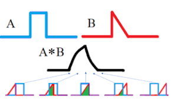
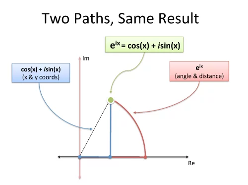
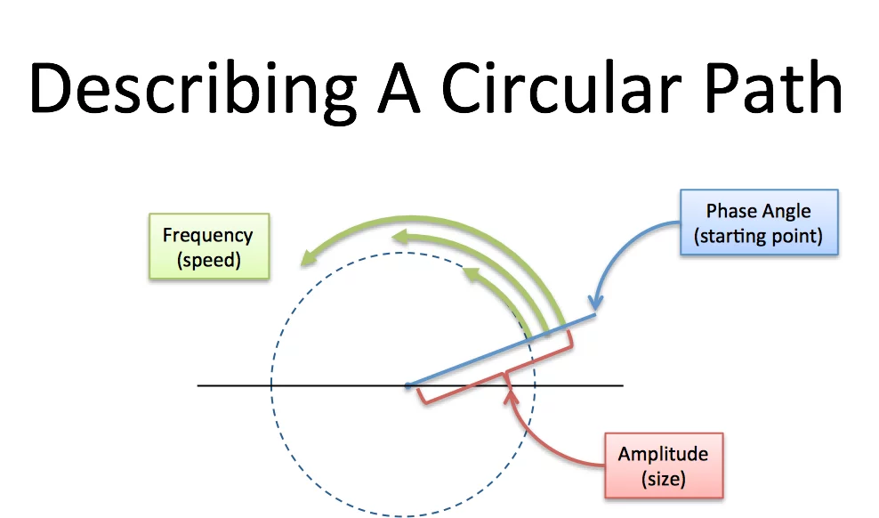
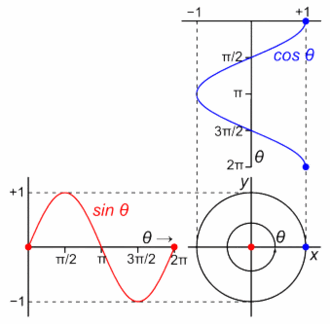

# Convolutiona and Fast Fourier Transform

Convolution is a mathematical operation that combines two functions to produce a third function. It expresses how the shape of one function is modified by another. In discrete form, the convolution of two sequences $a[0...n-1]$and $b[0...m-1]$ produces a sequence $c[0...n+m-2]$.

<figure markdown="span">
    {width="80%"}
    <figcaption>Convolution of two functions A (red) and B (blue) produce a third function describing the overlap (green).</figcaption>
    <p align='right' style="font-size:0.8em"><i>Image Source: <a href="https://www.statisticshowto.com/convolution-integral-simple-definition/"> Statistics How to</a ></i></p>
</figure>

### 4.4.1 Discrete Time convolution

<figure markdown="span">
    {width="100%"}
    <figcaption>Convolution of two functions f and g</figcaption>
    <p align='right' style="font-size:0.8em"><i>Image Source: <a href="https://quincyaflint.weebly.com/academic-material/discrete-convolution"> Quincy's Website</a ></i></p>
</figure>

Discrete time convolution is an operation on two discrete time signals is given by:

$$(f * g)[n]=\sum_{i=-\infty}^{\infty} f[i] g[n-i] $$

where:

- $f[i]$ : input signal
- $g[n-i]$: kernel/filter function shifted by n
- The result (𝑓∗𝑔)[𝑛] is a new sequence that depends on both

!!! example "Example"

    Let
    \( f = [1, 2, 3] \) and \( g = [0, 1, 0.5] \)

    Then,

    $$
    (f * g)[n] = \begin{cases}
    1 \cdot 0 = 0 & (n=0)\\
    1 \cdot 1 + 2 \cdot 0 = 1 & (n=1)\\
    1 \cdot 0.5 + 2 \cdot 1 + 3 \cdot 0 = 2.5 & (n=2)\\
    2 \cdot 0.5 + 3 \cdot 1 = 4 & (n=3)\\
    3 \cdot 0.5 = 1.5 & (n=4)
    \end{cases}
    $$

    **Result:**
    $$
    (f \* g) = [0, 1, 2.5, 4, 1.5]
    $$

---

**Key Applications**

1.  Signal Processing
    - Audio filtering and enhancement
    - Noise reduction
    - Echo and reverb effects

Image Processing

Edge detection
Blurring and sharpening
Feature extraction in CNNs

<figure markdown="span">
    {width="100%"}
    <figcaption>Convolution with kernel in modification of image example</figcaption>
    <p align='right' style="font-size:0.8em"><i>Image Source: <a href="https://commons.wikimedia.org/wiki/File:2D_Convolution_Animation.gif"> Wiki Media</a ></i></p>
</figure>

<figure markdown="span">
    {width="100%"}
    <figcaption>Convolution example of blurring an image</figcaption>
    <p align='right' style="font-size:0.8em"><i>Image Source: <a href="https://www.bitcoininsider.org/article/70964/computer-vision-busy-developers-convolutions"> Bitcoin Insider</a ></i></p>
</figure>

### 4.4.2 Naive Approch to convolution

In the **naive method**, we directly apply the convolution formula using nested loops.

For sequences of length \( N \) : $ (f \* g)[n] = \sum\_{i=0}^{N-1} f[i] \cdot g[n - i]$

We compute this for each output index \( n \).

**Time Complexity**

- There are \( N \) possible output positions
- Each position requires summing up to \( M \) terms  
  **O(N × M)** operations $\approx$ **O(N^2)**

```
ConvolutionNaive(a[0...n-1], b[0...m-1]):
result_size = n + m - 1
c[0...result_size-1] = all zeros

    for k = 0 to result_size-1:
        for i = 0 to n-1:
            j = k - i
            if 0 ≤ j < m:
                c[k] = c[k] + a[i] × b[j]

    return c

```

### 4.4.3 Fast Fourier Transform

FFT (Fast Fourier Transform) is an **efficient algorithm** to compute the **Discrete Fourier Transform (DFT)** of a sequence in **O(N log N)** time instead of **O(N²)**.

The DFT converts a signal from the **time domain** to the **frequency domain**.

**Mathematical Idea**

The DFT of a sequence \( x[n] \) of length \( N \) is:

$$
X[k] = \sum_{n=0}^{N-1} x[n] \cdot e^{-i2\pi kn/N}
$$

Where :

- N = number of time samples we have
- n = current sample we're considering (0 .. N-1)
- x[n] = value of the signal at time n
- k = current frequency we're considering (0 Hertz up to N-1 Hertz)
- X[k] = amount of frequency k in the signal (amplitude and phase, a complex number)

This tells us how much of each frequency \( k \) is present in the signal.

**Intution Of DFT**
The Fourier Transform takes a specific viewpoint: **_What if any signal could be filtered into a bunch of circular paths?_**

The Fourier Transform is about circular paths and Euler's formula is a clever way to generate one

<figure markdown="span">
    {width="100%"}
    <figcaption>Representation of Euler Formula</figcaption>
    <p align='right' style="font-size:0.8em"><i>Image Source: <a href="https://betterexplained.com/articles/an-interactive-guide-to-the-fourier-transform/"> Better Explained</a ></i></p>
</figure>

<figure markdown="span">
    {width="50%"}
    <figcaption>Representation in a circle</figcaption>
    <p align='right' style="font-size:0.8em"><i>Image Source: <a href="https://betterexplained.com/articles/an-interactive-guide-to-the-fourier-transform/"> Better Explained</a ></i></p>
</figure>
<figure markdown="span">
    {width="100%"}
    <figcaption>Euler Formula</figcaption>
    <p align='right' style="font-size:0.8em"><i>Image Source: <a href="http://engredu.com/2022/12/09/euler-formula/"> Engr Edu </a ></i></p>
</figure>

**Information from the Circle**

- Amplitutde : How big is the circle? (Radius)
- Frequency: How fast do we draw it? (Frequency. 1 circle/second is a frequency of 1 Hertz (Hz) or 2\*pi radians/sec)
- Where do we start? (Phase angle, where 0 degrees is the x-axis)

### 4.4.4 Divide-and-Conquer in FFT (Cooley–Tukey Algorithm)

1. **Split the signal** into even and odd indexed parts:

   $$ x\_{even}[n] = x[2n], \quad x\_{odd}[n] = x[2n + 1]$$

2. **Recursively compute** DFTs of each half.

3. **Combine** results using the formula:  
   $$ X[k] = E[k] + e^{-i2\pi k/N} O[k] $$  
   $$ X[k + N/2] = E[k] - e^{-i2\pi k/N} O[k] $$

This reduces computations from **N² → N log₂N**, a massive improvement.

---

    Algorithm FFT(x)
    Input: Sequence x of length N (where N is a power of 2)
    Output: DFT of x

    1.  if N == 1 then
    2.      return x
    3.  end if

    4.  Split x into two sequences:
        even = [x[0], x[2], x[4], ..., x[N-2]]
        odd = [x[1], x[3], x[5], ..., x[N-1]]

    5.  E = FFT(even) // Recursive call for even indices
    6.  O = FFT(odd) // Recursive call for odd indices

    7.  Initialize X as an array of size N

    8.  for k = 0 to N/2 - 1 do
    9.      t = exp(-2πi * k / N) * O[k]
    10. X[k] = E[k] + t
    11. X[k + N/2] = E[k] - t
    12. end for

    13. return X

## Addtional Resources

{{ youtube_embed("https://www.youtube.com/watch?v=nmgFG7PUHfo", title="The Most Important Algorithm Of All Time - Veritasium", width="700px") }}
{{ youtube_embed("https://www.youtube.com/watch?v=spUNpyF58BY", title="But what is the Fourier Transform? A visual introduction.- 3blue1brown", width="700px") }}
