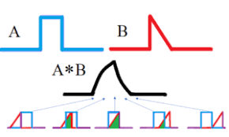
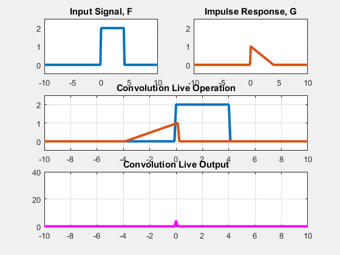
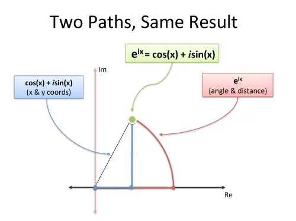
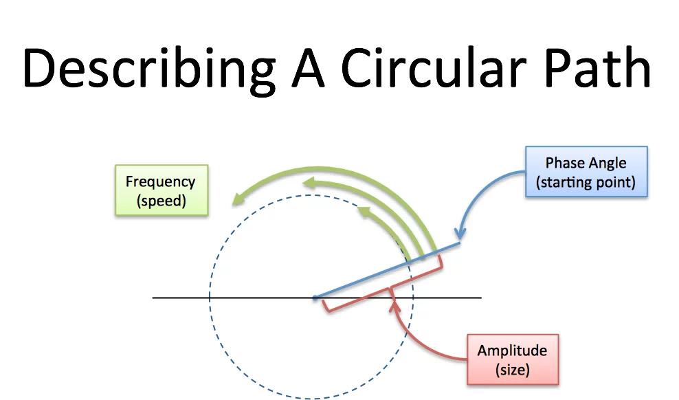
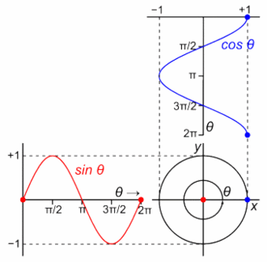

# Convolution and Fast Fourier Transform

## Definition

**Informally.** Convolution is an operation that combines two sequences (or functions) into a third by sliding one across the other and, at every relative shift, summing the products of the terms that overlap. It captures how one signal is "smeared", filtered, or reshaped by another.

**Precisely.** Given two finite sequences $a = (a_0, a_1, \dots, a_{n-1})$ and $b = (b_0, b_1, \dots, b_{m-1})$, their (linear, discrete) convolution is the sequence $c = a * b$ of length $n + m - 1$ defined by

$$
c_k = \sum_{i+j=k} a_i\, b_j, \qquad k = 0, 1, \dots, n+m-2 .
$$

| Aspect | Content |
| --- | --- |
| Input | Two sequences $a$ (length $n$) and $b$ (length $m$) |
| Output | Sequence $c$ of length $n + m - 1$ |
| Cost model | Number of multiply-add (coefficient) operations |
| Where it fits | The same operation that appears as the coefficient step of polynomial multiplication, and hence of integer multiplication (Unit 4.3) |

**Connection to polynomial multiplication.** If $a$ and $b$ are read as coefficient vectors of the polynomials

$$
A(x) = \sum_{i=0}^{n-1} a_i x^i, \qquad B(x) = \sum_{j=0}^{m-1} b_j x^j,
$$

then the coefficients of the product polynomial $C(x) = A(x) B(x)$ are exactly the convolution of $a$ and $b$:

$$
C(x) = \sum_{k=0}^{n+m-2} c_k x^k, \qquad c_k = \sum_{i+j=k} a_i b_j .
$$

This identity is why convolution, polynomial multiplication, and — as shown in Topic 4.3 — integer multiplication are, at their core, the same computational problem seen through three different lenses.

!!! tip "The one idea to keep"

    Multiplying two polynomials is convolving their coefficient vectors. Every fast convolution algorithm — including the FFT-based one developed in this topic — is therefore also a fast polynomial-multiplication algorithm.

Convolution is a mathematical operation that combines two functions to produce a third function. It expresses how the shape of one function is modified by another. In discrete form, the convolution of two sequences $a[0...n-1]$and $b[0...m-1]$ produces a sequence $c[0...n+m-2]$.

<figure markdown="span">
    {width="80%"}
    <figcaption>Convolution of two functions A (red) and B (blue) produce a third function describing the overlap (green).</figcaption>
    <p align='right' style="font-size:0.8em"><i>Image Source: <a href="https://www.statisticshowto.com/convolution-integral-simple-definition/"> Statistics How to</a ></i></p>
</figure>

## Problem Formulation

```text
Input:
    Sequence a = (a_0, a_1, ..., a_{n-1})   [length n]
    Sequence b = (b_0, b_1, ..., b_{m-1})   [length m]

Output:
    Sequence c = (c_0, c_1, ..., c_{n+m-2}) [length n + m - 1]
    where c_k = sum over all (i, j) with i + j = k of a_i * b_j

Objective:
    Compute every value c_k, for k = 0 .. n+m-2,
    minimising the total number of multiplications and additions performed.

Assumptions:
    - a_i, b_j come from a ring where multiplication and addition are defined
      (reals, complex numbers, integers, or a residue ring for number-theoretic transforms).
    - Both sequences are stored as indexable arrays, so a_i and b_j cost O(1) to access.

Edge cases:
    - n = 0 or m = 0            -> the output is empty
    - n = 1 or m = 1            -> convolution degenerates to scaling the longer sequence
    - n != m                    -> the algorithm must not assume equal lengths
    - length not a power of 2   -> FFT-based methods must zero-pad first
```

## Intuition

Look again at the convolution figures above: the operation is a "slide, multiply, and sum" over every relative shift. Computed directly, each of the $n+m-1$ output values touches up to $\min(n,m)$ terms, so the whole computation costs $\Theta(nm)$ — fine for a small, fixed-size kernel sliding over an image, but a genuine bottleneck when *both* sequences are large.

That is exactly the situation encountered in Topic 4.3: multiplying two large integers reduces, after writing each integer as a coefficient vector of digits, to **convolving those digit sequences**, followed by a cheap $\Theta(n)$ carry-propagation pass. Karatsuba attacked that same convolution by an algebraic trick — evaluating at 3 points instead of the 4 that a naive split would need, so that only 3 half-size recursive multiplications remain instead of 4. The FFT attacks the *identical* convolution problem from a completely different angle: instead of reducing the *number* of sub-multiplications, it changes the **representation** of the sequences entirely.

The idea, developed formally in Algorithm Design below, rests on a basic fact of algebra: a polynomial of degree less than $N$ is uniquely determined by its values at any $N$ distinct points. If those points are chosen to be the $N$ complex $N$-th roots of unity, three things become true simultaneously:

1. Evaluating a degree-$<N$ polynomial at *all* $N$ roots of unity at once can be done in $O(N \log N)$ time — this is the Fast Fourier Transform — instead of the $O(N^2)$ it would cost to evaluate one point at a time.
2. Once two polynomials are evaluated at the same $N$ points, multiplying them is just $N$ independent pointwise multiplications: $O(N)$.
3. Recovering the coefficients (i.e. the convolution) from the $N$ pointwise products is again an FFT-shaped computation, the **inverse FFT**, also $O(N \log N)$.

So a computation that looks irreducibly quadratic in the coefficient representation becomes $O(N \log N)$ once the sequences are briefly re-expressed in the "values at roots of unity" representation. This is the same representation-change instinct behind Karatsuba's evaluation at three points (see Topic 4.3, *Evaluation–interpolation view*), pushed to its logical extreme: instead of a handful of cleverly chosen points, the FFT uses *all* $N$ roots of unity at once, and exploits the massive algebraic symmetry among their powers to make that evaluation itself fast.

### 4.4.1 Discrete Time convolution

<figure markdown="span">
    {width="100%"}
    <figcaption>Convolution of two functions f and g</figcaption>
    <p align='right' style="font-size:0.8em"><i>Image Source: <a href="https://quincyaflint.weebly.com/academic-material/discrete-convolution"> Quincy's Website</a ></i></p>
</figure>

Discrete time convolution is an operation on two discrete time signals is given by:

$$(f * g)[n]=\sum_{i=-\infty}^{\infty} f[i] g[n-i] $$

where:

- $f[i]$ : input signal
- $g[n-i]$: kernel/filter function shifted by n
- The result (𝑓∗𝑔)[𝑛] is a new sequence that depends on both

!!! example "Example"

    Let
    \( f = [1, 2, 3] \) and \( g = [0, 1, 0.5] \)

    Then,

    $$
    (f * g)[n] = \begin{cases}
    1 \cdot 0 = 0 & (n=0)\\
    1 \cdot 1 + 2 \cdot 0 = 1 & (n=1)\\
    1 \cdot 0.5 + 2 \cdot 1 + 3 \cdot 0 = 2.5 & (n=2)\\
    2 \cdot 0.5 + 3 \cdot 1 = 4 & (n=3)\\
    3 \cdot 0.5 = 1.5 & (n=4)
    \end{cases}
    $$

    **Result:**
    $$
    (f \* g) = [0, 1, 2.5, 4, 1.5]
    $$

---

**Key Applications**

1.  Signal Processing
    - Audio filtering and enhancement
    - Noise reduction
    - Echo and reverb effects

Image Processing

Edge detection
Blurring and sharpening
Feature extraction in CNNs

<figure markdown="span">
    {width="100%"}
    <figcaption>Convolution with kernel in modification of image example</figcaption>
    <p align='right' style="font-size:0.8em"><i>Image Source: <a href="https://commons.wikimedia.org/wiki/File:2D_Convolution_Animation.gif"> Wiki Media</a ></i></p>
</figure>

<figure markdown="span">
    {width="100%"}
    <figcaption>Convolution example of blurring an image</figcaption>
    <p align='right' style="font-size:0.8em"><i>Image Source: <a href="https://www.bitcoininsider.org/article/70964/computer-vision-busy-developers-convolutions"> Bitcoin Insider</a ></i></p>
</figure>

### 4.4.2 Naive Approach to convolution

In the **naive method**, we directly apply the convolution formula using nested loops.

For sequences of length \( N \) : $ (f \* g)[n] = \sum\_{i=0}^{N-1} f[i] \cdot g[n - i]$

We compute this for each output index \( n \).

**Time Complexity**

- There are \( N \) possible output positions
- Each position requires summing up to \( M \) terms  
  **O(N × M)** operations $\approx$ **O(N^2)**

```
ConvolutionNaive(a[0...n-1], b[0...m-1]):
result_size = n + m - 1
c[0...result_size-1] = all zeros

    for k = 0 to result_size-1:
        for i = 0 to n-1:
            j = k - i
            if 0 ≤ j < m:
                c[k] = c[k] + a[i] × b[j]

    return c

```

## Algorithmic Paradigm

The Cooley–Tukey FFT belongs to the **divide-and-conquer** paradigm:

- **Divide** — split a size-$N$ DFT into two size-$N/2$ DFTs, one over the even-indexed samples and one over the odd-indexed samples.
- **Conquer** — solve each half recursively, down to the trivial $N = 1$ base case.
- **Combine** — merge the two half-size DFTs into the full size-$N$ DFT in $O(N)$ time, using the butterfly formulas.

| Paradigm ingredient | Role in FFT |
| --- | --- |
| Self-similarity | A size-$N/2$ DFT is structurally the same problem as a size-$N$ DFT, only smaller |
| Balanced split | Even/odd indices split the input into two exactly equal halves, giving the clean recurrence $T(N) = 2T(N/2) + O(N)$ |
| Cheap combine step | The combine step is a single linear pass, not an algebraic reduction in the number of sub-multiplications |

This is the same divide-and-conquer shape used by Karatsuba in Topic 4.3 — there, the split is high/low digit halves; here, it is even/odd indexed samples — but the two differ in *why* they are fast. Karatsuba keeps the split factor $b=2$ but reduces the number of recursive calls from 4 to 3, moving the Master Theorem exponent from $\log_2 4 = 2$ down to $\log_2 3 \approx 1.585$. The FFT keeps a full branching factor of $a=2$ but makes the combine step only $O(N)$ (linear, not another multiplication), which — as shown in Recurrence Analysis — is enough on its own to reach $O(N \log N)$.

### 4.4.3 Fast Fourier Transform

FFT (Fast Fourier Transform) is an **efficient algorithm** to compute the **Discrete Fourier Transform (DFT)** of a sequence in **O(N log N)** time instead of **O(N²)**.

The DFT converts a signal from the **time domain** to the **frequency domain**.

**Mathematical Idea**

The DFT of a sequence \( x[n] \) of length \( N \) is:

$$
X[k] = \sum_{n=0}^{N-1} x[n] \cdot e^{-i2\pi kn/N}
$$

Where :

- N = number of time samples we have
- n = current sample we're considering (0 .. N-1)
- x[n] = value of the signal at time n
- k = current frequency we're considering (0 Hertz up to N-1 Hertz)
- X[k] = amount of frequency k in the signal (amplitude and phase, a complex number)

This tells us how much of each frequency \( k \) is present in the signal.

**Intution Of DFT**
The Fourier Transform takes a specific viewpoint: **_What if any signal could be filtered into a bunch of circular paths?_**

The Fourier Transform is about circular paths and Euler's formula is a clever way to generate one

<figure markdown="span">
    {width="100%"}
    <figcaption>Representation of Euler Formula</figcaption>
    <p align='right' style="font-size:0.8em"><i>Image Source: <a href="https://betterexplained.com/articles/an-interactive-guide-to-the-fourier-transform/"> Better Explained</a ></i></p>
</figure>

<figure markdown="span">
    {width="50%"}
    <figcaption>Representation in a circle</figcaption>
    <p align='right' style="font-size:0.8em"><i>Image Source: <a href="https://betterexplained.com/articles/an-interactive-guide-to-the-fourier-transform/"> Better Explained</a ></i></p>
</figure>
<figure markdown="span">
    {width="100%"}
    <figcaption>Euler Formula</figcaption>
    <p align='right' style="font-size:0.8em"><i>Image Source: <a href="http://engredu.com/2022/12/09/euler-formula/"> Engr Edu </a ></i></p>
</figure>

**Information from the Circle**

- Amplitutde : How big is the circle? (Radius)
- Frequency: How fast do we draw it? (Frequency. 1 circle/second is a frequency of 1 Hertz (Hz) or 2\*pi radians/sec)
- Where do we start? (Phase angle, where 0 degrees is the x-axis)

## Algorithm Design

Write the DFT as a matrix–vector product $X = F_N x$, where $F_N$ is the $N \times N$ matrix with entries $(F_N)_{k,n} = \omega_N^{-kn}$ and $\omega_N = e^{i2\pi/N}$ is the principal $N$-th root of unity. Computed directly, this is $N^2$ entries, each an $O(1)$ multiply-add: $\Theta(N^2)$ — the naive DFT of 4.4.3 restated in matrix form.

Split the sum defining $X[k]$ by the parity of the index $n$:

$$
X[k] = \sum_{n \text{ even}} x[n]\, \omega_N^{-kn} \;+\; \sum_{n \text{ odd}} x[n]\, \omega_N^{-kn}
     = \sum_{r=0}^{N/2-1} x[2r]\, (\omega_N^{2})^{-kr} \;+\; \omega_N^{-k} \sum_{r=0}^{N/2-1} x[2r+1]\, (\omega_N^{2})^{-kr} .
$$

The step that makes this useful is a single algebraic fact about roots of unity:

$$
\omega_N^{2} = \left(e^{i2\pi/N}\right)^2 = e^{i2\pi/(N/2)} = \omega_{N/2} .
$$

So each inner sum is *itself* a size-$N/2$ DFT — of the even-indexed and odd-indexed subsequences respectively:

$$
E[k] = \sum_{r=0}^{N/2-1} x[2r]\, \omega_{N/2}^{-kr}, \qquad
O[k] = \sum_{r=0}^{N/2-1} x[2r+1]\, \omega_{N/2}^{-kr},
$$

giving

$$
X[k] = E[k] + \omega_N^{-k}\, O[k], \qquad k = 0, \dots, N/2 - 1 .
$$

!!! tip "Why even/odd, and not first-half/second-half"

    The even/odd split is not an arbitrary choice — it is the *only* split for which $\omega_N^2$ collapses exactly to $\omega_{N/2}$. Splitting into a first half $x[0..N/2-1]$ and a second half $x[N/2..N-1]$ does not telescope the exponents into a clean smaller root of unity, so no equivalent shortcut is available; the two "halves" would not be DFTs of anything of size $N/2$. The even/odd split is designed specifically to expose this symmetry.

Because $E$ and $O$ are themselves size-$N/2$ DFTs, they are periodic with period $N/2$, so the remaining outputs $X[k+N/2]$, $k=0,\dots,N/2-1$, can be obtained by reusing the *same* $E[k]$ and $O[k]$ with a sign change (proved in Correctness below) — meaning $E$ and $O$ never need to be evaluated beyond index $N/2-1$. This turns one $N \times N$ matrix multiplication into two $(N/2)\times(N/2)$ ones, combined with $O(N)$ extra work, which is exactly the recurrence used in Complexity Analysis and Recurrence Analysis.

### 4.4.4 Divide-and-Conquer in FFT (Cooley–Tukey Algorithm)

1. **Split the signal** into even and odd indexed parts:

   $$ x\_{even}[n] = x[2n], \quad x\_{odd}[n] = x[2n + 1]$$

2. **Recursively compute** DFTs of each half.

3. **Combine** results using the formula:  
   $$ X[k] = E[k] + e^{-i2\pi k/N} O[k] $$  
   $$ X[k + N/2] = E[k] - e^{-i2\pi k/N} O[k] $$

This reduces computations from **N² → N log₂N**, a massive improvement.

---

    Algorithm FFT(x)
    Input: Sequence x of length N (where N is a power of 2)
    Output: DFT of x

    1.  if N == 1 then
    2.      return x
    3.  end if

    4.  Split x into two sequences:
        even = [x[0], x[2], x[4], ..., x[N-2]]
        odd = [x[1], x[3], x[5], ..., x[N-1]]

    5.  E = FFT(even) // Recursive call for even indices
    6.  O = FFT(odd) // Recursive call for odd indices

    7.  Initialize X as an array of size N

    8.  for k = 0 to N/2 - 1 do
    9.      t = exp(-2πi * k / N) * O[k]
    10. X[k] = E[k] + t
    11. X[k + N/2] = E[k] - t
    12. end for

    13. return X

## Correctness

**Claim.** For every $k = 0, \dots, N/2-1$,

$$
X[k] = E[k] + \omega_N^{-k} O[k], \qquad X[k+N/2] = E[k] - \omega_N^{-k} O[k],
$$

where $E$, $O$ are the correct size-$N/2$ DFTs of the even- and odd-indexed subsequences, together give the correct size-$N$ DFT $X$.

**Proof.** The formula for $X[k]$, $k < N/2$, was derived directly from the DFT definition in Algorithm Design above. It remains to derive $X[k+N/2]$.

$$
X[k+N/2] = \sum_{n=0}^{N-1} x[n]\, \omega_N^{-(k+N/2)n} = \sum_{n=0}^{N-1} x[n]\, \omega_N^{-kn} \cdot \omega_N^{-Nn/2} .
$$

Since $\omega_N^{-N/2} = e^{-i\pi} = -1$, the factor $\omega_N^{-Nn/2} = (-1)^n$: it is $+1$ for even $n$ and $-1$ for odd $n$. Substituting,

$$
X[k+N/2] = \sum_{n \text{ even}} x[n]\, \omega_N^{-kn} \;-\; \sum_{n \text{ odd}} x[n]\, \omega_N^{-kn} = E[k] - \omega_N^{-k} O[k],
$$

using the same even/odd substitution as before. Equivalently, since $\omega_N^{-(k+N/2)} = \omega_N^{-k}\omega_N^{-N/2} = -\omega_N^{-k}$, this is the periodicity/anti-periodicity identity

$$
\omega_N^{\,k+N/2} = -\,\omega_N^{\,k},
$$

which says that the twiddle factor for output index $k+N/2$ is exactly the negative of the twiddle factor for output index $k$. This is precisely why the pseudocode computes the product $t = \omega_N^{-k}O[k]$ **once** and reuses it with a sign flip for both $X[k]$ and $X[k+N/2]$, instead of recomputing it. $\blacksquare$

**Correctness of the full recursion — induction on $N$ (a power of 2).**

- *Base case* ($N=1$): the DFT of a single sample is the sample itself; the pseudocode's `if N == 1 then return x` is exactly this.
- *Inductive hypothesis*: `FFT` correctly computes the size-$N/2$ DFT for all inputs of length $N/2 < N$.
- *Inductive step*: given an input of length $N$, the even and odd subsequences each have length $N/2$, a power of 2, so by the inductive hypothesis the recursive calls `E = FFT(even)` and `O = FFT(odd)` return the correct size-$N/2$ DFTs. By the butterfly identity proved above, combining them as in lines 8–12 produces the correct $X[k]$ for every $k = 0, \dots, N-1$.
- *Termination*: each recursive call halves $N$; since $N$ is a power of 2, the recursion reaches the base case $N=1$ after exactly $\log_2 N$ levels.

By induction, `FFT(x)` is correct for every input length that is a power of 2. $\blacksquare$

## Complexity Analysis

Let $T(N)$ be the running time of `FFT` on an input of length $N = 2^p$.

- **Base case** ($N=1$): $O(1)$.
- **Recursive calls**: two calls of size $N/2$ each: $2T(N/2)$.
- **Split step**: separating `x` into `even` and `odd` touches every element once: $O(N)$.
- **Combine step**: the loop runs $N/2$ times, each iteration doing one complex exponential/multiplication and two additions, all $O(1)$: $O(N)$ total.

$$
T(N) = 2\,T(N/2) + O(N), \qquad T(1) = O(1).
$$

**Space.** Recursion depth is $O(\log N)$. If, as in the pseudocode and the direct Python translation below, each level builds new `even`/`odd`/`X` arrays by copying, the auxiliary space is $O(N)$ per level for $O(\log N)$ levels, i.e. $O(N \log N)$ total. An in-place, iterative version (Alternative Approaches) removes this and uses only $O(N)$ total space, or $O(1)$ auxiliary beyond the output.

**Contrast with the naive convolution/DFT of 4.4.2.** The naive approach costs $O(N \cdot M) \approx O(N^2)$ for equal-length inputs. At $N = 2^{20} \approx 1.05 \times 10^6$:

| Method | Approximate operation count |
| --- | --- |
| Naive $O(N^2)$ | $\approx 1.1 \times 10^{12}$ |
| FFT-based $O(N \log_2 N)$ | $\approx 2.1 \times 10^{7}$ |

a difference of roughly five orders of magnitude — the naive method is not merely slower, it is computationally infeasible at sizes the FFT handles routinely.

## Recurrence Analysis

**Construction.** As derived above,

$$
T(N) = 2\,T(N/2) + \Theta(N), \qquad T(1) = \Theta(1).
$$

**Solving by the Master Theorem.** Here $a = 2$, $b = 2$, $f(N) = \Theta(N)$. Then $\log_b a = \log_2 2 = 1$, so $f(N) = \Theta(N^{\log_b a})$: this is **Case 2**, and

$$
T(N) = \Theta\!\left(N^{\log_b a} \log N\right) = \Theta(N \log N).
$$

**Solving by recursion tree (to see why).** At depth $i$ there are $2^i$ subproblems, each of size $N/2^i$, each contributing $c \cdot N/2^i$ non-recursive work:

| Level $i$ | Subproblems | Size | Work at level |
| --- | --- | --- | --- |
| 0 | 1 | $N$ | $cN$ |
| 1 | 2 | $N/2$ | $cN$ |
| 2 | 4 | $N/4$ | $cN$ |
| $i$ | $2^i$ | $N/2^i$ | $cN$ |
| $\log_2 N$ | $N$ | $1$ | $\Theta(N)$ (leaves) |

Every level does exactly $\Theta(N)$ work, and there are $\log_2 N$ levels, so

$$
T(N) = \Theta(N) \cdot \log_2 N + \Theta(N) = \Theta(N \log N).
$$

!!! tip "Compare with Karatsuba's recursion tree"

    In Topic 4.3, Karatsuba's recursion tree has ratio $3/2$ between levels (branching factor 3, halving the size), so the *bottom* level dominates and the total is $\Theta(n^{\log_2 3})$. Here the branching factor is 2 and the size halves, giving ratio $2 \cdot \tfrac12 = 1$ between levels — every level contributes equally, and the total is the per-level work times the number of levels, $\Theta(N \log N)$. This is the qualitative signature of Case 2 of the Master Theorem: balance between recursive work and combine work.

## Python Implementation

```python
import cmath

def fft(x):
    """
    Recursive radix-2 Cooley-Tukey FFT (matches the FFT(x) pseudocode above).

    x: list of numbers (real or complex); len(x) must be a power of 2.
    Returns: list of complex numbers, the DFT of x.
    """
    n = len(x)
    if n == 1:                                   # base case
        return x

    if n % 2 != 0:
        raise ValueError("length of x must be a power of 2")

    even = fft(x[0::2])                          # E = FFT(even)
    odd = fft(x[1::2])                           # O = FFT(odd)

    X = [0] * n                                  # Initialize X
    for k in range(n // 2):
        twiddle = cmath.exp(-2j * cmath.pi * k / n) * odd[k]   # t
        X[k] = even[k] + twiddle
        X[k + n // 2] = even[k] - twiddle
    return X


def ifft(X):
    """
    Inverse FFT via the conjugation trick:
        ifft(X) = conjugate(fft(conjugate(X))) / n
    This reuses `fft` unchanged and only flips the sign of the exponent
    implicitly, avoiding a second, easily-mismatched implementation.
    """
    n = len(X)
    conjugated = [value.conjugate() if hasattr(value, "conjugate") else value for value in X]
    y = fft(conjugated)
    return [value.conjugate() / n for value in y]


def convolve_naive(a, b):
    """
    Naive O(n*m) discrete convolution, matching ConvolutionNaive(a, b) above.

    a: sequence of length n
    b: sequence of length m
    Returns: c of length n + m - 1
    """
    n, m = len(a), len(b)
    result_size = n + m - 1
    c = [0] * result_size

    for k in range(result_size):
        for i in range(n):
            j = k - i
            if 0 <= j < m:
                c[k] += a[i] * b[j]
    return c


def next_power_of_two(value):
    size = 1
    while size < value:
        size *= 2
    return size


def convolve_fft(a, b):
    """
    FFT-based convolution: zero-pad to a power of two at least n + m - 1,
    transform, multiply pointwise, and invert.
    """
    result_size = len(a) + len(b) - 1
    size = next_power_of_two(result_size)

    fa = a + [0] * (size - len(a))
    fb = b + [0] * (size - len(b))

    fa_hat = fft(fa)
    fb_hat = fft(fb)
    c_hat = [x * y for x, y in zip(fa_hat, fb_hat)]     # convolution theorem
    c = ifft(c_hat)

    # Discard the padding and clean up negligible imaginary/rounding noise.
    return [round(value.real, 10) for value in c[:result_size]]


if __name__ == "__main__":
    a = [1, 2, 3]
    b = [0, 1, 0.5]
    print(convolve_naive(a, b))   # [0.0, 1.0, 2.5, 4.0, 1.5]  (matches the 4.4.1 worked example)
    print(convolve_fft(a, b))     # same result, computed via FFT
```

## Code Walkthrough

| Pseudocode line | Python | Why it is written this way |
| --- | --- | --- |
| `if N == 1 then return x` | `if n == 1: return x` | Base case: a length-1 DFT is the identity |
| `even = [x[0], x[2], ...]`, `odd = [x[1], x[3], ...]` | `x[0::2]`, `x[1::2]` | Python slicing with step 2 expresses the even/odd split directly; note it copies, contributing the $O(N)$ split cost |
| `E = FFT(even)`, `O = FFT(odd)` | `even = fft(...)`, `odd = fft(...)` | The two recursive calls of the recurrence $T(N)=2T(N/2)+O(N)$ |
| `t = exp(-2πi k / N) * O[k]` | `twiddle = cmath.exp(-2j * cmath.pi * k / n) * odd[k]` | The twiddle factor $\omega_N^{-k}$ times $O[k]$, computed once per $k$ and reused (Correctness) |
| `X[k] = E[k] + t` | `X[k] = even[k] + twiddle` | Butterfly, first output |
| `X[k + N/2] = E[k] - t` | `X[k + n // 2] = even[k] - twiddle` | Butterfly, second output — same `twiddle`, sign flipped |
| *(not in the pseudocode)* | `ifft` | Needed to go back from the pointwise-multiplied spectra to the convolution's coefficients; implemented by conjugation so it cannot silently pick up the wrong sign of exponent |
| *(not in the pseudocode)* | `convolve_fft` | Wraps padding (Edge Cases), the pointwise multiply (the convolution theorem), and the inverse transform into the algorithm this whole topic has been building toward |

`convolve_naive` is a line-for-line translation of `ConvolutionNaive` in 4.4.2: the outer loop over `k`, the inner loop over `i`, the same guard `0 <= j < m`, and the same accumulation into `c[k]`.

## Alternative Approaches

| Approach | Idea | Time | Space | Notes |
| --- | --- | --- | --- | --- |
| Naive convolution | Direct double loop over all $(i,j)$ with $i+j=k$ | $O(nm)$ | $O(n+m)$ | Simple, exact, no padding needed; fine for small $n,m$ |
| Recursive FFT-based convolution (this topic) | Pad to a power of 2, `fft`, pointwise multiply, `ifft` | $O(N \log N)$, $N \ge n+m-1$ | $O(N \log N)$ with naive slicing recursion | Simple to implement and prove correct; recursion and array copies add constant-factor overhead |
| Iterative, in-place FFT | Reorder the input by *bit-reversal permutation*, then perform the same butterfly combine step bottom-up over $\log_2 N$ passes, in place | $O(N \log N)$ | $O(1)$ auxiliary (besides the array itself) | The version used in production DSP/numerics libraries; avoids recursion overhead and $O(N \log N)$ auxiliary space, at the cost of a less obviously-correct bit-reversal step |
| Mixed-radix / Bluestein's algorithm | Generalises Cooley–Tukey to non-power-of-2 lengths (mixed-radix factorises $N$; Bluestein re-expresses any-length DFT as a convolution that can itself be padded to a power of 2) | $O(N \log N)$ | $O(N)$ | Needed whenever the natural problem size is not a power of 2 and padding is undesirable |

## Trade-Off Analysis

| Trade-off | How it appears here |
| --- | --- |
| Asymptotics vs. constants | The FFT wins asymptotically from moderate $n$ onward but pays a real constant-factor overhead (complex arithmetic, recursive calls, padding); for very small $n$ the naive $O(nm)$ method is simply faster |
| Exactness vs. speed | Naive convolution over integers/rationals is exact; the FFT here works in floating-point complex numbers, so results carry rounding error and must be rounded (e.g. to the nearest integer) when the true answer is known to be exact |
| Memory layout vs. asymptotics | Zero-padding to the next power of 2 can up to double the working size, and the recursive implementation's array copies add further, non-asymptotic memory traffic that an iterative in-place FFT avoids |
| Simplicity vs. performance | `convolve_naive` is a few lines and obviously correct; a numerically robust, arbitrary-length FFT convolution (with Bluestein fallback, real-FFT optimisation, and error bounding) is substantially more code |
| Generality vs. specialisation | Real-valued signals admit specialised real-input FFTs that are about twice as fast as the general complex FFT above, at the cost of extra implementation care (Edge Cases) |

## Edge Cases

- **Length not a power of 2.** The recursive `fft` above requires $N$ to be a power of 2 (`raise ValueError` otherwise); real inputs must be zero-padded up to the next power of 2 at least as large as $n+m-1$, exactly as `convolve_fft` does. Padding changes the *length* of the transform but never the true convolution values, since appending zeros to a sequence does not change any $c_k = \sum a_i b_j$.
- **$N = 1$ base case.** A length-1 sequence's DFT is itself; omitting this base case, or terminating recursion too early/late, breaks the recursion's termination argument in Correctness.
- **Real-valued vs. complex signals.** Real input produces a DFT with conjugate symmetry, $X[N-k] = \overline{X[k]}$ (Important Properties and Invariants below); this redundancy can be exploited (real-input FFT variants) but must not be assumed when the input is genuinely complex.
- **All-zero or single-nonzero-element input.** Degenerate but must still terminate and return correctly-sized, all-zero (or appropriately shifted) output; a good implementation should be tested on these first (Testing Strategy).
- **$n \ne m$.** The convolution length is $n+m-1$, not $2\max(n,m)-1$; zero-padding both operands to the *same* power-of-2 length before the FFT must still produce an output of the original, un-padded convolution length once the extra padded entries are discarded.

## Common Implementation Pitfalls

- **Off-by-one in the butterfly indices.** Writing `X[k + n/2]` with integer division that silently truncates, or looping `k` over the full range `0..n-1` instead of `0..n/2-1` (which would overwrite `X[k+N/2]` before it is read, or read `odd[k]` out of bounds), corrupts the transform for every $N > 2$.
- **Forgetting to pad to a power of two.** Calling the recursive `fft` on a length that is not a power of 2 either raises an error (as coded above) or, in an unguarded implementation, silently recurses incorrectly when `n` is odd and not equal to 1.
- **Sign of the exponent, forward vs. inverse.** The forward transform uses $e^{-i2\pi kn/N}$ and the inverse uses $e^{+i2\pi kn/N}$ (with a $1/N$ normalisation); swapping the sign turns the inverse transform into another forward transform and silently produces the *time-reversed*, unnormalised signal instead of the original one. Implementing `ifft` by conjugating input and output around the same `fft`, as done above, is a standard defence against exactly this mistake.
- **Not truncating the padded result.** `convolve_fft` must slice back to `result_size = n + m - 1` before returning; the padded, power-of-two-length inverse transform contains extra trailing zeros (or wrapped-around garbage if the padding was insufficient) that are not part of the convolution.
- **Comparing floating-point results for exact equality.** Because the FFT is computed in floating point, `convolve_fft(a, b) == convolve_naive(a, b)` will generally be false element-wise even when correct; compare with a tolerance, or round when the answer is known to be an integer.
- **Insufficient padding causing circular (wrap-around) convolution.** Padding to *any* power of 2 is not enough — it must be at least $n+m-1$; the FFT computes a **circular** convolution of length $N$, which equals the desired **linear** convolution only when $N \ge n+m-1$.

## Common Conceptual Mistakes

- **Treating "FFT" as a different transform from the DFT.** The FFT is not a different mathematical operation from the DFT — it is an algorithm for computing the *same* DFT faster. Any correct FFT implementation must agree with the naive $O(N^2)$ DFT formula of 4.4.3 exactly (up to floating-point error).
- **Believing the FFT directly computes a convolution.** The FFT alone only evaluates a sequence at roots of unity. Computing a convolution additionally requires the pointwise multiplication step and the inverse transform; skipping either step yields nonsense.
- **Assuming any split of the input by half gives the same speedup.** As emphasised in Algorithm Design, only the even/odd split makes the recursive subproblems genuine smaller DFTs; a naive first-half/second-half split does not have this property and does not yield a correct or fast algorithm.
- **Confusing circular convolution with linear convolution.** The DFT/FFT machinery natively computes *circular* convolution of length $N$. It equals the linear convolution only after sufficient zero-padding (Edge Cases); forgetting this produces answers corrupted by wrap-around.
- **Thinking the twiddle factors are approximate "tuning" constants.** $\omega_N^{-k}$ is an exact algebraic quantity (up to floating-point representation); its role in the butterfly identity is proved exactly in Correctness, not approximated.

## Important Properties and Invariants

- **Periodicity.** $\omega_N^{k+N} = \omega_N^{k}$ for all integers $k$ — the $N$-th roots of unity repeat with period $N$.
- **Half-period anti-symmetry.** $\omega_N^{k+N/2} = -\omega_N^{k}$ — the identity that makes the butterfly combine step correct (proved in Correctness) and lets a single twiddle-factor multiplication serve two outputs.
- **Conjugate symmetry for real input.** If every $x[n]$ is real, then $X[N-k] = \overline{X[k]}$; only $\lfloor N/2 \rfloor + 1$ of the $N$ output values are independent.
- **Linearity of the DFT.** $\mathrm{DFT}(\alpha x + \beta y) = \alpha\, \mathrm{DFT}(x) + \beta\, \mathrm{DFT}(y)$ for scalars $\alpha, \beta$ — the transform is a linear map (the matrix $F_N$ of Algorithm Design), which is what justifies treating it as ordinary matrix–vector algebra throughout.
- **The convolution theorem.** $\mathrm{DFT}(a * b) = \mathrm{DFT}(a) \odot \mathrm{DFT}(b)$ (pointwise product), the identity that makes `convolve_fft` correct: convolution in the coefficient domain is pointwise multiplication in the frequency domain.

## When to Use

- The sequences to be convolved (or the polynomials/large integers to be multiplied) are large — from the low thousands of elements upward, where $N \log N \ll N^2$ starts to dominate wall-clock time.
- The same transform machinery is reused many times (e.g. repeated convolution/filtering in a signal-processing pipeline, or the FFT-based multiplication used internally by big-integer libraries such as Schönhage–Strassen in Topic 4.3).
- Floating-point precision is acceptable, or a number-theoretic transform variant (Related Algorithms and Concepts) is used to keep the computation exact.
- The problem is naturally about frequency content (audio, vibration, radar/sonar), where the frequency-domain representation is itself the desired output, not merely an intermediate trick.

## When NOT to Use

- $n$ and $m$ are small (a handful to a few dozen elements, e.g. a $3\times3$ image kernel) — the constant overhead of padding, complex arithmetic, and the transform/inverse-transform pair outweighs the asymptotic advantage.
- Exact integer or rational results are required and floating-point rounding is unacceptable — use exact naive convolution, Karatsuba-style methods, or a number-theoretic transform (exact modular arithmetic) instead.
- The sequence length changes on almost every call in a way that makes repeated re-padding and re-planning of the transform expensive relative to just doing the naive convolution once.
- Only a handful of convolution values are needed (not the whole output vector) — a targeted direct computation of just those values can beat computing an entire FFT-based convolution.

## Real-World Applications

Building on the *Key Applications* already introduced in 4.4.1:

- **Audio and signal processing** — filtering, noise reduction, echo/reverb effects, pitch detection, and spectral analysis all use convolution or its frequency-domain FFT equivalent.
- **Image processing and computer vision** — edge detection, blurring/sharpening kernels, and the convolutional layers of CNNs (feature extraction) are all discrete 2-D convolutions; large-kernel image convolution is often done via FFT for the same reason large convolutions of any kind benefit from it.
- **Polynomial and big-integer multiplication** — the Schönhage–Strassen algorithm (Topic 4.3) uses exactly the FFT-based convolution developed here, over a carefully chosen modular ring, to multiply very large integers in $\Theta(n \log n \log\log n)$ time.
- **Data compression** — transform coding (e.g. the Discrete Cosine Transform used in JPEG and MP3) is a close relative of the DFT, and fast transform algorithms in the Cooley–Tukey family underlie efficient encoders and decoders.
- **Communications** — Orthogonal Frequency-Division Multiplexing (OFDM), used in Wi-Fi, LTE, and DSL, relies on the FFT/inverse-FFT pair to modulate and demodulate many subcarriers simultaneously.
- **Scientific computing** — solving certain partial differential equations (spectral methods), computing correlations of large datasets, and radar/sonar pulse compression all reduce to fast convolution.

## Engineering Perspective

Production FFT libraries (FFTW, Intel MKL, cuFFT, NumPy's `numpy.fft`) do not use the simple recursive algorithm above. They combine: an iterative, in-place implementation to avoid recursion and allocation overhead; mixed-radix and Bluestein variants to handle arbitrary lengths without full zero-padding; real-input specialisations that exploit conjugate symmetry to roughly halve the work; and auto-tuning ("planning") that measures which factorisation and memory layout is fastest on the actual machine before running the transform. The algorithm taught here is the conceptual core that all of these share — the divide, the butterfly, and the correctness argument are identical; the engineering is in constant-factor and memory-access optimisation on top of it.

## Performance Considerations

- **Recursion vs. iteration.** The recursive version above allocates new lists at every level (`x[0::2]`, `x[1::2]`); an iterative, in-place version with a precomputed bit-reversal permutation removes this allocation entirely and is what real libraries use.
- **Padding overhead.** Padding to the next power of 2 can nearly double $N$ in the worst case (just over a power of 2); mixed-radix or Bluestein methods avoid this at the cost of implementation complexity.
- **Precomputing twiddle factors.** Recomputing `cmath.exp(...)` inside the innermost loop, as the simple pseudocode does, is wasteful in a performance-sensitive setting; twiddle factors depend only on $k$ and $N$ and are normally precomputed once and reused across many transforms of the same size.
- **Cache behaviour.** The even/odd split scatters memory accesses (stride-2), which is cache-unfriendly compared to the naive method's sequential access pattern; this is part of why the crossover point where the FFT beats the naive method in wall-clock time is larger than a pure operation-count comparison suggests.

## Testing Strategy

- **Agreement with the naive DFT/convolution.** For small $N$, `fft` must match a direct evaluation of $X[k] = \sum_n x[n] e^{-i2\pi kn/N}$, and `convolve_fft` must match `convolve_naive`, up to floating-point tolerance.
- **Round-trip test.** `ifft(fft(x))` should recover `x` (up to floating-point tolerance) for random inputs of several power-of-2 sizes.
- **Known small cases.** Reuse the worked example from 4.4.1 ($f=[1,2,3]$, $g=[0,1,0.5]$, expected $[0, 1, 2.5, 4, 1.5]$) as a regression test for `convolve_fft`.
- **Linearity check.** Verify $\mathrm{DFT}(\alpha x + \beta y) = \alpha\,\mathrm{DFT}(x) + \beta\,\mathrm{DFT}(y)$ numerically for random $x, y, \alpha, \beta$, exercising the linearity property listed above.
- **Edge cases.** $N=1$; all-zero input; a single non-zero entry; $n \ne m$; a length that is deliberately *not* a power of 2 fed to `convolve_fft` (which pads internally) versus fed directly to `fft` (which must raise, not silently misbehave).
- **Empirical complexity check.** As in Topic 4.3's empirical Karatsuba check, time `fft` at doubling sizes and confirm the ratio approaches $2$ (from $N\log N$ doubling to $2N\log(2N) \approx 2N\log N$ for large $N$), not $4$ (which would indicate an accidentally quadratic implementation).

## Debugging Strategy

- If `fft` disagrees with the naive DFT only at specific indices, suspect the butterfly indexing (`k` vs. `k + N/2`) or a sign error in the twiddle factor exponent first.
- If `ifft(fft(x))` returns a **time-reversed** or otherwise permuted version of `x`, the most common cause is a sign mismatch between the forward and inverse exponents.
- If `convolve_fft` matches `convolve_naive` only for some lengths, check the padding size: it must be a power of 2 **and** at least $n+m-1$, not merely a power of 2 at least $\max(n,m)$.
- If results are correct in magnitude but have a spurious global scale factor, check the $1/N$ normalisation in the inverse transform — the forward transform in this topic's convention carries no normalisation constant, so it belongs entirely in the inverse.
- If small negative numbers appear where zero is expected, this is ordinary floating-point rounding in the complex arithmetic; round before comparing, do not treat it as a logic bug.

## Related Algorithms and Concepts

- **Karatsuba multiplication (Topic 4.3)** — attacks the same underlying convolution problem via evaluation at 3 points and an algebraic identity, rather than evaluation at $N$ roots of unity; both are, at heart, evaluation–interpolation schemes for polynomial multiplication.
- **Schönhage–Strassen algorithm (Topic 4.3)** — applies exactly the FFT-based convolution developed here, inside a modular ring chosen so twiddle-factor multiplications become cheap bit shifts, to multiply very large integers in $\Theta(n\log n\log\log n)$.
- **Inverse FFT** — the mirror computation used to go from the frequency domain back to the time/coefficient domain; implemented above via conjugation to guarantee the sign of the exponent is consistent with the forward transform.
- **Number-Theoretic Transform (NTT)** — replaces complex roots of unity with roots of unity in a finite field/ring (e.g. $\mathbb{Z}/p\mathbb{Z}$ for a suitable prime $p$), giving an FFT-like $O(N\log N)$ transform that is exact (no floating-point rounding) — the natural choice when exactness matters (When NOT to Use).
- **Discrete Cosine Transform (DCT)** — a real-valued relative of the DFT computable via similar fast algorithms, central to image/audio compression (Real-World Applications).
- **Strassen's algorithm for matrix multiplication (Topic 4.2)** — a sibling in spirit: both trade a naive quadratic-or-worse baseline for a divide-and-conquer scheme that either reduces the number of recursive sub-multiplications (Strassen, Karatsuba) or makes the combine step cheap enough that a full branching factor is affordable (FFT).

## Complexity Summary

| Method | Time | Space (auxiliary) |
| --- | --- | --- |
| Naive convolution / DFT | $O(nm)$, i.e. $O(N^2)$ for $n=m=N$ | $O(n+m)$ |
| Recursive Cooley–Tukey FFT | $\Theta(N \log N)$, $N$ a power of 2 | $O(N \log N)$ (naive recursive copies) or $O(N)$ (careful implementation) |
| Iterative in-place FFT | $\Theta(N \log N)$ | $O(1)$ auxiliary |
| FFT-based convolution | $\Theta(N \log N)$, $N \ge n+m-1$ rounded up to a power of 2 | $O(N)$ |

## Algorithm Design Checklist

- [ ] Is the problem really a convolution (or equivalent to one via a polynomial/integer-multiplication reduction)?
- [ ] Are the sequence lengths large enough that $O(N\log N)$ meaningfully beats $O(N^2)$ (When to Use / When NOT to Use)?
- [ ] Has the working length been padded to a power of 2 **and** to at least $n+m-1$?
- [ ] Is exact (integer/rational) output required? If so, is an NTT-based or exact method more appropriate than a floating-point FFT?
- [ ] Does the combine step correctly reuse the twiddle factor with a sign flip for both $X[k]$ and $X[k+N/2]$ (Correctness)?
- [ ] Has the implementation been checked against the naive method on small, known cases (Testing Strategy)?
- [ ] Is the inverse transform's sign and $1/N$ normalisation consistent with the forward transform's convention?

## Final Summary

Convolution is the operation that underlies polynomial multiplication and, by extension, integer multiplication, digital filtering, and image processing. Computed directly it costs $\Theta(nm)$, which becomes a genuine bottleneck at scale. The Fast Fourier Transform computes the Discrete Fourier Transform — evaluation of a polynomial at all $N$ roots of unity — in $\Theta(N \log N)$ instead of $\Theta(N^2)$, by recursively splitting the input into even- and odd-indexed halves and exploiting the identity $\omega_N^2 = \omega_{N/2}$ (Cooley–Tukey). Combined with the convolution theorem, this yields an $\Theta(N \log N)$ algorithm for convolution itself: transform both sequences, multiply pointwise, and transform back. The recurrence $T(N) = 2T(N/2) + \Theta(N)$ solves, via the Master Theorem or a recursion tree with uniform per-level work, to $\Theta(N \log N)$ — a different mechanism from Karatsuba's reduced branching factor, but the same underlying divide-and-conquer philosophy applied to the same family of problems.

## Key Takeaways

- Convolution, polynomial multiplication, and (Topic 4.3) integer multiplication are the same operation viewed through different lenses; every speedup to one speeds up the others.
- Naive convolution/DFT costs $\Theta(N^2)$; the FFT computes the same DFT in $\Theta(N\log N)$ by changing representation, not by reducing the amount of information computed.
- Cooley–Tukey splits by parity (even/odd indices) specifically because $\omega_N^2 = \omega_{N/2}$ — no other split of the input collapses this way.
- The butterfly combine step, $X[k]=E[k]+\omega_N^{-k}O[k]$ and $X[k+N/2]=E[k]-\omega_N^{-k}O[k]$, is correct because $\omega_N^{k+N/2} = -\omega_N^{k}$; one twiddle-factor multiplication serves two outputs.
- The recurrence $T(N) = 2T(N/2) + O(N)$ solves to $\Theta(N\log N)$ by Master Theorem Case 2 — every level of the recursion tree does the same $\Theta(N)$ work.
- The convolution theorem — pointwise multiplication in the frequency domain equals convolution in the original domain — is what turns the FFT into a fast convolution algorithm, not the transform alone.
- The FFT requires a power-of-2 length (or a mixed-radix/Bluestein generalisation); convolution via FFT additionally requires padding to at least $n+m-1$ to avoid circular wrap-around.
- Floating-point FFTs trade exactness for speed; when exactness matters, a number-theoretic transform over a finite ring is the appropriate substitute.
- For small inputs the naive $O(nm)$ method remains faster in practice due to the FFT's constant-factor overhead — asymptotic superiority and practical superiority have different crossover points.

## Practice Problems

**Beginner**

1. Compute the linear convolution of $a = [1, 2]$ and $b = [3, 4]$ by hand using the definition $c_k = \sum_{i+j=k} a_i b_j$. *(Input: two short sequences; Output: the convolution sequence; Difficulty: Beginner)*
2. Given $N = 8$, list all 8 values of the 8th roots of unity $\omega_8^k$ for $k=0,\dots,7$ in the form $e^{i\theta}$. *(Input: N; Output: list of roots; Difficulty: Beginner)*
3. Trace `ConvolutionNaive` by hand on $a=[1,1,1]$, $b=[1,1]$, filling in the value of `c[k]` at each step of the loop. *(Input: two sequences; Output: step trace and final c; Difficulty: Beginner)*
4. Explain in one paragraph why the output of convolving a length-$n$ and a length-$m$ sequence has exactly $n+m-1$ elements, not $n+m$ or $\max(n,m)$. *(Conceptual; Difficulty: Beginner)*
5. For $N=4$, compute the naive DFT of $x=[1,0,0,0]$ directly from the formula $X[k]=\sum_n x[n]e^{-i2\pi kn/N}$. *(Input: x; Output: X; Difficulty: Beginner)*

**Intermediate**

1. Given $N=4$ and $x=[1,2,3,4]$, split $x$ into even/odd subsequences and compute their length-2 DFTs by hand; then combine them with the butterfly formula and verify the result against a direct length-4 DFT computation. *(Input: x; Output: X; Difficulty: Intermediate)*
2. Implement `convolve_naive` and `convolve_fft` from the Python Implementation section and empirically verify they agree (up to floating-point tolerance) on 20 random pairs of sequences of varying, non-power-of-2 lengths. *(Input: random test sequences; Output: pass/fail report; Difficulty: Intermediate)*
3. Prove that zero-padding a sequence (appending zeros) never changes any convolution value $c_k$ for $k$ within the original, un-padded output range. *(Correctness; Difficulty: Intermediate)*
4. Modify the recursive `fft` to count the number of complex multiplications it performs, and empirically confirm the count grows like $N\log_2 N$ rather than $N^2$, for $N = 2^4, 2^6, 2^8, 2^{10}$. *(Input: instrumented code; Output: growth-rate table; Difficulty: Intermediate)*
5. Given a real-valued input of length $N$, verify numerically that $X[N-k] = \overline{X[k]}$ for the DFT computed by `fft`, and explain how this could be used to halve the work of a real-input FFT. *(Correctness/Design; Difficulty: Intermediate)*

**Advanced**

1. Derive the recurrence and closed-form complexity for Cooley–Tukey generalised to a radix-4 split (four subsequences of indices $\equiv 0,1,2,3 \pmod 4$) instead of radix-2, and compare its constant factor to the radix-2 version. *(Design/Analysis; Difficulty: Advanced)*
2. Implement an iterative, in-place FFT using the bit-reversal permutation, and prove that the bit-reversal of the index array correctly places each element where the recursive version's call tree would have placed it. *(Implementation/Correctness; Difficulty: Advanced)*
3. Extend `convolve_fft` to work for any positive lengths $n, m$ (not just those that pad nicely) using Bluestein's algorithm, and explain why Bluestein's approach itself reduces to an FFT-based convolution. *(Design/Implementation; Difficulty: Advanced)*
4. Prove that the DFT matrix $F_N$ is invertible with $F_N^{-1} = \tfrac{1}{N}\overline{F_N}$, and use this to justify the `ifft` implementation given in this topic. *(Correctness/Mathematical Reasoning; Difficulty: Advanced)*
5. Analyse the numerical error growth of the recursive FFT as a function of $N$ and floating-point precision, and propose a strategy (e.g. Kahan summation, or switching to an NTT) to bound the error for very large $N$. *(Analysis/Trade-Off; Difficulty: Advanced)*

**Interview / Competitive Programming**

1. *Multiply two large integers given as strings of up to $10^5$ digits, and return the product as a string.* (Reduce to convolution of digit sequences via FFT/NTT, then carry-propagate; classic CP application of this topic.)
2. *Given two polynomials of degree up to $10^5$ as coefficient arrays, compute their product modulo a fixed prime.* (Requires a number-theoretic transform rather than a floating-point FFT, for exactness.)
3. *Given a binary string $s$ of length $n$, count the number of index pairs $(i,j)$ with $i<j$ such that $s[i]=s[j]$ and $j-i$ is a given fixed value $d$*, generalised to: count, for every possible shift $d$, how many positions match — a classic "string matching via convolution" problem.
4. *Given two arrays representing sparse polynomials (most coefficients zero), decide whether FFT-based multiplication or a direct sparse multiplication is asymptotically better, and justify with a complexity argument.*
5. *Wildcard pattern matching*: given a text and pattern (possibly containing a wildcard character that matches anything), determine all positions where the pattern matches the text, using convolution to test all positions simultaneously in $O(N\log N)$.

## Final Practice Set

**Beginner**

1. By hand, convolve $a=[2,0,1]$ with $b=[1,1]$ and state the length of the result before computing it. *(Difficulty: Beginner)*
2. State, without computing, the time complexity of the naive convolution of two length-$N$ sequences and justify it in one sentence. *(Difficulty: Beginner)*
3. For $N=2$, write out the $2\times 2$ DFT matrix $F_2$ explicitly using $\omega_2 = e^{i\pi} = -1$. *(Difficulty: Beginner)*
4. Explain, in your own words, the difference between the time domain and the frequency domain representation of a signal. *(Difficulty: Beginner)*
5. Given the pseudocode `FFT(x)`, state what value is returned when `x` has length 1, and why this is the correct base case. *(Difficulty: Beginner)*

**Intermediate**

1. Show, by direct substitution, that the even/odd split of $x=[1,2,3,4,5,6,7,8]$ combined via the butterfly formula reproduces the same $X$ as a direct length-8 DFT computation. *(Difficulty: Intermediate)*
2. Implement a unit test suite for `convolve_fft` covering: the 4.4.1 worked example, an all-zero input, $n \ne m$, and a length that requires padding beyond the next power of 2 of $\max(n,m)$. *(Difficulty: Intermediate)*
3. Given the recurrence $T(N) = 2T(N/2) + O(N)$, show step by step (recursion tree or substitution method) that $T(N) = O(N\log N)$, without directly quoting the Master Theorem. *(Difficulty: Intermediate)*
4. Explain why `ifft` is implemented above via conjugation rather than by writing a second, separate recursive function with $+i$ in the exponent. *(Difficulty: Intermediate)*
5. For a real-input signal, describe what information (if any) is lost by keeping only the first $\lfloor N/2\rfloor + 1$ DFT outputs. *(Difficulty: Intermediate)*

**Advanced**

1. Prove that the total auxiliary space used by the naive recursive `fft` (with list-slicing at every level) is $\Theta(N\log N)$, and describe a modification that reduces it to $\Theta(N)$. *(Difficulty: Advanced)*
2. Design an algorithm to multiply two polynomials of degree $n$ modulo $x^n - 1$ (cyclic convolution) directly using a single FFT/iFFT pair without padding, and explain why padding is unnecessary here specifically. *(Difficulty: Advanced)*
3. Compare, with a complexity and precision argument, when a number-theoretic transform should be preferred to a floating-point FFT for integer convolution. *(Difficulty: Advanced)*
4. Derive the radix-4 Cooley–Tukey recurrence $T(N) = 4T(N/4) + O(N)$ and show it solves to the same $\Theta(N\log N)$ as radix-2, explaining what changes and what does not. *(Difficulty: Advanced)*
5. Given only the ability to compute a forward FFT (no separate inverse routine available), derive and justify a correct procedure to compute the inverse FFT using it, other than the conjugation trick used in this topic. *(Difficulty: Advanced)*

**Interview / Competitive Programming**

1. *Count the number of ways to write $n$ as an ordered sum of two elements from a given multiset $S$*, for all $n$ simultaneously, using convolution of the indicator sequence of $S$ with itself.
2. *Given two large sparse polynomials with up to $10^6$ total coefficients but degree up to $10^9$, discuss whether FFT-based multiplication remains appropriate, and if not, what should replace it.*
3. *Fast string matching with mismatches*: given a text and pattern, use convolution to compute, for every alignment, the number of mismatched characters, in $O(N\log N)$ overall.
4. *Sum over subsets / XOR convolution*: distinguish the ordinary convolution used in this topic from XOR-convolution (used in Walsh–Hadamard transform problems), and explain at a high level why a different transform is needed there.
5. *Implement a big-integer multiplication routine for numbers with up to $10^6$ decimal digits within a strict time limit*, and justify, using the Complexity Summary table, why an FFT/NTT-based approach is required rather than Karatsuba alone.

## Questions

**Conceptual**

- Why is convolution described as "the same problem" as polynomial multiplication rather than merely "related to" it?

**Analytical**

- How does the constant hidden inside the FFT's $\Theta(N\log N)$ compare, in practice, to the constant hidden inside Karatsuba's $\Theta(n^{1.585})$, and at what sizes does each dominate?

**Design**

- Why does Cooley–Tukey split on parity of the index rather than, say, splitting the input into its first and second halves?

**Correctness**

- Where exactly in the correctness proof of the butterfly step is the assumption that $N$ is a power of 2 used, and what breaks if it is not?

**Scenario**

- A colleague proposes using the recursive FFT above, unmodified, to convolve two length-$10$ sequences inside a hot loop called a million times. Is this a good idea, and what would you suggest instead?

**Troubleshooting**

- A convolution implemented via FFT produces the correct values but wrapped around at the end of the array. What is the most likely cause, and how would you fix it?

**Comparative**

- Contrast how Karatsuba (Topic 4.3) and Cooley–Tukey both achieve a sub-quadratic recurrence from a branching, divide-and-conquer structure, despite reducing a different quantity (number of sub-multiplications vs. cost of the combine step).

## Additional Resources

{{ youtube_embed("https://www.youtube.com/watch?v=nmgFG7PUHfo", title="The Most Important Algorithm Of All Time - Veritasium", width="700px") }}
{{ youtube_embed("https://www.youtube.com/watch?v=spUNpyF58BY", title="But what is the Fourier Transform? A visual introduction.- 3blue1brown", width="700px") }}
