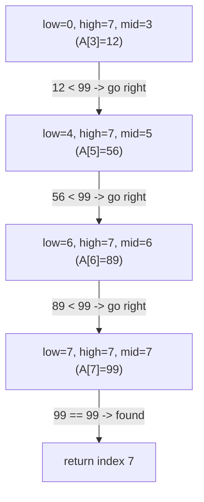

# Binary Search and Ternary Search

## Definition

**Binary search** is an algorithm for locating a target value `x` within a **sorted array** `A` of `n` elements. It works by repeatedly comparing `x` to the middle element of the current search range and discarding the half of the range that cannot contain `x`, until either `x` is found or the range becomes empty.

**Ternary search** refers to two related but distinct techniques, and it is important not to conflate them:

1. **Ternary search over a sorted array** — a generalization of binary search that splits the current range into three parts using two midpoints instead of one, and discards two-thirds of the range (or narrows to the middle third) on each step.
2. **Ternary search over a unimodal function** — an optimization technique that finds the maximum or minimum (the *extremum*) of a unimodal function `f` defined on a continuous or discrete interval `[low, high]`, by repeatedly comparing `f` at two interior points and discarding the third of the domain that provably cannot contain the extremum.

Both variants share the same divide-and-narrow structure, but they solve different problems: the first searches for a known value in sorted data, while the second searches for an unknown optimum of a function whose shape (increasing-then-decreasing, or vice versa) is known in advance. This distinction matters a great deal for correctness and for choosing the right tool, as later sections in this note will make precise.

## Motivation and Problem Context

Linear search inspects array elements one at a time, giving a worst-case running time of $O(n)$. For an array with a billion elements, a linear scan may require up to a billion comparisons. This is wasteful whenever the array has *structure* that a smarter algorithm can exploit.

Sortedness is exactly such a structure. If an array is sorted, a single comparison against any element tells us not just whether that element matches the target, but which *side* of the array the target must lie on if it exists at all. Every element on the other side can be eliminated from consideration without ever being examined. This observation is the seed of binary search: by discarding half the remaining candidates after every comparison, the search space shrinks geometrically, and the number of comparisons needed falls from linear to logarithmic in `n`.

Ternary search over a sorted array pushes the same idea further by discarding a larger fraction of the array per step (using two comparisons to eliminate roughly two-thirds of the range). Ternary search over a unimodal function generalizes the *decrease-and-conquer* narrowing idea to a setting where there is no discrete array to index into at all — only a function whose value can be sampled at any point in a continuous or discrete domain, and whose single-peak (or single-valley) shape guarantees that the same "discard a third and recurse" strategy is safe.

## Problem Formulation

**Binary search (array search).**

- **Input:** A sorted array `A` of `n` elements (ascending or descending, ascending assumed throughout this note), and a target value `x`.
- **Output:** An index `i` such that `A[i] = x`, if one exists; otherwise a report that `x` is not present (conventionally `-1` or `None`).
- **Assumption:** `A` is sorted with respect to the comparison used. Binary search's correctness depends entirely on this assumption.

**Ternary search (array search).**

- **Input:** Same as binary search — a sorted array `A` of `n` elements and a target `x`.
- **Output:** Same as binary search — the index of `x`, or "not found."
- **Assumption:** `A` is sorted. (As shown under Correctness and Common Conceptual Mistakes below, this variant is correct but not advantageous over binary search for this problem.)

**Ternary search (unimodal function optimization).**

- **Input:** A unimodal function `f` defined on an interval `[low, high]` — that is, `f` is strictly increasing (or non-decreasing) up to some point `x*` and strictly decreasing (or non-increasing) after it, or vice versa for finding a minimum.
- **Output:** The point `x*` (or an interval bracketing it, to within a specified tolerance) at which `f` attains its extremum, and optionally the extremal value `f(x*)`.
- **Assumption:** `f` is unimodal on `[low, high]`. Applying ternary search to a non-unimodal function gives no correctness guarantee at all.

## Intuition

**Binary search — the "guess a number" game.** Imagine a game in which one player picks a secret number between 1 and 1000, and the other must guess it, being told after each guess only whether the secret is higher or lower. The best strategy is never to guess 1, then 2, then 3, but instead to guess the midpoint, 500. Whatever feedback comes back, half of the remaining possibilities are eliminated in one move. Repeating this — always guessing the midpoint of what remains — finds the secret number in at most 10 guesses ($\lceil \log_2 1000 \rceil$), rather than up to 1000. Binary search is precisely this game played against a sorted array, where "higher/lower" feedback is the comparison `A[mid]` versus `x`.

**Ternary search — trisecting the range.** Ternary search on an array plays the same game but asks two questions per round instead of one: "is the secret at `mid1`? at `mid2`? or somewhere between, before, or after them?" This narrows the space into three regions instead of two. For a unimodal function, the intuition changes character: rather than eliminating a region because the target *cannot* be there, ternary search eliminates a region because the *extremum cannot lie inside it*, which follows from comparing the function's value at two interior points and using monotonicity on each side of the peak (see Correctness below).

## Algorithmic Paradigm

Binary search and ternary search are both instances of **decrease-and-conquer**, not divide-and-conquer in the fuller sense exemplified by algorithms such as merge sort or quicksort.

The distinction matters:

- **Divide-and-conquer** (e.g., merge sort) splits a problem of size `n` into *multiple* subproblems (typically two, each of size `n/2`), solves *all* of them recursively, and combines their solutions. The recurrence has the shape $T(n) = 2T(n/2) + O(n)$.
- **Decrease-and-conquer** (binary search, ternary search) reduces a problem of size `n` to a *single* smaller subproblem (of size roughly `n/2` or `n/3`) and solves only that one; the other piece(s) of the problem are discarded outright because they are known not to contain the answer. The recurrence has the shape $T(n) = T(n/b) + O(1)$.

Because only one subproblem survives at each step, there is no "combine" phase — the recursive call (or loop iteration) return value *is* the final answer. This is what allows binary and ternary search to run in logarithmic rather than linearithmic time, at the cost of requiring the input to already possess exploitable structure (sortedness or unimodality).

### 4.5.1 Binary Search

Binary search is an efficient **divide-and-conquer** algorithm used to find the position of a target element in a **sorted array**.  
Instead of checking each element sequentially (as in linear search), it repeatedly divides the search space in half, drastically reducing the number of comparisons.

Algorithm:

1. Compare the target element `x` with the middle element of the array.
2. If `x` equals the middle element, return its index.
3. If `x` is smaller, search the left half.
4. If `x` is larger, search the right half.
5. Repeat until the element is found or the range is empty.

!!! example "Example"

    Consider the sorted array: 2 6 8 12 25 56 89 99 and Target = 99

    1. mid = 25 Compare with mid, 25 < 99, Move right
    2. mid = 89, Compare with mid, 89 <99, Move right
    3. Mid = 99, return as 99 = 99

```
BINARY_SEARCH(A, n, x):
    low ← 0
    high ← n - 1
    while low ≤ high:
        mid ← (low + high) / 2
        if A[mid] == x:
            return mid
        else if A[mid] < x:
            low ← mid + 1
        else:
            high ← mid - 1
return -1 // Element not found
```

Time Complexity : O(logn)

### 4.5.2 Ternary Search

Ternary search is another divide-and-conquer technique, similar to binary search.
Instead of dividing the array into two halves, it divides the search space into three parts using two midpoints.

**Algorithm**

- Compute two midpoints:

      - mid1 = low + (high - low) / 3
      - mid2 = high - (high - low) / 3

- Compare the target element x with A[mid1] and A[mid2].
- If x == A[mid1] or x == A[mid2], return that index.
- If x < A[mid1], search the first third.
- If x > A[mid2], search the last third.
- Otherwise, search the middle third.

```
TERNARY_SEARCH(A, low, high, x):
    while low ≤ high:
        mid1 ← low + (high - low) / 3
        mid2 ← high - (high - low) / 3

        if A[mid1] == x:
            return mid1
        if A[mid2] == x:
            return mid2

        if x < A[mid1]:
            high ← mid1 - 1
        else if x > A[mid2]:
            low ← mid2 + 1
        else:
            low ← mid1 + 1
            high ← mid2 - 1
    return -1  // Element not found

```

!!! example "Example"

    A = [1, 3, 5, 7, 9, 11, 13, 15, 17]
    x = 11

    1. low= 1, high = 17

        m1 index =2 value =5, m2 index = 6 value = 13

        compare with m1 and m2, m1 < x < m2

    2. low = 3, high = 5

        m1 index = 3 value = 7, m2 index =5 value = 11, Found

Time Complexity : $O(log_3 n)$

## Visual Explanation

The following diagram traces how binary search narrows the range `[low, high]` for the array `[2, 6, 8, 12, 25, 56, 89, 99]` while searching for `99`, matching the worked example in 4.5.1.



Each level of the tree eliminates half of the remaining candidates; the search terminates after $\lceil \log_2 8 \rceil = 3$ comparisons, matching the algorithm's logarithmic bound.

## Correctness

### Binary Search — Loop Invariant Proof

Claim: if `x` is present in `A`, then at the start of every iteration of the `while` loop, `x` (if present) lies within `A[low..high]`.

- **Initialization.** Before the first iteration, `low = 0` and `high = n - 1`, so `A[low..high]` is the entire array. Trivially, if `x` is present in `A` at all, it is present in `A[low..high]`.

- **Maintenance.** Assume the invariant holds at the start of an iteration: if `x` is in `A`, it is in `A[low..high]`. Let `mid = (low + high) / 2` (integer division).
    - If `A[mid] == x`, the algorithm returns `mid` immediately, which is correct.
    - If `A[mid] < x`, then because `A` is sorted in ascending order, every element in `A[low..mid]` is `≤ A[mid] < x`, so `x` cannot lie in `A[low..mid]`. Hence if `x` is present, it must be in `A[mid+1..high]`. Setting `low ← mid + 1` restores the invariant for the new range.
    - If `A[mid] > x`, symmetric reasoning shows `x`, if present, must lie in `A[low..mid-1]`, and setting `high ← mid - 1` restores the invariant.

- **Termination.** The loop terminates when `low > high`, i.e., when the range `A[low..high]` is empty, or when a match is returned. Each iteration strictly shrinks `high - low`, so the loop must terminate. When it terminates via `low > high` without a match, the invariant guarantees that `x` is not present anywhere in `A` (since it would have had to be in the now-empty range), so returning "not found" is correct.

This is the standard three-part loop-invariant argument, and it is the same proof technique used for any algorithm that narrows a candidate range based on a monotonic comparison.

### Ternary Search on a Unimodal Function — Correctness Sketch

Let `f` be unimodal on `[low, high]`, say increasing then decreasing (the maximum case; minimum is symmetric). Pick two interior points `m1 < m2` (for example, at the one-third and two-thirds marks). Compare `f(m1)` and `f(m2)`:

- If `f(m1) < f(m2)`, the maximum cannot lie in `[low, m1)`. Why: if it did, `f` would have to be decreasing somewhere in `[low, m1]` and then increase again to reach `f(m2) > f(m1)`, which contradicts unimodality (a unimodal function changes direction at most once). Hence the search can safely continue on `[m1, high]`.
- If `f(m1) > f(m2)`, symmetric reasoning shows the maximum cannot lie in `(m2, high]`, so the search continues on `[low, m2]`.
- If `f(m1) == f(m2)`, unimodality guarantees the maximum lies in `[m1, m2]` (the function cannot dip below either endpoint value between them and still be unimodal), so the search continues on `[m1, m2]`.

In every case a positive fraction of the domain is discarded while the invariant "the extremum lies within `[low, high]`" is preserved, and the interval length shrinks geometrically, giving convergence to `x*`.

!!! warning "Ternary search on a sorted array is *not* the same guarantee as ternary search on a unimodal function"
    A very common misconception is that because ternary search "does more work per step," it must be at least as good as binary search for ordinary array search — it is not. Ternary search over a sorted array is correct (it does find `x` if present, by an invariant argument analogous to binary search's, now tracking three sub-ranges instead of two), but the earlier claim that it discards *more* of the array per comparison is misleading once actual comparison counts are considered. As the Complexity Analysis section below shows precisely, ternary search on an array requires *more* total element comparisons in the worst case than binary search does, despite needing fewer iterations. It also gains nothing extra from duplicate or adjacent equal elements — its extra comparison per iteration checks `A[mid1]` and `A[mid2]` separately and provides no additional pruning power that binary search's single comparison lacks. Treat "ternary search over an array" as correct but not competitively useful; reserve ternary search for unimodal function optimization, where it has no binary-search analogue at all (binary search cannot optimize an unknown unimodal function, since there is no target value to compare against).

## Complexity Analysis

**Binary search.** Each iteration performs $O(1)$ work (one comparison decision, or in a three-way comparison model, up to two comparisons: equality and less-than) and reduces the range size by half. Starting from `n` elements, the range size after `k` iterations is $n / 2^k$. The loop ends once the range size reaches 0 or 1, i.e., when $k \approx \log_2 n$. This gives:

- **Worst case:** $O(\log_2 n)$
- **Average case:** $O(\log_2 n)$ (the average depth over all possible positions of `x` is within a small constant of the worst case)
- **Best case:** $O(1)$ (target found at the first midpoint)
- **Space:** $O(1)$ for the iterative version; $O(\log n)$ for a recursive version due to call-stack depth.

**Ternary search (array).** Each iteration performs $O(1)$ work (two comparisons against `A[mid1]` and `A[mid2]`) and reduces the range size to roughly `n/3`. This gives $O(\log_3 n)$ iterations in the worst case, and $O(1)$ auxiliary space for the iterative version.

**Ternary search (unimodal function).** Each iteration evaluates `f` at two points and shrinks the search interval to two-thirds of its previous length, giving $O(\log_{3/2} n)$ iterations to reach a target interval width (this is the relevant bound in the continuous setting; some formulations use different split ratios, changing the base of the logarithm but not the asymptotic class).

### Why Fewer Iterations Does Not Mean Fewer Comparisons

This is the point most often gotten wrong, and it deserves to be stated precisely.

Since $\log_3 n = \dfrac{\log_2 n}{\log_2 3} \approx \dfrac{\log_2 n}{1.585} \approx 0.631 \cdot \log_2 n$, ternary search on an array needs only about **63% as many iterations** as binary search. On the surface this looks like a win. But each ternary-search iteration performs **two** element comparisons (`x` vs. `A[mid1]` and `x` vs. `A[mid2]`), whereas each binary-search iteration performs effectively **one** decisive comparison (`x` vs. `A[mid]`, from which "found / go left / go right" is determined). Multiplying iterations by comparisons per iteration:

$$
\text{Total comparisons (ternary)} \approx 2 \times 0.631 \cdot \log_2 n = 1.26 \cdot \log_2 n
$$

$$
\text{Total comparisons (binary)} \approx 1 \times \log_2 n = \log_2 n
$$

Ternary search therefore performs roughly **26% more comparisons in the worst case than binary search** for the same array-search problem, even though it needs fewer passes through the loop. This is precisely why binary search, not ternary search, is the standard tool for searching a sorted array, and why ternary search's real niche is unimodal function optimization, where there is no analogous "one-comparison-per-step" binary alternative to compete with.

!!! note "Accuracy note"
    This comparison-count argument uses the idealized worst-case comparison counts customarily quoted for these algorithms (one decisive comparison per binary-search step versus two per ternary-search step). Exact constants depend on implementation details (e.g., whether equality and ordering are tested as one machine operation), but the qualitative conclusion — ternary search does not reduce total comparisons relative to binary search for array search — is the standard, well-established result and holds under any reasonable comparison-counting model.

## Recurrence Analysis

**Binary search.**

$$
T(n) = T(n/2) + O(1), \qquad T(1) = O(1)
$$

By the Master Theorem, with $a = 1$, $b = 2$, and $f(n) = O(1) = O(n^0)$, we have $\log_b a = \log_2 1 = 0$, so $f(n) = \Theta(n^{\log_b a})$, placing this in Case 2 of the Master Theorem. This gives:

$$
T(n) = \Theta(n^0 \log n) = \Theta(\log n)
$$

Equivalently, by direct expansion: $T(n) = T(n/2) + c = T(n/4) + 2c = \dots = T(n/2^k) + kc$. Setting $n/2^k = 1$ gives $k = \log_2 n$, so $T(n) = \Theta(\log_2 n)$.

**Ternary search (array).**

$$
T(n) = T(n/3) + O(1), \qquad T(1) = O(1)
$$

By the same reasoning ($a = 1$, $b = 3$, Case 2 of the Master Theorem), $T(n) = \Theta(\log_3 n)$. Since $\log_3 n = \log_2 n / \log_2 3$, this is $\Theta(\log_2 n)$ as well — the same asymptotic class as binary search, differing only by the constant factor discussed above.

## Python Implementation

```python
def binary_search(arr: list[int], target: int) -> int:
    """Return the index of target in sorted arr, or -1 if absent."""
    low, high = 0, len(arr) - 1
    while low <= high:
        mid = low + (high - low) // 2  # overflow-safe midpoint
        if arr[mid] == target:
            return mid
        elif arr[mid] < target:
            low = mid + 1
        else:
            high = mid - 1
    return -1


def ternary_search(arr: list[int], target: int) -> int:
    """Return the index of target in sorted arr using ternary search, or -1."""
    low, high = 0, len(arr) - 1
    while low <= high:
        # If the range is too small for two distinct midpoints,
        # fall back to a direct comparison to avoid mid1 == mid2 issues.
        if high - low < 2:
            for i in range(low, high + 1):
                if arr[i] == target:
                    return i
            return -1

        mid1 = low + (high - low) // 3
        mid2 = high - (high - low) // 3

        if arr[mid1] == target:
            return mid1
        if arr[mid2] == target:
            return mid2

        if target < arr[mid1]:
            high = mid1 - 1
        elif target > arr[mid2]:
            low = mid2 + 1
        else:
            low, high = mid1 + 1, mid2 - 1
    return -1


def ternary_search_unimodal_max(f, low: float, high: float, eps: float = 1e-9):
    """Find the point that (approximately) maximizes a unimodal function f
    on [low, high], using continuous ternary search."""
    while high - low > eps:
        m1 = low + (high - low) / 3
        m2 = high - (high - low) / 3
        if f(m1) < f(m2):
            low = m1        # maximum cannot lie in [low, m1)
        else:
            high = m2       # maximum cannot lie in (m2, high]
    return (low + high) / 2
```

## Code Walkthrough

- `binary_search` follows the pseudocode of 4.5.1 exactly, with one deliberate change: the midpoint is computed as `low + (high - low) // 2` rather than `(low + high) // 2`. This avoids the classic integer-overflow pitfall (discussed below) and is considered best practice even in languages such as Python where integers do not overflow, since it keeps the implementation portable and idiomatic.
- `ternary_search` follows the pseudocode of 4.5.2, with an added guard for the case `high - low < 2`, where `mid1` and `mid2` could otherwise coincide or straddle incorrectly; in that regime it falls back to checking the (at most two) remaining elements directly.
- `ternary_search_unimodal_max` implements the continuous optimization variant described in Problem Formulation and proved correct above. Note that it compares `f(m1)` and `f(m2)` — the *function's values*, not equality against a target — since there is no target to match; the loop instead narrows toward the maximizer until the interval is smaller than a chosen tolerance `eps`.

## Alternative Approaches

| Algorithm | Time Complexity | Requires Sorted Data | When to Use |
|---|---|---|---|
| Linear search | $O(n)$ | No | Small or unsorted arrays; single-pass streaming data |
| Binary search | $O(\log n)$ | Yes | General-purpose search on sorted, randomly-indexable data |
| Ternary search (array) | $O(\log_3 n)$ iterations, more total comparisons than binary | Yes | Rarely preferred over binary search in practice; occasionally used pedagogically |
| Interpolation search | $O(\log \log n)$ average on uniformly distributed data, $O(n)$ worst case | Yes (and ideally uniformly distributed) | Large sorted arrays with roughly uniform key distribution (e.g., numeric keys) |
| Exponential (galloping) search | $O(\log i)$ where `i` is the target's position | Yes | Unbounded or very large sorted arrays/streams where the size is unknown in advance |

Interpolation search improves on binary search by guessing the probable position of the target using linear interpolation between the range endpoints' values, rather than always guessing the midpoint; it performs very well when data is uniformly distributed but degrades to $O(n)$ on adversarial or highly skewed distributions. Exponential search first finds a range `[2^{k-1}, 2^k]` likely to contain the target by repeated doubling, then runs binary search within that range; it is the standard technique for searching sorted but unbounded structures (e.g., an infinite sorted stream) where the array's length is not known up front.

## Trade-Off Analysis

- **Binary search vs. linear search:** binary search trades the simplicity and sort-independence of linear search for a logarithmic time bound, at the cost of requiring the data to be sorted (and re-sorted after updates) and requiring random access (an $O(1)$-time indexing operation), which rules out algorithms like binary search on a plain linked list.
- **Binary search vs. ternary search (array):** ternary search offers no practical advantage for this problem — it is strictly more code, more edge cases (the `mid1 == mid2` degeneracy), and more total comparisons in the worst case, for the same asymptotic class. It is included here mainly to sharpen the distinction between "fewer iterations" and "less total work," a distinction that recurs throughout algorithm analysis.
- **Ternary search vs. other optimization techniques (unimodal case):** for optimizing a unimodal function, ternary search trades a small constant-factor inefficiency (it discards only one-third of the domain per two evaluations) for simplicity, compared to golden-section search, which reuses one of the two function evaluations from the previous iteration and thus achieves the same asymptotic convergence rate with roughly half as many function evaluations. When function evaluations are expensive, golden-section search is generally preferred; when they are cheap, the difference is immaterial and ternary search's simplicity wins.

## Edge Cases

- **Empty array** (`n = 0`): `low = 0`, `high = -1`, so `low > high` immediately; both binary and ternary search correctly return "not found" without ever executing the loop body.
- **Single-element array:** binary search sets `mid = low = high` and resolves in one comparison. Ternary search must rely on its small-range guard (`high - low < 2`) to avoid attempting to compute two distinct midpoints from a single index.
- **Target not present:** both algorithms terminate correctly once the range becomes empty (`low > high`), and the loop invariant guarantees the target is genuinely absent from `A`.
- **Duplicate elements:** if `x` occurs multiple times in `A`, both algorithms as written return *some* valid index of an occurrence of `x`, but not necessarily the first or last one. Finding the first/last occurrence requires a modified "find boundary" binary search that continues narrowing even after a match is found (a common interview variant).
- **Array not actually sorted:** both algorithms silently produce incorrect or inconsistent results (they may return "not found" for a present element, or a wrong index) because the entire correctness argument depends on sortedness; neither algorithm detects or reports this violated precondition.
- **Ternary search on a non-unimodal function:** the correctness proof for the unimodal optimization variant collapses entirely, since the argument that "the extremum cannot lie in the discarded third" relies on the function changing direction at most once. On a function with multiple local optima, ternary search can converge to an arbitrary local extremum, or to a point that is not an extremum at all.

## Common Implementation Pitfalls

- **Integer overflow in `mid = (low + high) / 2`.** In fixed-width integer languages (C, C++, Java), if `low` and `high` are both large, their sum `low + high` can overflow the integer type before the division happens, producing a negative or wrapped-around midpoint and corrupting the search. The standard fix, `mid = low + (high - low) / 2`, never sums two large values directly, so it cannot overflow (`high - low` is bounded by the array size). The pseudocode in 4.5.1 uses `mid ← (low + high) / 2` for clarity of exposition; production code should always prefer the overflow-safe form.
- **Off-by-one errors in loop bounds.** Using `low < high` instead of `low ≤ high` (or vice versa) can cause the algorithm to miss the target when the search range collapses to a single element, or to terminate one iteration early.
- **Infinite loops from an incorrect boundary update.** Setting `low = mid` (instead of `mid + 1`) or `high = mid` (instead of `mid - 1`) when narrowing the range can leave the range unchanged when `low` and `high` are adjacent, causing the loop to spin forever without making progress.
- **`mid1 == mid2` in ternary search when `high - low < 2`.** When the range has only one or two elements, the formulas `mid1 = low + (high - low)/3` and `mid2 = high - (high - low)/3` can produce the same index for both, or leave a gap that the subsequent narrowing logic does not handle correctly. Implementations must special-case small ranges explicitly, as shown in the Python implementation above.

## Common Conceptual Mistakes

- **"Ternary search must be faster than binary search because it splits into three parts instead of two, and $3 > 2$."** This is false, as derived quantitatively in Complexity Analysis: ternary search needs fewer iterations ($\log_3 n$ vs. $\log_2 n$) but each iteration costs more comparisons (two vs. one), and the net effect is that ternary search performs *more* total comparisons than binary search for plain array search. The number of iterations alone is not a valid proxy for total work; the cost per iteration must always be accounted for.
- **"Ternary search works on any sorted array exactly the way binary search does, just with an extra midpoint."** While ternary search is correct on any sorted array, its extra midpoint provides no correctness or performance benefit that binary search's single midpoint lacks; it is not a strictly stronger technique, and treating it as a drop-in "upgrade" to binary search misunderstands why binary search is preferred in practice.
- **Confusing the two forms of ternary search.** Ternary search over a sorted array (Correctness via loop invariant, similar to binary search) and ternary search over a unimodal function (Correctness via a monotonicity/unimodality argument) rely on entirely different justifications. Treating them as interchangeable — e.g., assuming the array-search version can be used to optimize a function, or that the unimodal-optimization version can search for an arbitrary value in an arbitrary sorted array — is a category error.

## Important Properties and Invariants

- **Binary search's invariant:** if `x` is in `A`, it is in `A[low..high]`, maintained by the sortedness (monotonicity) of `A` under the comparison operator used.
- **Ternary search's (array) invariant:** analogous — if `x` is in `A`, it is in `A[low..high]` — maintained the same way, just partitioned into three regions per step instead of two.
- **Ternary search's (unimodal function) invariant:** the extremum `x*` lies within `[low, high]`, maintained by the unimodality property (the function changes monotonic direction at most once on the domain).
- Both binary and ternary search rely on **monotonic decidability**: at any point examined, it must be possible to determine, in $O(1)$ time, which remaining region can be safely discarded. This is what sortedness provides for array search and unimodality provides for function optimization; without such a property, neither technique applies.

## When to Use

- The data is sorted (or can be kept sorted cheaply) and supports $O(1)$ random access (arrays, not linked lists) — use **binary search**.
- The problem is to search a large, static or infrequently-updated sorted collection repeatedly (e.g., an index, a lookup table, a dictionary structure) — use **binary search**.
- The problem is to optimize (find the maximum or minimum of) a function known to be unimodal on some interval, and evaluating the function is not prohibitively expensive — use **ternary search** (or golden-section search if evaluations are costly).
- "Binary search the answer": many optimization problems in competitive programming ask for the smallest/largest value satisfying a monotonic predicate; binary search over the answer space is a standard and powerful pattern.

## When NOT to Use

- Do not use binary or ternary search on unsorted data without sorting it first (and only if the cost of sorting, $O(n \log n)$, is amortized over enough subsequent searches to be worthwhile).
- Do not use array-based binary/ternary search on data structures without efficient random access, such as singly or doubly linked lists; a linear scan (or a different structure, such as a skip list) is more appropriate there.
- Do not use ternary search over an array expecting a performance advantage over binary search — as shown above, none exists for this problem.
- Do not use ternary search (or any unimodal-optimization technique) on a function that is not known to be unimodal; the result is unreliable and there is no correctness guarantee.

## Real-World Applications

- **Binary search:** locating records in a sorted database index (B-tree-based indexes ultimately rely on binary-search-like narrowing within each node); the `bisect` module in Python's standard library and analogous library functions in other languages; version-control "bisect" tools (e.g., `git bisect`) that binary search over a sequence of commits to find the one that introduced a bug; searching sorted log files or time-series data by timestamp.
- **Ternary search:** widely used in competitive programming to find the minimum or maximum of a unimodal cost function (for example, minimizing a convex total-distance function, or finding the optimal split point in a parameter that trades off two competing costs); more generally, any one-dimensional convex optimization problem where evaluating the objective is easy but no closed-form derivative is available.

## Engineering Perspective

In production systems, binary search is rarely written by hand for simple cases — standard libraries provide it (e.g., Python's `bisect_left`/`bisect_right`, Java's `Arrays.binarySearch`, C++'s `std::lower_bound`/`std::upper_bound`), and these are preferred over hand-rolled implementations because they are heavily tested against the exact pitfalls listed above. Hand-written binary search is still common in interview and competitive-programming contexts, and in specialized settings (e.g., searching over an implicit, unmaterialized answer space, or embedded/low-level code without library access). Ternary search sees comparatively little production use outside of optimization-heavy domains (graphics, numerical computing, competitive programming), since most real-world "find the value" problems map to binary search or to hash-based lookups instead.

## Performance Considerations

- **Cache behavior.** Binary search's memory access pattern jumps around the array (first to the middle, then to a quarter or three-quarters point, and so on), which tends to produce poor cache locality on large arrays, since consecutive accesses are far apart in memory. By contrast, a linear scan accesses memory sequentially, which is highly cache-friendly and can benefit from prefetching. For small arrays that fit within one or a few cache lines, a simple linear scan can actually outperform binary search in wall-clock time despite its worse asymptotic complexity — this is why many highly optimized library implementations (e.g., some `std::sort`-adjacent utilities) fall back to linear scanning below a small size threshold.
- **Branch prediction.** Binary search's comparison outcome is essentially unpredictable from one call to the next (which branch is taken depends on the data and the target), which can cause frequent branch mispredictions on modern pipelined CPUs; some highly tuned implementations use branchless binary search variants to mitigate this.
- **Ternary search's extra comparisons** (two per iteration rather than one) compound both of the above effects: more comparisons, and typically two additional cache-unfriendly jumps per iteration rather than one, reinforcing why it is rarely chosen for array search in performance-sensitive code.

## Testing Strategy

- Unit test both algorithms against: an empty array, a single-element array (both a hit and a miss), an even-length and an odd-length array, a target smaller than every element, a target larger than every element, a target equal to the first element, a target equal to the last element, an array containing duplicates of the target, and a large randomly generated sorted array checked against Python's own `list.index` (or `bisect`) as an oracle.
- For the unimodal-function ternary search, test against functions with a known closed-form extremum (e.g., a parabola $f(x) = -(x-3)^2 + 5$), verifying the returned point is within the chosen tolerance `eps` of the true optimum.
- Property-based testing (e.g., using `hypothesis` in Python) is well suited here: generate random sorted arrays and random targets, and assert the returned index (if any) actually satisfies `arr[index] == target`, and that "not found" is returned if and only if the target is genuinely absent.

## Debugging Strategy

- If a binary or ternary search implementation seems to loop forever, first check the boundary-update lines (`low = mid + 1` / `high = mid - 1` for binary search; the three branches for ternary search) — an incorrect update that leaves `low`/`high` unchanged when they are adjacent is the most common cause.
- If the algorithm consistently misses a target that is present, add a trace print of `(low, high, mid)` (or `(low, high, mid1, mid2)`) at the top of each iteration and check whether the range is being narrowed on the correct side of the comparison — a flipped `<` and `>` is a common source of this bug.
- If results are inconsistent only on arrays with duplicates, remember that plain binary/ternary search returns *an* occurrence, not necessarily the first or last; this is expected behavior, not a bug, unless a boundary-search variant was intended.

## Related Algorithms and Concepts

- **Interpolation search** — refines binary search's fixed-midpoint strategy by estimating the target's likely position from the values at the range endpoints; effective on large, uniformly distributed numeric data.
- **Exponential (galloping) search** — locates a bounding range via repeated doubling before invoking binary search inside it; used for unbounded or very large sorted sequences.
- **Golden-section search** — the continuous analogue of ternary search for unimodal function optimization, distinguished by reusing one function evaluation between iterations (via the golden ratio) to achieve the same convergence rate with fewer function evaluations.
- **Binary search on the answer** — a problem-solving pattern (not a distinct algorithm) in which binary search is applied not to an array of stored values but to a monotonic predicate over a range of candidate answers, common in competitive programming.
- **Bisection method** (numerical analysis) — closely related in spirit to binary search: it locates a root of a continuous function by repeatedly halving an interval known (via the intermediate value theorem) to contain a sign change.

## Serviceable Mental Model

Think of binary search as **"ask one yes/no-shaped question that eliminates half the possibilities, every time."** Think of ternary search over an array as the same idea with a slightly more expensive question that eliminates a differently-shaped set of possibilities, without actually being a better question. Think of ternary search over a unimodal function as **"climbing a single hill by comparing two nearby points on its slope and always stepping away from the side that is provably going downhill."**

## Complexity Summary

| Algorithm | Best Case | Average Case | Worst Case | Space |
|---|---|---|---|---|
| Linear search | $O(1)$ | $O(n)$ | $O(n)$ | $O(1)$ |
| Binary search | $O(1)$ | $O(\log n)$ | $O(\log n)$ | $O(1)$ iterative, $O(\log n)$ recursive |
| Ternary search (array) | $O(1)$ | $O(\log_3 n)$ iterations (more comparisons than binary) | $O(\log_3 n)$ iterations | $O(1)$ iterative, $O(\log n)$ recursive |
| Ternary search (unimodal, continuous) | — | $O(\log_{3/2}(1/\varepsilon))$ to reach tolerance $\varepsilon$ | same | $O(1)$ |
| Interpolation search | $O(1)$ | $O(\log \log n)$ (uniform data) | $O(n)$ | $O(1)$ |
| Exponential search | $O(1)$ | $O(\log i)$ | $O(\log i)$ | $O(1)$ |

## Algorithm Design Checklist

- [ ] Is the array actually sorted with respect to the comparison being used?
- [ ] Does the data structure support $O(1)$ random access (needed for array-based binary/ternary search)?
- [ ] Is the midpoint computed as `low + (high - low) / 2` (or `/3`) rather than `(low + high) / 2`, to avoid overflow?
- [ ] Are the loop bounds (`low ≤ high` vs. `low < high`) and boundary updates (`mid ± 1`) consistent and provably progress-making?
- [ ] If duplicates may be present, is a boundary-search variant needed (first/last occurrence), or is any occurrence acceptable?
- [ ] For ternary search on a function, has unimodality actually been established (not just assumed)?
- [ ] For ternary search on an array, is binary search a strictly better choice for this use case (almost always yes)?

## Final Summary

Binary search exploits sortedness to reduce search time from linear to logarithmic by discarding half of the remaining candidates with each comparison, and its correctness follows from a standard loop-invariant argument. Ternary search generalizes the same decrease-and-conquer idea in two directions: as an array-search technique (correct, but not more efficient than binary search once total comparisons are counted properly), and as a unimodal function optimization technique (where it has no binary-search analogue and is genuinely useful). Both algorithms are decrease-and-conquer, not full divide-and-conquer, since each step retains only one surviving subproblem. The most important, and most frequently misunderstood, quantitative fact in this topic is that ternary search's fewer iterations do not translate into fewer comparisons for array search — a reminder that asymptotic iteration counts and total work are not the same thing, and that "more branches" does not automatically mean "more efficient."

## Key Takeaways

- Binary search reduces $O(n)$ linear search to $O(\log_2 n)$ by discarding half the remaining range per comparison, relying entirely on sortedness.
- Both binary and ternary search are **decrease-and-conquer** algorithms: exactly one subproblem survives each step, unlike true divide-and-conquer algorithms such as merge sort.
- Binary search's correctness is proven via a loop invariant with the standard Initialization/Maintenance/Termination structure.
- Ternary search over a sorted array is correct but performs more total comparisons than binary search in the worst case ($\approx 1.26 \log_2 n$ vs. $\log_2 n$), because its 37% iteration savings is outweighed by needing two comparisons per iteration instead of one.
- Ternary search over a unimodal function is a distinct technique from ternary search over a sorted array, correct under a unimodality assumption, and has no direct binary-search counterpart.
- Always compute midpoints as `low + (high - low) / k` rather than `(low + high) / k` to avoid integer overflow.
- Ternary search on very small ranges (`high - low < 2`) needs an explicit guard to avoid degenerate or coincident midpoints.
- Binary search is preferred over ternary search for plain array search in virtually every practical situation; ternary search's niche is unimodal optimization, where golden-section search is its more evaluation-efficient continuous cousin.
- Poor correctness in either algorithm most often traces back to an unsorted (or non-unimodal) input, an off-by-one loop bound, or an incorrect boundary update — check these first when debugging.

## Practice Problems

**Beginner**

1. Given a sorted array of `n` integers and a target `x`, implement binary search and return the index of `x`, or `-1` if absent. Constraints: `1 ≤ n ≤ 10^5`.
2. Given a sorted array, implement ternary search and return the index of a target `x`, or `-1` if absent. Constraints: `1 ≤ n ≤ 10^5`.
3. Given a sorted array that may contain duplicates, find the first occurrence of a target `x`. Constraints: `1 ≤ n ≤ 10^5`.
4. Given a sorted array that may contain duplicates, find the last occurrence of a target `x`. Constraints: `1 ≤ n ≤ 10^5`.
5. Given a sorted array, count the number of occurrences of a target `x` using binary search (not a linear scan). Constraints: `1 ≤ n ≤ 10^5`.

**Intermediate**

1. Given a sorted array that has been rotated at an unknown pivot, search for a target `x` in $O(\log n)$ time. Constraints: `1 ≤ n ≤ 10^5`, all elements distinct.
2. Given an array that is first strictly increasing and then strictly decreasing (a "mountain array"), find the index of its peak element using a binary-search-style approach. Constraints: `3 ≤ n ≤ 10^5`.
3. Given a unimodal function `f(x) = -(x - k)^2 + c` for unknown constants `k` and `c`, sampled only at integer points on `[low, high]`, find the integer `x` that maximizes `f` using ternary search. Constraints: `1 ≤ high - low ≤ 10^6`.
4. Given two sorted arrays of sizes `m` and `n`, find their median in $O(\log(\min(m, n)))$ time using a binary-search-based partitioning approach.
5. Given a sorted array of floating-point numbers, find the index of the closest value to a given target `x` (not necessarily an exact match).

**Advanced**

1. Given a monotonic (non-decreasing) function `f: [0, 10^9] → int`, find the smallest `x` such that `f(x) ≥ k`, using binary search on the answer, in $O(\log(10^9))$ evaluations of `f`.
2. Given `n` workers and `m` tasks with known completion times, use binary search on the answer to find the minimum time `T` such that all tasks can be completed within `T` (a classic "minimize the maximum" allocation problem).
3. Given a convex function representing total cost as a function of a single real-valued parameter, use ternary search to find the parameter value minimizing cost, to within a tolerance of $10^{-6}$.
4. Prove formally, using the Master Theorem, that $T(n) = T(n/3) + O(1)$ solves to $\Theta(\log n)$, and derive the exact constant factor relating $\log_3 n$ to $\log_2 n$.
5. Design and prove correct a variant of binary search that finds the boundary index `i` such that a given predicate `P` is false for all indices `< i` and true for all indices `≥ i`, given that `P` is monotonic.

**Interview / Competitive Programming**

1. "Search in Rotated Sorted Array" (a well-known interview problem): search for a target in $O(\log n)$ time in a sorted array rotated at an unknown pivot, handling duplicates as a follow-up.
2. "Median of Two Sorted Arrays": find the median of two sorted arrays in $O(\log(\min(m, n)))$ time (a frequently asked hard-level interview problem).
3. "Koko Eating Bananas" style problem: given piles of bananas and a time limit, use binary search on the answer to find the minimum eating speed that finishes all piles in time.
4. "Aggressive Cows" style problem: given positions of stalls, use binary search on the answer to place `k` cows maximizing the minimum distance between any two cows.
5. Given a unimodal array (strictly increasing then strictly decreasing), determine in $O(\log n)$ time whether a target value `x` exists anywhere in the array (hint: use the peak found via a mountain-array search, then binary search each monotonic half).

## Questions

**Conceptual:** Why is binary search classified as decrease-and-conquer rather than divide-and-conquer, despite the name "binary" suggesting a two-way split similar to merge sort?

**Analytical:** Derive the exact worst-case number of comparisons made by binary search on an array of size `n`, and compare it to the exact worst-case number of comparisons made by ternary search on the same array.

**Design:** How would you design a search algorithm for an array so large it does not fit in memory, but is stored sorted on disk, where random access is comparatively expensive relative to sequential access? Would you still choose binary search?

**Correctness:** Write out the loop invariant for the "find first occurrence" variant of binary search, and prove its Initialization, Maintenance, and Termination.

**Scenario:** You are asked to find the minimum of a function that is known to have exactly two local minima on its domain (not unimodal). Explain precisely why ternary search fails here, and propose an alternative approach.

**Troubleshooting:** A colleague's binary search implementation passes all tests except ones with very large arrays (`n > 2^30`) in a language with 32-bit integers, where it sometimes returns wrong answers. Diagnose the likely bug and the fix.

**Comparative:** Under what circumstances, if any, would ternary search over a sorted array actually be preferable to binary search? Justify your answer using the comparison-count analysis from this note.

## Final Practice Set

**Beginner**

1. Implement recursive binary search and verify it returns identical results to the iterative version on 100 randomly generated sorted arrays.
2. Given a sorted array of strings, adapt binary search to find a target string using lexicographic comparison.
3. Given a sorted array, use binary search to determine the number of elements strictly less than a given value `x`.
4. Trace ternary search by hand on the array `[2, 4, 6, 8, 10, 12, 14]` searching for `x = 4`, listing `low`, `high`, `mid1`, `mid2` at each step.
5. Explain, in your own words, why binary search requires the input array to be sorted, using a concrete counterexample on an unsorted array where it returns a wrong answer.

**Intermediate**

1. Given a sorted 2D matrix where each row and column is sorted ascending, search for a target value in better than $O(m + n)$ time using a binary-search-based approach.
2. Given an infinite (or unbounded-length) sorted stream where only sequential access up to any index is available, implement exponential search followed by binary search to find a target.
3. Implement interpolation search and empirically compare its number of comparisons to binary search on 10,000 uniformly distributed sorted integers.
4. Given a unimodal array, find both the peak index and, given a target value less than the peak, determine on which side (ascending or descending half) it lies before searching.
5. Modify ternary search so that it works correctly and efficiently at the boundary case `high - low == 1`, and justify why the standard formulas fail there.

**Advanced**

1. Prove that binary search performs the minimum possible number of comparisons, in the worst case, among all comparison-based algorithms for searching a sorted array (a decision-tree lower-bound argument).
2. Given a convex function sampled with noisy (slightly randomized) evaluations, discuss whether ternary search remains correct, and propose a modification if it does not.
3. Derive the exact convergence rate (interval-shrinkage factor per evaluation) of golden-section search and show why it improves on plain ternary search's $2/3$ shrinkage factor per two evaluations.
4. Given `k` sorted arrays each of size `n`, design an algorithm using binary search to find the `m`-th smallest element across all of them combined, better than merging all arrays.
5. Formally define "unimodal" for a discrete (integer-domain) function and identify the precise condition under which the discrete ternary search correctness proof (adapted from the continuous case) still holds.

**Interview / Competitive Programming**

1. "Split Array Largest Sum": binary search on the answer to partition an array into `k` contiguous subarrays minimizing the largest subarray sum.
2. "Find Peak Element" (LeetCode-style): find any local peak in an array in $O(\log n)$ time without assuming full unimodality.
3. "Capacity to Ship Packages Within D Days": binary search on the answer to find the minimum ship capacity.
4. Given a sorted array and a number `k`, find the `k` closest elements to a given value `x` in $O(\log n + k)$ time using binary search to locate the insertion point.
5. A classic ternary-search CP problem: given a tent-shaped (unimodal) profit function over integer quantities produced, find the production quantity maximizing profit, and argue why ternary search (not binary search) is the appropriate tool here.
