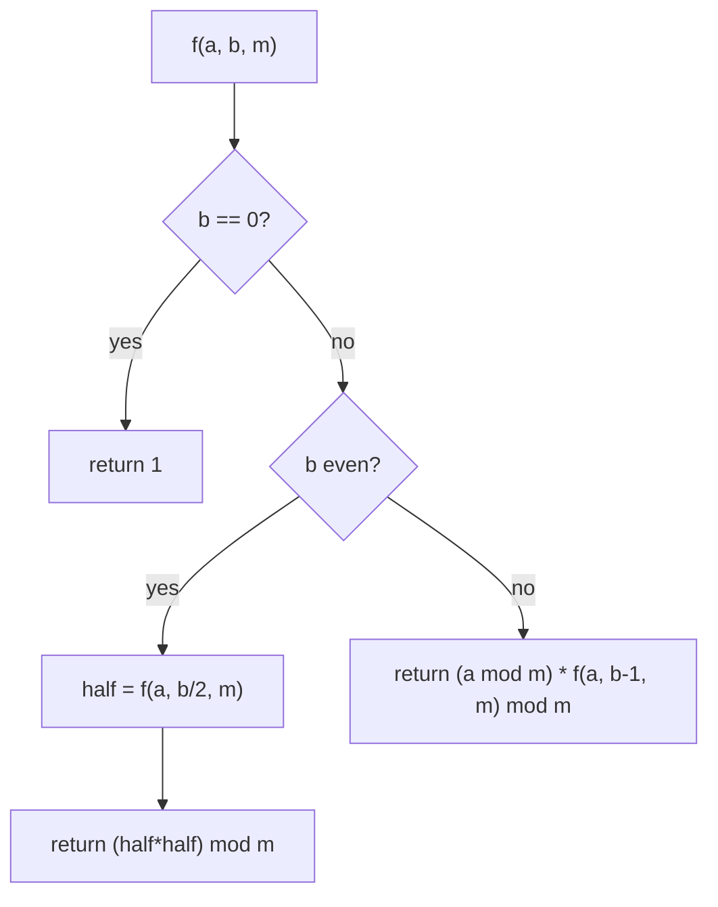

# Efficient Modular Exponentiation

Modular exponentiation is a technique to compute: $(a^b) \mod m$ efficiently

It’s widely used in **cryptography**, **number theory**, and **computer algorithms**, especially when the exponent \( b \) is very large.

---

## Definition

Modular exponentiation is the problem of computing $a^b \bmod m$ for integers $a$ (the base), $b$ (the exponent), and $m$ (the modulus), without ever constructing the full, potentially astronomical integer $a^b$ before reducing it. Formally, we want the unique integer $r$ with $0 \le r < m$ such that $r \equiv a^b \pmod m$, computed using an amount of arithmetic work that scales with the *number of bits* needed to represent $b$, rather than with the numeric value of $b$ or the size of $a^b$ itself. "Efficient" here specifically means avoiding the naive strategy of first forming $a^b$ in full and only then reducing it modulo $m$.

## Problem Formulation

**Input:** integers $a$, $b$, $m$ with $b \ge 0$ and $m \ge 1$. In cryptographic applications such as RSA, $b$ and $m$ are typically very large — commonly 2048-bit numbers, i.e. integers with roughly 600 decimal digits.

**Output:** the value $a^b \bmod m$, an integer in the range $[0, m)$.

**Constraints and assumptions:**

- $b$ and $m$ may be far too large for the exact integer $a^b$ to ever be materialized; the algorithm must keep every intermediate value bounded by roughly $m^2$ before each reduction, never by $a^b$ itself.
- At cryptographic scale, ordinary fixed-width machine integers are insufficient; the algorithm is implemented on top of arbitrary-precision (big-integer) arithmetic.
- This topic restricts attention to $b \ge 0$. Extending the idea to a "negative exponent" (a modular inverse) is discussed under Related Algorithms and Concepts.

## Intuition

Section 4.6.1 shows that computing $a^b \bmod m$ the naive way costs $b - 1$ multiplications — one multiplication per unit increase of the exponent. The key inefficiency is that the naive method treats the exponent additively: it builds $a^b$ up one factor of $a$ at a time, so the work is proportional to the *value* of $b$, not to how much information $b$ actually carries.

The insight behind a faster algorithm is that exponentiation can instead be built up multiplicatively by repeated squaring. If $b$ is even, then

$$
a^{b} = \left(a^{\,b/2}\right)^{2},
$$

so $a^b$ can be obtained from $a^{b/2}$ with just one extra squaring, regardless of how large $b$ is. If $b$ is odd,

$$
a^{b} = a \cdot a^{\,b-1} = a \cdot \left(a^{\,(b-1)/2}\right)^{2},
$$

so one extra multiplication by $a$ handles the leftover factor before squaring. Each application of this idea *halves* the exponent, so instead of peeling off one unit of $b$ per step (as the naive method does), repeated squaring peels off one **bit** of $b$ per step. Since a $b$-bit-value exponent has only $\lceil \log_2(b+1)\rceil$ bits, the number of steps collapses from $O(b)$ to $O(\log b)$ — the same asymptotic gain that halving intervals gives binary search over linear search. This is precisely the mechanism formalized as the square-and-multiply algorithm in Section 4.6.2.

## Algorithmic Paradigm

Binary (square-and-multiply) exponentiation is an instance of the **decrease-and-conquer** paradigm, specifically *decrease by a constant factor*: each step reduces the problem of computing $a^{b} \bmod m$ to a strictly smaller subproblem of computing $a^{\lfloor b/2 \rfloor} \bmod m$ (or the analogous odd case), shrinking the exponent by roughly half at every step, and then combines the subproblem's answer with $O(1)$ extra work (a squaring, and possibly one multiplication). This is distinct from a *divide-and-conquer* algorithm such as merge sort, which splits into multiple independent subproblems that are solved separately and merged — here there is exactly one subproblem per step, so the recursion is a simple chain rather than a branching tree. It is also distinct from a *greedy* or *dynamic programming* strategy: there is no choice to make and no overlapping subproblems to memoize, only a mechanical halving of the exponent at each stage.

---

### 4.6.1 Naive Approach to Modular Exponentiation

**Idea:**

The naive method directly computes \( a^b \) and then takes modulo \( m \).

\[
result = (a^b) \mod m
\]

**Algorithm:**

1. Initialize `result = 1`
2. Multiply `result` by `a`, `b` times
3. Take modulo \( m \) at the end.

**Pseudocode:**

```python
def naive_modular_pow(a, b, m):
    result = 1
    for i in range(b):
        result = result * a
    return result % m
```

Time Complexity: **O(b)** multiplications
Impractical for large exponents: If b = $2^{1000}$, we'd need $2^{1000}$ multiplications
Example: Computing $5^{100} \mod 13$ would require 100 multiplications
Even with modular reduction at each step, still too slow for cryptographic purposes

### 4.6.2 Square-and-multiply algorithm

Write the exponent \(b\) in binary and use its bits to decide when to multiply. This reduces the number of multiplications to about the number of bits in \(b\) (i.e., \(O(\log b)\)).

**Step**

To compute $a^b \mod m$

1.  Convert the Exponent "b" to Binary
2.  Start from the most significant bit (MSB).
3.  initialize result = 1
4.  For each bit in the binary representation (from left to right):

    - Square the current result
    - If the current bit is 1, multiply by the base a
    - Take modulo 𝑚 after each step.

!!! example "Example"

    Question : $10^{25} \mod 58$

    - **step 1**: convert 25 to binary : $25_{10} = (11001)_2$
    - **step 2**: result = 1
    - **step 3**:
        - checking first bit is equal  to 1, therefore sqaure the result and multiply with base "a" and find the modulo
        - $1^2 \times 10 \mod 58$ = 10
        - update the table

    |Bits → | 1 | 1 | 0 | 0 | 1 |
    |-------|---|---|---|---|---|
    |result →| 10|   |   |   |   |

    - **step 4**:
        - checking second bit is equal  to 1, therefore sqaure the result and multiply with base "a" and find the modulo
        - $10^2 \times 10 \mod 58$ = 14
        - update the table

    |Bits → | 1 | 1 | 0 | 0 | 1 |
    |-------|---|---|---|---|---|
    |result → | 10| 14  |   |   |   |

    - **step 5**:
        - checking second bit is equal  to 0, therefore sqaure the result and find the modulo
        - $14^2 \mod 58$ = 22
        - update the table

    |Bits → | 1 | 1 | 0 | 0 | 1 |
    |-------|---|---|---|---|---|
    |result → | 10| 14  | 22  |   |   |

    - **step 6**:
        - checking second bit is equal  to 0, therefore sqaure the result and multiply with base "a" and find the modulo
        - $22^2 \mod 58$ = 20
        - update the table

    |Bits → | 1 | 1 | 0 | 0 | 1 |
    |----|---|---|---|---|---|
    |result → | 10| 14  | 22  | 20 |   |

    - step 7:
        - checking second bit is equal  to 1, therefore sqaure the result and multiply with base "a" and find the modulo
        - $00^2 \times 10 \mod 58$ = 56
        - update the table

    |Bits → | 1 | 1 | 0 | 0 | 1 |
    |----|---|---|---|---|---|
    |result → | 10| 14  |  22 | 20  | 56  |

    ** final result** : $10^{25} \mod 58$ = 56

```
function modular_exponentiation(base, exponent, modulus):
    result = 1
    base = base mod modulus

    while exponent > 0:
        if exponent is odd:
            result = (result × base) mod modulus
        base = (base × base) mod modulus
        exponent = exponent >> 1  // right shift (divide by 2)

    return result
```

**Time Complexity**

- Bit length of exponent: $k = ⌈log₂(b)⌉$
- Number of squarings: $k - 1$ (one for each bit except the first)
- Number of multiplications: Approximately $k/2$ on average (for half the bits being 1) i.e, Each iteration halves the exponent.
- Total operations: O(k) = $O(log b)$ modular multiplications
- Modulo at every step keeps numbers manageable.
- Comparison: Naive O(b) vs Efficient O(log b)

---

!!! info "Two equivalent bit orders"
    The worked example above scans the bits of $b$ from **left to right (MSB-first)**, squaring the running result at every step and multiplying by $a$ whenever the current bit is 1. The pseudocode instead scans bits **right to left (LSB-first)**, via `exponent >> 1`, squaring the *base* rather than the *result* at each step and folding a bit-1 contribution into `result` directly. Both are correct implementations of square-and-multiply; they differ only in which variable accumulates the squarings and in which end of the bit string is consulted first. The Correctness and Python Implementation sections below formalize and implement the right-to-left (pseudocode) version, since it is the one already given in this section, and the left-to-right version is presented afterward as an alternative.

## Correctness

We prove the square-and-multiply algorithm of Section 4.6.2 correct using a **loop invariant** on its `while exponent > 0` loop. Let $a$, $b$, $m$ denote the original inputs, and let `base`, `exponent`, `result` denote the algorithm's variables at the start of a given iteration.

**Invariant.** At the top of every iteration of the while loop,

$$
result \times base^{\,exponent} \bmod m \;=\; a^{\,b} \bmod m .
$$

**Initialization.** Before the loop runs, `result = 1`, `base = a mod m`, `exponent = b`. Then $result \times base^{exponent} = 1 \times (a \bmod m)^{b} \equiv a^{b} \pmod m$, so the invariant holds before the first iteration.

**Maintenance.** Suppose the invariant holds at the start of an iteration with `exponent = e > 0`. The loop body distinguishes exactly the two cases used in the pseudocode:

- *If $e$ is odd:* the algorithm sets `result ← (result × base) mod m`, then `base ← (base × base) mod m`, `exponent ← e >> 1 = (e-1)/2`. Ignoring the modular reductions for a moment, the new triple satisfies
$$
result' \times (base')^{\,exponent'} = (result \cdot base)\times(base^{2})^{(e-1)/2} = result \times base^{\,1+(e-1)} = result \times base^{\,e},
$$
  which is exactly the pre-update quantity. Because $(xy) \bmod m = \big((x \bmod m)(y \bmod m)\big) \bmod m$ (the multiplicative invariant proved in the next section), replacing any factor by its residue mod $m$ at any point never changes the final residue mod $m$. Hence $result' \times (base')^{exponent'} \equiv result \times base^{e} \equiv a^{b} \pmod m$.

- *If $e$ is even:* `result` is left untouched and only `base ← (base \times base) \bmod m`, `exponent ← e/2` change. Then $result' \times (base')^{exponent'} = result \times (base^{2})^{e/2} = result \times base^{e}$, again congruent mod $m$ to the value before the update.

In both branches the invariant is preserved into the next iteration.

**Termination.** `exponent` is a non-negative integer that is right-shifted (halved, rounding down) every iteration, so it strictly decreases and reaches $0$ after exactly $\lceil \log_2(b+1) \rceil$ iterations. When the loop exits, `exponent = 0`, and the invariant gives $result \times base^{0} = result \equiv a^{b} \pmod m$. Since every assignment to `result` in the algorithm is immediately reduced modulo $m$, the returned `result` already satisfies $0 \le result < m$, so it is exactly $a^{b} \bmod m$. $\blacksquare$

The same argument, mirrored, justifies the left-to-right (MSB-first) variant used in the worked example: there the invariant is stated on `result` alone, namely "after processing the first $i$ bits of $b$ (from the MSB), `result` $\equiv a^{\,b_i}\pmod m$, where $b_i$ is the integer formed by those $i$ bits." Squaring `result` corresponds to shifting $b_i$ left by one bit, and multiplying by $a$ when the next bit is 1 corresponds to setting that new low-order bit — exactly what steps 3–7 of the worked example do.

## Complexity Analysis

Let $k = \lceil \log_2(b+1) \rceil$ denote the number of bits needed to represent $b$ (so $k \approx \log_2 b$ for large $b$).

**Time complexity.**

- The while loop of Section 4.6.2 runs exactly $k$ times — once per bit of $b$.
- Every iteration performs exactly one modular squaring (`base = (base*base) mod m`), and conditionally one further modular multiplication (`result = (result*base) mod m`) precisely when the corresponding bit of $b$ is 1.
- The total work is therefore $k$ squarings plus at most $k$ multiplications, i.e. $O(k) = O(\log b)$ modular multiplications overall — this is the derivation behind the bound already stated in 4.6.2, now obtained directly from the bit-length of $b$ rather than merely asserted.
- If a modular multiplication of two $n$-bit numbers costs $M(n)$ (e.g. $O(n^2)$ for schoolbook multiplication, or lower with faster multiplication algorithms), the full bit-level running time is $O(\log b \cdot M(\log m))$. For the purposes of this course we treat one modular multiplication as the unit of work and report the complexity as $O(\log b)$.

**Space complexity.**

- The iterative algorithm keeps a fixed number of variables (`result`, `base`, `exponent`) in addition to the inputs, so its auxiliary space is $O(1)$ — each of these values individually needs $O(\log m)$ bits to store, but the *number* of such values does not grow with $b$.
- The recursive formulation given next needs, in addition, one stack frame per halving of $b$, i.e. $O(\log b)$ extra space for the call stack.

## Recurrence Analysis

The iterative algorithm of 4.6.2 can equivalently be phrased as a recursive decrease-and-conquer procedure. Define $f(a, b, m) = a^{b} \bmod m$. Then

$$
f(a,b,m) =
\begin{cases}
1 & b = 0 \\[4pt]
\big(f(a,\, b/2,\, m)\big)^{2} \bmod m & b > 0 \text{ and } b \text{ even} \\[4pt]
\big(a \bmod m\big)\cdot f(a,\, b-1,\, m) \bmod m & b > 0 \text{ and } b \text{ odd}
\end{cases}
$$

```python
def modpow_recursive(a, b, m):
    if b == 0:
        return 1 % m
    if b % 2 == 0:
        half = modpow_recursive(a, b // 2, m)
        return (half * half) % m
    else:
        return (a % m) * modpow_recursive(a, b - 1, m) % m
```

Each recursive call on an even exponent halves $b$, and the intervening odd-exponent call only ever costs one extra step before the next halving, so at most two calls are needed per bit of $b$. Treating the per-call overhead (one multiplication and one modulo) as $O(1)$, the recurrence is

$$
T(b) = T(b/2) + O(1), \qquad T(0) = O(1).
$$

By the Master Theorem with $a=1$, $b=2$, $f(n)=O(1)$, we have $\log_b a = \log_2 1 = 0$, and since $f(n) = O(n^{0}) = O(1)$ matches the boundary case, $T(b) = \Theta(\log b)$. Equivalently, expanding the recurrence directly,

$$
T(b) = T(b/2) + c = T(b/4) + 2c = \cdots = T(1) + c\log_2 b = \Theta(\log b),
$$

confirming the $O(\log b)$ bound derived directly from the bit-count in the Complexity Analysis section above.



## Python Implementation

The following implementation matches the iterative, right-to-left pseudocode of Section 4.6.2 exactly, processing the bits of the exponent from the least significant bit upward via `exponent >> 1`:

```python
def modular_pow(base: int, exponent: int, modulus: int) -> int:
    """Compute (base ** exponent) % modulus without ever forming base ** exponent."""
    if modulus == 1:
        return 0

    result = 1
    base = base % modulus

    while exponent > 0:
        if exponent & 1:                 # current bit is 1
            result = (result * base) % modulus
        base = (base * base) % modulus   # square the base for the next bit
        exponent >>= 1                   # move to the next bit

    return result
```

As an alternative, the left-to-right (MSB-first) style used in the worked example of Section 4.6.2 squares `result` itself and multiplies by the base whenever the current bit is 1, scanning the exponent's binary digits from the most significant bit down:

```python
def modular_pow_msb_first(base: int, exponent: int, modulus: int) -> int:
    """Left-to-right variant: mirrors the bit-by-bit table in Section 4.6.2."""
    if modulus == 1:
        return 0

    base = base % modulus
    result = 1
    for bit in bin(exponent)[2:]:        # binary digits, MSB first
        result = (result * result) % modulus
        if bit == "1":
            result = (result * base) % modulus
    return result
```

Both functions are valid implementations of square-and-multiply and both run in $O(\log b)$ modular multiplications; they differ only in bit order and in which variable is squared at each step, exactly as noted in the "Two equivalent bit orders" remark above.

## Code Walkthrough

Working through `modular_pow`:

1. `if modulus == 1: return 0` handles the degenerate modulus edge case up front (see Edge Cases below), since every integer is $\equiv 0 \pmod 1$.
2. `base = base % modulus` reduces the base once at the start, so it is never negative or larger than the modulus going into the loop — this also correctly handles a negative `base` because Python's `%` returns a non-negative remainder for a positive modulus.
3. The loop condition `while exponent > 0` runs once per remaining bit of the exponent.
4. `if exponent & 1` tests the least-significant bit directly via a bitwise AND, equivalent to "exponent is odd" in the pseudocode.
5. `result = (result * base) % modulus` folds in a factor of the current `base` (which already represents $a^{2^{i}} \bmod m$ for the $i$-th bit processed) exactly when that bit is 1 — this is the "multiply" half of square-and-multiply.
6. `base = (base * base) % modulus` advances `base` from representing $a^{2^{i}}$ to $a^{2^{i+1}}$ — this is the "square" half, executed unconditionally every iteration.
7. `exponent >>= 1` discards the bit just processed and moves to the next one.
8. When `exponent` reaches 0, `result` holds $a^{b} \bmod m$, matching the invariant proved above.

The `modular_pow_msb_first` variant walks the string of binary digits produced by `bin(exponent)[2:]` from left to right, squaring `result` on every digit (this corresponds to "shifting" the partially-built exponent left by one bit) and multiplying by `base` whenever the digit is `'1'` (this corresponds to "setting" that new low bit) — precisely the sequence of operations shown step by step in the 4.6.2 worked example table.

## Alternative Approaches

| Approach | Multiplications | Notes |
|---|---|---|
| Naive repeated multiplication (4.6.1) | $O(b)$ | Simple but infeasible once $b$ has more than a few dozen bits |
| Square-and-multiply (4.6.2) | $O(\log b)$ | Standard approach; used throughout this section |
| Square-and-multiply with Montgomery modular multiplication | $O(\log b)$ multiplications, each individually cheaper | Replaces the `% modulus` step, which needs an expensive division, with a transform that turns modular reduction into cheap shifts and additions; used inside production cryptographic libraries for very large moduli |

Montgomery multiplication does not change the *number* of modular multiplications required by square-and-multiply — it changes the *cost of each one* by avoiding an explicit division in the reduction step, which is significantly more expensive than multiplication for large operands. A full treatment of Montgomery arithmetic is outside the scope of this course; it is mentioned here only so that when you encounter it in an RSA or elliptic-curve library, you recognize it as an optimized reduction step layered underneath the same square-and-multiply structure already covered.

## Trade-Off Analysis

- **Naive vs. square-and-multiply:** the naive method is trivial to write and verify but scales linearly with $b$, making it unusable once $b$ has more than roughly 20–30 bits; square-and-multiply adds a small amount of bit-manipulation complexity in exchange for an exponential reduction in the number of multiplications.
- **Iterative vs. recursive square-and-multiply:** the iterative version (4.6.2) uses $O(1)$ auxiliary space and is what production code uses; the recursive version (Recurrence Analysis) is easier to state and prove by direct structural induction but costs $O(\log b)$ stack space and, in languages without tail-call optimization, has higher constant-factor overhead per call.
- **Plain square-and-multiply vs. Montgomery multiplication:** plain modular reduction (`% m`) is simple and adequate for teaching and for moderate-sized moduli; Montgomery multiplication is more complex to implement correctly but is substantially faster for the very large (thousands-of-bits) moduli used in real cryptographic systems, and, when implemented in constant time, closes a timing side-channel that a naive implementation leaves open (see Engineering Perspective below).
- **Left-to-right vs. right-to-left bit processing:** the two variants have identical asymptotic complexity; the choice is mostly a matter of implementation convenience and of which auxiliary computation (squaring `result` vs. squaring `base`) is more natural in a given setting, such as fixed-window or sliding-window exponentiation optimizations that build on the left-to-right form.

## Edge Cases

- **$b = 0$:** by convention $a^{0} = 1$, so the algorithm must return $1 \bmod m$ (which is $0$ only in the degenerate case $m=1$, and $1$ otherwise). The pseudocode and both Python implementations handle this correctly because the loop simply never executes when `exponent = 0`, leaving `result = 1` (then implicitly reduced by the $m=1$ special case).
- **$m = 1$:** every integer is congruent to $0$ modulo $1$, so the correct output is always $0$, regardless of $a$ and $b$. This is worth handling explicitly (as `modular_pow` does), since otherwise a `base % 1` yields `0` naturally, but returning `1` when `b == 0` before that reduction would be an off-by-one style bug — computing `1 % 1 == 0` is what should happen, and the explicit early return makes that intent unambiguous.
- **$a < 0$ or $a \ge m$:** the base should be reduced modulo $m$ before the main loop begins (`base = base % modulus`), which also correctly folds a negative base into the range $[0, m)$ in languages, like Python, where `%` follows the sign of the modulus.
- **Very large $b$ or $m$:** at cryptographic sizes (2048-bit and beyond), $b$ and $m$ no longer fit in a machine word, and the algorithm must run on top of an arbitrary-precision integer type — Python's native `int` handles this transparently, but an implementation in a fixed-width-integer language must use an explicit big-integer library.
- **$b < 0$:** not handled by this algorithm as stated; a negative exponent corresponds to a modular inverse and requires $\gcd(a, m) = 1$ together with a separate technique (see Related Algorithms and Concepts).

## Common Implementation Pitfalls

- **Forgetting to reduce modulo $m$ at every multiplication.** If `result` or `base` is allowed to grow across several iterations without reduction, the numbers involved can become far larger than necessary, defeating the entire purpose of the algorithm (in a fixed-width-integer language this additionally causes silent overflow). Every multiplication in the loop body must be immediately followed by `% modulus`.
- **Off-by-one errors in the bit loop.** A loop that stops one iteration too early (e.g. terminating on `exponent == 1` instead of `exponent == 0`) silently drops the final bit's squaring or multiplication and returns a wrong answer that is easy to overlook for small test cases where the discarded bit happens not to matter.
- **Confusing left-to-right and right-to-left processing and mismatching the square/multiply order.** In the right-to-left (LSB-first) version, `base` is squared and `exponent` is shifted every iteration while `result` is updated conditionally; in the left-to-right (MSB-first) version, `result` is squared every iteration while the conditional multiplication also targets `result`, not `base`. Mixing the two conventions — for instance, squaring `base` while also iterating over bits MSB-first — produces an algorithm that neither matches the pseudocode's invariant nor the worked example's table, and will generally compute a wrong power of $a$.
- **Not reducing the base before the loop.** Skipping `base = base % modulus` at the start means a large or negative input base is squared without ever being brought into range first, which can also break the correctness invariant proved above (the invariant's initialization step explicitly relies on `base = a mod m` holding at the outset).

## Common Conceptual Mistakes

- **Thinking modular exponentiation means "compute $a^{b}$, then take the mod."** This conflates the *mathematical definition* of the answer with a *feasible way of computing it*. The naive approach in 4.6.1 does exactly this and is correct in principle, but for a 2048-bit exponent $b$, the number $a^{b}$ would typically have on the order of $10^{600}$ decimal digits — vastly more digits than there are atoms in the observable universe (roughly $10^{80}$). No computer could ever store, let alone compute, that intermediate value; the entire point of square-and-multiply is to produce the same mathematically correct result while only ever manipulating numbers with roughly the same number of digits as $m$.
- **Believing $O(\log b)$ means "logarithmically fewer bits are examined."** It is not that fewer bits of $b$ matter; every bit of $b$ is examined exactly once. The saving comes from processing $b$ bit-by-bit (additively contributing to the *exponent*) rather than unit-by-unit (additively contributing to the count of multiplications), so the number of *operations* scales with the number of bits, not with the numeric value.
- **Assuming reducing modulo $m$ partway through changes the final answer.** Some students worry that taking `% modulus` after each multiplication, rather than only once at the very end, could produce a different result than the naive method. It does not — this is guaranteed by the modular multiplication invariant discussed next.

## Important Properties and Invariants

The correctness of reducing modulo $m$ at every intermediate step, rather than only once at the end, rests entirely on one algebraic fact:

$$
(x \cdot y) \bmod m \;=\; \big((x \bmod m)\cdot(y \bmod m)\big) \bmod m .
$$

This identity says that multiplication "commutes" with reduction modulo $m$: you may reduce either operand (or both) to its residue before multiplying, and the final residue of the product is unaffected. This is precisely why square-and-multiply is allowed to keep `result` and `base` bounded by $m$ throughout — without this property, the early modular reductions performed in every iteration of the loop in 4.6.2 could not be trusted to leave the final answer unchanged. This same property is what makes the loop invariant in the Correctness section well-defined: the "$\equiv \pmod m$" relation used there is preserved under exactly the multiplications the algorithm performs.

## When to Use

- Whenever $a^{b} \bmod m$ is needed and $b$ is large enough (more than a handful of bits) that naive repeated multiplication would be too slow — this includes essentially all cryptographic computations (RSA, Diffie–Hellman, DSA/ECDSA), competitive programming problems involving modular arithmetic on large exponents, and combinatorial computations such as $n! \bmod p$-adjacent formulas requiring modular inverses via Fermat's little theorem.
- Whenever intermediate values must stay bounded — for instance in a fixed-width-integer environment, or wherever avoiding gratuitous big-integer growth matters for performance.

## When NOT to Use

- When $b$ is already known to be tiny (say, a small compile-time constant such as squaring or cubing), plain repeated multiplication is simpler to read and the asymptotic gain is negligible.
- When the exponent is negative and no modular inverse framework is set up — square-and-multiply as presented here assumes $b \ge 0$ and must be paired with a modular-inverse technique (Related Algorithms and Concepts) to handle $b < 0$.
- In production-grade cryptographic software operating on secret exponents, plain square-and-multiply as written above should not be used unmodified, because its data-dependent branch (`if exponent is odd` / `if bit == 1`) leaks information about the exponent's bits through timing; a constant-time implementation is required instead (see Engineering Perspective below).

### 4.6.3 Applications in Cryptography

1.  RSA Cryptosystem

    - Encryption: $c = m^e \mod n$
    - Decryption: $m = c^d \mod n$

    Where e (public exponent) and d (private exponent) are large numbers
    Efficient modular exponentiation is essential for practical RSA

2.  Diffie-Hellman Key Exchange

    - Key computation: $K = g^{(ab)} \mod p$
    - Both parties compute shared secret using large exponents
    - Security relies on difficulty of discrete logarithm problem

3.  Digital Signatures (DSA, ECDSA)

    - Signature verification involves modular exponentiation
    - Must verify signatures efficiently in real-time applications

## Real-World Applications

Building on Section 4.6.3, modular exponentiation also underlies:

- **Primality testing.** The Fermat and Miller–Rabin primality tests both repeatedly compute $a^{d} \bmod n$ for various bases $a$; without an $O(\log n)$ modular exponentiation routine, these tests would be as impractical as the numbers they check.
- **Modular inverses via Fermat's little theorem.** When $m$ is prime, $a^{-1} \bmod m$ can be computed as $a^{m-2} \bmod m$, turning "division" in modular arithmetic into another call to the same square-and-multiply routine (see Related Algorithms and Concepts).
- **Hash-based and lattice cryptography libraries.** Many cryptographic primitives beyond RSA and Diffie–Hellman — including some accumulator and commitment schemes — rely internally on fast exponentiation in a large modulus group.
- **Verifiable delay functions (VDFs).** Certain VDF constructions require computing a specific, sequential chain of squarings modulo a large number, directly reusing the repeated-squaring idea from Section 4.6.2 in a setting where the sequential nature of squaring (rather than its speed) is the point.

## Engineering Perspective

Correctness and asymptotic efficiency are not the only concerns when modular exponentiation is used to protect a secret key. A textbook implementation of the loop in 4.6.2 branches on the exponent's bits:

```python
if exponent & 1:
    result = (result * base) % modulus
```

If the exponent is a secret (for instance, an RSA private key $d$ in $m^{d} \bmod n$), this conditional multiply takes measurably different time — or draws measurably different power, in a hardware side-channel setting — depending on whether the branch is taken. An attacker who can measure the timing of many such operations can, in principle, recover bits of the secret exponent purely from how long each operation took, without ever breaking the underlying number-theoretic hardness assumption. This is a genuine, historically exploited class of vulnerability (timing and power side-channel attacks against RSA and related schemes), not a theoretical curiosity.

Production cryptographic libraries address this in two main ways, both worth knowing about even though their internals are outside this course's scope:

- **Constant-time implementations**, which perform the same sequence of operations (e.g. always computing both the "squared" and "squared-and-multiplied" values and then selecting the right one with a branch-free operation) regardless of the exponent's bit pattern, so that timing carries no information about the secret.
- **Montgomery modular multiplication**, mentioned already in Alternative Approaches, which is typically implemented in a way that is both faster and naturally more uniform in timing than repeated `% n` reductions, and is the standard building block underneath constant-time exponentiation in libraries such as OpenSSL.

The broader lesson generalizes well beyond this one algorithm: an algorithm that is asymptotically optimal and mathematically correct can still be operationally unsafe if its control flow depends on secret data. This is exactly the kind of trade-off the course's "trade-offs" and "when to use / avoid" questions are meant to train you to ask.

## Performance Considerations

- In practice, the dominant cost is usually the big-integer multiplication and modular reduction inside each loop iteration, not the $O(\log b)$ loop overhead itself — so for large moduli, the constant factor hidden in $M(\log m)$ (the multiplication cost) matters as much as the $\log b$ bit-count.
- Libraries that perform many modular exponentiations with the same fixed modulus (as RSA does) precompute Montgomery constants once and reuse them across calls, amortizing the setup cost of Montgomery multiplication.
- For settings where the *base* is fixed and reused across many different exponents (e.g. repeated Diffie–Hellman-style operations with the same generator $g$), further speedups are possible via precomputed tables of powers of the base — this is a natural extension once the basic square-and-multiply idea is understood, though it is not covered in depth here.

## Testing Strategy

- **Small hand-checkable cases:** verify against the worked example in Section 4.6.2 ($10^{25} \bmod 58 = 56$) and other small triples $(a, b, m)$ computed by hand or with a calculator.
- **Cross-check against the naive method:** for small $b$ (say $b < 10^4$), assert that `modular_pow(a, b, m) == naive_modular_pow(a, b, m)` across many randomly generated $(a, b, m)$ triples — this directly tests the invariant proved in Correctness without requiring a from-scratch proof each time.
- **Cross-check the two bit-order variants against each other:** `modular_pow` and `modular_pow_msb_first` must agree on every input, which is a useful regression test for the pitfall of mismatching square/multiply order between the two conventions.
- **Edge-case tests:** explicitly test $b=0$, $m=1$, negative $a$, and $a \ge m$, matching each case discussed in Edge Cases above.
- **Large-input tests:** test with genuinely large (hundreds- or thousands-of-bit) $a$, $b$, $m$ to confirm the implementation does not silently assume machine-word-sized integers, and to sanity-check performance scales as expected with $\log b$.

## Debugging Strategy

- If results disagree with the naive method on small inputs, print the sequence of `(exponent, base, result)` triples after every iteration and check them against the loop invariant $result \times base^{exponent} \equiv a^{b} \pmod m$ directly — the first iteration where the invariant fails to hold pinpoints the bug (usually a missing modulo, or a squared/updated variable swapped between the two bit-order conventions).
- If a bug only appears for even vs. odd exponents specifically, suspect the branch condition (`exponent is odd` / `exponent & 1` / bit-string check) is inverted or the wrong variable is being squared in that branch.
- If results are correct for small $b$ but wrong or slow for large $b$, check whether the implementation language is silently truncating integers (a fixed-width-integer bug) rather than using arbitrary-precision arithmetic.

## Related Algorithms and Concepts

- **Matrix modular exponentiation (Section 4.7).** The same decrease-and-conquer, repeated-squaring idea generalizes directly from scalar numbers to square matrices: computing $A^{n} \bmod m$ for a matrix $A$ uses an identical bit-by-bit squaring structure, with matrix multiplication (and the identity matrix as the multiplicative unit) in place of ordinary multiplication. This is the natural generalization used to solve linear recurrences (e.g. Fibonacci numbers modulo $m$) in $O(\log n)$ matrix multiplications — see `unit4/topic7.md` for the full treatment.
- **Fermat's little theorem and Euler's theorem for modular inverses.** When $m$ is prime, Fermat's little theorem gives $a^{m-1} \equiv 1 \pmod m$ for $\gcd(a,m)=1$, so $a^{-1} \equiv a^{m-2} \pmod m$ — a modular inverse can therefore be computed with one call to square-and-multiply. Euler's theorem generalizes this to composite $m$ via $a^{\varphi(m)} \equiv 1 \pmod m$, giving $a^{-1} \equiv a^{\varphi(m)-1} \pmod m$ whenever $\gcd(a,m)=1$. Both routes reduce "modular division" to another instance of the exact algorithm developed in this section.
- **Extended Euclidean algorithm.** An alternative, often cheaper, route to a modular inverse that does not require $m$ to be prime or $\varphi(m)$ to be known; worth comparing against the Fermat/Euler route above when only an inverse (not a general power) is needed.
- **Fast exponentiation in other algebraic structures.** The decrease-and-conquer squaring idea is not specific to integers modulo $m$ — the same technique computes large powers in any monoid (e.g. polynomial exponentiation modulo a polynomial, or "matrix exponentiation" above), which is why it is often introduced generically as "binary exponentiation" rather than only as "modular exponentiation."

## Serviceable Mental Model

Think of the exponent $b$ as a sequence of "double" and "double-and-add-one" instructions written in binary. Reading $b$'s binary digits is exactly reading off, one bit at a time, whether to just square the running power or to square it and also multiply in one more copy of $a$ — the same way that repeatedly doubling a counter and optionally adding 1 lets you build up any integer bit by bit. Modular exponentiation is that bit-by-bit construction applied to exponents, with a reduction modulo $m$ folded into every step so the numbers involved never grow beyond roughly the size of $m$.

## Complexity Summary

| Approach | Time (modular multiplications) | Space |
|---|---|---|
| Naive repeated multiplication (4.6.1) | $O(b)$ | $O(1)$ |
| Square-and-multiply, iterative (4.6.2) | $O(\log b)$ | $O(1)$ auxiliary |
| Square-and-multiply, recursive | $O(\log b)$ | $O(\log b)$ (call stack) |
| Square-and-multiply + Montgomery reduction | $O(\log b)$, cheaper per multiplication | $O(1)$ auxiliary |

## Algorithm Design Checklist

- [ ] Reduce the base modulo $m$ before starting (`base = base % m`), so negative or oversized bases are handled correctly.
- [ ] Reduce after every multiplication, never only at the end.
- [ ] Confirm the loop terminates on `exponent == 0`, not `exponent == 1`.
- [ ] Pick one bit order (LSB-first or MSB-first) and keep the "square" and "conditional multiply" targets consistent with that choice.
- [ ] Handle $b = 0$ (return $1 \bmod m$) and $m = 1$ (return $0$) as explicit edge cases.
- [ ] If the exponent is secret (cryptographic use), do not ship the branching version unmodified — use or call into a constant-time / Montgomery-based implementation.
- [ ] Verify against the naive method on small random inputs before trusting the implementation on large ones.

## Final Summary

Modular exponentiation asks for $a^{b} \bmod m$ without ever forming the astronomically large integer $a^{b}$. The naive method (4.6.1) computes this correctly but requires $O(b)$ multiplications, which is infeasible once $b$ has more than a few dozen bits. The square-and-multiply algorithm (4.6.2) exploits the observation that $a^{b}$ can be built by repeated squaring, halving the exponent at each step — a decrease-and-conquer strategy — which drives the number of modular multiplications down to $O(\log b)$. Its correctness follows from a loop invariant preserved by the multiplicative property $(xy)\bmod m = ((x\bmod m)(y \bmod m))\bmod m$, which is also exactly why reducing at every step, rather than only at the end, is safe. Beyond the asymptotic win, real cryptographic deployments must also guard against the algorithm's data-dependent branching leaking secret exponent bits through timing, which motivates constant-time and Montgomery-multiplication-based implementations in production libraries. The same repeated-squaring idea generalizes to matrices (Section 4.7) and underlies modular-inverse computation via Fermat's and Euler's theorems.

## Key Takeaways

- Modular exponentiation computes $a^{b} \bmod m$ without ever forming the full integer $a^{b}$, which for cryptographic-sized $b$ would be unimaginably larger than the number of atoms in the observable universe.
- The naive method costs $O(b)$ multiplications; square-and-multiply costs only $O(\log b)$, by exploiting $a^{b} = (a^{b/2})^{2}$ to halve the exponent at each step.
- Square-and-multiply is a decrease-and-conquer algorithm: each step reduces to one smaller subproblem plus $O(1)$ extra work.
- Its correctness rests on a loop invariant, $result \times base^{exponent} \equiv a^{b} \pmod m$, proved by induction over the loop's iterations (equivalently, over the bits of $b$).
- The identity $(xy)\bmod m = ((x\bmod m)(y\bmod m))\bmod m$ is what licenses reducing modulo $m$ at every intermediate step rather than only at the end.
- The left-to-right (MSB-first) and right-to-left (LSB-first) variants are both correct and asymptotically identical; they differ only in which variable is squared and in bit-scan direction, and must not be mixed.
- A recursive formulation satisfies $T(b) = T(b/2) + O(1) = O(\log b)$, the same bound obtained directly from counting bits.
- **A naive, data-dependent-branching implementation of square-and-multiply is a timing side-channel vulnerability when the exponent is secret** — production cryptographic code uses constant-time and/or Montgomery-multiplication-based implementations specifically to close this leak.
- Modular exponentiation underlies RSA, Diffie–Hellman, DSA/ECDSA, primality testing, and modular inverse computation via Fermat's/Euler's theorems.
- It generalizes directly to matrices (Section 4.7), where the same repeated-squaring structure computes $A^{n} \bmod m$ in $O(\log n)$ matrix multiplications.

## Practice Problems

**Beginner**

1. Compute $3^{13} \bmod 7$ by hand using the square-and-multiply table format shown in Section 4.6.2. *Input:* $a=3, b=13, m=7$. *Output:* a single integer in $[0,7)$. *Difficulty:* Beginner.
2. Trace `modular_pow(5, 6, 11)` iteration by iteration, listing `(exponent, base, result)` at the top of each loop pass. *Input:* $a=5, b=6, m=11$. *Output:* the trace and final answer. *Difficulty:* Beginner.
3. Explain, in your own words, why $a^{0} \bmod m$ should be defined as $1 \bmod m$ rather than $0$. *Input:* none (conceptual). *Output:* a short written explanation. *Difficulty:* Beginner.
4. Given $b = 25$, write out its binary representation and identify, for each bit, whether that step squares only or squares-and-multiplies, matching the style of the 4.6.2 worked example. *Input:* $b=25$. *Output:* an annotated bit table. *Difficulty:* Beginner.
5. Implement `naive_modular_pow` and `modular_pow` and confirm they agree for all $b$ from $0$ to $50$ with $a=7, m=13$. *Input:* $a=7, m=13$, $b \in [0,50]$. *Output:* a pass/fail confirmation for each $b$. *Difficulty:* Beginner.

**Intermediate**

1. Implement `modular_pow_msb_first` from scratch (without looking at the version in this document) and prove to yourself, via testing, that it agrees with `modular_pow` on at least 1000 random $(a,b,m)$ triples. *Input:* random triples with $b, m < 10^6$. *Output:* a confirmation of agreement. *Difficulty:* Intermediate.
2. Given only that $m$ is prime, write a function `modular_inverse(a, m)` using Fermat's little theorem and your `modular_pow` implementation, and test it by confirming $a \times \text{modular\_inverse}(a, m) \equiv 1 \pmod m$. *Input:* $a$, prime $m$ with $\gcd(a,m)=1$. *Output:* the modular inverse of $a$. *Difficulty:* Intermediate.
3. Modify `modular_pow` to also return the total count of modular multiplications performed, and confirm empirically that this count is close to $1.5 \log_2 b$ on average across many random $b$. *Input:* random $b$ values. *Output:* multiplication counts and their average. *Difficulty:* Intermediate.
4. Prove, by induction on the number of bits of $b$, that the left-to-right variant `modular_pow_msb_first` is correct (an independent proof from the one given for the right-to-left version in this document). *Input:* none (proof exercise). *Output:* a written induction proof. *Difficulty:* Intermediate.
5. Explain why `modular_pow(a, b, m)` for $m=1$ must return $0$ for every $a, b$, and demonstrate what would go wrong (and where) if the `modulus == 1` special case were removed from the implementation. *Input:* the given implementation. *Output:* a written explanation with a concrete failing example if one exists. *Difficulty:* Intermediate.

**Advanced**

1. Design and implement a constant-time variant of `modular_pow` in which the sequence of operations executed does not depend on the bits of `exponent` (hint: always compute both the squared value and the squared-and-multiplied value, and select between them without a data-dependent branch). *Input:* $a, b, m$. *Output:* $a^b \bmod m$, computed via a fixed operation sequence regardless of $b$'s bit pattern. *Difficulty:* Advanced.
2. Extend the recursive formulation in Recurrence Analysis to also count the exact number of multiplications performed as a function of the number of 1-bits (the Hamming weight) of $b$, and derive a tight (not just asymptotic) formula. *Input:* $b$. *Output:* an exact multiplication count formula in terms of $\lfloor \log_2 b \rfloor$ and the Hamming weight of $b$. *Difficulty:* Advanced.
3. Implement a simple (non-constant-time) Montgomery multiplication routine for a fixed odd modulus $m$, and use it inside a square-and-multiply loop; benchmark it against the plain `% m` version for large ($\ge 512$-bit) random moduli. *Input:* odd $m$, $a, b$. *Output:* $a^b \bmod m$ plus a timing comparison. *Difficulty:* Advanced.
4. Prove that the loop invariant used in the Correctness section still holds if the algorithm is modified to process two bits of the exponent per iteration (a simple windowed exponentiation scheme) instead of one. *Input:* none (proof exercise). *Output:* a written proof or a specific counterexample showing where it fails without adjustment. *Difficulty:* Advanced.
5. Investigate and explain, with a worked timing measurement on your own machine, whether a naive Python `modular_pow` shows a measurable timing difference between exponents with very different Hamming weights (e.g. $b = 2^{200}$ vs. $b = 2^{200}-1$), and discuss why this is (or is not) a realistic side-channel in practice given Python's execution model. *Input:* two exponents of very different Hamming weight, common $a, m$. *Output:* timing measurements and a written discussion. *Difficulty:* Advanced.

**Interview / Competitive Programming**

1. "Pow(x, n)" style problem: implement fast exponentiation of a floating-point base to an integer power (positive or negative), handling $n < 0$ by computing the reciprocal. *Input:* real $x$, integer $n$. *Output:* $x^{n}$. *Difficulty:* Interview/CP.
2. Given $a$, $b$, and a prime $m$, compute $\binom{a}{b} \bmod m$ for potentially large $a, b$ using modular exponentiation to compute factorial-inverse terms via Fermat's little theorem. *Input:* $a, b$, prime $m$, with $a, b$ up to $10^6$. *Output:* $\binom{a}{b} \bmod m$. *Difficulty:* Interview/CP.
3. Given a very large exponent $b$ provided as a *string* of decimal digits (too large to fit in a machine integer), compute $a^{b} \bmod m$. *Input:* integer $a$, modulus $m$, exponent $b$ as a decimal string with up to $10^6$ digits. *Output:* $a^{b} \bmod m$. *Difficulty:* Interview/CP.
4. Given $n$ up to $10^{18}$, compute the $n$-th Fibonacci number modulo $10^9+7$ using matrix exponentiation (Section 4.7), and explain in one paragraph how this problem is a direct generalization of the scalar modular exponentiation covered in this section. *Input:* $n \le 10^{18}$. *Output:* $F_n \bmod (10^9+7)$ plus a short written explanation. *Difficulty:* Interview/CP.
5. You are given $t$ up to $10^5$ independent queries, each supplying $(a_i, b_i, m_i)$ with values up to $10^{18}$; compute all answers within a strict time limit. Discuss what changes (if anything) about your implementation choices — language-level big-integer performance, avoiding redundant work across queries, etc. — as $t$ grows large. *Input:* $t$ triples $(a_i, b_i, m_i)$. *Output:* $t$ answers plus a short discussion of implementation choices. *Difficulty:* Interview/CP.

## Questions

**Conceptual**

- Why is it not suffient to just compute $a^b$ and take the modulus once at the end, even though that would be mathematically correct?
- Why does reducing modulo $m$ after every multiplication, rather than only at the end, not change the final answer?

**Analytical**

- Derive, from first principles, why the number of loop iterations in Section 4.6.2's algorithm equals the number of bits of $b$ and not, say, the number of 1-bits of $b$.

**Design**

- If you needed to compute $a^{b_1}, a^{b_2}, \ldots, a^{b_k} \bmod m$ for the same $a$ and $m$ but many different exponents $b_i$, what precomputation (if any) could you share across calls to speed up the overall computation?

**Correctness**

- Where exactly in the loop-invariant proof would the argument break if the "square" and "conditional multiply" operations were performed in the opposite order within a single iteration?

**Scenario**

- You are asked to implement RSA decryption for a hardware security module where operation timing must not depend on the private key. Which of the two Python implementations in this section would you start from, and what would you need to change?

**Troubleshooting**

- Your implementation of `modular_pow` produces the right answer for every $b$ you have tested except $b = 0$. What is the most likely bug, and how would you confirm it?

**Comparative**

- Compare the naive method, iterative square-and-multiply, and Montgomery-based square-and-multiply along the axes of implementation complexity, raw speed, and suitability for secret exponents.

## Final Practice Set

**Beginner**

1. Hand-compute $2^{10} \bmod 1000$ using the square-and-multiply bit table. *Input:* $a=2,b=10,m=1000$. *Output:* an integer. *Difficulty:* Beginner.
2. State, without proof, the time complexity of naive modular exponentiation and of square-and-multiply, in terms of $b$. *Input:* none. *Output:* two Big-O expressions. *Difficulty:* Beginner.
3. For $b=18$, list its binary digits and count how many multiplications (not squarings) square-and-multiply will perform. *Input:* $b=18$. *Output:* a bit list and a multiplication count. *Difficulty:* Beginner.
4. Write a one-paragraph explanation of why $m=1$ must always produce output $0$. *Input:* none. *Output:* a short paragraph. *Difficulty:* Beginner.
5. Implement and test `modular_pow(a, 1, m)` and confirm it always equals `a % m`. *Input:* several $(a,m)$ pairs. *Output:* pass/fail results. *Difficulty:* Beginner.

**Intermediate**

1. Prove the base case and one inductive step of the loop-invariant proof in Correctness in your own words, without copying the notation used in this document. *Input:* none. *Output:* a written proof fragment. *Difficulty:* Intermediate.
2. Implement modular exponentiation for negative bases and confirm it agrees with Python's built-in `pow(a, b, m)` across 100 random negative-$a$ triples. *Input:* random triples with $a<0$. *Output:* agreement confirmation. *Difficulty:* Intermediate.
3. Using Euler's theorem, compute $7^{-1} \bmod 15$ (note $15$ is not prime) and verify the result by direct multiplication. *Input:* $a=7,m=15$. *Output:* the modular inverse of 7 mod 15. *Difficulty:* Intermediate.
4. Modify the recursive implementation in Recurrence Analysis to memoize repeated $(a,b,m)$ subcalls across multiple top-level calls sharing the same $a$ and $m$, and discuss whether this actually helps asymptotically. *Input:* multiple $b$ values, shared $a,m$. *Output:* a modified implementation plus a short discussion. *Difficulty:* Intermediate.
5. Given the worked example in 4.6.2, redo the same computation ($10^{25}\bmod 58$) using the right-to-left pseudocode instead of the left-to-right table, and confirm you reach the same final answer, 56. *Input:* $a=10,b=25,m=58$. *Output:* a right-to-left trace ending in 56. *Difficulty:* Intermediate.

**Advanced**

1. Formally derive the exact number of modular multiplications performed by `modular_pow` as a function of $\lfloor\log_2 b\rfloor$ and the Hamming weight of $b$, then verify your formula empirically for 20 random values of $b$. *Input:* random $b$. *Output:* a formula and matching empirical counts. *Difficulty:* Advanced.
2. Implement a sliding-window (rather than single-bit) exponentiation scheme and measure how the number of multiplications changes relative to plain square-and-multiply for $b$ around $2^{256}$. *Input:* $b \approx 2^{256}$. *Output:* multiplication counts under both schemes. *Difficulty:* Advanced.
3. Design a constant-time version of `modular_pow_msb_first` (the left-to-right variant) and argue why it does or does not leak less information than a naive constant-time attempt on the right-to-left version. *Input:* none (design exercise). *Output:* an implementation plus a written argument. *Difficulty:* Advanced.
4. Prove that Montgomery multiplication's avoidance of division does not change the asymptotic $O(\log b)$ multiplication count of square-and-multiply, only the constant factor per multiplication. *Input:* none (proof exercise). *Output:* a short written proof. *Difficulty:* Advanced.
5. Given a scenario where $m$ shares a common factor with $a$ (so $\gcd(a,m) \ne 1$), explain why Fermat's-little-theorem-based modular inverse computation fails, and identify what algorithm should be used instead. *Input:* $a, m$ with $\gcd(a,m)\ne 1$. *Output:* a written explanation naming the correct alternative algorithm. *Difficulty:* Advanced.

**Interview / Competitive Programming**

1. Implement "Super Pow": compute $a^{b} \bmod 1337$ where $b$ is given as an array of digits (a classic interview variant of large-exponent modular exponentiation). *Input:* integer $a$, digit array $b$. *Output:* $a^b \bmod 1337$. *Difficulty:* Interview/CP.
2. Given $q$ queries each asking for $a^{b} \bmod m$ with $a, b, m$ up to $10^{18}$, and a strict per-query time limit, justify why an $O(\log b)$ algorithm is necessary and an $O(b)$ one is not viable, with concrete numbers. *Input:* representative $(a,b,m)$ with $b\sim 10^{18}$. *Output:* a runtime justification with numeric estimates. *Difficulty:* Interview/CP.
3. Use modular exponentiation to compute large modular factorials/inverse-factorials for fast $O(1)$ binomial-coefficient queries modulo a prime, across up to $10^6$ queries. *Input:* prime $m$, up to $10^6$ binomial queries with $n \le 10^6$. *Output:* answers to all queries. *Difficulty:* Interview/CP.
4. Explain, for an interviewer, how you would detect and fix a bug where your modular exponentiation implementation works for small test cases but times out or overflows for exponents near $10^{18}$. *Input:* a buggy implementation description. *Output:* a diagnosis and fix, described verbally. *Difficulty:* Interview/CP.
5. Given a matrix recurrence (e.g. tiling or Fibonacci-like counting) with $n$ up to $10^{18}$, explain how you would recognize that scalar modular exponentiation is insufficient and that matrix modular exponentiation (Section 4.7) is required instead. *Input:* a recurrence relation and target $n$. *Output:* a written recognition-and-solution outline. *Difficulty:* Interview/CP.
