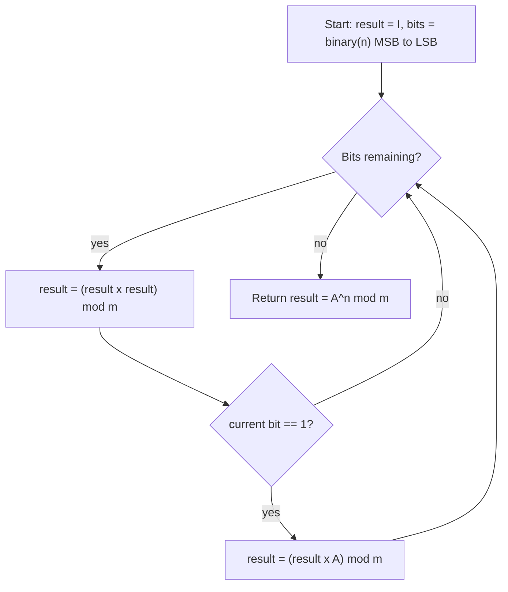

# Efficient Matrix Modular Exponentiation

## Definition

Matrix modular exponentiation extends scalar modular exponentiation (Topic 4.6) from ordinary numbers to matrices. Given a square matrix $A$ of dimension $D \times D$ and a non-negative integer exponent $n$, matrix modular exponentiation computes

$$
\boxed{A^n \bmod m}
$$

where $A^n$ denotes $A$ multiplied by itself $n$ times using standard matrix multiplication, $m$ is the modulus, and "$\bmod\ m$" is applied to **every entry** of the resulting matrix (not to the matrix as a single number). Throughout this topic we use $n$ for the exponent in derivations and worked examples, and $E$ interchangeably when stating the final complexity result, matching the notation already used at the end of this section; $D$ always denotes the matrix dimension.

## Motivation and Problem Context

Why would anyone want to raise a matrix to a power at all? The answer is that many computational problems that look nothing like "multiply a matrix" turn out to be exactly that once modeled correctly, and once a problem is phrased as a matrix power, the fast exponentiation technique from Topic 4.6 becomes available "for free" — except now each scalar multiplication is replaced by a $D \times D$ matrix multiplication.

**Fibonacci numbers in $O(\log n)$ time.** The classic motivating example is the Fibonacci sequence, defined by $F(0)=0$, $F(1)=1$, and $F(n) = F(n-1) + F(n-2)$ for $n \ge 2$.

- A **naive recursive** implementation that directly follows the recurrence recomputes the same subproblems exponentially many times, giving $O(2^n)$ time (more precisely $O(\varphi^n)$ where $\varphi$ is the golden ratio) unless memoized.
- A **naive iterative / bottom-up** implementation keeps a running pair $(F(n-1), F(n))$ and updates it $n-1$ times, giving $O(n)$ time and $O(1)$ space. This is perfectly fine when $n$ is a few million, but becomes impractical when $n$ is astronomically large — for example $n = 10^{18}$, as appears in competitive-programming problems.
- The key algebraic fact that unlocks a faster method is:

$$
\begin{bmatrix} F(n+1) & F(n) \\ F(n) & F(n-1) \end{bmatrix}
=
\begin{bmatrix} 1 & 1 \\ 1 & 0 \end{bmatrix}^{n}
$$

  The matrix $Q = \begin{bmatrix} 1 & 1 \\ 1 & 0 \end{bmatrix}$ is called the **Fibonacci Q-matrix**, and it is *exactly* the matrix $A$ used in the worked example later in this topic. Computing $F(n)$ therefore reduces to computing $Q^n$, and if $Q^n$ can be computed in $O(\log n)$ matrix multiplications using binary exponentiation (rather than $n-1$ multiplications one at a time), we obtain $F(n) \bmod m$ in $O(\log n)$ time instead of $O(n)$. The worked example below computes $A^{10} \bmod 1000$ for precisely this matrix — so, without necessarily being labeled as such, that example is already computing $F(9)$, $F(10)$, and $F(11)$.

**Counting walks in a graph.** If $A$ is the adjacency matrix of a graph on $D$ vertices (with $A_{ij} = 1$ if there is an edge from $i$ to $j$, and $0$ otherwise), then the entry $(A^n)_{ij}$ equals the number of walks of length exactly $n$ from vertex $i$ to vertex $j$ (a walk may repeat vertices and edges, unlike a simple path). Computing the number of length-$n$ walks for a large $n$ — for instance, "how many walks of length $10^9$ connect vertex 1 to vertex 5" — is only tractable through matrix exponentiation; there is no way to enumerate that many walks directly.

**General linear recurrences.** Any linear recurrence with constant coefficients, such as the Tribonacci recurrence $T(n) = T(n-1) + T(n-2) + T(n-3)$, can be rewritten as multiplying a fixed-size state vector by a fixed **companion matrix** at every step. For Tribonacci, with state $v_n = \begin{bmatrix} T(n) \\ T(n-1) \\ T(n-2)\end{bmatrix}$, the transition is $v_n = M v_{n-1}$ where

$$
M = \begin{bmatrix} 1 & 1 & 1 \\ 1 & 0 & 0 \\ 0 & 1 & 0 \end{bmatrix}
$$

Once the recurrence has been repackaged this way, computing the $n$-th term reduces to computing $M^n$, and the same $O(D^3 \log n)$ technique developed in this topic applies directly, with $D$ equal to the order of the recurrence (here $D=3$).

In short: whenever a quantity evolves by repeatedly applying the *same* linear transformation, that transformation can be captured as a matrix, and matrix modular exponentiation turns "apply it $n$ times" from an $O(n)$ operation into an $O(\log n)$ one.

## Problem Formulation

- **Input:** a square matrix $A$ of dimension $D \times D$ (entries typically non-negative integers), a non-negative integer exponent $n$, and a modulus $m$ (a positive integer, $m \ge 1$).
- **Output:** the matrix $A^n \bmod m$, a $D \times D$ matrix each of whose entries lies in $\{0, 1, \dots, m-1\}$.
- **Constraints:**
    - $A$ must be square. Matrix powers $A^n$ are only defined when the number of rows equals the number of columns, because $A$ must be multiplied by itself.
    - The modulus is applied **entrywise, after every intermediate multiplication**, not only at the end. This is essential to keep the numbers involved bounded, exactly as in scalar modular exponentiation (Topic 4.6); without it, entries would grow exponentially in $n$ and the multiplications themselves would become the bottleneck.
    - $n$ is assumed non-negative; negative exponents would require a modular matrix inverse and are outside the scope of this topic.

## Intuition

The intuition is identical to the binary (square-and-multiply) exponentiation idea already developed for scalars in Topic 4.6: write $n$ in binary, and build up $A^n$ by repeatedly squaring and conditionally multiplying in the base, according to the bits of $n$, rather than multiplying by $A$ one factor at a time.

$$
A^n = A^{\left(b_{k-1} b_{k-2} \cdots b_1 b_0\right)_2} = \prod_{i \,:\, b_i = 1} A^{2^i}
$$

This generalizes the binary-exponentiation idea from 4.6 to matrices: every place a scalar multiplication `result = result * base` or `result = result * a` appeared, it is replaced by a $D \times D$ matrix multiplication, and every "take mod $m$" step is now taken entrywise. Nothing about the *shape* of the algorithm changes — only the object being multiplied.

## Algorithmic Paradigm

**Decrease and Conquer** — the same family as Topic 4.6. At each step, the problem "compute $A^n \bmod m$" is reduced to a single smaller subproblem of *the same kind*, "compute $A^{\lfloor n/2 \rfloor} \bmod m$", plus $O(D^3)$ extra work (one squaring and, possibly, one more multiplication). This is a decrease of the exponent by (roughly) a constant factor at each step, not a split into several independent subproblems — which is what distinguishes Decrease and Conquer from Divide and Conquer (the paradigm used for Strassen's algorithm in Topic 4.2, where the matrix itself is split into quadrants).

## Algorithm Design

Two algebraic properties of matrix multiplication govern whether binary exponentiation can be lifted from scalars to matrices at all.

**Associativity is what makes squaring valid.** Matrix multiplication is associative: $(XY)Z = X(YZ)$ for all conformable matrices $X, Y, Z$. Integer powers of a matrix are *defined* via repeated, associative multiplication, so for any non-negative integers $i, j$:

$$
A^i \cdot A^j = A^{i+j} = A^j \cdot A^i
$$

The first equality — that $A^i A^j = A^{i+j}$ regardless of how the product is grouped — is exactly what licenses the "square the current result" step: $(A^{n_t})^2 = A^{n_t} \cdot A^{n_t} = A^{2n_t}$ is guaranteed to be correct no matter how the underlying multiplications are parenthesized. Without associativity, repeated squaring would not even be a well-defined shortcut for repeated multiplication.

**Commutativity is *not* needed — and this is the subtle point.** Matrix multiplication is famously **not** commutative in general: $XY \neq YX$ for arbitrary matrices $X$ and $Y$. A student carrying over intuition from scalar exponentiation (where multiplication is always commutative) might worry that the algorithm's multiplication order — `result = result × A` versus `result = A × result` — matters, or that processing the bits of $n$ left-to-right versus right-to-left (as the alternative "exponentiation by squaring" formulation in Topic 4.6 does, accumulating into `base` while scanning from the least significant bit) could silently produce a different, wrong answer for matrices even though it does not for scalars.

It turns out this concern, while reasonable, does not materialize here, for a precise reason: **every matrix ever multiplied together in this algorithm is a power of the same base matrix $A$**, and powers of one matrix always commute with each other, for *any* square matrix $A$:

$$
A^i A^j = A^{i+j} = A^j A^i \quad \text{for all } i, j \ge 0
$$

This is a genuine, general fact — not a special property of the Fibonacci $Q$-matrix — because $A^i$ and $A^j$ are both, in effect, "polynomials in $A$", and any two polynomials in the same matrix commute. Consequently, whether the implementation writes `result × A` or `A × result`, and whether it scans the bits of $n$ left-to-right (as this topic's algorithm does) or right-to-left (as Topic 4.6's pseudocode does when translated to matrices), all variants compute the same mathematically correct $A^n$. This is the reason it is safe, in this specific algorithm, to reuse the exact same control structure as scalar modular exponentiation with no extra bookkeeping for order.

This safety is narrow, though, and does not extend beyond exponentiating a single base matrix. The moment a computation combines $A^n$ with a genuinely *different* matrix $B$ that is not a power of $A$ — for example, extending a recurrence with an inhomogeneous term, or composing two different linear transformations — order becomes essential again, and $A^n B \neq B A^n$ in general. Section "Common Conceptual Mistakes" below returns to this distinction explicitly.



**Steps in Left-to-Right Matrix Modular Exponentiation**

- Step 1: Convert the Exponent to Binary

       - Write `n` in binary form.

- Step 2: Initialize result

       - `result = I` (identity matrix)
       - `base = A`

- Step 3: Process Each Bit (Left → Right)

For each bit **b** in the binary representation of `n` (starting from the **leftmost bit**):

1. **Square the current result**  
   $
   result = (result × result) \mod m
   $

2. **If the current bit is 1**, multiply by the base matrix:
   $
   result = (result × A) \mod m
   $

## Step-by-Step Execution

We now trace the algorithm on the concrete example that motivated this whole topic: computing the 10th power of the Fibonacci $Q$-matrix modulo 1000.

$$
A^{10} \mod 1000
$$

where

$$
A =
\begin{bmatrix}
1 & 1 \\
1 & 0
\end{bmatrix}
$$

---

#### Step 1: Convert the Exponent to Binary

$$
10_{10} = 1010_2
$$

- Bit 1 (MSB = 1)
- result = result² = I
- multiply by A:
- result = $I^2 \times A = A$

$$
\begin{bmatrix}
1 & 0 \\
0 & 1
\end{bmatrix}
\times
\begin{bmatrix}
1 & 1 \\
1 & 0
\end{bmatrix}
=
\begin{bmatrix}
1 & 1 \\
1 & 0
\end{bmatrix}
$$

- Bit 2 (next = 0)
- Square the result : $A^2$
- Bit = 0 → don’t multiply

$$
\begin{bmatrix}
1 & 1 \\
1 & 0
\end{bmatrix}
\times
\begin{bmatrix}
1 & 1 \\
1 & 0
\end{bmatrix}
=
\begin{bmatrix}
2 & 1 \\
1 & 1
\end{bmatrix}
$$

- Bit 3 (next = 1)
- Square the result : $(A^2)^2 = A^4$

$$
\begin{bmatrix}
2 & 1 \\
1 & 1
\end{bmatrix}
\times
\begin{bmatrix}
2 & 1 \\
1 & 1
\end{bmatrix}
=
\begin{bmatrix}
5 & 3 \\
3 & 2
\end{bmatrix}
$$

- Bit = 1 → multiply by A i.e, $A^4 \times A$

$$
\begin{bmatrix}
5 & 3 \\
3 & 2
\end{bmatrix}
\times
\begin{bmatrix}
1 & 1 \\
1 & 0
\end{bmatrix}
=
\begin{bmatrix}
8 & 5 \\
5 & 3
\end{bmatrix}
$$

After this step the running result is $A^5$ (it was $A^4$ before this bit, and this bit's multiply-by-$A$ brings it to $A^5$).

- Bit 4 (last = 0)
- Square result: $(A^5)^2 = A^{10}$

$$
\begin{bmatrix}
8 & 5 \\
5 & 3
\end{bmatrix}
\times
\begin{bmatrix}
8 & 5 \\
5 & 3
\end{bmatrix}
=
\begin{bmatrix}
89 & 55 \\
55 & 34
\end{bmatrix}
$$

- Bit = 0 → no multiply.

All entries of the result are already below the modulus $1000$, so taking the modulus does not change anything, and:

$$
A^{10} \bmod 1000 = \begin{bmatrix} 89 & 55 \\ 55 & 34 \end{bmatrix}
$$

This matches the Fibonacci identity given in Motivation and Problem Context: $F(11) = 89$, $F(10) = 55$, and $F(9) = 34$. In other words, this worked example was not merely a matrix-arithmetic exercise — it was, at the same time, an $O(\log n)$ computation of three consecutive Fibonacci numbers.

## Correctness

**Claim.** The left-to-right algorithm above computes $A^n \bmod m$ correctly for every $A$, every non-negative integer $n$, and every modulus $m \ge 1$.

**Setup.** Let the binary representation of $n$, from most significant to least significant bit, be $b_{k-1} b_{k-2} \cdots b_1 b_0$ (with $b_{k-1} = 1$ for $n \ge 1$; if $n = 0$ the algorithm returns the identity matrix immediately and the claim holds trivially). For $t = 0, 1, \dots, k$, let $n_t$ denote the integer whose binary representation is the first $t$ bits of $n$ read left to right, i.e. $n_0 = 0$, $n_k = n$, and $n_{t+1} = 2 n_t + b_{k-1-t}$.

**Invariant.** After the algorithm has processed the first $t$ bits, `result` $= A^{n_t} \bmod m$.

- **Base case ($t = 0$):** before any bit is processed, `result` $= I = A^0 = A^{n_0}$. True by initialization.
- **Inductive step:** assume `result` $= A^{n_t} \bmod m$ after $t$ bits. Processing bit $t+1$ (value $b_{k-1-t}$) does two things:
    1. It squares: `result` $= (A^{n_t})^2 \bmod m = A^{2 n_t} \bmod m$, using associativity of matrix multiplication as justified above ($A^{n_t} \cdot A^{n_t} = A^{n_t + n_t} = A^{2n_t}$).
    2. If $b_{k-1-t} = 1$, it multiplies by the base: `result` $= A^{2n_t} \cdot A \bmod m = A^{2n_t + 1} \bmod m$, again by associativity.

  In either case, `result` $= A^{2 n_t + b_{k-1-t}} \bmod m = A^{n_{t+1}} \bmod m$, which is exactly the invariant for $t+1$.
- **Termination:** after all $k$ bits have been processed, $n_k = n$, so `result` $= A^n \bmod m$, as required.

**Why taking the modulus after every step is valid.** Because matrix multiplication entries are sums of products of scalar entries, and modular arithmetic distributes over both addition and multiplication ($(a \bmod m)(b \bmod m) \bmod m = ab \bmod m$, and similarly for sums), reducing every intermediate matrix entrywise modulo $m$ never changes the final answer modulo $m$ — it only keeps the numbers involved bounded.

**On commutativity.** Notice that the proof above uses associativity of matrix multiplication in every step, but never uses commutativity — it never needs $XY = YX$ for arbitrary $X, Y$. It only ever multiplies together powers of the same matrix $A$, which (as shown in Algorithm Design) always commute regardless of order. This is worth stating explicitly because it is easy to assume, incorrectly, that a non-commutative correctness proof would need to track multiplication order carefully; here it does not, precisely because of this special structure.

## Complexity Analysis

The exponent $n$ has $k = \lceil \log_2(n+1) \rceil = O(\log n)$ bits (this is the quantity called $E$ — for "exponent" — in the closing statement of this topic; $\log E$ and $\log n$ refer to the same bit-length here).

- The main loop runs once per bit: $O(\log n)$ iterations.
- Each iteration performs **one** matrix squaring and, when the current bit is 1, **one** additional matrix multiplication — at most 2 matrix multiplications per bit, which is still $O(\log n)$ matrix multiplications in total (the constant factor of 2 is absorbed by the big-$O$).
- Each matrix multiplication of two $D \times D$ matrices, computed the schoolbook way, costs $O(D^3)$ scalar multiplications and additions (three nested loops over $D$), plus $O(D^2)$ modulus operations, which is dominated by $O(D^3)$.

Multiplying these together gives the overall time complexity already stated for this topic:

$$
O(D^3 \log E)
$$

where $D$ is the matrix dimension and $E$ (equivalently $n$) is the exponent. The space complexity is $O(D^2)$, for storing the constant number of $D \times D$ matrices (`result`, `base`/`A`, and one scratch matrix per multiplication) in play at any time.

**Reducing the per-step cost with Strassen's algorithm.** The $O(D^3)$ figure assumes schoolbook multiplication. Topic 4.2.3 (`docs/unit4/topic2.md`) develops Strassen's algorithm, which multiplies two $D \times D$ matrices in $O(D^{\log_2 7}) \approx O(D^{2.807})$ time (rounded there to $O(D^{2.80})$) using only 7 recursive multiplications instead of 8. Substituting Strassen's multiplication routine as the per-step matrix multiply in this algorithm improves the overall time to

$$
O\!\left(D^{\log_2 7} \log E\right)
$$

This is a genuine asymptotic win only when $D$ is large enough for Strassen's smaller exponent to overcome its larger constant factor and the extra bookkeeping of subtraction under a modulus (subtracting two reduced residues can go negative and needs an extra correction before the next mod reduction). For the small, fixed dimensions typical of linear-recurrence problems (Fibonacci's $D=2$, Tribonacci's $D=3$), schoolbook multiplication remains the practical choice, and this cross-reference is included mainly so students recognize the two topics compose.

## Recurrence Analysis

Let $T(n)$ denote the time to compute $A^n \bmod m$ for a fixed $D \times D$ matrix $A$. Each step of the algorithm reduces the exponent by (about) half and performs $O(D^3)$ work (a squaring, plus possibly one more multiplication):

$$
T(n) = T\!\left(\left\lfloor n/2 \right\rfloor\right) + O(D^3), \qquad T(0) = O(1)
$$

This recurrence has only **one** recursive subproblem whose size is a constant fraction of the original — a "decrease-by-half" recurrence, not a "divide into several subproblems" recurrence — so the Master Theorem (which is built for $T(n) = aT(n/b) + f(n)$ with $a$ competing subproblems) is not the natural tool here; a direct unrolling suffices instead:

$$
T(n) = O(D^3) + O(D^3) + \cdots + O(D^3) \quad (\text{once per halving of } n) = O(D^3) \cdot O(\log n)
$$

since $n$ can be halved $O(\log n)$ times before reaching the base case $0$. Hence:

$$
T(n) = O(D^3 \log n)
$$

which matches the complexity derived directly above by counting bits and multiplications.

## Python Implementation

```python
def identity_matrix(d):
    """Return the d x d multiplicative identity matrix."""
    return [[1 if i == j else 0 for j in range(d)] for i in range(d)]


def mat_mult_mod(X, Y, m):
    """Multiply two square matrices X and Y, reducing every entry mod m."""
    d = len(X)
    result = [[0] * d for _ in range(d)]
    for i in range(d):
        for k in range(d):
            if X[i][k] == 0:
                continue
            xik = X[i][k]
            for j in range(d):
                result[i][j] = (result[i][j] + xik * Y[k][j]) % m
    return result


def matrix_mod_pow(A, n, m):
    """Compute A^n mod m using left-to-right binary exponentiation."""
    d = len(A)
    if len(A) != len(A[0]):
        raise ValueError("matrix must be square")
    if n == 0:
        return identity_matrix(d)

    bits = bin(n)[2:]          # binary representation of n, MSB first
    result = identity_matrix(d)
    for bit in bits:
        result = mat_mult_mod(result, result, m)     # square
        if bit == '1':
            result = mat_mult_mod(result, A, m)       # multiply by base

    return result


def fibonacci_mod(n, m):
    """Return F(n) mod m in O(log n) time using the Fibonacci Q-matrix."""
    Q = [[1, 1], [1, 0]]
    Qn = matrix_mod_pow(Q, n, m)
    return Qn[0][1]   # since Q^n = [[F(n+1), F(n)], [F(n), F(n-1)]]


# Example matching the worked walkthrough above:
print(matrix_mod_pow([[1, 1], [1, 0]], 10, 1000))   # [[89, 55], [55, 34]]
print(fibonacci_mod(10, 1000))                       # 55
```

## Code Walkthrough

- `identity_matrix(d)` builds the $D \times D$ identity, used both as the correct starting value of `result` and as the correct return value for the $n=0$ edge case.
- `mat_mult_mod(X, Y, m)` is the workhorse: three nested loops implementing schoolbook $O(D^3)$ matrix multiplication, with the modulus taken on every accumulated entry rather than only at the end. The `if X[i][k] == 0: continue` line is a minor practical optimization (skipping multiplications by a known zero); it does not change the asymptotic complexity.
- `matrix_mod_pow(A, n, m)` first rejects non-square input, then short-circuits $n=0$ to the identity matrix. For $n \ge 1$, `bin(n)[2:]` produces the binary digits of $n$ with the most significant bit first and no leading zero — exactly the left-to-right bit order used throughout the worked example. The loop body is a direct transcription of Step 3 of the algorithm: square, then conditionally multiply by the original base `A` (not by the evolving `result`, since the base matrix never changes).
- `fibonacci_mod(n, m)` demonstrates the motivating application: it builds the Fibonacci $Q$-matrix, raises it to the $n$-th power modulo $m$, and reads $F(n)$ out of the top-right entry, using the identity $Q^n = \begin{bmatrix} F(n+1) & F(n) \\ F(n) & F(n-1)\end{bmatrix}$ established in Motivation and Problem Context. Running it on $n=10$ reproduces the $55$ seen in the worked example's result matrix.

## Alternative Approaches

| Approach | Time | Space | Notes |
|---|---|---|---|
| Naive iterative recurrence (e.g. plain Fibonacci loop) | $O(n)$ | $O(1)$ | Simple and exact, but infeasible once $n$ is on the order of $10^{18}$. |
| Naive recursive recurrence (no memoization) | $O(2^n)$ (exponential) | $O(n)$ stack | Recomputes overlapping subproblems; never used in practice beyond tiny $n$. |
| Matrix modular exponentiation (this topic) | $O(D^3 \log n)$ | $O(D^2)$ | Exact, works for any linear recurrence of order $D$, scales to huge $n$. |
| Matrix exponentiation + Strassen (Topic 4.2.3) | $O(D^{\log_2 7} \log n)$ | $O(D^2)$ | Only pays off for large $D$; not useful for small fixed-order recurrences. |
| Closed-form (Binet's formula) | $O(1)$ arithmetic operations | $O(1)$ | $F(n) = \dfrac{\varphi^n - \psi^n}{\sqrt 5}$; see caveat below. |

Binet's formula deserves a precise caveat rather than a blanket "it's faster": evaluated with standard floating-point (double-precision) arithmetic, it loses accuracy once $F(n)$ exceeds the roughly 15–17 significant decimal digits a double can represent exactly, which happens for $n$ in the neighborhood of 70–80; beyond that point it can silently return an incorrect integer due to rounding. It is also not a direct substitute for computing $F(n) \bmod m$ for an arbitrary modulus $m$, because that would require a modular square root of $5$ (and a modular inverse of $2$), which need not exist for a general $m$. For these reasons, Binet's formula is a fine tool for small, non-modular $n$, but matrix exponentiation (or the closely related fast-doubling identities) is the correct tool once $n$ is large or the answer is required modulo $m$.

## Trade-Off Analysis

Matrix exponentiation has a larger constant factor per step than naive scalar iteration: each "step" costs $O(D^3)$ instead of $O(1)$ (or $O(D)$ for a general order-$D$ recurrence advanced one term at a time). Roughly, naive iteration costs $O(nD)$ while matrix exponentiation costs $O(D^3 \log n)$; matrix exponentiation wins asymptotically once

$$
D^3 \log n \; \ll \; nD \quad \Longleftrightarrow \quad D^2 \log n \; \ll \; n
$$

For a small, fixed $D$ (Fibonacci's $D=2$, Tribonacci's $D=3$), the left-hand side grows so slowly that matrix exponentiation overtakes naive iteration almost immediately, at values of $n$ as small as a few dozen — this is why it is the standard technique whenever $n$ is large in a Fibonacci-style problem. But for a recurrence of large order $D$ (many linear-recurrence models in practice have dozens or hundreds of terms) and a modest $n$, the $D^3$ per-step cost can dominate, and simple $O(nD)$ (or $O(nD^2)$, depending on how the recurrence's update step is implemented) linear iteration may in fact be faster. The rule of thumb: only pay the $D^3$ cost per squaring when $n$ is large enough to amortize it — i.e., when $D^2 \log n$ is genuinely small compared to $n$.

## Edge Cases

- **$n = 0$:** by definition $A^0 = I$, the $D \times D$ identity matrix. The algorithm and implementation above handle this directly (`matrix_mod_pow` returns `identity_matrix(d)` immediately).
- **Non-square matrix:** matrix exponentiation is undefined for a non-square matrix, since $A$ could not be multiplied by itself. The implementation should reject this input explicitly (as `matrix_mod_pow` does) rather than let it fail obscurely inside a later multiplication.
- **$D = 1$:** a $1 \times 1$ "matrix" is just a scalar, and $1 \times 1$ matrix multiplication is exactly scalar multiplication. Matrix modular exponentiation degenerates exactly to the scalar modular exponentiation algorithm of Topic 4.6 (`docs/unit4/topic6.md`) in this case — the same algorithm, specialized to $D=1$.
- **$m = 1$:** every integer is congruent to $0$ modulo $1$, so every entry of the result is $0$ for any $n \ge 0$ (this is a degenerate but valid modulus; the algorithm still runs correctly, it simply produces the all-zero matrix).
- **Negative $n$:** not handled by this algorithm as stated; a negative exponent would require a modular inverse of the matrix $A$ (which exists only when $A$ is invertible modulo $m$) and is outside this topic's scope.

## Common Implementation Pitfalls

- **Forgetting to reduce modulo $m$ after every single matrix multiplication**, not just once at the end. Skipping intermediate reductions defeats the entire purpose of the "mod" step — entries can grow enormous, which either overflows fixed-width integer types (in languages like C++ or Java) or, even in Python's arbitrary-precision integers, makes every subsequent multiplication far more expensive than it needs to be.
- **Initializing `result` to `A` instead of the identity matrix `I`.** This silently computes one extra factor of $A$ throughout, breaks the $n=0$ case (which should return $I$, not $A$), and invalidates the induction's base case entirely.
- **Multiplication order errors when a different matrix enters the picture.** Within a pure single-base exponentiation, `result × A` and `A × result` agree (Algorithm Design explains why). But the instant a computation multiplies $A^n$ against some *other*, unrelated matrix $B$ — for instance, when adapting the technique to a recurrence with an additive constant, which typically introduces an extra column/row in the companion matrix — order suddenly matters, and swapping it produces a well-formed but mathematically wrong matrix with no runtime error to flag the mistake.
- **Off-by-one errors in bit extraction**, particularly in a right-to-left variant that repeatedly right-shifts the exponent; forgetting to also square the base every iteration (not only when the bit is 1) silently truncates the computation.
- **Not validating squareness before multiplying**, which turns a clear input-validation error into a confusing index-out-of-range exception deep inside the multiplication routine.

## Common Conceptual Mistakes

- **Assuming multiplication order never matters, because scalar multiplication is commutative.** The correct mental model: order happens to be safe *in this specific algorithm* only because every matrix involved is a power of the very same base $A$, and powers of one matrix always commute with each other. This is a narrow, provable exception — not a general property of matrix multiplication. The moment two genuinely different matrices are combined, order becomes essential, and getting it backwards gives a different, but still perfectly well-formed, matrix — there is no error message to catch the mistake.
- **Confusing "walks" with "paths"** when using $A^n$ to count graph connectivity: $(A^n)_{ij}$ counts walks (which may revisit vertices and edges), not simple paths.
- **Treating "mod $m$" as applying to the matrix as a whole** rather than entrywise; each of the $D^2$ entries must be reduced independently.

## Important Properties and Invariants

- **Associativity of matrix multiplication is the load-bearing property.** It is exactly what allows $A^n$ to be built by squaring in any grouping, and it is the only algebraic fact the correctness proof actually needs.
- **The identity matrix $I$ is the multiplicative identity and correct base case**, exactly analogous to the role of the scalar $1$ in ordinary modular exponentiation.
- **Powers of the same matrix commute** ($A^iA^j = A^jA^i$) — a special fact used repeatedly above, distinct from (and much weaker than) general matrix commutativity, which does not hold.
- **Loop invariant:** after processing the first $t$ bits of $n$ (left to right), `result` $= A^{n_t} \bmod m$, where $n_t$ is the integer formed by those $t$ bits.

## When to Use

- The exponent $n$ is very large (up to $10^{9}$–$10^{18}$ in typical competitive-programming constraints), ruling out $O(n)$ iteration.
- The quantity of interest evolves by repeatedly applying the *same* fixed linear transformation: linear recurrences with constant coefficients (Fibonacci, Tribonacci, and similar), $n$-step Markov chain transition probabilities, or counts of length-$n$ walks in a fixed graph.
- An exact answer modulo a given $m$ is required (ruling out floating-point closed forms like Binet's formula).

## When NOT to Use

- $n$ is small enough that simple $O(n)$ (or $O(nD)$) iteration is already fast and simpler to implement and verify.
- The matrix dimension $D$ is very large and $n$ is only modest, so the $O(D^3)$ (or even Strassen's $O(D^{2.807})$) per-step cost dominates any savings from $O(\log n)$ steps.
- The recurrence is not linear with constant coefficients — matrix exponentiation applies specifically to transformations expressible as a fixed matrix; nonlinear recurrences cannot be captured this way.
- Only an approximate, non-modular numeric answer is needed for small $n$, where a closed form or direct iteration is simpler.

## Real-World Applications

- Fast computation of Fibonacci numbers and other constant-coefficient linear recurrences, including in cryptographic and competitive-programming contexts where $n$ can be enormous.
- Computing $n$-step transition probabilities in Markov chains (e.g., queueing models, simple reachability-style analyses) via powers of the transition matrix.
- Counting paths/walks of a given length in graphs, relevant to network reachability analysis and combinatorial enumeration.
- Recurrence-based models in computational biology (e.g., certain population-growth or phylogenetic recurrence models that reduce to fixed linear recurrences).

## Engineering Perspective

In managed languages with arbitrary-precision integers (Python), correctness is the main concern and performance mostly follows from the algorithm itself. In fixed-width languages (C++, Java) used for competitive programming, the entries of `X[i][k] * Y[k][j]` must be checked against overflow before the modulus is applied — a common technique is to use a wider intermediate type (e.g., `long long` for `int` inputs, or `__int128` when the modulus itself is close to the width of a `long long`). General-purpose linear-algebra libraries (NumPy, etc.) rarely expose a "matrix power modulo $m$" primitive directly, and naively using floating-point matrix power routines is unsafe for this use case, since they are not designed to preserve modular-integer semantics; a hand-rolled integer implementation, as given above, is standard practice.

## Performance Considerations

- The dominant cost is the $O(D^3)$ matrix multiplication performed $O(\log n)$ times; for small, fixed $D$ (as in Fibonacci/Tribonacci-style problems) this is already extremely fast.
- Strassen's algorithm (Topic 4.2.3) is worth substituting only once $D$ is large enough (typically hundreds) that its lower exponent outweighs its constant-factor and modular-arithmetic overhead.
- The left-to-right variant shown here needs the full bit string of $n$ up front (`bin(n)[2:]`); a right-to-left variant can process bits without materializing the string, which can matter for extremely large $n$ in tight-memory settings, though the asymptotic complexity is identical either way.

## Testing Strategy

- Compare against a naive $O(n)$ reference implementation for small $n$ (e.g., verify `fibonacci_mod(n, m)` against a plain iterative Fibonacci loop for every $n$ from $0$ to a few hundred).
- Explicitly test the edge cases from above: $n=0$ returns the identity, a non-square input raises an error, and $m=1$ returns the all-zero matrix.
- Property-based check: verify $A^{a+b} \bmod m = (A^a \cdot A^b) \bmod m$ for random small $a, b$, which exercises associativity directly.
- Cross-check a schoolbook implementation against a Strassen-based one on the same random inputs to ensure they agree exactly.

## Debugging Strategy

- If results are numerically wrong for large $n$ but correct for very small $n$, first check that the modulus is applied after **every** multiplication, not only at the end.
- Verify that `result` is initialized to the identity matrix, not to `A`.
- If a left-to-right and right-to-left version disagree, check that whichever "square" and "multiply-by-base" steps correspond to the current bit are applied in the intended order relative to each other (square first, then conditionally multiply, in the version shown here).
- For applications built on a companion matrix (Tribonacci-style recurrences), double-check the matrix's rows and columns are not transposed — a transposition mistake in the companion matrix is a very common source of a "plausible but wrong" recurrence being computed silently.

## Related Algorithms and Concepts

- **Scalar modular exponentiation (Topic 4.6, `docs/unit4/topic6.md`)** — the $D=1$ special case of everything developed in this topic; the algorithm, correctness argument, and complexity all specialize directly.
- **Strassen's algorithm (Topic 4.2.3, `docs/unit4/topic2.md`)** — a drop-in replacement for the $O(D^3)$ per-step matrix multiplication used here, reducing it to $O(D^{\log_2 7})$ for sufficiently large $D$.
- **Fast doubling for Fibonacci** — a more specialized $O(\log n)$ technique using the identities $F(2k) = F(k)\big(2F(k+1) - F(k)\big)$ and $F(2k+1) = F(k+1)^2 + F(k)^2$, which avoids full $2\times2$ matrix multiplication overhead for the Fibonacci case specifically.
- **Markov chain analysis** — $n$-step transition matrices are a direct application of matrix exponentiation.
- **Companion matrices for linear recurrences** — the general mechanism by which any constant-coefficient linear recurrence becomes "a matrix power".

## Serviceable Mental Model

Binary exponentiation is repeated squaring guided by the bits of $n$; matrices simply replace the scalar multiplication with a matrix multiplication, and the modulus is now taken entrywise instead of on a single number. More broadly: **any linear recurrence with constant coefficients can be repackaged as "multiply a fixed-size state vector by a fixed matrix at every step"** — and once the transformation is a fixed matrix, fast exponentiation applies automatically.

## Complexity Summary

| Approach | Time | Space |
|---|---|---|
| Naive repeated multiplication, $A \cdot A \cdots A$ | $O(nD^3)$ | $O(D^2)$ |
| Binary matrix exponentiation (this topic) | $O(D^3 \log n)$ | $O(D^2)$ |
| Binary matrix exponentiation + Strassen | $O(D^{\log_2 7} \log n)$ | $O(D^2)$ |
| $D=1$ special case (scalar modular exponentiation, 4.6) | $O(\log n)$ | $O(1)$ |

## Algorithm Design Checklist

- Is $A$ square? Reject immediately if not.
- Is the exponent $n$ a non-negative integer? Handle $n=0$ by returning the identity matrix.
- Is `result` initialized to the identity matrix $I$, not to $A$?
- Is the modulus $m$ applied to **every entry** after **every** multiplication, not only at the end?
- Is the bit-processing direction (left-to-right, as used here, or right-to-left) applied consistently within the implementation? (Either is correct for this algorithm specifically, because all factors are powers of the same $A$.)
- Has the implementation been checked against a brute-force reference for small $n$ before being trusted for huge $n$?
- Is $m \ge 1$ confirmed, with the $m=1$ degenerate case understood (all-zero result)?

## Final Summary

Matrix modular exponentiation is the direct generalization of the binary (square-and-multiply) exponentiation technique from Topic 4.6, obtained by replacing scalar multiplication with $D \times D$ matrix multiplication and applying the modulus entrywise. Its correctness rests entirely on the associativity of matrix multiplication, together with the fact — easy to overlook — that powers of a single matrix always commute with one another, so the non-commutativity of matrix multiplication in general never becomes an obstacle for this specific algorithm. Its importance comes from the range of problems that reduce to "apply the same linear transformation $n$ times": the $n$-th Fibonacci number (via the $Q$-matrix used throughout this topic's worked example), general linear recurrences via companion matrices, walk counts in graphs, and Markov chain transition probabilities. The technique costs $O(D^3 \log n)$ time using schoolbook matrix multiplication, improvable to $O(D^{\log_2 7} \log n)$ with Strassen's algorithm (Topic 4.2.3) when $D$ is large, and it is worth its higher per-step constant factor precisely when $n$ is large enough to make the $O(\log n)$ number of steps decisively beat $O(n)$ naive iteration.

## Key Takeaways

- Matrix modular exponentiation computes $A^n \bmod m$ in $O(D^3 \log n)$ time by generalizing scalar binary exponentiation (Topic 4.6) to matrices.
- The Fibonacci $Q$-matrix $\begin{bmatrix}1&1\\1&0\end{bmatrix}$ is the canonical motivating example: $Q^n$ encodes three consecutive Fibonacci numbers, turning $O(n)$ Fibonacci computation into $O(\log n)$.
- Correctness relies on associativity of matrix multiplication; it does **not** require commutativity, because every matrix multiplied is a power of the same base and powers of one matrix always commute.
- Multiplication order (`result × A` vs `A × result`, left-to-right vs right-to-left bit processing) is safe to vary in this algorithm specifically — but only because of the single-base-matrix structure, not as a general matrix-multiplication fact.
- The modulus must be applied entrywise after every intermediate multiplication, not just at the end.
- $n=0$ must return the identity matrix; initializing `result` to $A$ instead of $I$ is a classic bug.
- Strassen's algorithm (Topic 4.2.3) can reduce the per-step multiplication cost from $O(D^3)$ to $O(D^{\log_2 7})$, worthwhile only for large $D$.
- The technique generalizes beyond Fibonacci to any constant-coefficient linear recurrence via a companion matrix, and to counting graph walks via the adjacency matrix.
- Binet's closed-form formula is a poor substitute for large $n$: it loses floating-point precision and does not translate cleanly to modular arithmetic.
- $D=1$ reduces exactly to the scalar modular exponentiation of Topic 4.6.

## Practice Problems

**Beginner**

1. By hand, compute $A^4 \bmod 13$ for $A = \begin{bmatrix}1&1\\1&0\end{bmatrix}$ using the left-to-right bit method, showing each squaring step.
2. Write out the binary representation of $n=13$ and list, in order, which steps of the algorithm are "square" and which are "square then multiply".
3. Explain in your own words why $A^0$ must be the identity matrix rather than the zero matrix.
4. For $D=1$, show that the matrix algorithm reduces exactly to the scalar algorithm from Topic 4.6.
5. Given $m=1$, what is $A^n \bmod m$ for any square matrix $A$ and any $n \ge 0$? Justify your answer.

**Intermediate**

1. Implement `matrix_mod_pow` from scratch (without looking at the code above) and verify it against a naive $O(n)$ loop for all $n$ from $0$ to $200$, using the Fibonacci $Q$-matrix.
2. Derive the companion matrix for the recurrence $T(n) = 2T(n-1) + T(n-2)$ and use matrix exponentiation to compute $T(50)$.
3. Prove that $(A^n)^{\!\top} = (A^{\top})^n$ (the transpose of a power is the power of the transpose), and discuss whether this offers any shortcut for computing powers of symmetric matrices.
4. Given the adjacency matrix of a small graph (5–6 vertices), compute the number of walks of length 6 between two chosen vertices using matrix exponentiation, and verify by brute-force enumeration for a smaller length.
5. Modify the implementation to process bits right-to-left (in the style of Topic 4.6's pseudocode adapted to matrices) and confirm it produces identical results to the left-to-right version on several test cases.

**Advanced**

1. Derive the companion matrix for the Tribonacci recurrence and prove, by induction, that its $n$-th power's first row and column encode $T(n)$, $T(n-1)$, $T(n-2)$.
2. Combine Strassen's algorithm (Topic 4.2.3) with matrix modular exponentiation to compute $A^n \bmod m$ for a $64 \times 64$ matrix, and empirically compare running time against the schoolbook version for varying $n$.
3. Prove formally that powers of the same square matrix always commute ($A^iA^j = A^jA^i$ for all $i,j \ge 0$), and identify exactly where this fact is used in the correctness proof of this topic.
4. Given a directed graph with edge weights, define a suitable "matrix" and operation (over the $(\min, +)$ semiring rather than ordinary $(+, \times)$) such that matrix "exponentiation" computes shortest-path lengths of bounded hop count; discuss what breaks and what still works in the correctness argument from this topic.
5. Analyze the numerical behavior of Binet's formula in floating point for $n$ from 1 to 100, and empirically determine the smallest $n$ at which it first disagrees with the exact matrix-exponentiation result.

**Interview / Competitive Programming**

1. Compute $F(n) \bmod (10^9 + 7)$ for a given $n$ up to $10^{18}$, using matrix exponentiation of the Fibonacci $Q$-matrix.
2. Given a linear recurrence of order up to $15$ with constant integer coefficients and a huge $n$ (up to $10^{18}$), compute the $n$-th term modulo $10^9+7$.
3. Given the adjacency matrix of a graph with up to 50 vertices, count the number of walks of length exactly $n$ (up to $10^{9}$) between two given vertices, modulo $10^9+7$.
4. Given a Markov chain with up to 20 states and a transition matrix, compute the probability distribution after $n$ steps for $n$ up to $10^{12}$.
5. Given two large exponents $n_1, n_2$ and a matrix $A$, determine the most efficient way to compute both $A^{n_1} \bmod m$ and $A^{n_2} \bmod m$, discussing what (if anything) can be reused between the two computations.

## Final Practice Set

**Beginner**

1. Trace the left-to-right algorithm by hand for $A = \begin{bmatrix}2&0\\0&3\end{bmatrix}$ and $n=5$, $m=1000$, and confirm the result equals $\begin{bmatrix}32&0\\0&243\end{bmatrix} \bmod 1000$.
2. State, without proof, which single algebraic property of matrix multiplication is essential for this algorithm to be correct.
3. Explain why a non-square matrix cannot be raised to a power, in terms of the definition of matrix multiplication.
4. What does the algorithm return when $n=1$? Verify it equals $A \bmod m$.
5. List the two situations in this topic where the identity matrix plays a role, and explain each.

**Intermediate**

1. Show, using the state-vector formulation, how a second-order linear recurrence with a constant additive term, $T(n) = T(n-1) + T(n-2) + c$, can still be handled by matrix exponentiation by augmenting the state vector with a constant entry.
2. Implement and test a version of `mat_mult_mod` that works for rectangular matrix multiplication (needed internally even though only square powers are taken), and explain why $A^n$ itself still requires $A$ to be square.
3. For the Fibonacci $Q$-matrix, prove that $\det(Q^n) = (-1)^n$ and relate this to the identity $F(n+1)F(n-1) - F(n)^2 = (-1)^n$.
4. Compare, empirically, the running time of naive $O(n)$ Fibonacci versus matrix exponentiation for $n = 10, 100, 1000, 10^6$, and report the crossover point.
5. Explain why applying Binet's formula modulo a prime $p$ is only meaningful when $5$ is a quadratic residue modulo $p$, and what goes wrong otherwise.

**Advanced**

1. Generalize the correctness proof in this topic to right-to-left bit processing, defining the appropriate loop invariant and showing it is maintained.
2. Prove that the set of all integer powers of a fixed invertible matrix $A$ (over the integers modulo $m$) forms a cyclic group under multiplication, and relate the group's order to the periodicity of Fibonacci numbers modulo $m$ (the Pisano period).
3. Design an algorithm to compute $A^n \bmod m$ when $n$ itself is given modulo some huge value but the *true* exponent is needed (i.e., $n$ cannot simply be reduced modulo anything without knowing the multiplicative order of $A$); discuss why exponents cannot, in general, be reduced the way bases can under a modulus.
4. Extend the walk-counting application to count only *simple* paths of length $n$ rather than walks, and explain precisely why matrix powers no longer suffice for this variant.
5. Analyze the numerical stability and correctness trade-offs of implementing matrix modular exponentiation using floating-point matrices versus exact integer arithmetic.

**Interview / Competitive Programming**

1. Compute $F(n) \bmod (10^9+7)$ for $n$ up to $10^{18}$, given up to $10^5$ independent queries — discuss whether/how repeated squaring results can be cached across queries.
2. Given a graph with up to $100$ vertices and a target walk length $n$ up to $10^{18}$, count walks of length $n$ between every pair of vertices modulo $10^9+7$.
3. Given a linear homogeneous recurrence of order $D \le 100$ and an exponent $n$ up to $10^{18}$, compute the $n$-th term modulo a given prime, and analyze whether $D^3 \log n$ or an FFT/Strassen-based approach is preferable for this $D$.
4. Given a Markov chain and a target step count $n$, compute the expected number of visits to a particular state over the first $n$ steps (not just the distribution at step $n$) using an augmented transition matrix.
5. Given two matrices $A$ and $B$ and an exponent $n$, determine efficiently whether $(AB)^n = A^nB^n$ holds for the specific $A, B$ given, and explain under what general condition on $A$ and $B$ this identity is guaranteed to hold.

## Questions

- **Conceptual:** Why does binary exponentiation generalize so directly from scalars to matrices, when so many other scalar algorithms do not generalize this smoothly?
- **Analytical:** How does the overall complexity $O(D^3 \log n)$ change if the exponent $n$ is given as a very large number represented as a string of decimal digits rather than a machine integer?
- **Design:** How would you adapt this algorithm to compute $A^n \bmod m$ for a batch of many different exponents $n_1, \dots, n_q$ against the same base matrix $A$, and what, if anything, could be precomputed once and reused?
- **Correctness:** Where exactly in the correctness proof would the argument break if the algorithm ever multiplied $A^n$ against a matrix that was *not* a power of $A$?
- **Scenario:** A colleague implements this algorithm but initializes `result = A` instead of `result = I`. For which values of $n$ does their implementation happen to still give the correct answer, and why?
- **Troubleshooting:** Your implementation gives correct answers for small $n$ but incorrect answers for large $n$ only when the modulus $m$ is close to the square root of the maximum representable integer in your language. What is the most likely bug?
- **Comparative:** Under what circumstances would you prefer the fast-doubling Fibonacci identities over full $2\times2$ matrix exponentiation, given that both are $O(\log n)$?
