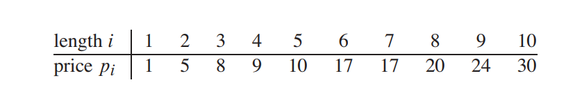
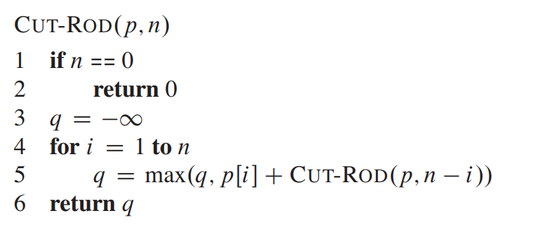
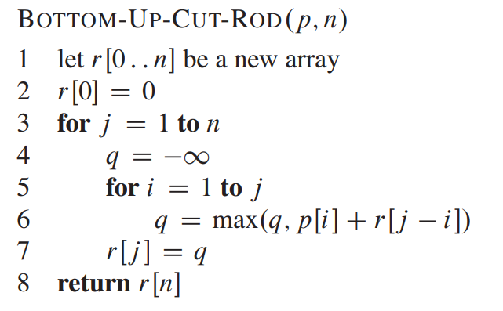

# 6.2 Rod Cutting Problem

## 6.2.1 Problem statement and analysis

Given a rod of length $n$ inches and a table of prices $P_i$ for $i = 1, 2, . . ., n$, determine the maximum revenue $r_n$ obtainable by cutting up the rod and selling the pieces. Note that if the price $P_n$ for a rod of length $n$ is large enough, an optimal solution may require no cutting at all.[^2]

!!! example "Example"

    Consider $n = 4$ and pricing for each length as follows

    <figure markdown="span">
    {width="60%"}
    </figure>

    The Following figure shows all the ways how $n=4$ can be cut
    <figure>
    
    </figure>

    We can cut up a rod of length n in $2^{n-1}$ different ways, since we have an independent option of cutting, or not cutting, at distance i inches from the left end for i = 1, 2, . . . , n. We denote a decomposition into pieces using ordinary additive notation, so that 7 = 2 + 2 + 3 indicates that a rod of length 7 is cut into three pieces—two of length 2 and one of length 3.

    If an optimal solution cuts the rod into k pieces, for some $1 \le k \le n$, then an optimal decomposition
    $n = i_1 + i_2 + . . . + i_k$ of the rod into pieces of lengths $i_1, i_2, . . . , i_k$ provides maximum corresponding revenue $r_n = p_{i_1} + p_{i_2} + . . . +  p_{i_k}$.

## 6.2.2 Recursive solution and its limitations

<figure markdown="span" style="text-align:left;">
    
    <figcaption>Pseudocode for Rod cutting Algorithm using recursive top-down approach</figcaption>
    
<i>Image Source: Introduction to Algorithms, Chapter 15</i>

</figure>

1. CUT-ROD takes as input an array p[1 .. n] of prices and an integer n and returns the maximum revenue possible for a rod of length n
2. If n = 0, no revenue is possible
3. Line 3 initializes the maximum revenue q to -∞, so that the for loop in lines 4–5 correctly computes $R(n) = max\_{1 \leq i \leq n} \( P_i + CUT-ROD (p,{n-i})) $
4. line 6 then returns this value

- Exponential time complexity $O(2^n)$.
- Many repeated computations $R_{n-1}$ etc. appear multiple times.

## 6.2.3 Dynamic programming solution

we arrange for each subproblem to be solved only once, saving its solution. If we need to refer to this subproblem’s solution again later, we can just look it up, rather than recompute it. Dynamic programming thus uses additional memory to save computation time.

1.  The first approach is top-down with memoization

    - we write the procedure recursively in a natural manner, but modified to save the result of each subproblem (usually in an array or hash table).
    - The procedure now first checks to see whether it has previously solved this subproblem.
    - If yes, it returns the saved value, saving further computation at this level; if not, the procedure computes the value in the usual manner.

    For the Rod-cutting Problem

        MEMOIZED-CUT-ROD(p, n)
        1 let r[0.. n] be a new array
        2 for i = 0 to n
        3   r[i] = -∞
        4 return MEMOIZED-CUT-ROD-AUX(p,n,r)

        MEMOIZED-CUT-ROD-AUX(p,n,r)
        1 if r[n] ≥ 0
        2   return r[n]
        3 if n ==
        4 q = 0
        5 else q = -∞
        6   for i = 1 to n
        7       q = max(q, p[i] + MEMOIZED-CUT-ROD-AUX(p, n-i, r))
        8 r[n] = q
        9 return

2.  The second approach is the bottom-up method.

    - This approach typically depends on some natural notion of the “size” of a subproblem, such that solving any particular subproblem depends only on solving “smaller” subproblems.
    - We sort the subproblems by size and solve them in size order, smallest first.
    - When solving a particular subproblem, we have already solved all of the smaller subproblems its solution depends upon, and we have saved their solutions.
    - We solve each subproblem only once, and when we first see it, we have already solved all of its prerequisite subproblems

<figure markdown="span">
    
    <figcaption>Pseudocode for Rod cutting Algorithm Buttom Up approach</figcaption>
    
<i>Image Source: Introduction to Algorithms, Chapter 15</i>

</figure>

!!! example "example"

    Given length of Rod= 5 m

    | Length |  1  |  2  |  3  |  4  |
    | :----: | --- | --- | --- | --- |
    |  P[i]  |  2  |  5  |  7  |  8  |

    **Solution using Buttom up method**

    - If a rod has a length of 0, what would the maximum profit be? It would be 0​.

    |cost|Piece| 0   | 1   | 2   | 3   | 4   | 5   | ← Possible Length of pieces |
    |--- | --- | --- | --- | --- | --- | --- | --- | |
    |-   | -   | -   | ""  | ""  | ""  | ""  |  "" | |
    |2   | 1   | 0   | ""  | ""  | ""  | ""  | ""  | |
    |5   | 2   | 0   | ""  | ""  | ""  | ""  | ""  | |
    |7   | 3   | 0   | ""  | ""  | ""  | ""  | ""  | |
    |8   | 4   | 0   | ""  | ""  | ""  | ""  | ""  | |

    - In the first row, we only have the price 2 for a rod of length 1 in our array.

        !!! Note ""

            we will use ==i = row index  and  j= column index== and the cell $[i,j]$ represents the maximum amount of profit that can be earned by selling a rod of length j. Example: $[2,3]$ represents the masximum profit that can be earned with a rod of length 3, with differnt length sub rods {0,1,2}

         At index [0,1], making a cut at length 1 yields a profit of 2.
         Not making any cut also gives a profit of 2, since only a 1-meter rod exists.

         At index [0,2], making a cut at length 1 results in two pieces of length 1 each, giving a total profit of 4 (2 + 2).
         Without any cut, the profit would also be 4—not 5, because the price for a 2-meter rod hasn’t been introduced yet in the array.

         Therefore, the better option (and the maximum profit) at this stage is 4.

         Repeating it for the entire row will result as follows:

    |cost|Piece| 0   | 1   | 2   | 3   | 4   | 5   |
    |--- | --- | --- | --- | --- | --- | --- | --- |
    |-   | -   | -   | 0   | 0   | 0   | 0   |  0  |
    |2   | 1   | **0** [0,0]  | **2** [0,1]   | **4** [0,2]   | **6** [0,3]   | **8** [0,4]   | **10** [0,5]  |

    - At each step, we decide whether adding a new cut mark (at position i + 1) increases the profit for the given rod length j.
    We make this decision by taking the maximum of two possible cases:

        - **Without the new cut mark:** The maximum profit before the new cut mark was added — represented by the value at$[i − 1, j]$. ***This corresponds to ignoring the newly introduced cut mark.***

        - **With the new cut mark:** The price of the current cut $(price[i])$ plus the maximum profit obtainable from the remaining rod of length $j − i − 1$, which is represented by the value at $[i, j − i − 1]$ (and would already have been computed earlier).***This represents the case where the new cut mark contributes to the profit.***

     In essence, we are continuously comparing whether including the latest cut leads to a higher profit than excluding it.

     so the general expression used for filling the cell is :

    $$P[i,j] = max \begin{cases}
    P[i-1,j]  \\
    P[i] + P[i, j-i-1]
    \end{cases}
    $$

    in short : Profit = max{Profit excluding the new Piece, profit including the new piece}

    - Thus, with this condition, if we fill the table it would be as follows:

    |cost|Piece| 0   | 1   | 2   | 3   | 4   | 5   |
    |--- | --- | --- | --- | --- | --- | --- | --- |
    |-   | -   | -   | 0   | 0   | 0   | 0   |  0  |
    |2   | 1   | 0   | 2   | 4   | 6   | 8   | 10  |
    |5   | 2   | 0   | 2   | 5   | 7   | 10  | 12  |
    |7   | 3   | 0   | 2   | 5   | 7   | 10  | 12  |
    |8   | 4   | 0   | 2   | 5   | 7   | 10  | 12  |

    - The last cell at the bottom right corner gives the maximum profit that can be earned for the given length of rod

## 6.2.4 Time and space complexity analysis

naive recursive approach is exponential time (\(O(n^{n})\)) and \(O(n)\) space for the call stack

dynamic programming, including memoization or tabulation, the time complexity is typically \(O(n^{2})\) and the space complexity is \(O(n)\) to store the results.

[^2]: Cormen, T., Leiserson, C., Rivest, R., & Stein, C. (2009). Introduction to Algorithms (Third). Mit Press.
