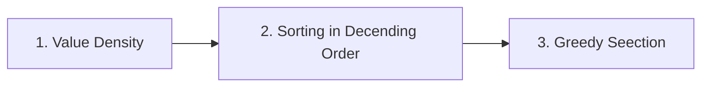

# 7.2 Fractional Knapsack Problem

The Fractional Knapsack Problem is a fundamental optimization problem that perfectly illustrates the power and simplicity of a greedy approach when the problem constraints allow it.

{{image_block("../img/u7gdy/knapsack.webp", "Fractional KnapsacK","Fractional Knapsack")}}

---

## **7.2.1 Problem Statement and Comparison with 0/1 Knapsack**

- **Problem Statement:**

  - **Given:** A set of $n$ items. Each item $i$ has a positive weight $w_i$ and a positive value $v_i$.
  - **Given:** A knapsack with a maximum weight capacity $W$.
  - **Objective:** Choose fractions of items (between 0 and 1) to put in the knapsack such that the total value is maximized, and the total weight does not exceed $W$.

  Formally, find amounts $x_i$ (where $0 ≤ x_i ≤ 1$) for each item $i$ to:

Maximize: $Σ (v_i * x_i)$
Subject to: $Σ (w_i * x_i) ≤ W$

- **Comparison with 0/1 Knapsack:**
  This is the critical distinction that makes the greedy strategy optimal.

  | Feature               | **Fractional Knapsack**                                      | **0/1 Knapsack**                                                    |
  | :-------------------- | :----------------------------------------------------------- | :------------------------------------------------------------------ |
  | **Item Divisibility** | Items can be broken. You can take a fraction of an item.     | Items are indivisible. You either take an item (1) or leave it (0). |
  | **Algorithm**         | **Greedy Algorithm** is optimal.                             | Greedy algorithm is **not optimal**. Requires Dynamic Programming.  |
  | **Intuition**         | If an item is valuable but heavy, you can take a part of it. | The choice is all-or-nothing, which can lead to wasted capacity.    |
  | **Example**           | Gold dust, crude oil, flour.                                 | A laptop, a painting, a jewelry box.                                |

---

**7.2.2 Greedy Strategy for Fractional Knapsack**

The optimal strategy is intuitive: always prioritize the most "cost-effective" items.

1.  **Calculate Value Density:** For each item $i$, compute its value-per-unit-weight (its density):
    $\boxed {density_i = \frac{v_i}{w_i}}$

2.  **Sort:** Sort all items in **descending order** of their $density_i$.

3.  **Greedy Selection:** Iterate through the sorted list and take as much as possible of each item. - If the remaining knapsack capacity can hold the entire next item, take all of it. Subtract its weight from the remaining capacity and add its value to the total value. - If the remaining capacity cannot hold the entire next item, take a fraction of it. This fraction is $(remaining_capacity / w_i)$. Add $(v_i * fraction)$ to the total value. The knapsack is now full.



!!! example "**Illustrative Example:**"

    Let $W = 13$

    Given :

    | ***item*** | 1 | 2 | 3 | 4 | 5 | 6 |
    | --- | --- | --- | --- | --- | --- | --- |
    | ***Value*** | 6 | 12 | 18 | 25 | 8 | 4 |
    | ***weight*** | 1 | 3 | 6 | 5 | 2 | 4 |

    Step 1: Calculate the Desity

    | ***item*** | 1 | 2 | 3 | 4 | 5 | 6 |
    | --- | --- | --- | --- | --- | --- | --- |
    | ***Desity*** | 6 | 4 | 3 | 5 | 4 | 1 |

    Step 2: Sort in decreasing order of density, Decending order of Density : 1 > 4 > 2 > 5 > 3 > 6

    Step 3: Fill the knapsack

    | ***Item*** | V[i] | W[i] | Remaining Weight | Remarks |
    | ---- | ---- | ---- | ---- | ------ |
    | 1 | 6 | 1 | $13 - 1 = 12$ | Take Fully |
    | 4 | 25 | 5 | $12 - 5 = 7$ | Take Fully |
    | 2 | 12 | 3 | $7 - 3 = 4$ | Take Fully |
    | 5 | 12 | 3 | $4 - 2 = 4$ | Take Fully |
    | 3 | $18 \times \frac{2}{6}$ | 2 | $2 - 2 = 0$ | Take $\frac{2}{6}$ of the original |

    Step 4: Add all the values of each item to get the maximum profit

    Total = 55

**7.2.3 Proof of Optimality**

We can prove that this greedy strategy is optimal by using an **exchange argument**, which is a common technique for proving the greedy choice property.

- **Assumption for Contradiction:** Suppose there exists an optimal solution `O` that is different from our greedy solution `G`.
- **Identify the Difference:** Since `O` and `G` are different, there must be a point in the sorted list (by density) where `O` has taken less of a high-density item `i` and more of a lower-density item `j` (where `density_i > density_j`).
- **The Exchange:** We can construct a new solution `O'` by replacing some amount of item `j` in `O` with an equal weight of item `i`.
- **Analyze the Change:**
  - The total weight remains the same.
  - The change in value is: `(amount * density_i) - (amount * density_j)`.
  - Since `density_i > density_j`, this change is positive. Therefore, `O'` has a **higher total value** than `O`.
- **Contradiction:** This contradicts our initial assumption that `O` was optimal. Therefore, any solution that is not the greedy solution cannot be optimal. The greedy solution must be optimal.

This proof relies on the **divisibility** of items. In the 0/1 Knapsack problem, you cannot make this smooth exchange; you would have to swap entire items, which may not be possible without violating the weight constraint or may not improve the value.

**7.2.4 Time Complexity and Implementation Considerations**

- **Time Complexity Analysis:**

  1.  **Calculating Densities:** This requires a single pass through the `n` items, which is **O(n)**.
  2.  **Sorting the Items:** This is the most expensive step. Using an efficient comparison-based sort like Merge Sort or Heap Sort takes **O(n log n)** time.
  3.  **Greedy Selection:** This involves a single pass through the sorted list, which is **O(n)**.

  Therefore, the **overall time complexity is O(n log n)**.

- **Implementation Considerations:**
  1.  **Data Structure:** Use a list of tuples or a list of objects to store the `(value, weight, density)` for each item. This allows them to be sorted together.
  2.  **Sorting:** Leverage your language's built-in sorting function. Ensure it can sort based on a custom key (the density).
  3.  **Handling Floating-Point:** The result (total value) might be a floating-point number. Be cautious about floating-point precision in financial or other sensitive applications, though it is generally acceptable for this problem.
  4.  **Edge Cases:**
      - If the total weight of all items is less than or equal to `W`, the solution is to take all items.
      - If `W = 0`, the maximum value is 0.

**Pseudocode:**

```

FractionalKnapsack(W, v[], w[]):
n = length(v)
items = [] // Create a list of items with their density

    for i from 0 to n-1:
        density = v[i] / w[i]
        items.append( (v[i], w[i], density) )

    sort items in descending order of density

    total_value = 0
    current_weight = 0

    for each item in items:
        if current_weight + item.w <= W:
            // Take the whole item
            total_value += item.v
            current_weight += item.w
        else:
            // Take a fraction of the item
            remaining = W - current_weight
            fraction = remaining / item.w
            total_value += item.v * fraction
            break // Knapsack is full

    return total_value
```

## Reference

## Further Reading
